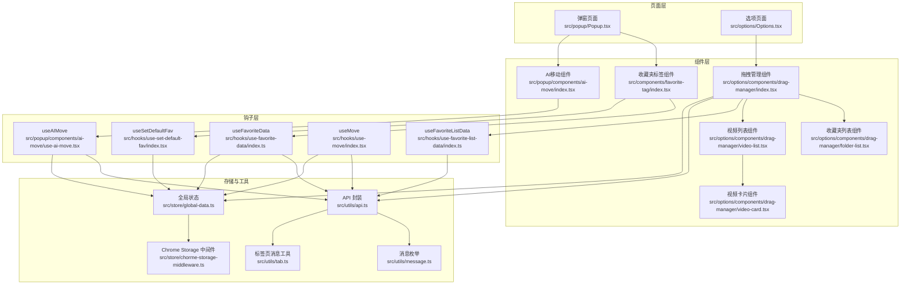
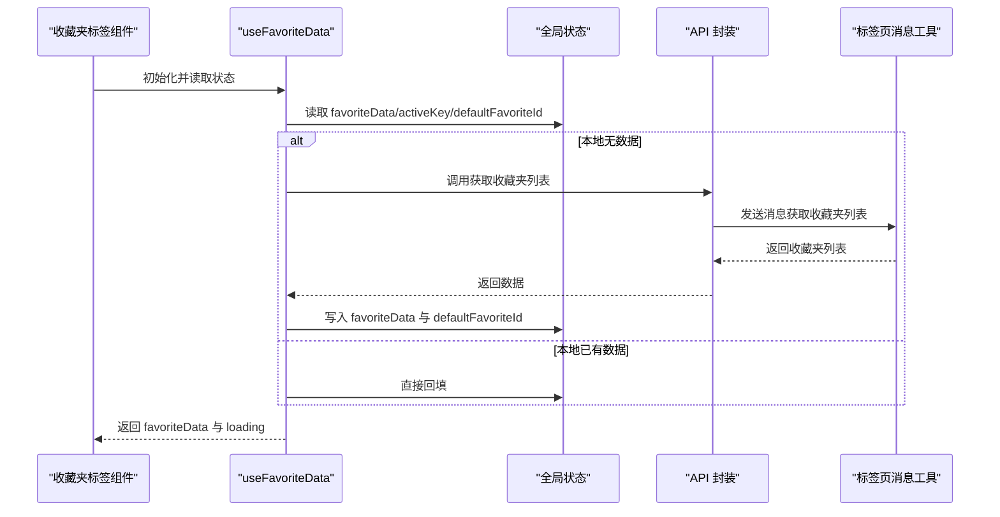
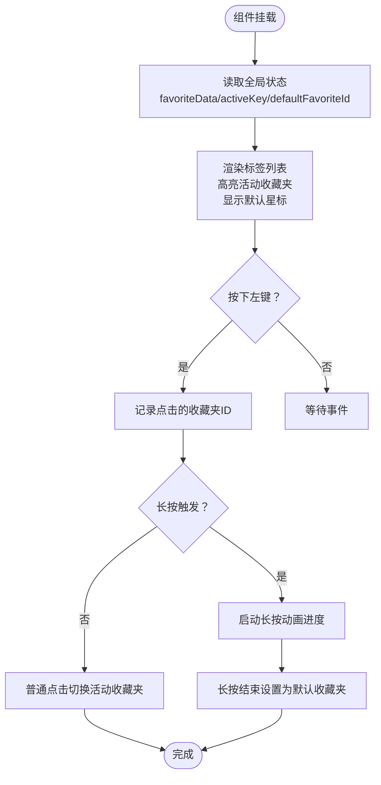
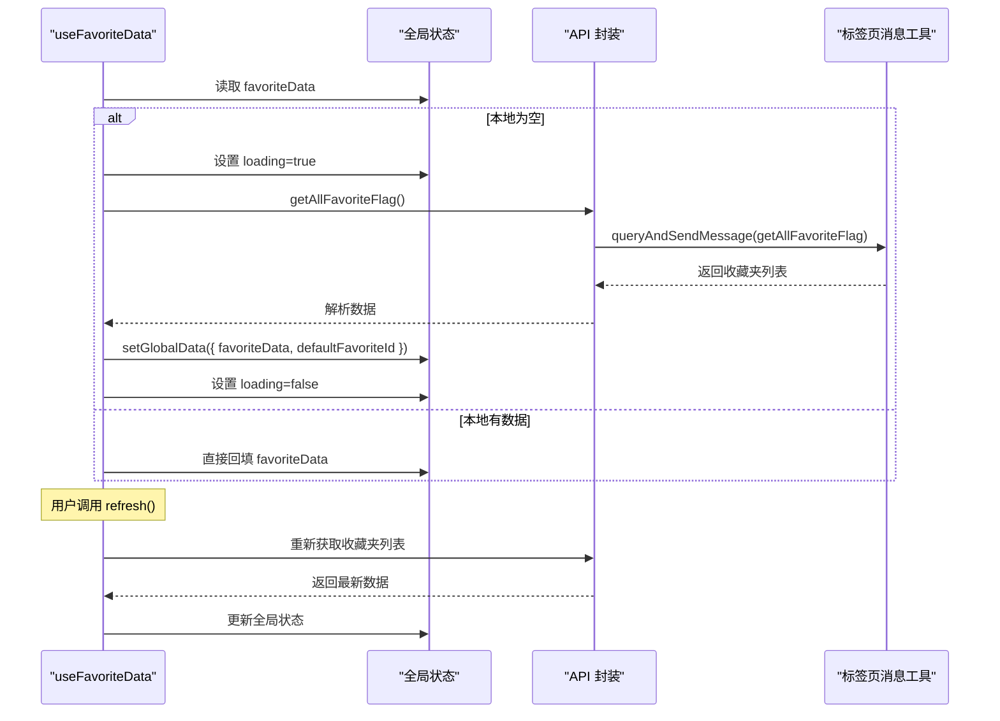
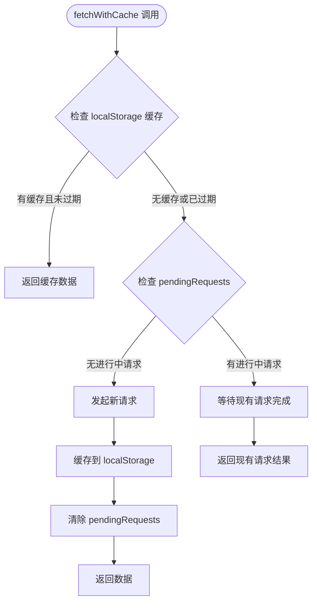
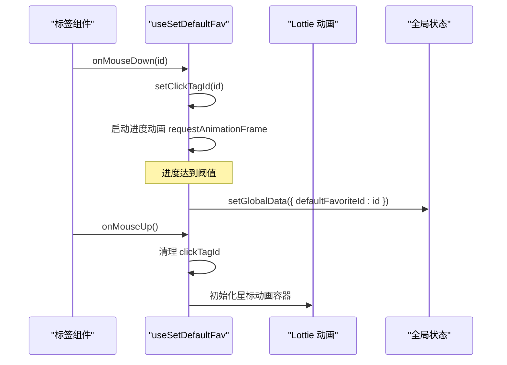
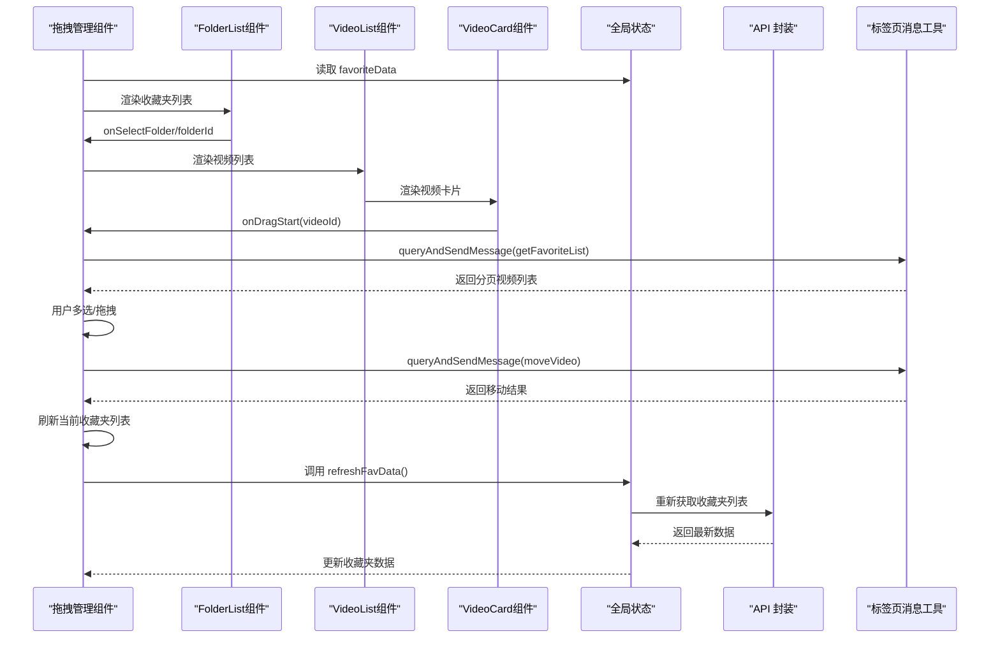
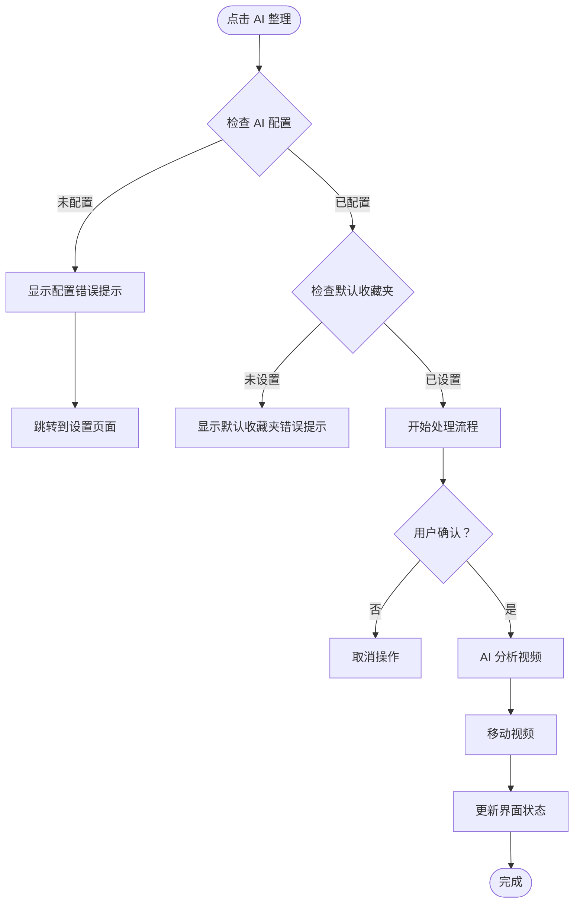
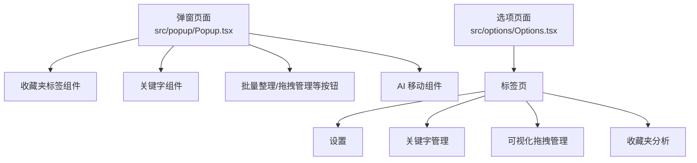
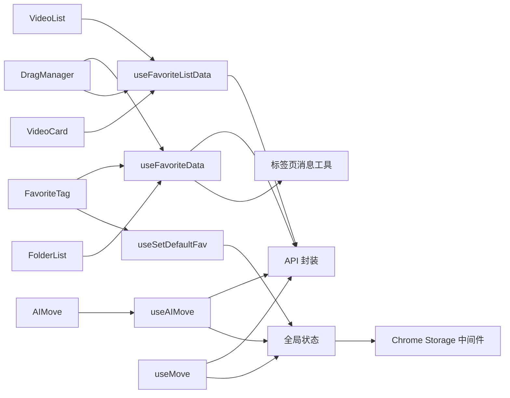

# 收藏夹管理系统

<cite>
**本文引用的文件**
- [src/components/favorite-tag/index.tsx](file://src/components/favorite-tag/index.tsx)
- [src/hooks/use-favorite-data/index.ts](file://src/hooks/use-favorite-data/index.ts)
- [src/hooks/use-favorite-list-data/index.ts](file://src/hooks/use-favorite-list-data/index.ts)
- [src/hooks/use-set-default-fav/index.tsx](file://src/hooks/use-set-default-fav/index.tsx)
- [src/hooks/use-move/index.tsx](file://src/hooks/use-move/index.tsx)
- [src/options/components/drag-manager/index.tsx](file://src/options/components/drag-manager/index.tsx)
- [src/options/components/drag-manager/folder-list.tsx](file://src/options/components/drag-manager/folder-list.tsx)
- [src/options/components/drag-manager/video-list.tsx](file://src/options/components/drag-manager/video-list.tsx)
- [src/options/components/drag-manager/video-card.tsx](file://src/options/components/drag-manager/video-card.tsx)
- [src/components/ui/scroll-area.tsx](file://src/components/ui/scroll-area.tsx)
- [src/store/global-data.ts](file://src/store/global-data.ts)
- [src/store/chorme-storage-middleware.ts](file://src/store/chorme-storage-middleware.ts)
- [src/utils/data-context.ts](file://src/utils/data-context.ts)
- [src/utils/message.ts](file://src/utils/message.ts)
- [src/utils/api.ts](file://src/utils/api.ts)
- [src/utils/tab.ts](file://src/utils/tab.ts)
- [src/options/Options.tsx](file://src/options/Options.tsx)
- [src/popup/Popup.tsx](file://src/popup/Popup.tsx)
- [src/popup/components/drag-manager-button/index.tsx](file://src/popup/components/drag-manager-button/index.tsx)
- [src/popup/components/ai-move/index.tsx](file://src/popup/components/ai-move/index.tsx)
- [src/popup/components/ai-move/use-ai-move.tsx](file://src/popup/components/ai-move/use-ai-move.tsx)
- [src/components/ui/button.tsx](file://src/components/ui/button.tsx)
- [src/options/index.css](file://src/options/index.css)
- [src/popup/index.css](file://src/popup/index.css)
- [README.md](file://README.md)
</cite>

## 更新摘要
**变更内容**
- **拖拽管理功能模块化重构**：新增 FolderList、VideoList、VideoCard 组件，实现更清晰的组件分离和职责划分
- **引入 useFavoriteListData 钩子**：实现智能缓存和请求去重，提升性能和用户体验
- **增强拖拽管理功能**：支持 Ctrl/Cmd 多选、Shift 范围选择、拖拽移动到目标收藏夹
- **优化收藏夹标签组件**：改进样式对比度和可访问性，提升用户体验
- **改进长按逻辑**：简化状态管理，提升交互流畅度
- **新增 useFavoriteListData 钩子**：提供智能缓存、请求去重和缓存失效功能

## 目录
1. [简介](#简介)
2. [项目结构](#项目结构)
3. [核心组件](#核心组件)
4. [架构总览](#架构总览)
5. [详细组件分析](#详细组件分析)
6. [依赖关系分析](#依赖关系分析)
7. [性能考虑](#性能考虑)
8. [故障排查指南](#故障排查指南)
9. [结论](#结论)
10. [附录](#附录)

## 简介
本项目是一个 Chrome 扩展，旨在帮助用户高效管理与分析 Bilibili 收藏夹内容。系统围绕"收藏夹标签展示""收藏夹数据获取与缓存""默认收藏夹配置""批量整理与拖拽移动"等核心能力构建，提供弹窗与侧边栏两种使用形态，并通过全局状态管理与消息通信机制实现跨页面的数据同步与操作。

## 项目结构
系统采用按功能域划分的目录组织方式，主要模块包括：
- 组件层：收藏夹标签组件、UI 组件库、拖拽管理组件（模块化重构）
- 钩子层：收藏夹数据获取、默认收藏夹设置、移动操作、拖拽管理、收藏夹列表数据管理
- 存储层：全局状态（Zustand + Chrome Storage）与 IndexedDB 缓存
- 工具层：消息通信、API 请求封装、数据上下文类型定义
- 页面层：弹窗 Popup、选项页面 Options、可视化拖拽管理界面



**图示来源**
- [src/popup/Popup.tsx:14-76](file://src/popup/Popup.tsx#L14-L76)
- [src/options/Options.tsx:12-87](file://src/options/Options.tsx#L12-L87)
- [src/components/favorite-tag/index.tsx:13-83](file://src/components/favorite-tag/index.tsx#L13-L83)
- [src/options/components/drag-manager/index.tsx:23-26](file://src/options/components/drag-manager/index.tsx#L23-L26)
- [src/options/components/drag-manager/folder-list.tsx:23-31](file://src/options/components/drag-manager/folder-list.tsx#L23-L31)
- [src/options/components/drag-manager/video-list.tsx:28-37](file://src/options/components/drag-manager/video-list.tsx#L28-L37)
- [src/options/components/drag-manager/video-card.tsx:17-23](file://src/options/components/drag-manager/video-card.tsx#L17-L23)
- [src/hooks/use-favorite-data/index.ts:20-56](file://src/hooks/use-favorite-data/index.ts#L20-L56)
- [src/hooks/use-favorite-list-data/index.ts:44-130](file://src/hooks/use-favorite-list-data/index.ts#L44-L130)
- [src/hooks/use-set-default-fav/index.tsx:8-126](file://src/hooks/use-set-default-fav/index.tsx#L8-L126)
- [src/hooks/use-move/index.tsx:14-158](file://src/hooks/use-move/index.tsx#L14-L158)
- [src/popup/components/ai-move/index.tsx:1-64](file://src/popup/components/ai-move/index.tsx#L1-L64)
- [src/popup/components/ai-move/use-ai-move.tsx:23-396](file://src/popup/components/ai-move/use-ai-move.tsx#L23-L396)
- [src/store/global-data.ts:6-25](file://src/store/global-data.ts#L6-L25)
- [src/store/chorme-storage-middleware.ts:8-57](file://src/store/chorme-storage-middleware.ts#L8-L57)
- [src/utils/api.ts:285-319](file://src/utils/api.ts#L285-L319)
- [src/utils/message.ts:1-20](file://src/utils/message.ts#L1-L20)
- [src/utils/tab.ts:65-82](file://src/utils/tab.ts#L65-L82)

**章节来源**
- [src/popup/Popup.tsx:14-76](file://src/popup/Popup.tsx#L14-L76)
- [src/options/Options.tsx:12-87](file://src/options/Options.tsx#L12-L87)
- [README.md:29-78](file://README.md#L29-L78)

## 核心组件
- **收藏夹标签组件**：负责渲染收藏夹列表、高亮当前活动收藏夹、显示默认收藏夹星标、处理长按设置默认收藏夹与点击切换活动收藏夹。
- **收藏夹数据钩子**：负责首次拉取收藏夹列表、缓存与状态更新、触发全局状态变更，支持手动刷新功能。
- **收藏夹列表数据钩子**：**新增**负责智能缓存收藏夹视频列表、请求去重、缓存失效管理，提升拖拽管理性能。
- **默认收藏夹设置钩子**：负责长按动画进度、长按结束清理、在长按过程中将点击的收藏夹设为默认收藏夹。
- **批量移动钩子**：负责遍历默认收藏夹视频、按关键词匹配移动到目标收藏夹、提供加载态与取消逻辑。
- **拖拽管理组件**：**模块化重构**负责收藏夹与视频列表的可视化界面，支持 Ctrl/Cmd 多选、Shift 范围选择、拖拽批量移动，自动刷新功能。
- **FolderList 组件**：**新增**专门负责渲染收藏夹列表，支持拖拽事件处理和视觉反馈。
- **VideoList 组件**：**新增**专门负责渲染视频列表，支持全选、空状态、加载骨架屏和移动遮罩。
- **VideoCard 组件**：**新增**专门负责渲染单个视频卡片，支持选中状态、拖拽开始和视觉反馈。
- **全局状态**：统一管理收藏夹数据、活动收藏夹、默认收藏夹、关键词等，并持久化到 Chrome Storage。
- **AI 移动组件**：提供智能视频分类和移动功能，加强配置验证和用户确认机制。

**章节来源**
- [src/components/favorite-tag/index.tsx:13-83](file://src/components/favorite-tag/index.tsx#L13-L83)
- [src/hooks/use-favorite-data/index.ts:20-56](file://src/hooks/use-favorite-data/index.ts#L20-L56)
- [src/hooks/use-favorite-list-data/index.ts:44-130](file://src/hooks/use-favorite-list-data/index.ts#L44-L130)
- [src/hooks/use-set-default-fav/index.tsx:8-126](file://src/hooks/use-set-default-fav/index.tsx#L8-L126)
- [src/hooks/use-move/index.tsx:14-158](file://src/hooks/use-move/index.tsx#L14-L158)
- [src/options/components/drag-manager/index.tsx:23-26](file://src/options/components/drag-manager/index.tsx#L23-L26)
- [src/options/components/drag-manager/folder-list.tsx:23-31](file://src/options/components/drag-manager/folder-list.tsx#L23-L31)
- [src/options/components/drag-manager/video-list.tsx:28-37](file://src/options/components/drag-manager/video-list.tsx#L28-L37)
- [src/options/components/drag-manager/video-card.tsx:17-23](file://src/options/components/drag-manager/video-card.tsx#L17-L23)
- [src/store/global-data.ts:6-25](file://src/store/global-data.ts#L6-L25)
- [src/popup/components/ai-move/index.tsx:1-64](file://src/popup/components/ai-move/index.tsx#L1-L64)

## 架构总览
系统采用"页面 -> 组件 -> 钩子 -> 工具/存储"的分层架构。页面通过组件渲染 UI；组件通过钩子获取/更新状态；钩子通过 API 与消息工具与后台通信；全局状态通过中间件持久化到 Chrome Storage；部分数据通过 IndexedDB 缓存以降低重复请求。



**图示来源**
- [src/components/favorite-tag/index.tsx:20-28](file://src/components/favorite-tag/index.tsx#L20-L28)
- [src/hooks/use-favorite-data/index.ts:33-47](file://src/hooks/use-favorite-data/index.ts#L33-L47)
- [src/utils/api.ts:137-145](file://src/utils/api.ts#L137-L145)
- [src/utils/tab.ts:65-82](file://src/utils/tab.ts#L65-L82)
- [src/store/global-data.ts:16-22](file://src/store/global-data.ts#L16-L22)

## 详细组件分析

### 收藏夹标签组件（FavoriteTag）
- **渲染逻辑**：根据全局收藏夹数据生成标签元素，支持滚动展示、高亮当前活动收藏夹、显示默认收藏夹星标。
- **交互行为**：鼠标按下记录点击的收藏夹 ID；长按触发设置默认收藏夹流程；松开恢复状态。
- **数据来源**：依赖 useFavoriteData 获取收藏夹列表与 loading 状态；依赖 useSetDefaultFav 提供长按动画与点击事件处理；依赖全局状态获取当前活动收藏夹与默认收藏夹 ID。

**更新** 改进了样式对比度和可访问性，提升了用户体验



**图示来源**
- [src/components/favorite-tag/index.tsx:30-67](file://src/components/favorite-tag/index.tsx#L30-L67)
- [src/hooks/use-set-default-fav/index.tsx:55-100](file://src/hooks/use-set-default-fav/index.tsx#L55-L100)

**章节来源**
- [src/components/favorite-tag/index.tsx:13-83](file://src/components/favorite-tag/index.tsx#L13-L83)
- [src/hooks/use-set-default-fav/index.tsx:8-126](file://src/hooks/use-set-default-fav/index.tsx#L8-L126)

### 收藏夹数据获取钩子（useFavoriteData）
- **数据拉取**：若本地已有收藏夹数据则直接回填，否则通过消息通信向后台请求收藏夹列表，并写入全局状态。
- **缓存策略**：在内存中缓存一次拉取结果，避免重复请求；同时通过全局状态持久化到 Chrome Storage。
- **状态管理**：返回 favoriteData 与 loading，支持 refresh 函数手动刷新收藏夹数据。
- **自动刷新**：在组件挂载时自动检查并拉取收藏夹数据。

**更新** 增加了 refresh 函数，允许手动触发收藏夹数据刷新



**图示来源**
- [src/hooks/use-favorite-data/index.ts:33-47](file://src/hooks/use-favorite-data/index.ts#L33-L47)
- [src/utils/api.ts:137-145](file://src/utils/api.ts#L137-L145)
- [src/utils/tab.ts:65-82](file://src/utils/tab.ts#L65-L82)
- [src/store/global-data.ts:16-22](file://src/store/global-data.ts#L16-L22)

**章节来源**
- [src/hooks/use-favorite-data/index.ts:20-56](file://src/hooks/use-favorite-data/index.ts#L20-L56)

### 收藏夹列表数据钩子（useFavoriteListData）
- **智能缓存**：使用 localStorage 实现收藏夹视频列表的智能缓存，支持 20 分钟过期时间。
- **请求去重**：通过 pendingRequests Map 实现同一媒体 ID 的并发请求去重，避免重复网络请求。
- **缓存同步**：提供 moveVideosCache 方法，支持在本地缓存中同步移动视频，无需重新请求。
- **缓存失效**：提供 invalidateCache 方法，支持按媒体 ID 或全部清除缓存。
- **性能优化**：结合 useFavoriteData 的 refresh 功能，确保缓存与实际数据的一致性。

**新增** 收藏夹列表数据管理钩子，提供智能缓存和请求去重功能



**图示来源**
- [src/hooks/use-favorite-list-data/index.ts:51-79](file://src/hooks/use-favorite-list-data/index.ts#L51-L79)
- [src/hooks/use-favorite-list-data/index.ts:87-108](file://src/hooks/use-favorite-list-data/index.ts#L87-L108)
- [src/hooks/use-favorite-list-data/index.ts:114-127](file://src/hooks/use-favorite-list-data/index.ts#L114-L127)

**章节来源**
- [src/hooks/use-favorite-list-data/index.ts:44-130](file://src/hooks/use-favorite-list-data/index.ts#L44-L130)

### 默认收藏夹设置钩子（useSetDefaultFav）
- **长按逻辑**：使用长按钩子检测长按事件，长按时启动进度动画；长按结束后将点击的收藏夹设为默认收藏夹。
- **状态管理**：维护 isLongPress、clickTagId、pendingElement（遮罩）、starElement（星标动画容器）等状态与 DOM 引用。
- **事件绑定**：在标签组件中通过 onMouseDown/onMouseUp 传递事件，确保长按与点击行为一致。

**更新** 优化了状态管理，移除了未使用的状态变量，简化了代码结构



**图示来源**
- [src/hooks/use-set-default-fav/index.tsx:55-100](file://src/hooks/use-set-default-fav/index.tsx#L55-L100)
- [src/hooks/use-set-default-fav/index.tsx:102-112](file://src/hooks/use-set-default-fav/index.tsx#L102-L112)

**章节来源**
- [src/hooks/use-set-default-fav/index.tsx:8-126](file://src/hooks/use-set-default-fav/index.tsx#L8-L126)

### 批量移动钩子（useMove）
- **执行流程**：从全局状态读取关键词与收藏夹列表，从默认收藏夹拉取全部视频，按关键词匹配移动到目标收藏夹。
- **加载与取消**：提供加载遮罩、取消按钮、完成提示；支持中途取消并清理状态。
- **错误处理**：捕获移动异常并通过 Toast 提示错误信息。


**图示来源**
- [src/hooks/use-move/index.tsx:60-124](file://src/hooks/use-move/index.tsx#L60-L124)
- [src/utils/api.ts:285-319](file://src/utils/api.ts#L285-L319)
- [src/utils/message.ts:3-5](file://src/utils/message.ts#L3-L5)

**章节来源**
- [src/hooks/use-move/index.tsx:14-158](file://src/hooks/use-move/index.tsx#L14-L158)

### 模块化拖拽管理（DragManager）
- **组件分离**：**模块化重构**将拖拽管理功能拆分为 FolderList、VideoList、VideoCard 三个专门组件，提升代码可维护性。
- **交互能力**：左侧收藏夹列表，右侧视频列表；支持 Ctrl/Cmd 多选、Shift 范围选择、拖拽移动到目标收藏夹。
- **数据流**：选择收藏夹后通过 useFavoriteListData 的 fetchWithCache 分页拉取视频列表；拖拽放置时逐个调用移动接口并统计结果；成功后刷新当前收藏夹。
- **状态与反馈**：加载骨架屏、移动中遮罩、Toast 结果提示。
- **自动刷新**：在视频移动成功后，自动刷新当前收藏夹列表和收藏夹数据，确保界面实时更新。

**更新** 模块化重构，新增 FolderList、VideoList、VideoCard 组件，提升代码结构清晰度



**图示来源**
- [src/options/components/drag-manager/index.tsx:37-66](file://src/options/components/drag-manager/index.tsx#L37-L66)
- [src/options/components/drag-manager/index.tsx:126-164](file://src/options/components/drag-manager/index.tsx#L126-L164)
- [src/options/components/drag-manager/folder-list.tsx:40-72](file://src/options/components/drag-manager/folder-list.tsx#L40-L72)
- [src/options/components/drag-manager/video-list.tsx:83-91](file://src/options/components/drag-manager/video-list.tsx#L83-L91)
- [src/utils/api.ts:285-319](file://src/utils/api.ts#L285-L319)
- [src/utils/message.ts:3-5](file://src/utils/message.ts#L3-L5)

**章节来源**
- [src/options/components/drag-manager/index.tsx:23-26](file://src/options/components/drag-manager/index.tsx#L23-L26)
- [src/options/components/drag-manager/folder-list.tsx:23-77](file://src/options/components/drag-manager/folder-list.tsx#L23-L77)
- [src/options/components/drag-manager/video-list.tsx:28-147](file://src/options/components/drag-manager/video-list.tsx#L28-L147)
- [src/options/components/drag-manager/video-card.tsx:17-86](file://src/options/components/drag-manager/video-card.tsx#L17-L86)

### FolderList 组件
- **职责单一**：专门负责渲染收藏夹列表，支持拖拽事件处理和视觉反馈。
- **交互状态**：通过 selectedFolderId 和 dragOverFolderId 管理选中状态和拖拽悬停状态。
- **视觉设计**：使用渐变背景、圆角边框和阴影效果，提供清晰的视觉层次。
- **拖拽支持**：实现 onDragOver、onDragLeave、onDrop 事件处理，支持拖拽到收藏夹的操作。

**新增** 专门的收藏夹列表组件，负责渲染和管理收藏夹列表

**章节来源**
- [src/options/components/drag-manager/folder-list.tsx:23-77](file://src/options/components/drag-manager/folder-list.tsx#L23-L77)

### VideoList 组件
- **职责单一**：专门负责渲染视频列表，支持全选、空状态、加载骨架屏和移动遮罩。
- **状态管理**：通过 selectedVideoIds 管理选中状态，支持 Ctrl/Cmd 多选和 Shift 范围选择。
- **空状态处理**：当没有选择收藏夹或视频列表为空时，显示相应的空状态提示。
- **加载体验**：使用骨架屏提供更好的加载体验，移动过程中显示遮罩层。
- **底部提示**：提供拖拽操作的使用提示，提升用户体验。

**新增** 专门的视频列表组件，负责渲染和管理视频列表

**章节来源**
- [src/options/components/drag-manager/video-list.tsx:28-147](file://src/options/components/drag-manager/video-list.tsx#L28-L147)

### VideoCard 组件
- **职责单一**：专门负责渲染单个视频卡片，支持选中状态、拖拽开始和视觉反馈。
- **视觉设计**：使用封面图片、标题和 BVID 信息，提供清晰的视频信息展示。
- **选中状态**：通过选中指示器和颜色变化，明确显示选中状态。
- **拖拽支持**：实现 onDragStart 事件处理，支持拖拽操作。

**新增** 专门的视频卡片组件，负责渲染单个视频项

**章节来源**
- [src/options/components/drag-manager/video-card.tsx:17-86](file://src/options/components/drag-manager/video-card.tsx#L17-L86)

### AI 移动组件（AIMove）
- **配置验证**：在执行 AI 整理前检查 AI 配置（自定义配置或 AIGate 免费额度），确保用户已正确配置。
- **用户确认**：增加二次确认机制，提醒用户操作可能消耗大量 Token，需要再次点击确认执行。
- **智能分析**：基于视频标题和收藏夹名称进行智能分类，支持自定义模型和免费额度两种模式。
- **进度反馈**：提供详细的进度反馈，包括 AI 分析阶段和移动阶段的状态显示。

**更新** 加强了验证逻辑，增加了用户确认机制，提升了安全性



**图示来源**
- [src/popup/components/ai-move/index.tsx:12-27](file://src/popup/components/ai-move/index.tsx#L12-L27)
- [src/popup/components/ai-move/use-ai-move.tsx:217-242](file://src/popup/components/ai-move/use-ai-move.tsx#L217-L242)
- [src/popup/components/ai-move/use-ai-move.tsx:251-282](file://src/popup/components/ai-move/use-ai-move.tsx#L251-L282)

**章节来源**
- [src/popup/components/ai-move/index.tsx:1-64](file://src/popup/components/ai-move/index.tsx#L1-L64)
- [src/popup/components/ai-move/use-ai-move.tsx:23-396](file://src/popup/components/ai-move/use-ai-move.tsx#L23-L396)

### 页面集成与入口
- **弹窗页面**：在弹窗中展示收藏夹标签与关键字管理区域，并提供批量整理、AI 整理、拖拽管理等操作入口。
- **选项页面**：提供设置、关键字管理、可视化拖拽管理、收藏夹分析等标签页。



**图示来源**
- [src/popup/Popup.tsx:14-76](file://src/popup/Popup.tsx#L14-L76)
- [src/options/Options.tsx:31-83](file://src/options/Options.tsx#L31-L83)

**章节来源**
- [src/popup/Popup.tsx:14-76](file://src/popup/Popup.tsx#L14-L76)
- [src/options/Options.tsx:12-87](file://src/options/Options.tsx#L12-L87)

## 依赖关系分析
- **组件依赖钩子**：FavoriteTag 依赖 useFavoriteData 与 useSetDefaultFav；AIMove 依赖 useAIMove；DragManager 依赖 useFavoriteData 与 useFavoriteListData。
- **钩子依赖工具**：useFavoriteData 与 useMove 依赖 API 封装与消息工具；useFavoriteListData 依赖 API 封装；useMove 依赖全局状态；useAIMove 依赖全局状态和 AI 配置。
- **全局状态依赖中间件**：全局状态通过 Chrome Storage 中间件持久化，仅持久化指定字段。
- **页面依赖组件**：弹窗与选项页面分别组合收藏夹标签与拖拽管理组件。



**图示来源**
- [src/components/favorite-tag/index.tsx:20-22](file://src/components/favorite-tag/index.tsx#L20-L22)
- [src/popup/components/ai-move/index.tsx:5](file://src/popup/components/ai-move/index.tsx#L5)
- [src/options/components/drag-manager/index.tsx:7-8](file://src/options/components/drag-manager/index.tsx#L7-L8)
- [src/hooks/use-favorite-data/index.ts:21-26](file://src/hooks/use-favorite-data/index.ts#L21-L26)
- [src/hooks/use-favorite-list-data/index.ts:44-130](file://src/hooks/use-favorite-list-data/index.ts#L44-L130)
- [src/hooks/use-set-default-fav/index.tsx:10-16](file://src/hooks/use-set-default-fav/index.tsx#L10-L16)
- [src/hooks/use-move/index.tsx:9-11](file://src/hooks/use-move/index.tsx#L9-L11)
- [src/store/global-data.ts:6-25](file://src/store/global-data.ts#L6-L25)
- [src/store/chorme-storage-middleware.ts:8-57](file://src/store/chorme-storage-middleware.ts#L8-L57)

**章节来源**
- [src/store/global-data.ts:6-25](file://src/store/global-data.ts#L6-L25)
- [src/store/chorme-storage-middleware.ts:8-57](file://src/store/chorme-storage-middleware.ts#L8-L57)

## 性能考虑
- **数据缓存**
  - **收藏夹视频列表缓存**：**新增**使用 localStorage 实现智能缓存，支持 20 分钟过期时间，减少重复请求。
  - **请求去重**：**新增**通过 pendingRequests Map 实现同一媒体 ID 的并发请求去重，避免重复网络请求。
  - **缓存同步**：**新增**提供 moveVideosCache 方法，支持在本地缓存中同步移动视频，无需重新请求。
  - **收藏夹列表缓存**：内存缓存一次拉取结果，避免重复请求。
- **网络与消息**
  - 使用消息通信在后台与页面间传递数据，避免前端直接访问外部 API。
- **渲染优化**
  - 使用滚动区域组件限制高度，避免长列表造成渲染压力。
  - 骨架屏与加载遮罩提升交互体验。
  - **模块化组件**：**新增** FolderList、VideoList、VideoCard 组件分离，提升渲染性能。
- **状态持久化**
  - 仅持久化必要字段，减少存储体积与读写开销。
- **手动刷新优化**
  - useFavoriteData 的 refresh 函数使用 useMemoizedFn 优化性能，避免不必要的重新创建。

**更新** 新增了智能缓存和请求去重机制，显著提升拖拽管理性能

**章节来源**
- [src/hooks/use-favorite-list-data/index.ts:16-38](file://src/hooks/use-favorite-list-data/index.ts#L16-L38)
- [src/hooks/use-favorite-list-data/index.ts:51-79](file://src/hooks/use-favorite-list-data/index.ts#L51-L79)
- [src/hooks/use-favorite-list-data/index.ts:87-108](file://src/hooks/use-favorite-list-data/index.ts#L87-L108)
- [src/utils/api.ts:285-319](file://src/utils/api.ts#L285-L319)
- [src/hooks/use-favorite-data/index.ts:29-31](file://src/hooks/use-favorite-data/index.ts#L29-L31)
- [src/store/chorme-storage-middleware.ts:3-34](file://src/store/chorme-storage-middleware.ts#L3-L34)

## 故障排查指南
- **无法获取收藏夹列表**
  - 检查是否已登录 B 站并在 B 站页面保持打开状态。
  - 确认消息通信是否正常，后台是否有响应。
  - **新增** 尝试调用 refresh 函数手动刷新收藏夹数据。
- **移动视频失败**
  - 检查源收藏夹与目标收藏夹是否正确选择。
  - 查看 Toast 错误提示，确认网络与权限。
  - **增强** 拖拽管理组件会在移动成功后自动刷新，检查是否需要手动刷新。
- **默认收藏夹未生效**
  - 确认长按时间是否足够，动画进度是否完成。
  - 检查全局状态是否已更新 defaultFavoriteId。
- **拖拽移动无响应**
  - 确认是否选择了收藏夹与视频。
  - 检查拖拽放置事件是否触发，后台是否返回成功。
  - **增强** 确认拖拽管理组件是否正确调用了 refresh 函数。
- **收藏夹列表加载缓慢**
  - **新增** 检查 localStorage 缓存是否正常工作。
  - 确认是否有过多的并发请求。
  - 检查缓存是否过期，尝试调用 invalidateCache 清除缓存。
- **AI 整理失败**
  - 检查 AI 配置是否正确设置，包括 API Key、模型名称等。
  - 确认默认收藏夹是否已设置。
  - 查看 Token 消耗提醒，确认用户已进行二次确认。
- **手动刷新无效**
  - 检查 refresh 函数是否正确导入和使用。
  - 确认网络连接正常，后台服务可访问。

**更新** 新增了收藏夹列表缓存相关的故障排查指南

**章节来源**
- [src/hooks/use-move/index.tsx:114-123](file://src/hooks/use-move/index.tsx#L114-L123)
- [src/hooks/use-set-default-fav/index.tsx:75-100](file://src/hooks/use-set-default-fav/index.tsx#L75-L100)
- [src/options/components/drag-manager/index.tsx:126-164](file://src/options/components/drag-manager/index.tsx#L126-L164)
- [src/popup/components/ai-move/use-ai-move.tsx:217-242](file://src/popup/components/ai-move/use-ai-move.tsx#L217-L242)
- [src/hooks/use-favorite-data/index.ts:29-31](file://src/hooks/use-favorite-data/index.ts#L29-L31)
- [src/hooks/use-favorite-list-data/index.ts:114-127](file://src/hooks/use-favorite-list-data/index.ts#L114-L127)

## 结论
本收藏夹管理系统通过清晰的分层设计与消息通信机制，实现了收藏夹列表的高效获取、默认收藏夹的便捷配置、以及可视化的批量移动能力。**本次重大更新**引入了模块化拖拽管理架构和智能缓存机制，显著提升了系统的性能和用户体验。

**本次更新重点改进**：
- **拖拽管理功能模块化重构**：将拖拽管理功能拆分为 FolderList、VideoList、VideoCard 三个专门组件，提升了代码结构清晰度和可维护性。
- **引入 useFavoriteListData 钩子**：实现了智能缓存（20分钟过期时间）、请求去重和缓存同步功能，显著提升了拖拽管理性能。
- **增强拖拽管理组件**：在视频移动成功后自动刷新收藏夹列表和收藏夹数据，确保界面实时更新，减少了用户的等待时间。
- **AI 移动组件验证逻辑加强**：增加了配置检查和用户确认机制，提升了操作的安全性和透明度。
- **优化收藏夹标签组件**：改进了样式对比度和可访问性，提升了用户体验。

后续可在关键词匹配算法、AI 整理策略与拖拽交互细节方面持续优化，进一步提升系统的智能化水平和用户体验。

## 附录

### 常见问题与最佳实践
- **如何使用 FavoriteTag 组件**
  - 在页面中直接引入并传入 className 即可渲染收藏夹标签列表。
  - 通过全局状态 activeKey 控制高亮，通过 defaultFavoriteId 显示星标。
- **如何使用 useFavoriteData 钩子**
  - 在组件中调用返回的 favoriteData 与 loading，用于渲染与交互控制。
  - 首次加载会自动拉取收藏夹列表并写入全局状态。
  - 可通过 refresh 函数手动刷新收藏夹数据。
- **如何使用 useFavoriteListData 钩子**
  - **新增** 使用 fetchWithCache 获取收藏夹视频列表，自动处理缓存和请求去重。
  - 使用 moveVideosCache 同步更新本地缓存，无需重新请求。
  - 使用 invalidateCache 清除指定或全部缓存。
- **如何配置默认收藏夹**
  - 长按任意收藏夹标签，等待进度条完成，即可将其设为默认收藏夹。
  - 默认收藏夹 ID 会写入全局状态并持久化。
- **如何进行批量整理**
  - 在选项页面的"可视化管理"标签中，选择源收藏夹与目标收藏夹，配置关键词规则后开始整理。
  - 支持取消与完成提示，移动完成后自动刷新当前收藏夹。
- **如何使用拖拽管理**
  - 在弹窗中点击"拖拽管理"按钮，打开选项页的拖拽管理界面。
  - 支持 Ctrl/Cmd 多选与拖拽批量移动。
  - **增强** 移动成功后会自动刷新界面。
- **如何使用模块化拖拽组件**
  - **新增** FolderList 负责渲染收藏夹列表，支持拖拽事件处理。
  - **新增** VideoList 负责渲染视频列表，支持全选和加载状态。
  - **新增** VideoCard 负责渲染单个视频项，支持选中状态和拖拽。
- **如何使用 AI 整理功能**
  - 在弹窗中点击"AI 整理"按钮，系统会进行二次确认并开始智能分析。
  - 支持自定义 AI 配置或使用免费额度。
  - 实时显示处理进度和结果统计。

**章节来源**
- [src/components/favorite-tag/index.tsx:13-83](file://src/components/favorite-tag/index.tsx#L13-L83)
- [src/hooks/use-favorite-data/index.ts:20-56](file://src/hooks/use-favorite-data/index.ts#L20-L56)
- [src/hooks/use-favorite-list-data/index.ts:44-130](file://src/hooks/use-favorite-list-data/index.ts#L44-L130)
- [src/hooks/use-set-default-fav/index.tsx:8-126](file://src/hooks/use-set-default-fav/index.tsx#L8-L126)
- [src/hooks/use-move/index.tsx:14-158](file://src/hooks/use-move/index.tsx#L14-L158)
- [src/options/components/drag-manager/index.tsx:23-26](file://src/options/components/drag-manager/index.tsx#L23-L26)
- [src/options/components/drag-manager/folder-list.tsx:23-77](file://src/options/components/drag-manager/folder-list.tsx#L23-L77)
- [src/options/components/drag-manager/video-list.tsx:28-147](file://src/options/components/drag-manager/video-list.tsx#L28-L147)
- [src/options/components/drag-manager/video-card.tsx:17-86](file://src/options/components/drag-manager/video-card.tsx#L17-L86)
- [src/popup/components/drag-manager-button/index.tsx:6-8](file://src/popup/components/drag-manager-button/index.tsx#L6-L8)
- [src/popup/components/ai-move/index.tsx:1-64](file://src/popup/components/ai-move/index.tsx#L1-L64)

### 代码示例

#### FavoriteTag 组件使用示例
```typescript
// 在页面中使用收藏夹标签组件
import FavoriteTag from '@/components/favorite-tag'

function MyComponent() {
  return (
    <div className="p-4">
      <FavoriteTag className="w-full" />
    </div>
  )
}
```

#### useFavoriteData 钩子使用示例
```typescript
// 在组件中使用收藏夹数据钩子
import { useFavoriteData } from '@/hooks/use-favorite-data'

function FavoriteList() {
  const { favoriteData, loading, refresh } = useFavoriteData()
  
  const handleRefresh = () => {
    refresh() // 手动刷新收藏夹数据
  }
  
  if (loading) {
    return <div>加载中...</div>
  }
  
  return (
    <div>
      <button onClick={handleRefresh}>刷新</button>
      {favoriteData.map(item => (
        <div key={item.id}>{item.title}</div>
      ))}
    </div>
  )
}
```

#### useFavoriteListData 钩子使用示例
```typescript
// 在拖拽管理组件中使用收藏夹列表数据钩子
import { useFavoriteListData } from '@/hooks/use-favorite-list-data'

function DragManager() {
  const { fetchWithCache, moveVideosCache, invalidateCache } = useFavoriteListData()
  
  const loadVideos = async (folderId: number) => {
    try {
      const medias = await fetchWithCache(folderId.toString())
      // 处理视频列表
    } catch (error) {
      console.error('加载失败:', error)
    }
  }
  
  const handleMove = async (videoIds: number[], targetFolderId: number) => {
    // 移动视频的逻辑
    moveVideosCache(sourceFolderId.toString(), targetFolderId.toString(), videoIds)
  }
  
  return <div>拖拽管理界面</div>
}
```

#### useSetDefaultFav 钩子使用示例
```typescript
// 在自定义组件中使用默认收藏夹设置钩子
import { useSetDefaultFav } from '@/hooks/use-set-default-fav'

function CustomFavoriteTag() {
  const { 
    domRef, 
    clickTagId, 
    pendingElement, 
    starElement, 
    handleMouseDown, 
    handleMouseUp 
  } = useSetDefaultFav()
  
  return (
    <div ref={domRef}>
      {/* 自定义标签渲染逻辑 */}
      {clickTagId && pendingElement}
      {starElement}
    </div>
  )
}
```

#### 模块化拖拽组件使用示例
```typescript
// 在选项页面中使用模块化拖拽管理组件
import DragManager from '@/options/components/drag-manager'

function DragManagerPage() {
  return (
    <div className="p-4">
      <DragManager className="w-full" />
    </div>
  )
}

// 使用单独的子组件
import FolderList from '@/options/components/drag-manager/folder-list'
import VideoList from '@/options/components/drag-manager/video-list'
import VideoCard from '@/options/components/drag-manager/video-card'

function CustomDragManager() {
  return (
    <div className="flex gap-4">
      <FolderList 
        folders={favoriteData}
        selectedFolderId={selectedFolderId}
        onSelectFolder={handleSelectFolder}
      />
      <VideoList 
        videos={videos}
        selectedVideoIds={selectedVideoIds}
        onToggleVideo={toggleVideoSelection}
      />
    </div>
  )
}
```

#### AI 移动组件使用示例
```typescript
// 在弹窗中使用 AI 移动组件
import AIMove from '@/popup/components/ai-move'

function AIMovePage() {
  return (
    <div className="p-4">
      <AIMove />
    </div>
  )
}
```

**章节来源**
- [src/components/favorite-tag/index.tsx:13-83](file://src/components/favorite-tag/index.tsx#L13-L83)
- [src/hooks/use-favorite-data/index.ts:20-56](file://src/hooks/use-favorite-data/index.ts#L20-L56)
- [src/hooks/use-favorite-list-data/index.ts:44-130](file://src/hooks/use-favorite-list-data/index.ts#L44-L130)
- [src/hooks/use-set-default-fav/index.tsx:8-126](file://src/hooks/use-set-default-fav/index.tsx#L8-L126)
- [src/options/components/drag-manager/index.tsx:23-26](file://src/options/components/drag-manager/index.tsx#L23-L26)
- [src/options/components/drag-manager/folder-list.tsx:23-77](file://src/options/components/drag-manager/folder-list.tsx#L23-L77)
- [src/options/components/drag-manager/video-list.tsx:28-147](file://src/options/components/drag-manager/video-list.tsx#L28-L147)
- [src/options/components/drag-manager/video-card.tsx:17-86](file://src/options/components/drag-manager/video-card.tsx#L17-L86)
- [src/popup/components/ai-move/index.tsx:1-64](file://src/popup/components/ai-move/index.tsx#L1-L64)