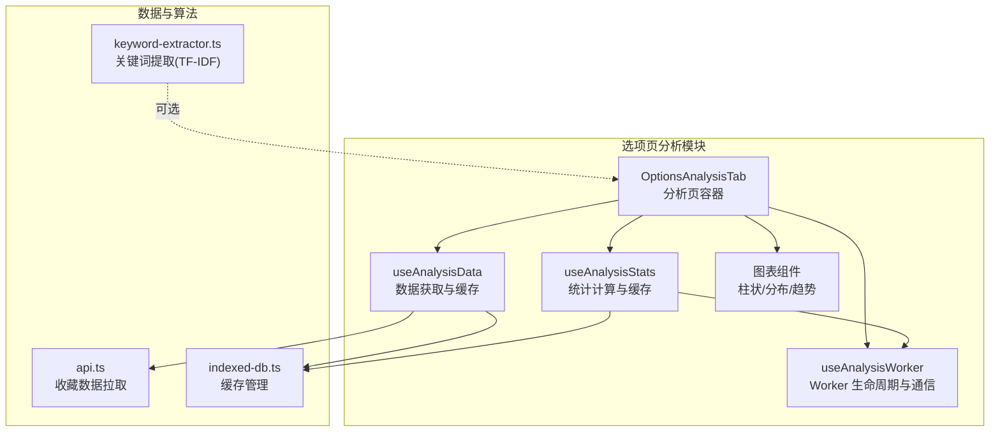
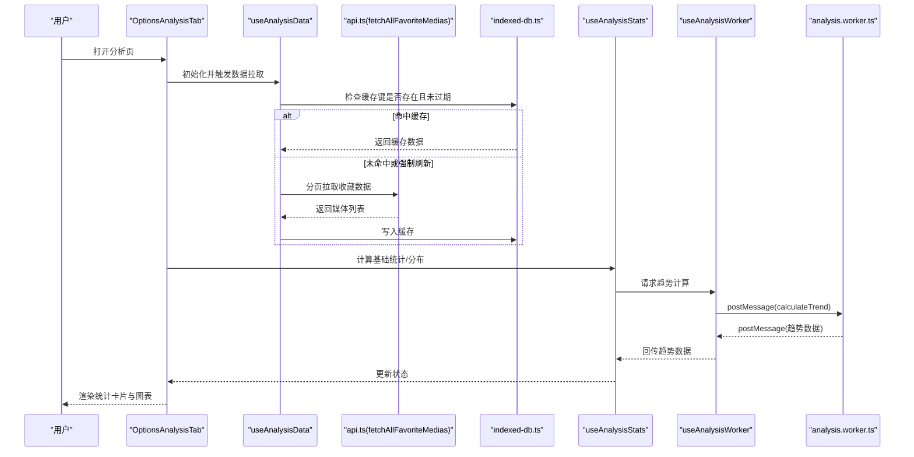
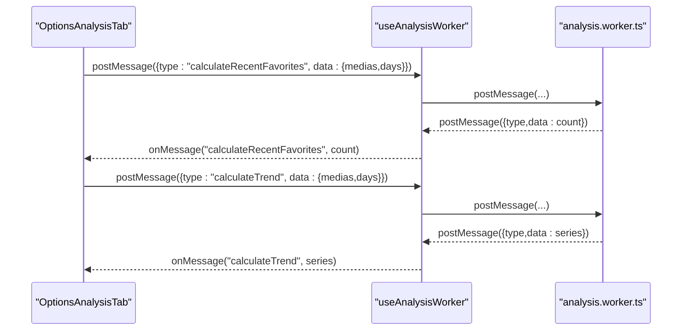
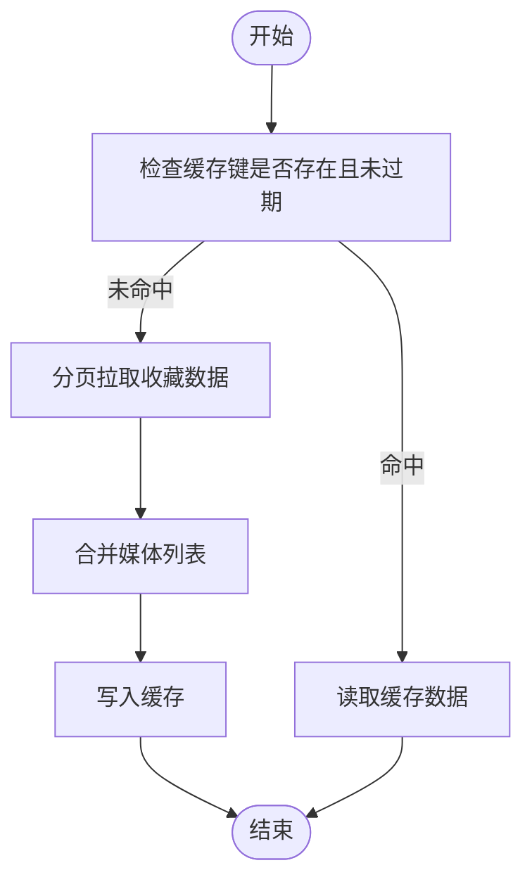
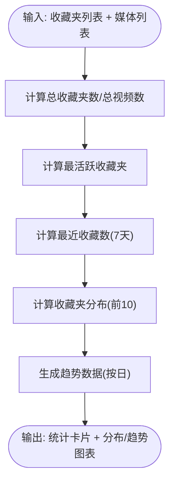
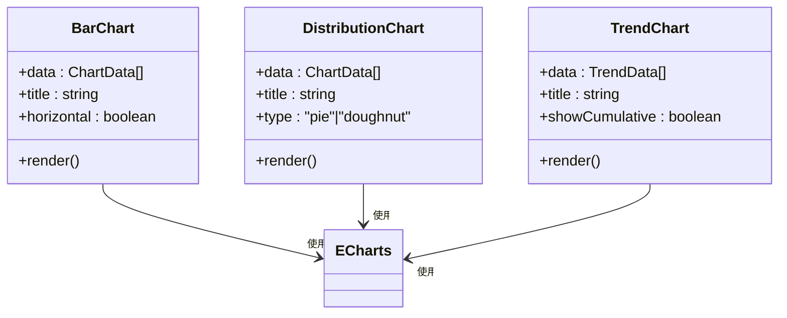
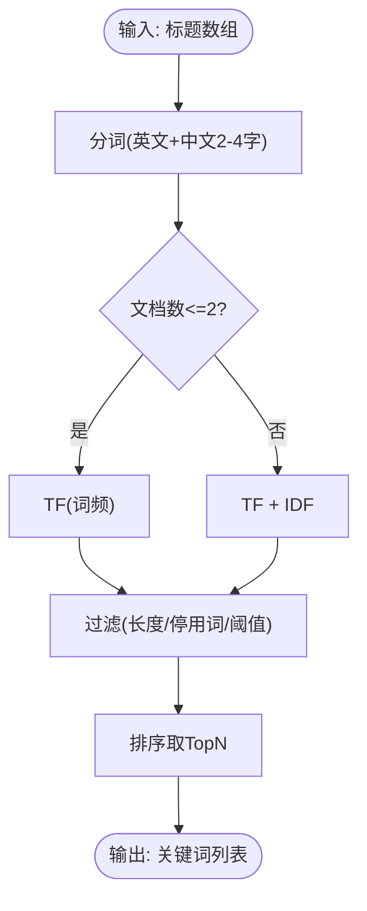
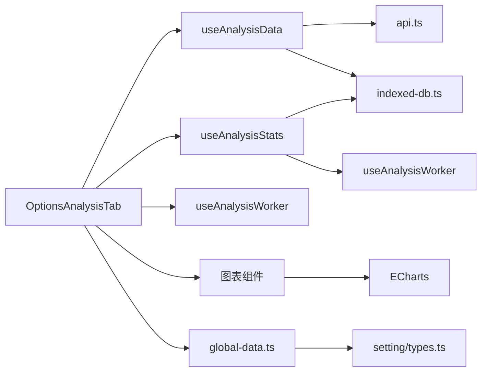

# 智能分析系统

<cite>
**本文引用的文件**
- [analysis.worker.ts](file://src/workers/analysis.worker.ts)
- [use-analysis-worker.ts](file://src/options/components/analysis/use-analysis-worker.ts)
- [options-analysis-tab.tsx](file://src/options/components/analysis/options-analysis-tab.tsx)
- [use-analysis-data.ts](file://src/options/components/analysis/use-analysis-data.ts)
- [use-analysis-stats.ts](file://src/options/components/analysis/use-analysis-stats.ts)
- [bar-chart.tsx](file://src/options/components/analysis/chart/bar-chart.tsx)
- [distribution-chart.tsx](file://src/options/components/analysis/chart/distribution-chart.tsx)
- [trend-chart.tsx](file://src/options/components/analysis/chart/trend-chart.tsx)
- [stats-cards.tsx](file://src/options/components/analysis/stats-cards.tsx)
- [keyword-extractor.ts](file://src/utils/keyword-extractor.ts)
- [api.ts](file://src/utils/api.ts)
- [indexed-db.ts](file://src/utils/indexed-db.ts)
- [global-data.ts](file://src/store/global-data.ts)
- [types.ts](file://src/options/components/setting/types.ts)
- [package.json](file://package.json)
- [README.md](file://README.md)
</cite>

## 目录
1. [简介](#简介)
2. [项目结构](#项目结构)
3. [核心组件](#核心组件)
4. [架构总览](#架构总览)
5. [详细组件分析](#详细组件分析)
6. [依赖关系分析](#依赖关系分析)
7. [性能考量](#性能考量)
8. [故障排查指南](#故障排查指南)
9. [结论](#结论)
10. [附录](#附录)

## 简介
本文件面向“智能分析系统”的使用者与开发者，系统性阐述收藏数据分析引擎的架构设计与实现要点，涵盖：
- Web Worker 的使用与消息通信机制
- 数据处理流程与缓存策略
- 图表组件（柱状图、分布图、趋势图）的技术细节
- 统计数据计算逻辑（关键词分布统计、时间趋势分析、内容类型识别）
- 分析数据的获取与处理机制（预处理、算法实现、结果展示）
- 配置选项说明与使用示例

## 项目结构
该扩展以 React + TypeScript 构建，分析模块位于 options 页面的 analysis 子目录，核心由三部分组成：
- 数据层：负责从 B 站接口拉取收藏数据、分页聚合、IndexedDB 缓存
- 计算层：通过 Web Worker 执行耗时统计计算（最近收藏数、日度分布与趋势）
- 展示层：基于 ECharts 的可视化图表与统计卡片

**图表来源**
- [options-analysis-tab.tsx:25-215](file://src/options/components/analysis/options-analysis-tab.tsx#L25-L215)
- [use-analysis-data.ts:33-109](file://src/options/components/analysis/use-analysis-data.ts#L33-L109)
- [use-analysis-stats.ts:53-166](file://src/options/components/analysis/use-analysis-stats.ts#L53-L166)
- [use-analysis-worker.ts:21-74](file://src/options/components/analysis/use-analysis-worker.ts#L21-L74)
- [bar-chart.tsx:16-107](file://src/options/components/analysis/chart/bar-chart.tsx#L16-L107)
- [distribution-chart.tsx:17-93](file://src/options/components/analysis/chart/distribution-chart.tsx#L17-L93)
- [trend-chart.tsx:17-120](file://src/options/components/analysis/chart/trend-chart.tsx#L17-L120)
- [api.ts:285-319](file://src/utils/api.ts#L285-L319)
- [indexed-db.ts:15-128](file://src/utils/indexed-db.ts#L15-L128)
- [keyword-extractor.ts:137-197](file://src/utils/keyword-extractor.ts#L137-L197)

**章节来源**
- [options-analysis-tab.tsx:25-215](file://src/options/components/analysis/options-analysis-tab.tsx#L25-L215)
- [use-analysis-data.ts:33-109](file://src/options/components/analysis/use-analysis-data.ts#L33-L109)
- [use-analysis-stats.ts:53-166](file://src/options/components/analysis/use-analysis-stats.ts#L53-L166)
- [use-analysis-worker.ts:21-74](file://src/options/components/analysis/use-analysis-worker.ts#L21-L74)
- [bar-chart.tsx:16-107](file://src/options/components/analysis/chart/bar-chart.tsx#L16-L107)
- [distribution-chart.tsx:17-93](file://src/options/components/analysis/chart/distribution-chart.tsx#L17-L93)
- [trend-chart.tsx:17-120](file://src/options/components/analysis/chart/trend-chart.tsx#L17-L120)
- [api.ts:285-319](file://src/utils/api.ts#L285-L319)
- [indexed-db.ts:15-128](file://src/utils/indexed-db.ts#L15-L128)
- [keyword-extractor.ts:137-197](file://src/utils/keyword-extractor.ts#L137-L197)

## 核心组件
- 分析页容器：负责组织数据获取、统计计算、Worker 通信与图表渲染
- 数据钩子：封装收藏数据拉取、缓存键生成、跨域/端口异常处理
- 统计钩子：封装基础统计、分布统计、趋势生成与缓存
- Worker 钩子：封装 Worker 生命周期、消息发送、错误处理
- 图表组件：基于 ECharts 的柱状图、饼图/圆环图、折线趋势图
- 缓存管理：IndexedDB 封装，支持读写、过期检查、清理
- 关键词提取：本地 TF-IDF 算法，支持停用词过滤与最小长度控制

**章节来源**
- [options-analysis-tab.tsx:25-215](file://src/options/components/analysis/options-analysis-tab.tsx#L25-L215)
- [use-analysis-data.ts:33-109](file://src/options/components/analysis/use-analysis-data.ts#L33-L109)
- [use-analysis-stats.ts:53-166](file://src/options/components/analysis/use-analysis-stats.ts#L53-L166)
- [use-analysis-worker.ts:21-74](file://src/options/components/analysis/use-analysis-worker.ts#L21-L74)
- [bar-chart.tsx:16-107](file://src/options/components/analysis/chart/bar-chart.tsx#L16-L107)
- [distribution-chart.tsx:17-93](file://src/options/components/analysis/chart/distribution-chart.tsx#L17-L93)
- [trend-chart.tsx:17-120](file://src/options/components/analysis/chart/trend-chart.tsx#L17-L120)
- [indexed-db.ts:15-128](file://src/utils/indexed-db.ts#L15-L128)
- [keyword-extractor.ts:137-197](file://src/utils/keyword-extractor.ts#L137-L197)

## 架构总览
下图展示了从用户交互到数据呈现的端到端流程，包括数据获取、缓存、Worker 计算与图表渲染。

**图表来源**
- [options-analysis-tab.tsx:82-135](file://src/options/components/analysis/options-analysis-tab.tsx#L82-L135)
- [use-analysis-data.ts:51-100](file://src/options/components/analysis/use-analysis-data.ts#L51-L100)
- [api.ts:285-319](file://src/utils/api.ts#L285-L319)
- [indexed-db.ts:45-81](file://src/utils/indexed-db.ts#L45-L81)
- [use-analysis-stats.ts:72-95](file://src/options/components/analysis/use-analysis-stats.ts#L72-L95)
- [use-analysis-worker.ts:27-67](file://src/options/components/analysis/use-analysis-worker.ts#L27-L67)
- [analysis.worker.ts:90-133](file://src/workers/analysis.worker.ts#L90-L133)

## 详细组件分析

### Web Worker 与消息通信
- Worker 负责两类计算：最近收藏数（N 日）、日度收藏分布与累计趋势
- 主线程通过 useAnalysisWorker 发送消息，监听 onmessage 并透传给分析页
- 错误通过 error 字段回传，避免主线程崩溃

**图表来源**
- [use-analysis-worker.ts:27-67](file://src/options/components/analysis/use-analysis-worker.ts#L27-L67)
- [analysis.worker.ts:90-133](file://src/workers/analysis.worker.ts#L90-L133)

**章节来源**
- [analysis.worker.ts:18-133](file://src/workers/analysis.worker.ts#L18-L133)
- [use-analysis-worker.ts:21-74](file://src/options/components/analysis/use-analysis-worker.ts#L21-L74)

### 数据获取与缓存策略
- 缓存键由收藏夹 ID 序列化并哈希生成，避免长键污染
- 默认缓存有效期 24 小时；强制刷新时绕过缓存
- 分页拉取收藏数据，聚合后写入 IndexedDB
- 对跨域/端口关闭等异常进行日志提示与降级处理

**图表来源**
- [use-analysis-data.ts:39-100](file://src/options/components/analysis/use-analysis-data.ts#L39-L100)
- [api.ts:285-319](file://src/utils/api.ts#L285-L319)
- [indexed-db.ts:45-81](file://src/utils/indexed-db.ts#L45-L81)

**章节来源**
- [use-analysis-data.ts:33-109](file://src/options/components/analysis/use-analysis-data.ts#L33-L109)
- [api.ts:285-319](file://src/utils/api.ts#L285-L319)
- [indexed-db.ts:15-128](file://src/utils/indexed-db.ts#L15-L128)

### 统计数据计算逻辑
- 基础统计：总收藏夹数、总视频数、最近收藏数（7 天）
- 分布统计：按收藏夹视频数量排序，取 TOP 10 的分布与百分比
- 趋势分析：按日统计收藏数与累计数，支持缓存复用

**图表来源**
- [use-analysis-stats.ts:98-142](file://src/options/components/analysis/use-analysis-stats.ts#L98-L142)
- [use-analysis-stats.ts:72-95](file://src/options/components/analysis/use-analysis-stats.ts#L72-L95)

**章节来源**
- [use-analysis-stats.ts:53-166](file://src/options/components/analysis/use-analysis-stats.ts#L53-L166)

### 图表组件技术细节
- 柱状图：支持横向/纵向，渐变色样式，自适应窗口大小
- 分布图：支持饼图/圆环图，百分比标签与悬浮提示
- 趋势图：双曲线（每日/累计），平滑曲线与面积填充

**图表来源**
- [bar-chart.tsx:16-107](file://src/options/components/analysis/chart/bar-chart.tsx#L16-L107)
- [distribution-chart.tsx:17-93](file://src/options/components/analysis/chart/distribution-chart.tsx#L17-L93)
- [trend-chart.tsx:17-120](file://src/options/components/analysis/chart/trend-chart.tsx#L17-L120)

**章节来源**
- [bar-chart.tsx:16-107](file://src/options/components/analysis/chart/bar-chart.tsx#L16-L107)
- [distribution-chart.tsx:17-93](file://src/options/components/analysis/chart/distribution-chart.tsx#L17-L93)
- [trend-chart.tsx:17-120](file://src/options/components/analysis/chart/trend-chart.tsx#L17-L120)

### 关键词提取算法（TF-IDF）
- 支持停用词过滤、中文分词（2-4 字词组）、英文单词
- 文档数 ≤ 2 时回退为纯词频（TF），否则使用 TF-IDF
- 可配置最大关键词数、最小长度、最低分数

**图表来源**
- [keyword-extractor.ts:137-197](file://src/utils/keyword-extractor.ts#L137-L197)

**章节来源**
- [keyword-extractor.ts:137-197](file://src/utils/keyword-extractor.ts#L137-L197)

## 依赖关系分析
- 选项页分析模块依赖数据钩子、统计钩子、Worker 钩子与图表组件
- 数据钩子依赖 API 工具与 IndexedDB 管理器
- 统计钩子依赖 Worker 钩子与 IndexedDB 管理器
- 图表组件依赖 ECharts
- 全局配置通过 Zustand + Chrome Storage 管理

**图表来源**
- [options-analysis-tab.tsx:25-215](file://src/options/components/analysis/options-analysis-tab.tsx#L25-L215)
- [use-analysis-data.ts:33-109](file://src/options/components/analysis/use-analysis-data.ts#L33-L109)
- [use-analysis-stats.ts:53-166](file://src/options/components/analysis/use-analysis-stats.ts#L53-L166)
- [use-analysis-worker.ts:21-74](file://src/options/components/analysis/use-analysis-worker.ts#L21-L74)
- [api.ts:285-319](file://src/utils/api.ts#L285-L319)
- [indexed-db.ts:15-128](file://src/utils/indexed-db.ts#L15-L128)
- [global-data.ts:6-28](file://src/store/global-data.ts#L6-L28)
- [types.ts:30-99](file://src/options/components/setting/types.ts#L30-L99)

**章节来源**
- [package.json:29-58](file://package.json#L29-L58)
- [global-data.ts:6-28](file://src/store/global-data.ts#L6-L28)
- [types.ts:30-99](file://src/options/components/setting/types.ts#L30-L99)

## 性能考量
- 使用 Web Worker 执行耗时计算，避免阻塞主线程
- IndexedDB 缓存 24 小时，减少重复网络请求
- 图表组件在窗口 resize 时自动适配，避免内存泄漏
- 分页拉取与增量缓存，降低单次请求压力
- 统计计算与趋势生成支持缓存复用，减少重复计算

[本节为通用性能建议，无需特定文件引用]

## 故障排查指南
- Worker 未就绪：检查 Worker 实例与 isReady 标志位
- 跨域/端口关闭：当出现“消息通道关闭”提示时，确保 B 站页面处于激活状态且内容脚本已加载
- 缓存异常：检查 IndexedDB 是否初始化成功、键值是否正确
- 图表渲染问题：确认容器尺寸与 ECharts 初始化时机

**章节来源**
- [use-analysis-worker.ts:27-67](file://src/options/components/analysis/use-analysis-worker.ts#L27-L67)
- [use-analysis-data.ts:78-88](file://src/options/components/analysis/use-analysis-data.ts#L78-L88)
- [indexed-db.ts:21-40](file://src/utils/indexed-db.ts#L21-L40)

## 结论
该智能分析系统通过清晰的分层设计与合理的性能策略，实现了从数据获取、缓存、计算到可视化的完整链路。Web Worker 与 IndexedDB 的结合有效提升了响应速度与用户体验；ECharts 图表提供了直观的数据洞察。同时，关键词提取算法为内容分类与归档提供了基础能力。

[本节为总结性内容，无需特定文件引用]

## 附录

### 配置选项说明
- 配置模式：支持“自定义”与“免费”两种模式，分别填写不同字段
- 自定义模式：需提供 API Key、模型名称与适配器
- 免费模式：需提供用户邮箱与 API Key ID、模型名称
- 表单校验：根据模式动态校验必填字段

**章节来源**
- [types.ts:30-99](file://src/options/components/setting/types.ts#L30-L99)

### 使用示例
- 打开分析页：在选项页中切换至“收藏夹分析”，选择时间范围并点击“刷新”
- 刷新数据：点击“刷新”按钮，强制清空缓存并重新拉取
- 查看统计：顶部卡片显示总收藏夹数、总视频数、最近收藏与最活跃收藏夹
- 查看图表：收藏分布与收藏趋势两个标签页分别展示饼图/柱状图与趋势折线图

**章节来源**
- [README.md:108-132](file://README.md#L108-L132)
- [options-analysis-tab.tsx:144-164](file://src/options/components/analysis/options-analysis-tab.tsx#L144-L164)
- [stats-cards.tsx:53-85](file://src/options/components/analysis/stats-cards.tsx#L53-L85)