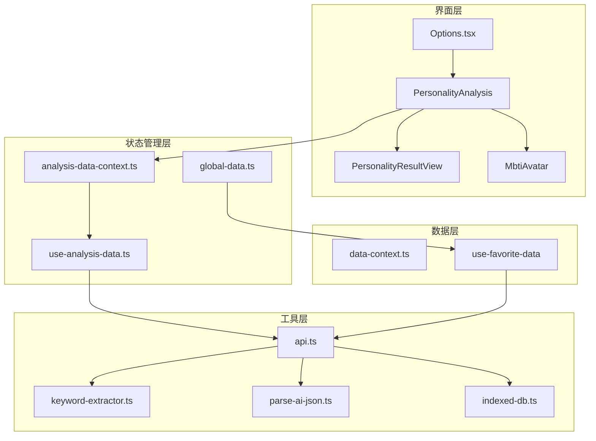
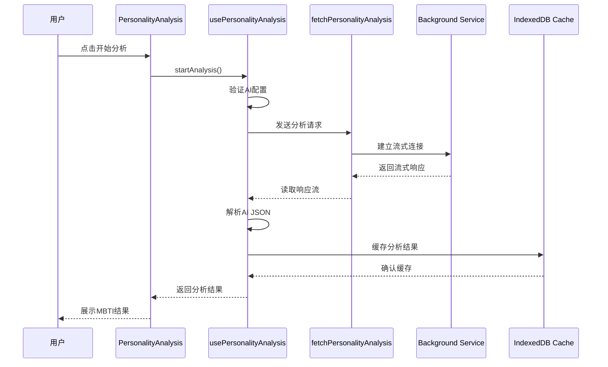
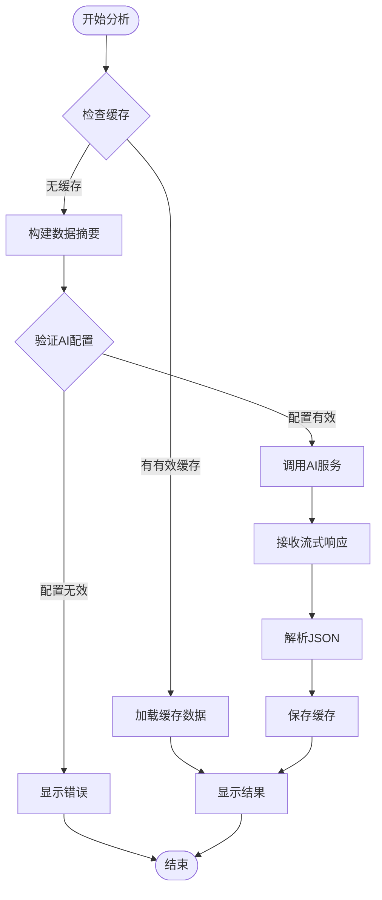
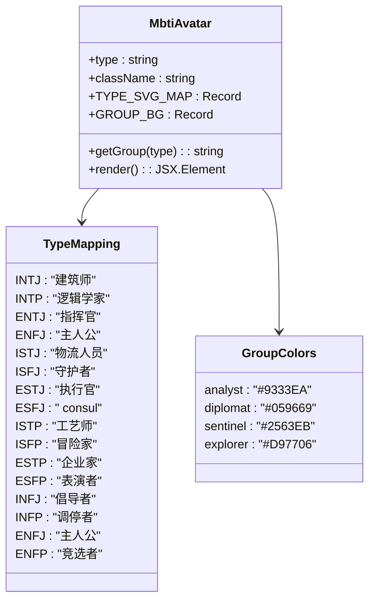
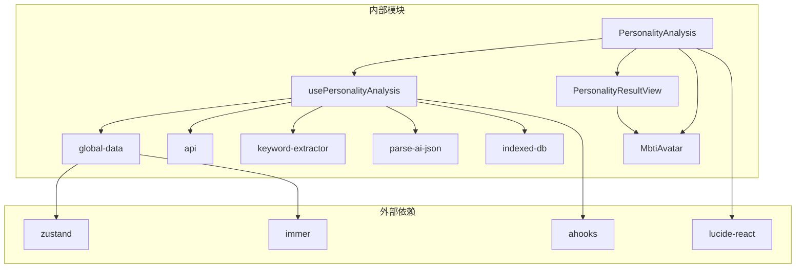
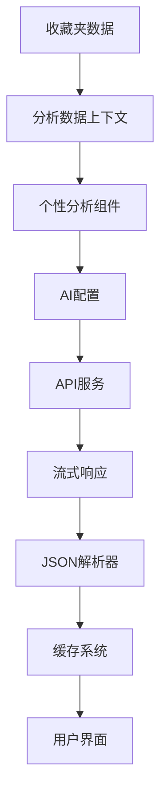

# MBTI人格分析系统

<cite>
**本文档引用的文件**
- [src/options/components/personality/index.tsx](file://src/options/components/personality/index.tsx)
- [src/options/components/personality/use-personality-analysis.ts](file://src/options/components/personality/use-personality-analysis.ts)
- [src/options/components/personality/personality-result.tsx](file://src/options/components/personality/personality-result.tsx)
- [src/options/components/personality/mbti-avatar.tsx](file://src/options/components/personality/mbti-avatar.tsx)
- [src/store/global-data.ts](file://src/store/global-data.ts)
- [src/utils/api.ts](file://src/utils/api.ts)
- [src/utils/keyword-extractor.ts](file://src/utils/keyword-extractor.ts)
- [src/utils/parse-ai-json.ts](file://src/utils/parse-ai-json.ts)
- [src/hooks/use-favorite-data/index.ts](file://src/hooks/use-favorite-data/index.ts)
- [src/options/components/analysis/analysis-data-context.ts](file://src/options/components/analysis/analysis-data-context.ts)
- [src/options/components/analysis/use-analysis-data.ts](file://src/options/components/analysis/use-analysis-data.ts)
- [src/utils/indexed-db.ts](file://src/utils/indexed-db.ts)
- [src/utils/data-context.ts](file://src/utils/data-context.ts)
- [src/options/Options.tsx](file://src/options/Options.tsx)
</cite>

## 目录
1. [简介](#简介)
2. [项目结构](#项目结构)
3. [核心组件](#核心组件)
4. [架构概览](#架构概览)
5. [详细组件分析](#详细组件分析)
6. [依赖关系分析](#依赖关系分析)
7. [性能考虑](#性能考虑)
8. [故障排除指南](#故障排除指南)
9. [结论](#结论)

## 简介

MBTI人格分析系统是一个基于B站收藏夹内容的AI驱动人格分析工具。该系统能够分析用户的收藏夹视频标题、分类分布和高频关键词，推断出符合MBTI理论的16种人格类型之一，并提供详细的维度分析和个人化建议。

系统采用现代化的React技术栈构建，支持多种AI模型集成，包括内置的免费AI服务和用户自定义的AI配置。通过智能缓存机制和流式数据处理，确保了良好的用户体验和性能表现。

## 项目结构

该项目采用模块化的组织方式，主要分为以下几个核心区域：



**图表来源**
- [src/options/Options.tsx:17-106](file://src/options/Options.tsx#L17-L106)
- [src/options/components/personality/index.tsx:12-124](file://src/options/components/personality/index.tsx#L12-L124)

**章节来源**
- [src/options/Options.tsx:1-110](file://src/options/Options.tsx#L1-L110)
- [src/options/components/personality/index.tsx:1-127](file://src/options/components/personality/index.tsx#L1-L127)

## 核心组件

### PersonalityAnalysis 主组件

PersonalityAnalysis 是整个MBTI分析功能的核心入口组件，负责协调数据获取、分析执行和结果显示。

**主要功能特性：**
- 收藏夹数据状态管理
- AI分析流程控制
- 结果展示和交互
- 错误处理和加载状态管理

### usePersonalityAnalysis Hook

这是一个自定义Hook，封装了完整的MBTI分析逻辑：

**核心能力：**
- 收藏夹数据摘要生成
- AI配置验证和适配
- 流式AI响应处理
- 结果缓存和持久化
- 错误恢复机制

### PersonalityResultView 结果展示组件

专门负责MBTI分析结果的可视化展示：

**展示内容：**
- MBTI类型卡片和描述
- 四维度分析进度条
- 兴趣标签云
- 个性化建议列表
- 重新分析功能

**章节来源**
- [src/options/components/personality/index.tsx:12-124](file://src/options/components/personality/index.tsx#L12-L124)
- [src/options/components/personality/use-personality-analysis.ts:71-160](file://src/options/components/personality/use-personality-analysis.ts#L71-L160)
- [src/options/components/personality/personality-result.tsx:23-138](file://src/options/components/personality/personality-result.tsx#L23-L138)

## 架构概览

系统采用分层架构设计，确保各层职责清晰分离：



**图表来源**
- [src/options/components/personality/use-personality-analysis.ts:95-152](file://src/options/components/personality/use-personality-analysis.ts#L95-L152)
- [src/utils/api.ts:307-325](file://src/utils/api.ts#L307-L325)

系统架构的关键特点：

1. **流式数据处理**：使用ReadableStream处理AI响应，提供实时反馈
2. **智能缓存策略**：结合IndexedDB和内存缓存，提升性能
3. **错误恢复机制**：完善的错误处理和用户提示
4. **配置灵活性**：支持多种AI服务提供商

## 详细组件分析

### 数据流分析



**图表来源**
- [src/options/components/personality/use-personality-analysis.ts:81-152](file://src/options/components/personality/use-personality-analysis.ts#L81-L152)

### 关键词提取算法

系统实现了基于TF-IDF的中文关键词提取算法：

```mermaid
flowchart LR
Input[输入视频标题集合] --> Tokenize[中文分词]
Tokenize --> Filter[过滤停用词]
Filter --> TF[计算词频(TF)]
Filter --> IDF[计算逆文档频率(IDF)]
TF --> Score[计算TF-IDF分数]
IDF --> Score
Score --> Sort[按分数排序]
Sort --> Output[输出关键词列表]
```

**图表来源**
- [src/utils/keyword-extractor.ts:137-187](file://src/utils/keyword-extractor.ts#L137-L187)

### MBTI类型映射系统

系统支持16种MBTI类型的完整映射：



**图表来源**
- [src/options/components/personality/mbti-avatar.tsx:27-62](file://src/options/components/personality/mbti-avatar.tsx#L27-L62)

**章节来源**
- [src/utils/keyword-extractor.ts:1-197](file://src/utils/keyword-extractor.ts#L1-L197)
- [src/options/components/personality/mbti-avatar.tsx:1-100](file://src/options/components/personality/mbti-avatar.tsx#L1-L100)

## 依赖关系分析

系统的核心依赖关系如下：



**图表来源**
- [src/options/components/personality/use-personality-analysis.ts:1-11](file://src/options/components/personality/use-personality-analysis.ts#L1-L11)

### 数据流依赖



**图表来源**
- [src/options/components/analysis/analysis-data-context.ts:22-48](file://src/options/components/analysis/analysis-data-context.ts#L22-L48)
- [src/store/global-data.ts:6-33](file://src/store/global-data.ts#L6-L33)

**章节来源**
- [src/utils/data-context.ts:5-39](file://src/utils/data-context.ts#L5-L39)
- [src/utils/api.ts:1-523](file://src/utils/api.ts#L1-L523)

## 性能考虑

### 缓存策略

系统实现了多层次的缓存机制：

1. **IndexedDB持久化缓存**：24小时过期策略
2. **内存缓存**：快速访问最近使用的数据
3. **分页缓存**：针对收藏夹分页数据的智能缓存
4. **分析结果缓存**：MBTI分析结果的短期缓存

### 性能优化措施

- **懒加载**：仅在需要时加载AI模型和资源
- **防抖处理**：避免重复请求和过度渲染
- **流式处理**：实时显示分析进度，提升用户体验
- **智能刷新**：根据数据变化自动决定是否重新分析

## 故障排除指南

### 常见问题及解决方案

**AI配置问题**
- 检查AI密钥、基础URL和模型名称是否正确设置
- 确认配置模式选择（免费/自定义）
- 验证网络连接和API服务可用性

**数据加载问题**
- 确保已登录B站账号并授权扩展访问
- 检查收藏夹权限设置
- 验证网络连接稳定性

**性能问题**
- 清理浏览器缓存和扩展存储
- 检查系统资源使用情况
- 重启浏览器扩展服务

**章节来源**
- [src/options/components/personality/use-personality-analysis.ts:96-102](file://src/options/components/personality/use-personality-analysis.ts#L96-L102)
- [src/utils/api.ts:182-239](file://src/utils/api.ts#L182-L239)

## 结论

MBTI人格分析系统是一个功能完整、架构清晰的Chrome扩展应用。系统通过以下关键特性提供了优秀的用户体验：

1. **智能化的数据处理**：基于TF-IDF算法的关键词提取，准确反映用户兴趣偏好
2. **灵活的AI集成**：支持多种AI服务提供商，满足不同用户需求
3. **高效的缓存机制**：多层缓存策略确保快速响应和低资源消耗
4. **优雅的错误处理**：完善的错误恢复和用户提示机制
5. **现代化的技术栈**：基于React和TypeScript的高质量代码实现

该系统不仅展示了现代前端开发的最佳实践，也为用户提供了有价值的个人洞察工具。通过持续优化和功能扩展，有望成为B站生态中不可或缺的个人分析工具。