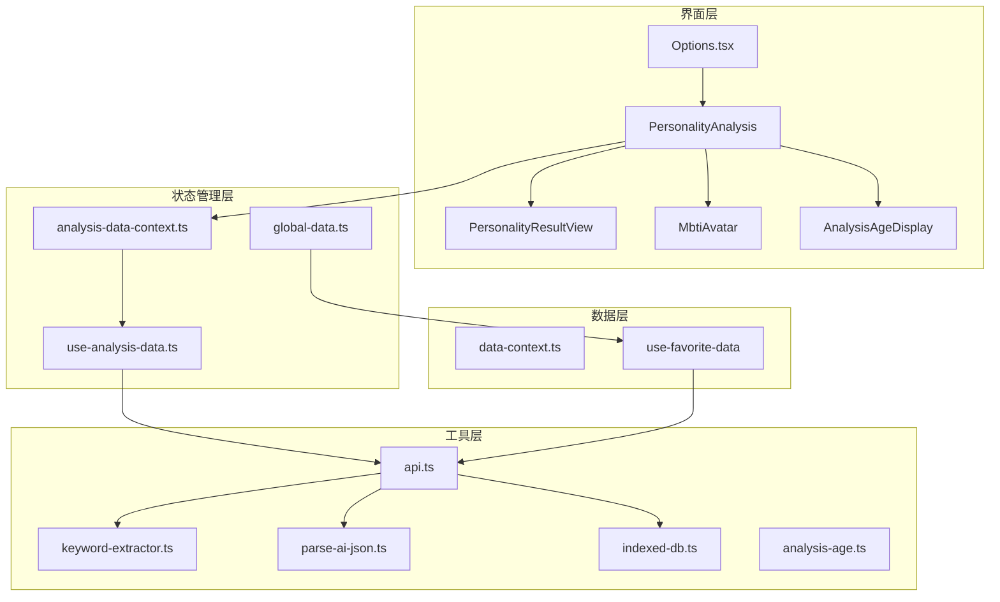
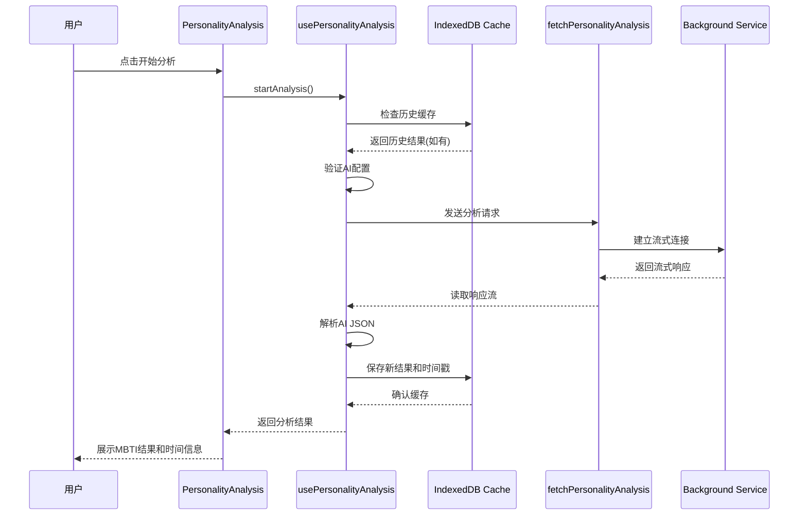
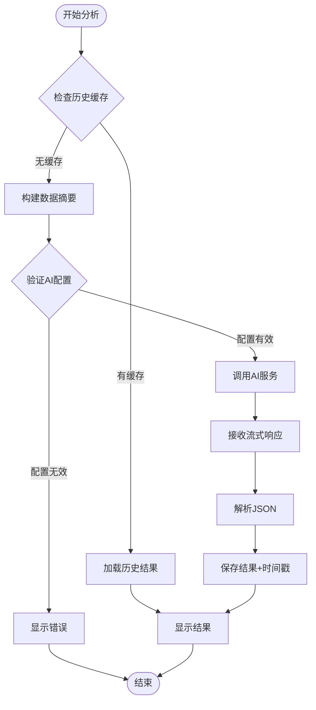
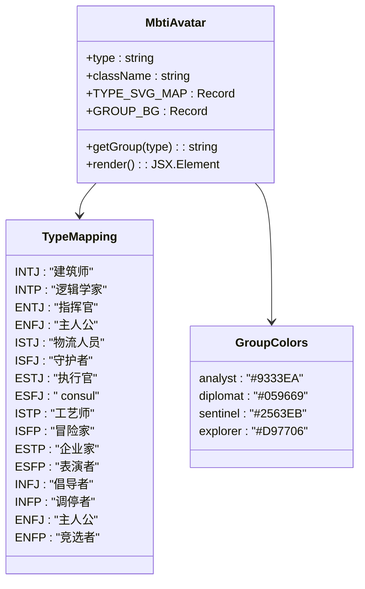
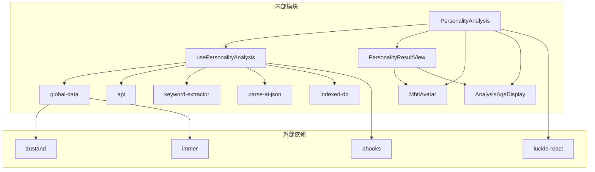
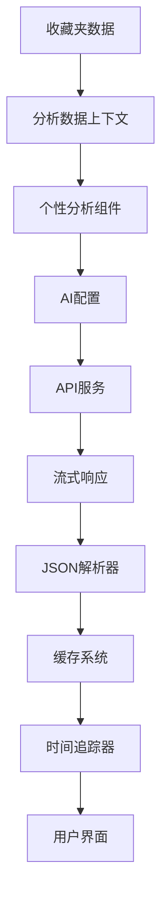

# MBTI人格分析系统

<cite>
**本文档引用的文件**
- [src/options/components/personality/index.tsx](file://src/options/components/personality/index.tsx)
- [src/options/components/personality/use-personality-analysis.ts](file://src/options/components/personality/use-personality-analysis.ts)
- [src/options/components/personality/personality-result.tsx](file://src/options/components/personality/personality-result.tsx)
- [src/options/components/personality/analysis-age.ts](file://src/options/components/personality/analysis-age.ts)
- [src/options/components/personality/mbti-avatar.tsx](file://src/options/components/personality/mbti-avatar.tsx)
- [src/store/global-data.ts](file://src/store/global-data.ts)
- [src/utils/api.ts](file://src/utils/api.ts)
- [src/utils/keyword-extractor.ts](file://src/utils/keyword-extractor.ts)
- [src/utils/parse-ai-json.ts](file://src/utils/parse-ai-json.ts)
- [src/hooks/use-favorite-data/index.ts](file://src/hooks/use-favorite-data/index.ts)
- [src/options/components/analysis/analysis-data-context.ts](file://src/options/components/analysis/analysis-data-context.ts)
- [src/options/components/analysis/use-analysis-data.ts](file://src/options/components/analysis/use-analysis-data.ts)
- [src/utils/indexed-db.ts](file://src/utils/indexed-db.ts)
- [src/utils/data-context.ts](file://src/utils/data-context.ts)
- [src/options/Options.tsx](file://src/options/Options.tsx)
</cite>

## 更新摘要
**变更内容**
- 新增年龄显示功能，展示上次分析的时间间隔
- 增强缓存行为以提高性能，支持历史结果持久化
- 改进用户界面，提供更友好的时间提示
- 完善错误处理和用户体验优化

## 目录
1. [简介](#简介)
2. [项目结构](#项目结构)
3. [核心组件](#核心组件)
4. [架构概览](#架构概览)
5. [详细组件分析](#详细组件分析)
6. [依赖关系分析](#依赖关系分析)
7. [性能考虑](#性能考虑)
8. [故障排除指南](#故障排除指南)
9. [结论](#结论)

## 简介

MBTI人格分析系统是一个基于B站收藏夹内容的AI驱动人格分析工具。该系统能够分析用户的收藏夹视频标题、分类分布和高频关键词，推断出符合MBTI理论的16种人格类型之一，并提供详细的维度分析和个人化建议。

系统采用现代化的React技术栈构建，支持多种AI模型集成，包括内置的免费AI服务和用户自定义的AI配置。通过智能缓存机制和流式数据处理，确保了良好的用户体验和性能表现。**最新更新**增强了年龄显示功能，能够展示上次分析的时间间隔，并改进了缓存行为以提高性能。

## 项目结构

该项目采用模块化的组织方式，主要分为以下几个核心区域：

```mermaid
graph TB
subgraph "界面层"
Options[Options.tsx]
Personality[PersonalityAnalysis]
Result[PersonalityResultView]
Avatar[MbtiAvatar]
AgeDisplay[AnalysisAgeDisplay]
end
subgraph "状态管理层"
GlobalStore[global-data.ts]
AnalysisContext[analysis-data-context.ts]
AnalysisData[use-analysis-data.ts]
end
subgraph "工具层"
API[api.ts]
KeywordExtractor[keyword-extractor.ts]
ParseAI[parse-ai-json.ts]
IndexedDB[indexed-db.ts]
AgeUtils[analysis-age.ts]
end
subgraph "数据层"
DataContext[data-context.ts]
Hooks[use-favorite-data]
end
Options --> Personality
Personality --> Result
Personality --> Avatar
Personality --> AgeDisplay
Personality --> AnalysisContext
AnalysisContext --> AnalysisData
AnalysisData --> API
API --> KeywordExtractor
API --> ParseAI
API --> IndexedDB
GlobalStore --> Hooks
Hooks --> API
```

**图表来源**
- [src/options/Options.tsx:17-106](file://src/options/Options.tsx#L17-L106)
- [src/options/components/personality/index.tsx:12-124](file://src/options/components/personality/index.tsx#L12-L124)

**章节来源**
- [src/options/Options.tsx:1-110](file://src/options/Options.tsx#L1-L110)
- [src/options/components/personality/index.tsx:1-138](file://src/options/components/personality/index.tsx#L1-L138)

## 核心组件

### PersonalityAnalysis 主组件

PersonalityAnalysis 是整个MBTI分析功能的核心入口组件，负责协调数据获取、分析执行和结果显示。

**主要功能特性：**
- 收藏夹数据状态管理
- AI分析流程控制
- 结果展示和交互
- 错误处理和加载状态管理
- **新增**：分析完成时间跟踪和用户提示

### usePersonalityAnalysis Hook

这是一个自定义Hook，封装了完整的MBTI分析逻辑：

**核心能力：**
- 收藏夹数据摘要生成
- AI配置验证和适配
- 流式AI响应处理
- **增强**：结果缓存和持久化，支持历史结果加载
- 错误恢复机制
- **新增**：分析完成时间戳记录

### PersonalityResultView 结果展示组件

专门负责MBTI分析结果的可视化展示：

**展示内容：**
- MBTI类型卡片和描述
- 四维度分析进度条
- 兴趣标签云
- 个性化建议列表
- 重新分析功能
- **新增**：上次分析时间显示

### AnalysisAge 时间显示组件

**新增功能**：提供人性化的时间间隔显示

**主要功能：**
- 计算分析完成后的时间间隔
- 提供友好的中文时间描述
- 支持天、月、年等多单位显示
- 实时更新时间显示

**章节来源**
- [src/options/components/personality/index.tsx:12-138](file://src/options/components/personality/index.tsx#L12-L138)
- [src/options/components/personality/use-personality-analysis.ts:76-185](file://src/options/components/personality/use-personality-analysis.ts#L76-L185)
- [src/options/components/personality/personality-result.tsx:25-153](file://src/options/components/personality/personality-result.tsx#L25-L153)
- [src/options/components/personality/analysis-age.ts:1-22](file://src/options/components/personality/analysis-age.ts#L1-L22)

## 架构概览

系统采用分层架构设计，确保各层职责清晰分离：

```mermaid
sequenceDiagram
participant User as 用户
participant UI as PersonalityAnalysis
participant Hook as usePersonalityAnalysis
participant Cache as IndexedDB Cache
participant API as fetchPersonalityAnalysis
participant BG as Background Service
User->>UI : 点击开始分析
UI->>Hook : startAnalysis()
Hook->>Cache : 检查历史缓存
Cache-->>Hook : 返回历史结果(如有)
Hook->>Hook : 验证AI配置
Hook->>API : 发送分析请求
API->>BG : 建立流式连接
BG-->>API : 返回流式响应
API-->>Hook : 读取响应流
Hook->>Hook : 解析AI JSON
Hook->>Cache : 保存新结果和时间戳
Cache-->>Hook : 确认缓存
Hook-->>UI : 返回分析结果
UI-->>User : 展示MBTI结果和时间信息
```

**图表来源**
- [src/options/components/personality/use-personality-analysis.ts:90-168](file://src/options/components/personality/use-personality-analysis.ts#L90-L168)
- [src/utils/api.ts:394-410](file://src/utils/api.ts#L394-L410)

系统架构的关键特点：

1. **流式数据处理**：使用ReadableStream处理AI响应，提供实时反馈
2. **智能缓存策略**：结合IndexedDB和内存缓存，提升性能
3. **历史结果支持**：永久保存分析结果，支持随时查看
4. **错误恢复机制**：完善的错误处理和用户提示
5. **配置灵活性**：支持多种AI服务提供商

## 详细组件分析

### 数据流分析

```mermaid
flowchart TD
Start([开始分析]) --> CheckCache{检查历史缓存}
CheckCache --> |有缓存| LoadHistory[加载历史结果]
CheckCache --> |无缓存| BuildSummary[构建数据摘要]
LoadHistory --> ShowResult[显示结果]
BuildSummary --> ValidateConfig{验证AI配置}
ValidateConfig --> |配置无效| ShowError[显示错误]
ValidateConfig --> |配置有效| CallAI[调用AI服务]
CallAI --> StreamResponse[接收流式响应]
StreamResponse --> ParseJSON[解析JSON]
ParseJSON --> SaveCache[保存结果+时间戳]
SaveCache --> ShowResult
ShowError --> End([结束])
ShowResult --> End
```

**图表来源**
- [src/options/components/personality/use-personality-analysis.ts:90-168](file://src/options/components/personality/use-personality-analysis.ts#L90-L168)

### 年龄显示算法

**新增功能**：实现人性化的时间间隔显示算法

```mermaid
flowchart LR
Input[分析完成时间] --> CalcDays[计算天数差值]
CalcDays --> CheckToday{是否当天?}
CheckToday --> |是| ShowJustNow[显示"刚刚分析过"]
CheckToday --> |否| CheckMonths{是否小于1个月?}
CheckMonths --> |是| ShowDays[显示"已经X天啦"]
CheckMonths --> |否| CheckYears{是否小于1年?}
CheckYears --> |是| ShowMonths[显示"已经X个月啦"]
CheckYears --> |否| ShowYears[显示"已经X年X个月啦"]
```

**图表来源**
- [src/options/components/personality/analysis-age.ts:5-19](file://src/options/components/personality/analysis-age.ts#L5-L19)

### 关键词提取算法

系统实现了基于TF-IDF的中文关键词提取算法：

```mermaid
flowchart LR
Input[输入视频标题集合] --> Tokenize[中文分词]
Tokenize --> Filter[过滤停用词]
Filter --> TF[计算词频(TF)]
Filter --> IDF[计算逆文档频率(IDF)]
TF --> Score[计算TF-IDF分数]
IDF --> Score
Score --> Sort[按分数排序]
Sort --> Output[输出关键词列表]
```

**图表来源**
- [src/utils/keyword-extractor.ts:137-187](file://src/utils/keyword-extractor.ts#L137-L187)

### MBTI类型映射系统

系统支持16种MBTI类型的完整映射：

```mermaid
classDiagram
class MbtiAvatar {
+type : string
+className : string
+TYPE_SVG_MAP : Record
+GROUP_BG : Record
+getGroup(type) : string
+render() : JSX.Element
}
class TypeMapping {
INTJ : "建筑师"
INTP : "逻辑学家"
ENTJ : "指挥官"
ENFJ : "主人公"
ISTJ : "物流人员"
ISFJ : "守护者"
ESTJ : "执行官"
ESFJ : " consul"
ISTP : "工艺师"
ISFP : "冒险家"
ESTP : "企业家"
ESFP : "表演者"
INFJ : "倡导者"
INFP : "调停者"
ENFJ : "主人公"
ENFP : "竞选者"
}
class GroupColors {
analyst : "#9333EA"
diplomat : "#059669"
sentinel : "#2563EB"
explorer : "#D97706"
}
MbtiAvatar --> TypeMapping
MbtiAvatar --> GroupColors
```

**图表来源**
- [src/options/components/personality/mbti-avatar.tsx:27-62](file://src/options/components/personality/mbti-avatar.tsx#L27-L62)

**章节来源**
- [src/utils/keyword-extractor.ts:1-197](file://src/utils/keyword-extractor.ts#L1-L197)
- [src/options/components/personality/mbti-avatar.tsx:1-100](file://src/options/components/personality/mbti-avatar.tsx#L1-L100)
- [src/options/components/personality/analysis-age.ts:1-22](file://src/options/components/personality/analysis-age.ts#L1-L22)

## 依赖关系分析

系统的核心依赖关系如下：

```mermaid
graph TB
subgraph "外部依赖"
Zustand[zustand]
Ahooks[ahooks]
Lucide[lucide-react]
Immer[immer]
end
subgraph "内部模块"
Personality[PersonalityAnalysis]
Hook[usePersonalityAnalysis]
Result[PersonalityResultView]
Avatar[MbtiAvatar]
AgeDisplay[AnalysisAgeDisplay]
Store[global-data]
API[api]
Extractor[keyword-extractor]
Parser[parse-ai-json]
DB[indexed-db]
end
Personality --> Hook
Personality --> Result
Personality --> Avatar
Personality --> AgeDisplay
Hook --> Store
Hook --> API
Hook --> Extractor
Hook --> Parser
Hook --> DB
Result --> Avatar
Result --> AgeDisplay
Store --> Zustand
Store --> Immer
Hook --> Ahooks
Personality --> Lucide
```

**图表来源**
- [src/options/components/personality/use-personality-analysis.ts:1-12](file://src/options/components/personality/use-personality-analysis.ts#L1-L12)

### 数据流依赖

```mermaid
flowchart TD
FavoriteData[收藏夹数据] --> AnalysisData[分析数据上下文]
AnalysisData --> PersonalityAnalysis[个性分析组件]
PersonalityAnalysis --> AIConfig[AI配置]
AIConfig --> APIService[API服务]
APIService --> StreamResponse[流式响应]
StreamResponse --> JSONParser[JSON解析器]
JSONParser --> Cache[缓存系统]
Cache --> TimeTracker[时间追踪器]
TimeTracker --> UI[用户界面]
```

**图表来源**
- [src/options/components/analysis/analysis-data-context.ts:22-48](file://src/options/components/analysis/analysis-data-context.ts#L22-L48)
- [src/store/global-data.ts:6-33](file://src/store/global-data.ts#L6-L33)

**章节来源**
- [src/utils/data-context.ts:5-39](file://src/utils/data-context.ts#L5-L39)
- [src/utils/api.ts:1-640](file://src/utils/api.ts#L1-L640)

## 性能考虑

### 缓存策略

系统实现了多层次的缓存机制：

1. **IndexedDB持久化缓存**：永久保存分析结果，支持历史查询
2. **内存缓存**：快速访问最近使用的数据
3. **分页缓存**：针对收藏夹分页数据的智能缓存（20分钟过期）
4. **分析结果缓存**：MBTI分析结果的长期缓存，包含时间戳

### 性能优化措施

- **懒加载**：仅在需要时加载AI模型和资源
- **防抖处理**：避免重复请求和过度渲染
- **流式处理**：实时显示分析进度，提升用户体验
- **智能刷新**：根据数据变化自动决定是否重新分析
- **历史结果复用**：无需重复分析即可查看历史结果
- **时间戳优化**：精确记录分析完成时间，支持灵活的时间显示

### 新增的性能优化

**缓存增强**：
- 支持历史分析结果的永久存储
- 自动加载最近的分析结果
- 减少不必要的AI调用
- 提高页面加载速度

**时间显示优化**：
- 高效的时间计算算法
- 本地化的时间格式显示
- 实时更新的时间提示

## 故障排除指南

### 常见问题及解决方案

**AI配置问题**
- 检查AI密钥、基础URL和模型名称是否正确设置
- 确认配置模式选择（免费/自定义）
- 验证网络连接和API服务可用性

**数据加载问题**
- 确保已登录B站账号并授权扩展访问
- 检查收藏夹权限设置
- 验证网络连接稳定性

**性能问题**
- 清理浏览器缓存和扩展存储
- 检查系统资源使用情况
- 重启浏览器扩展服务

**历史结果问题**
- 检查IndexedDB存储是否正常
- 确认缓存数据完整性
- 必要时清除缓存重新分析

**章节来源**
- [src/options/components/personality/use-personality-analysis.ts:101-117](file://src/options/components/personality/use-personality-analysis.ts#L101-L117)
- [src/utils/api.ts:182-239](file://src/utils/api.ts#L182-L239)
- [src/utils/indexed-db.ts:145-150](file://src/utils/indexed-db.ts#L145-L150)

## 结论

MBTI人格分析系统是一个功能完整、架构清晰的Chrome扩展应用。系统通过以下关键特性提供了优秀的用户体验：

1. **智能化的数据处理**：基于TF-IDF算法的关键词提取，准确反映用户兴趣偏好
2. **灵活的AI集成**：支持多种AI服务提供商，满足不同用户需求
3. **高效的缓存机制**：多层缓存策略确保快速响应和低资源消耗
4. **优雅的错误处理**：完善的错误恢复和用户提示机制
5. **现代化的技术栈**：基于React和TypeScript的高质量代码实现
6. **增强的用户体验**：**新增**的年龄显示功能让用户了解上次分析的时间间隔，提升使用体验

**最新更新亮点**：
- **年龄显示功能**：智能计算并显示分析完成后的时间间隔，提供"刚刚分析过"、"已经X天啦"等友好提示
- **历史结果支持**：永久保存分析结果，用户可随时查看历史分析而无需重复调用AI
- **性能优化**：改进的缓存策略减少了不必要的AI调用，提升了响应速度
- **用户体验提升**：更直观的时间提示帮助用户了解分析的新鲜度

该系统不仅展示了现代前端开发的最佳实践，也为用户提供了有价值的个人洞察工具。通过持续优化和功能扩展，有望成为B站生态中不可或缺的个人分析工具。