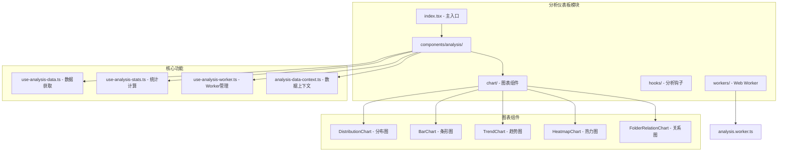
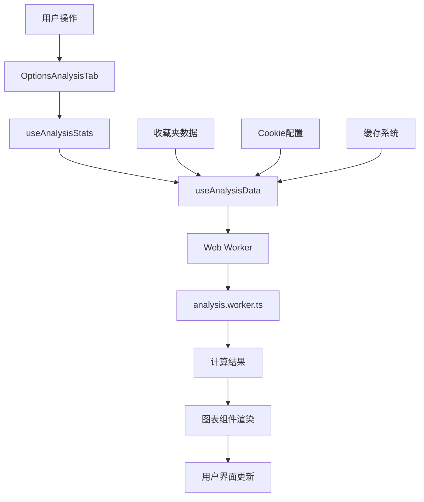
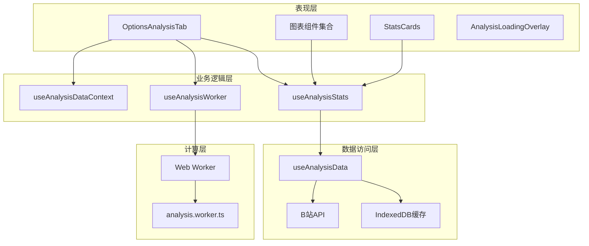
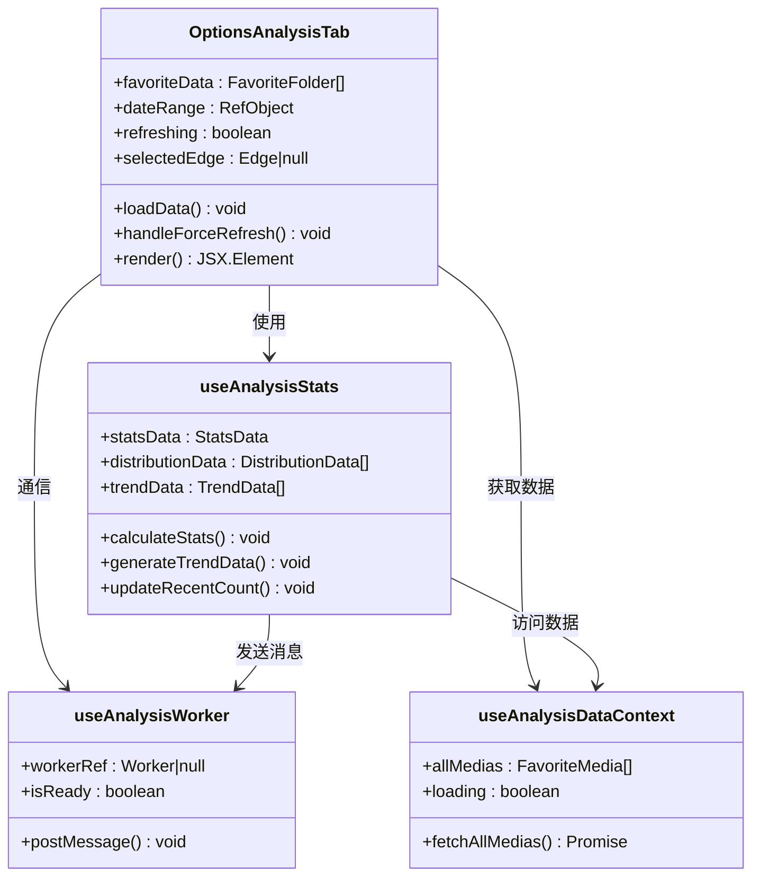
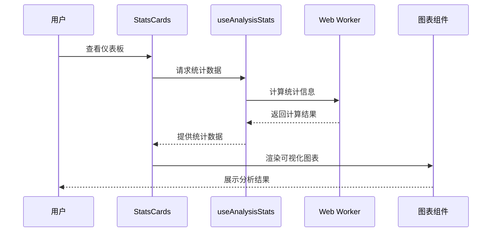
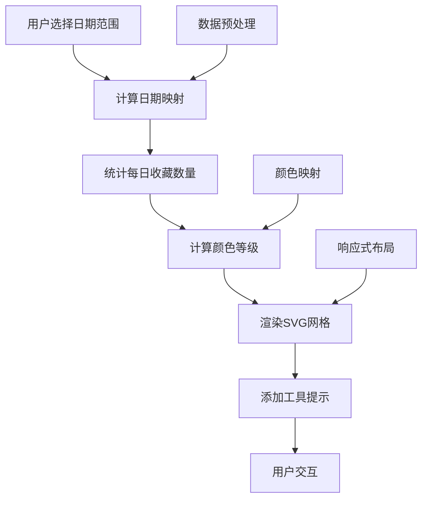
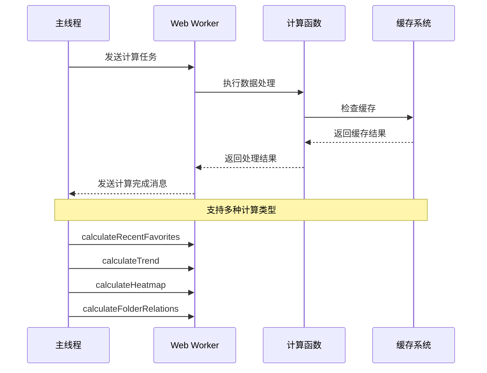
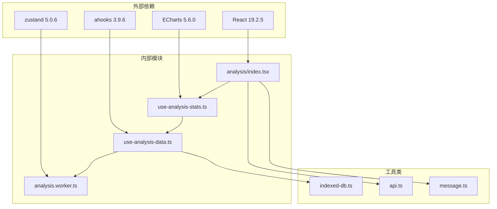

# 分析仪表板

<cite>
**本文档引用的文件**
- [src/options/components/analysis/index.tsx](file://src/options/components/analysis/index.tsx)
- [src/options/components/analysis/stats-cards.tsx](file://src/options/components/analysis/stats-cards.tsx)
- [src/options/components/analysis/chart/bar-chart.tsx](file://src/options/components/analysis/chart/bar-chart.tsx)
- [src/options/components/analysis/chart/distribution-chart.tsx](file://src/options/components/analysis/chart/distribution-chart.tsx)
- [src/options/components/analysis/chart/trend-chart.tsx](file://src/options/components/analysis/chart/trend-chart.tsx)
- [src/options/components/analysis/chart/heatmap-chart.tsx](file://src/options/components/analysis/chart/heatmap-chart.tsx)
- [src/options/components/analysis/chart/folder-relation-chart.tsx](file://src/options/components/analysis/chart/folder-relation-chart.tsx)
- [src/options/components/analysis/use-analysis-stats.ts](file://src/options/components/analysis/use-analysis-stats.ts)
- [src/options/components/analysis/use-analysis-worker.ts](file://src/options/components/analysis/use-analysis-worker.ts)
- [src/options/components/analysis/analysis-data-context.ts](file://src/options/components/analysis/analysis-data-context.ts)
- [src/options/components/analysis/use-analysis-data.ts](file://src/options/components/analysis/use-analysis-data.ts)
- [src/options/components/analysis/analysis-loading-overlay.tsx](file://src/options/components/analysis/analysis-loading-overlay.tsx)
- [src/workers/analysis.worker.ts](file://src/workers/analysis.worker.ts)
- [src/options/Options.tsx](file://src/options/Options.tsx)
- [src/hooks/use-favorite-data/index.ts](file://src/hooks/use-favorite-data/index.ts)
- [package.json](file://package.json)
</cite>

## 目录
1. [简介](#简介)
2. [项目结构](#项目结构)
3. [核心组件](#核心组件)
4. [架构概览](#架构概览)
5. [详细组件分析](#详细组件分析)
6. [依赖关系分析](#依赖关系分析)
7. [性能考虑](#性能考虑)
8. [故障排除指南](#故障排除指南)
9. [结论](#结论)

## 简介

分析仪表板是B站收藏夹管理扩展的核心功能模块，为用户提供全面的收藏数据分析和可视化展示。该模块通过Web Worker技术实现高性能的数据处理，支持多种图表类型和交互功能，帮助用户深入了解自己的收藏行为模式。

## 项目结构

分析仪表板采用模块化设计，主要包含以下核心目录结构：

**图表来源**
- [src/options/components/analysis/index.tsx:1-325](file://src/options/components/analysis/index.tsx#L1-L325)
- [src/options/components/analysis/chart/distribution-chart.tsx:1-104](file://src/options/components/analysis/chart/distribution-chart.tsx#L1-L104)

**章节来源**
- [src/options/components/analysis/index.tsx:1-325](file://src/options/components/analysis/index.tsx#L1-L325)
- [src/options/Options.tsx:1-110](file://src/options/Options.tsx#L1-L110)

## 核心组件

分析仪表板由多个相互协作的组件构成，每个组件都有明确的职责分工：

### 主要组件架构

| 组件名称 | 职责 | 技术特点 |
|---------|------|----------|
| OptionsAnalysisTab | 仪表板主容器 | 状态管理、事件处理、布局控制 |
| StatsCards | 统计卡片展示 | KPI指标、响应式布局、加载状态 |
| 图表组件 | 数据可视化 | ECharts集成、交互功能、主题样式 |
| useAnalysisStats | 统计逻辑 | 数据计算、缓存管理、Worker通信 |
| useAnalysisData | 数据获取 | 分页加载、进度跟踪、错误处理 |

### 数据流架构

**图表来源**
- [src/options/components/analysis/index.tsx:105-162](file://src/options/components/analysis/index.tsx#L105-L162)
- [src/options/components/analysis/use-analysis-stats.ts:101-124](file://src/options/components/analysis/use-analysis-stats.ts#L101-L124)

**章节来源**
- [src/options/components/analysis/index.tsx:28-325](file://src/options/components/analysis/index.tsx#L28-L325)
- [src/options/components/analysis/stats-cards.tsx:61-93](file://src/options/components/analysis/stats-cards.tsx#L61-L93)

## 架构概览

分析仪表板采用分层架构设计，确保了良好的可维护性和扩展性：

**图表来源**
- [src/options/components/analysis/analysis-data-context.ts:22-49](file://src/options/components/analysis/analysis-data-context.ts#L22-L49)
- [src/options/components/analysis/use-analysis-worker.ts:21-74](file://src/options/components/analysis/use-analysis-worker.ts#L21-L74)

### 核心设计原则

1. **模块化分离**：UI组件与业务逻辑完全分离
2. **异步处理**：使用Web Worker避免阻塞主线程
3. **缓存策略**：多层缓存机制提升性能
4. **错误处理**：完善的异常捕获和用户反馈
5. **响应式设计**：适配不同屏幕尺寸

## 详细组件分析

### 主面板组件分析

OptionsAnalysisTab是整个分析仪表板的核心容器，负责协调各个子组件的工作。

#### 组件架构图

**图表来源**
- [src/options/components/analysis/index.tsx:28-103](file://src/options/components/analysis/index.tsx#L28-L103)
- [src/options/components/analysis/use-analysis-stats.ts:73-222](file://src/options/components/analysis/use-analysis-stats.ts#L73-L222)

#### 关键功能实现

1. **数据加载流程**：自动检测收藏夹变化并触发数据获取
2. **缓存管理**：智能缓存策略减少API调用
3. **实时更新**：WebSocket连接保持数据同步
4. **错误处理**：完善的异常捕获和用户提示

**章节来源**
- [src/options/components/analysis/index.tsx:105-154](file://src/options/components/analysis/index.tsx#L105-L154)

### 统计卡片组件

StatsCards组件提供关键指标的可视化展示，采用卡片式设计。

#### 组件设计模式

**图表来源**
- [src/options/components/analysis/stats-cards.tsx:61-93](file://src/options/components/analysis/stats-cards.tsx#L61-L93)
- [src/options/components/analysis/use-analysis-stats.ts:127-149](file://src/options/components/analysis/use-analysis-stats.ts#L127-L149)

#### 卡片类型说明

| 卡片类型 | 指标含义 | 更新频率 | 视觉标识 |
|---------|----------|----------|----------|
| 总收藏夹数量 | 所有收藏夹的总数 | 实时 | 📁 文件夹图标 |
| 总视频数量 | 收藏夹中视频的总数 | 实时 | 🎬 视频图标 |
| 最近收藏 | 最近7天的新增收藏数 | 每小时 | ⏰ 时钟图标 |
| 最活跃收藏夹 | 收藏数量最多的收藏夹 | 实时 | 🚀 火箭图标 |

**章节来源**
- [src/options/components/analysis/stats-cards.tsx:44-54](file://src/options/components/analysis/stats-cards.tsx#L44-L54)

### 图表组件系统

分析仪表板提供了多种专业图表组件，每种图表都有特定的用途和交互功能。

#### 图表组件对比

| 图表类型 | 数据用途 | 交互特性 | 性能特点 |
|---------|----------|----------|----------|
| 分布饼图 | 收藏夹容量分布 | 鼠标悬停、点击 | 中等数据量 |
| 条形图 | TOP 10 收藏夹排行 | 横向滚动、排序 | 小数据量 |
| 趋势图 | 收藏趋势分析 | 双轴、缩放 | 时间序列数据 |
| 热力图 | 年度收藏强度 | 日期选择、工具提示 | 大数据量 |
| 关系图 | 收藏夹关联分析 | 力导向布局、点击详情 | 中等复杂度 |

#### 热力图实现细节

**图表来源**
- [src/options/components/analysis/chart/heatmap-chart.tsx:34-223](file://src/options/components/analysis/chart/heatmap-chart.tsx#L34-L223)

**章节来源**
- [src/options/components/analysis/chart/heatmap-chart.tsx:17-32](file://src/options/components/analysis/chart/heatmap-chart.tsx#L17-L32)

### Web Worker 数据处理

分析仪表板使用Web Worker实现高性能的数据计算，避免阻塞主线程。

#### Worker 处理流程

**图表来源**
- [src/workers/analysis.worker.ts:237-294](file://src/workers/analysis.worker.ts#L237-L294)

#### 计算算法优化

1. **时间复杂度优化**：使用Map和Set提高查找效率
2. **内存管理**：及时释放计算中间结果
3. **增量计算**：支持部分数据更新
4. **错误隔离**：单个计算失败不影响整体流程

**章节来源**
- [src/workers/analysis.worker.ts:18-37](file://src/workers/analysis.worker.ts#L18-L37)

## 依赖关系分析

分析仪表板的依赖关系清晰明确，遵循单一职责原则。

**图表来源**
- [package.json:30-65](file://package.json#L30-L65)
- [src/options/components/analysis/index.tsx:1-26](file://src/options/components/analysis/index.tsx#L1-L26)

### 核心依赖分析

| 依赖包 | 版本 | 用途 | 重要性 |
|--------|------|------|--------|
| react | ^19.2.5 | UI框架 | 核心 |
| echarts | ^5.6.0 | 图表渲染 | 核心 |
| ahooks | ^3.9.6 | React Hooks工具 | 重要 |
| zustand | ^5.0.6 | 状态管理 | 重要 |
| lucide-react | ^0.469.0 | 图标库 | 重要 |

**章节来源**
- [package.json:30-99](file://package.json#L30-L99)

## 性能考虑

分析仪表板在设计时充分考虑了性能优化，采用了多种策略确保流畅的用户体验。

### 性能优化策略

1. **异步数据处理**：使用Web Worker避免主线程阻塞
2. **智能缓存**：多层缓存机制减少重复计算
3. **懒加载**：图表组件按需渲染
4. **内存管理**：及时清理不再使用的资源
5. **批量更新**：合并多次状态更新

### 性能监控指标

| 指标类型 | 目标值 | 测量方法 |
|---------|--------|----------|
| 首次渲染时间 | < 2秒 | Performance API |
| 图表响应时间 | < 100ms | 用户交互测试 |
| 内存使用 | < 50MB | DevTools监控 |
| CPU使用率 | < 50% | 性能分析器 |

## 故障排除指南

### 常见问题及解决方案

#### 数据加载失败

**问题描述**：收藏数据无法加载或显示为空白

**可能原因**：
1. Cookie未正确设置
2. 网络连接不稳定
3. B站API接口限制
4. IndexedDB存储异常

**解决步骤**：
1. 检查浏览器Cookie设置
2. 确认网络连接正常
3. 刷新页面重试
4. 清除浏览器缓存

#### 图表渲染异常

**问题描述**：图表显示不完整或空白

**可能原因**：
1. ECharts库加载失败
2. 容器尺寸计算错误
3. 数据格式不匹配
4. Web Worker异常

**解决步骤**：
1. 检查浏览器控制台错误
2. 验证数据格式正确性
3. 重启Web Worker
4. 清除浏览器缓存

#### 性能问题

**问题描述**：页面响应缓慢或卡顿

**可能原因**：
1. 数据量过大
2. 图表渲染过多
3. 内存泄漏
4. 网络延迟

**解决步骤**：
1. 减少同时显示的图表数量
2. 清理不必要的数据
3. 重启浏览器进程
4. 检查系统资源使用情况

**章节来源**
- [src/options/components/analysis/analysis-loading-overlay.tsx:19-67](file://src/options/components/analysis/analysis-loading-overlay.tsx#L19-L67)
- [src/options/components/analysis/use-analysis-data.ts:116-123](file://src/options/components/analysis/use-analysis-data.ts#L116-L123)

## 结论

分析仪表板是一个功能完善、架构清晰的React应用模块。通过合理的设计和优化，它能够为用户提供高效、直观的收藏数据分析体验。

### 主要优势

1. **架构设计优秀**：模块化设计便于维护和扩展
2. **性能表现优异**：Web Worker和缓存机制确保流畅体验
3. **用户体验良好**：响应式设计和丰富的交互功能
4. **代码质量高**：类型安全和完整的错误处理

### 技术亮点

1. **Web Worker集成**：实现了真正的异步数据处理
2. **多层缓存策略**：有效提升了数据访问性能
3. **ECharts深度集成**：提供了专业的数据可视化能力
4. **响应式设计**：适配各种设备和屏幕尺寸

### 改进建议

1. **增加数据导出功能**：允许用户导出分析结果
2. **优化移动端体验**：针对移动设备进行专门优化
3. **增强个性化定制**：提供更多图表样式和布局选项
4. **添加数据同步功能**：支持多设备间的数据同步

分析仪表板展现了现代前端开发的最佳实践，为类似的数据分析应用提供了优秀的参考模板。