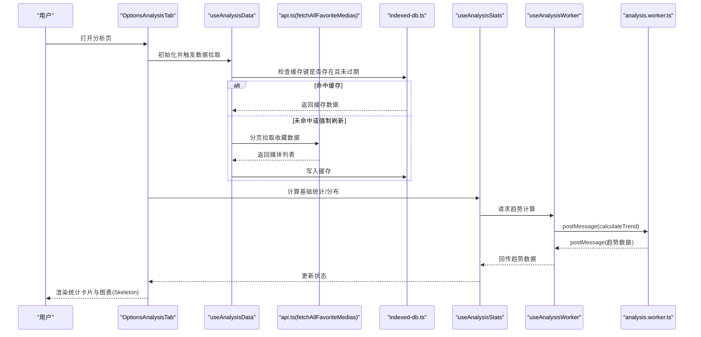
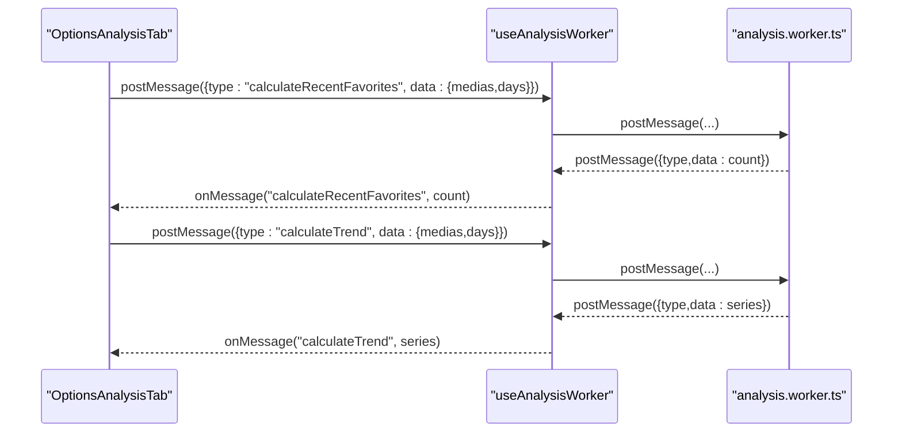
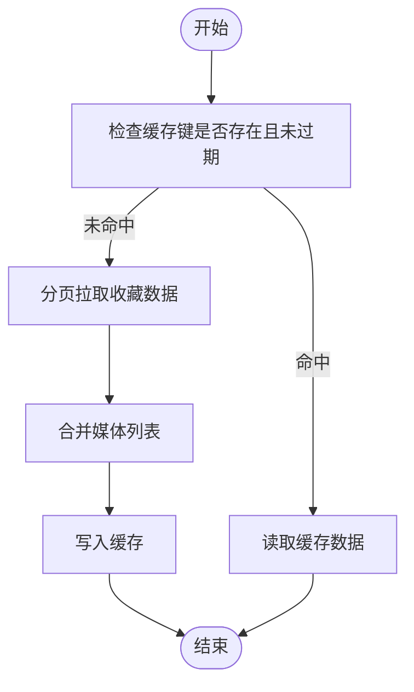
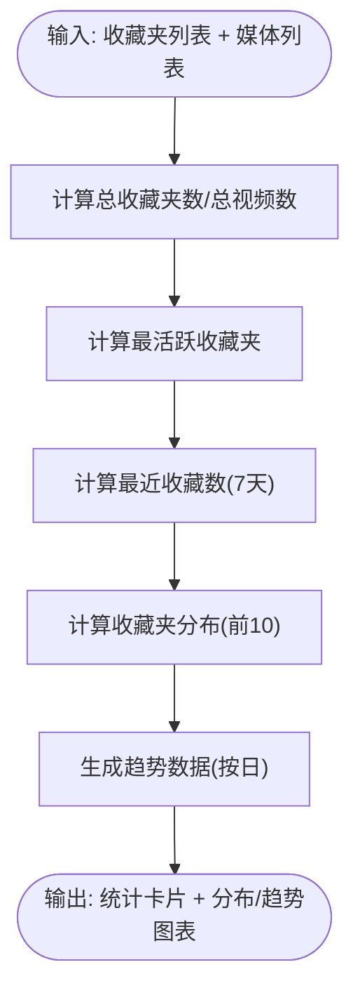
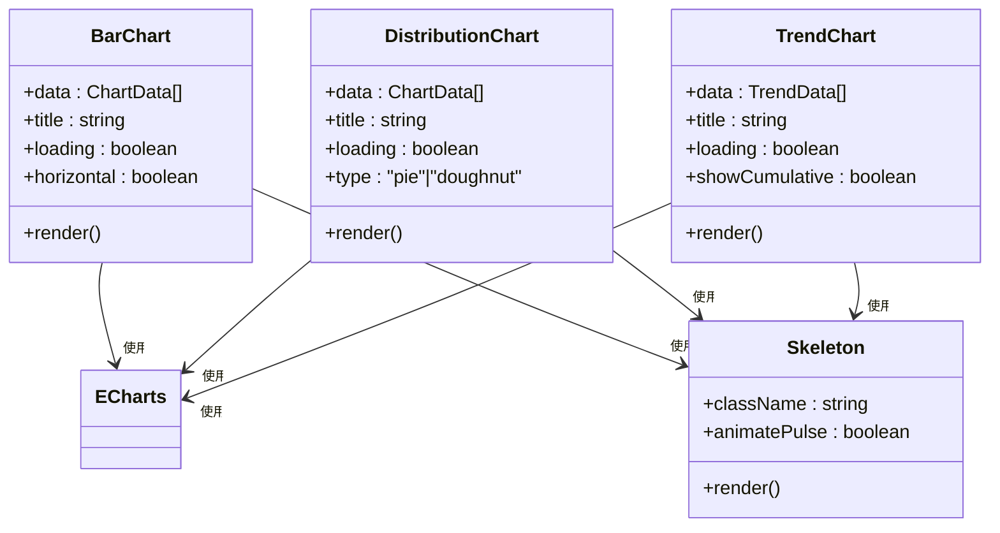
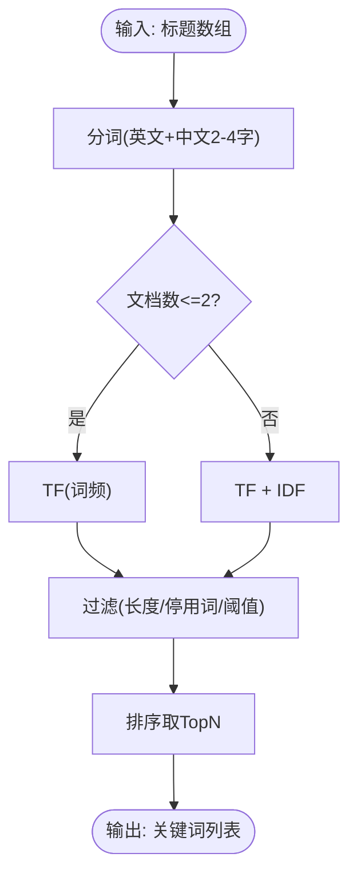
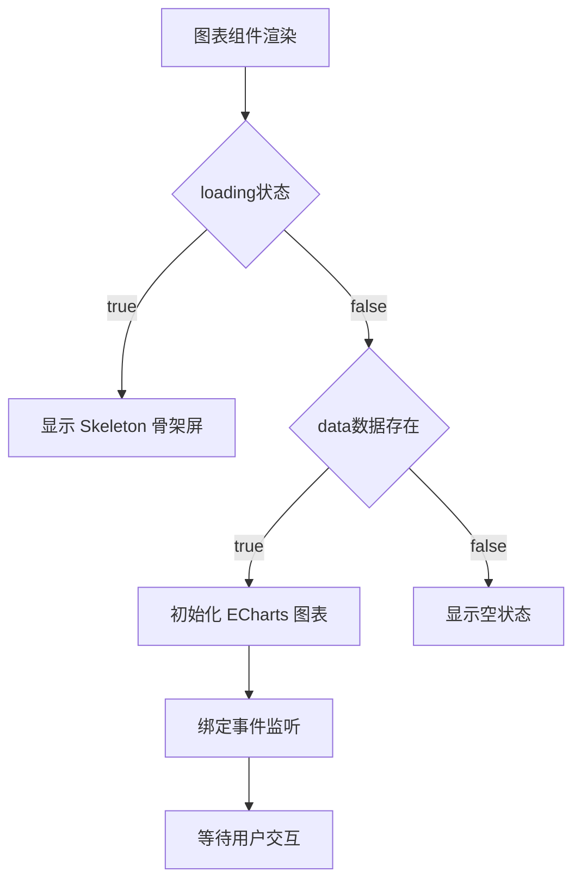
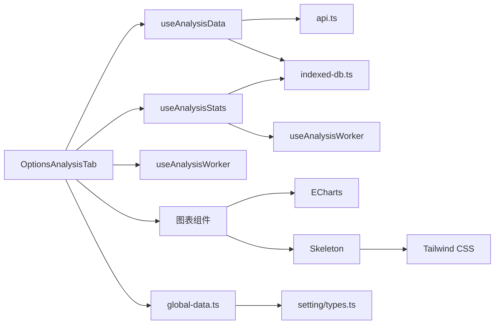

# 智能分析系统

<cite>
**本文引用的文件**
- [analysis.worker.ts](file://src/workers/analysis.worker.ts)
- [use-analysis-worker.ts](file://src/options/components/analysis/use-analysis-worker.ts)
- [index.tsx](file://src/options/components/analysis/index.tsx)
- [use-analysis-data.ts](file://src/options/components/analysis/use-analysis-data.ts)
- [use-analysis-stats.ts](file://src/options/components/analysis/use-analysis-stats.ts)
- [bar-chart.tsx](file://src/options/components/analysis/chart/bar-chart.tsx)
- [distribution-chart.tsx](file://src/options/components/analysis/chart/distribution-chart.tsx)
- [trend-chart.tsx](file://src/options/components/analysis/chart/trend-chart.tsx)
- [stats-cards.tsx](file://src/options/components/analysis/stats-cards.tsx)
- [skeleton.tsx](file://src/components/ui/skeleton.tsx)
- [keyword-extractor.ts](file://src/utils/keyword-extractor.ts)
- [api.ts](file://src/utils/api.ts)
- [indexed-db.ts](file://src/utils/indexed-db.ts)
- [global-data.ts](file://src/store/global-data.ts)
- [types.ts](file://src/options/components/setting/types.ts)
- [package.json](file://package.json)
- [README.md](file://README.md)
</cite>

## 更新摘要
**所做更改**
- 新增 Skeleton 骨架屏组件章节，详细说明加载状态处理机制
- 更新图表组件章节，增加 Skeleton 骨架屏集成和响应式设计改进
- 新增加载状态处理最佳实践章节
- 更新故障排查指南，增加骨架屏相关问题诊断

## 目录
1. [简介](#简介)
2. [项目结构](#项目结构)
3. [核心组件](#核心组件)
4. [架构总览](#架构总览)
5. [详细组件分析](#详细组件分析)
6. [加载状态处理与用户体验](#加载状态处理与用户体验)
7. [依赖关系分析](#依赖关系分析)
8. [性能考量](#性能考量)
9. [故障排查指南](#故障排查指南)
10. [结论](#结论)
11. [附录](#附录)

## 简介
本文件面向"智能分析系统"的使用者与开发者，系统性阐述收藏数据分析引擎的架构设计与实现要点，涵盖：
- Web Worker 的使用与消息通信机制
- 数据处理流程与缓存策略
- 图表组件（柱状图、分布图、趋势图）的技术细节
- 统计数据计算逻辑（关键词分布统计、时间趋势分析、内容类型识别）
- 分析数据的获取与处理机制（预处理、算法实现、结果展示）
- **新增**：Skeleton 骨架屏组件与加载状态处理机制
- 配置选项说明与使用示例

## 项目结构
该扩展以 React + TypeScript 构建，分析模块位于 options 页面的 analysis 子目录，核心由四部分组成：
- 数据层：负责从 B 站接口拉取收藏数据、分页聚合、IndexedDB 缓存
- 计算层：通过 Web Worker 执行耗时统计计算（最近收藏数、日度分布与趋势）
- 展示层：基于 ECharts 的可视化图表与统计卡片，集成 Skeleton 骨架屏
- UI 组件层：提供统一的 Skeleton 骨架屏组件，支持多种加载状态

```mermaid
graph TB
subgraph "选项页分析模块"
TAB["OptionsAnalysisTab<br/>分析页容器"]
DATA["useAnalysisData<br/>数据获取与缓存"]
STATS["useAnalysisStats<br/>统计计算与缓存"]
WORKER["useAnalysisWorker<br/>Worker 生命周期与通信"]
CHARTS["图表组件<br/>柱状/分布/趋势 + Skeleton"]
end
subgraph "数据与算法"
API["api.ts<br/>收藏数据拉取"]
IDX["indexed-db.ts<br/>缓存管理"]
KW["keyword-extractor.ts<br/>关键词提取(TF-IDF)"]
END
subgraph "UI 组件层"
SKEL["Skeleton<br/>骨架屏组件"]
END
TAB --> DATA
TAB --> STATS
TAB --> WORKER
TAB --> CHARTS
DATA --> API
DATA --> IDX
STATS --> WORKER
STATS --> IDX
CHARTS --> SKEL
KW -. 可选 .-> TAB
```

**图表来源**
- [index.tsx:27-260](file://src/options/components/analysis/index.tsx#L27-L260)
- [use-analysis-data.ts:39-121](file://src/options/components/analysis/use-analysis-data.ts#L39-L121)
- [use-analysis-stats.ts:53-166](file://src/options/components/analysis/use-analysis-stats.ts#L53-L166)
- [use-analysis-worker.ts:21-74](file://src/options/components/analysis/use-analysis-worker.ts#L21-L74)
- [bar-chart.tsx:19-118](file://src/options/components/analysis/chart/bar-chart.tsx#L19-L118)
- [distribution-chart.tsx:20-104](file://src/options/components/analysis/chart/distribution-chart.tsx#L20-L104)
- [trend-chart.tsx:20-130](file://src/options/components/analysis/chart/trend-chart.tsx#L20-L130)
- [skeleton.tsx:1-8](file://src/components/ui/skeleton.tsx#L1-L8)
- [api.ts:285-319](file://src/utils/api.ts#L285-L319)
- [indexed-db.ts:15-128](file://src/utils/indexed-db.ts#L15-L128)
- [keyword-extractor.ts:137-197](file://src/utils/keyword-extractor.ts#L137-L197)

**章节来源**
- [index.tsx:27-260](file://src/options/components/analysis/index.tsx#L27-L260)
- [use-analysis-data.ts:39-121](file://src/options/components/analysis/use-analysis-data.ts#L39-L121)
- [use-analysis-stats.ts:53-166](file://src/options/components/analysis/use-analysis-stats.ts#L53-L166)
- [use-analysis-worker.ts:21-74](file://src/options/components/analysis/use-analysis-worker.ts#L21-L74)
- [bar-chart.tsx:19-118](file://src/options/components/analysis/chart/bar-chart.tsx#L19-L118)
- [distribution-chart.tsx:20-104](file://src/options/components/analysis/chart/distribution-chart.tsx#L20-L104)
- [trend-chart.tsx:20-130](file://src/options/components/analysis/chart/trend-chart.tsx#L20-L130)
- [skeleton.tsx:1-8](file://src/components/ui/skeleton.tsx#L1-L8)
- [api.ts:285-319](file://src/utils/api.ts#L285-L319)
- [indexed-db.ts:15-128](file://src/utils/indexed-db.ts#L15-L128)
- [keyword-extractor.ts:137-197](file://src/utils/keyword-extractor.ts#L137-L197)

## 核心组件
- 分析页容器：负责组织数据获取、统计计算、Worker 通信与图表渲染
- 数据钩子：封装收藏数据拉取、缓存键生成、跨域/端口异常处理
- 统计钩子：封装基础统计、分布统计、趋势生成与缓存
- Worker 钩子：封装 Worker 生命周期、消息发送、错误处理
- 图表组件：基于 ECharts 的柱状图、饼图/圆环图、折线趋势图，集成 Skeleton 骨架屏
- 缓存管理：IndexedDB 封装，支持读写、过期检查、清理
- 关键词提取：本地 TF-IDF 算法，支持停用词过滤与最小长度控制
- **新增**：Skeleton 骨架屏组件：提供统一的加载状态视觉反馈，支持动画效果

**章节来源**
- [index.tsx:27-260](file://src/options/components/analysis/index.tsx#L27-L260)
- [use-analysis-data.ts:39-121](file://src/options/components/analysis/use-analysis-data.ts#L39-L121)
- [use-analysis-stats.ts:53-166](file://src/options/components/analysis/use-analysis-stats.ts#L53-L166)
- [use-analysis-worker.ts:21-74](file://src/options/components/analysis/use-analysis-worker.ts#L21-L74)
- [bar-chart.tsx:19-118](file://src/options/components/analysis/chart/bar-chart.tsx#L19-L118)
- [distribution-chart.tsx:20-104](file://src/options/components/analysis/chart/distribution-chart.tsx#L20-L104)
- [trend-chart.tsx:20-130](file://src/options/components/analysis/chart/trend-chart.tsx#L20-L130)
- [skeleton.tsx:1-8](file://src/components/ui/skeleton.tsx#L1-L8)
- [indexed-db.ts:15-128](file://src/utils/indexed-db.ts#L15-L128)
- [keyword-extractor.ts:137-197](file://src/utils/keyword-extractor.ts#L137-L197)

## 架构总览
下图展示了从用户交互到数据呈现的端到端流程，包括数据获取、缓存、Worker 计算、Skeleton 骨架屏加载状态和图表渲染。



**图表来源**
- [index.tsx:135-141](file://src/options/components/analysis/index.tsx#L135-L141)
- [use-analysis-data.ts:58-111](file://src/options/components/analysis/use-analysis-data.ts#L58-L111)
- [api.ts:285-319](file://src/utils/api.ts#L285-L319)
- [indexed-db.ts:45-81](file://src/utils/indexed-db.ts#L45-L81)
- [use-analysis-stats.ts:72-95](file://src/options/components/analysis/use-analysis-stats.ts#L72-L95)
- [use-analysis-worker.ts:27-67](file://src/options/components/analysis/use-analysis-worker.ts#L27-L67)
- [analysis.worker.ts:90-133](file://src/workers/analysis.worker.ts#L90-L133)

## 详细组件分析

### Web Worker 与消息通信
- Worker 负责两类计算：最近收藏数（N 日）、日度收藏分布与累计趋势
- 主线程通过 useAnalysisWorker 发送消息，监听 onmessage 并透传给分析页
- 错误通过 error 字段回传，避免主线程崩溃



**图表来源**
- [use-analysis-worker.ts:27-67](file://src/options/components/analysis/use-analysis-worker.ts#L27-L67)
- [analysis.worker.ts:90-133](file://src/workers/analysis.worker.ts#L90-L133)

**章节来源**
- [analysis.worker.ts:18-133](file://src/workers/analysis.worker.ts#L18-L133)
- [use-analysis-worker.ts:21-74](file://src/options/components/analysis/use-analysis-worker.ts#L21-L74)

### 数据获取与缓存策略
- 缓存键由收藏夹 ID 序列化并哈希生成，避免长键污染
- 默认缓存有效期 24 小时；强制刷新时绕过缓存
- 分页拉取收藏数据，聚合后写入 IndexedDB
- 对跨域/端口关闭等异常进行日志提示与降级处理



**图表来源**
- [use-analysis-data.ts:39-111](file://src/options/components/analysis/use-analysis-data.ts#L39-L111)
- [api.ts:285-319](file://src/utils/api.ts#L285-L319)
- [indexed-db.ts:45-81](file://src/utils/indexed-db.ts#L45-L81)

**章节来源**
- [use-analysis-data.ts:39-121](file://src/options/components/analysis/use-analysis-data.ts#L39-L121)
- [api.ts:285-319](file://src/utils/api.ts#L285-L319)
- [indexed-db.ts:15-128](file://src/utils/indexed-db.ts#L15-L128)

### 统计数据计算逻辑
- 基础统计：总收藏夹数、总视频数、最近收藏数（7 天）
- 分布统计：按收藏夹视频数量排序，取 TOP 10 的分布与百分比
- 趋势分析：按日统计收藏数与累计数，支持缓存复用



**图表来源**
- [use-analysis-stats.ts:98-142](file://src/options/components/analysis/use-analysis-stats.ts#L98-L142)
- [use-analysis-stats.ts:72-95](file://src/options/components/analysis/use-analysis-stats.ts#L72-L95)

**章节来源**
- [use-analysis-stats.ts:53-166](file://src/options/components/analysis/use-analysis-stats.ts#L53-L166)

### 图表组件技术细节
- 柱状图：支持横向/纵向，渐变色样式，自适应窗口大小，集成 Skeleton 骨架屏
- 分布图：支持饼图/圆环图，百分比标签与悬浮提示，集成 Skeleton 骨架屏
- 趋势图：双曲线（每日/累计），平滑曲线与面积填充，集成 Skeleton 骨架屏

**更新** 图表组件现已全面集成 Skeleton 骨架屏，提供更流畅的加载体验



**图表来源**
- [bar-chart.tsx:19-118](file://src/options/components/analysis/chart/bar-chart.tsx#L19-L118)
- [distribution-chart.tsx:20-104](file://src/options/components/analysis/chart/distribution-chart.tsx#L20-L104)
- [trend-chart.tsx:20-130](file://src/options/components/analysis/chart/trend-chart.tsx#L20-L130)
- [skeleton.tsx:1-8](file://src/components/ui/skeleton.tsx#L1-L8)

**章节来源**
- [bar-chart.tsx:19-118](file://src/options/components/analysis/chart/bar-chart.tsx#L19-L118)
- [distribution-chart.tsx:20-104](file://src/options/components/analysis/chart/distribution-chart.tsx#L20-L104)
- [trend-chart.tsx:20-130](file://src/options/components/analysis/chart/trend-chart.tsx#L20-L130)
- [skeleton.tsx:1-8](file://src/components/ui/skeleton.tsx#L1-L8)

### 关键词提取算法（TF-IDF）
- 支持停用词过滤、中文分词（2-4 字词组）、英文单词
- 文档数 ≤ 2 时回退为纯词频（TF），否则使用 TF-IDF
- 可配置最大关键词数、最小长度、最低分数



**图表来源**
- [keyword-extractor.ts:137-197](file://src/utils/keyword-extractor.ts#L137-L197)

**章节来源**
- [keyword-extractor.ts:137-197](file://src/utils/keyword-extractor.ts#L137-L197)

## 加载状态处理与用户体验

### Skeleton 骨架屏组件
系统新增统一的 Skeleton 骨架屏组件，提供优雅的加载状态视觉反馈：

- **动画效果**：使用 `animate-pulse` 实现呼吸式加载动画
- **样式设计**：基于 `bg-primary/10` 创建柔和的占位符背景
- **响应式布局**：完全覆盖图表容器，适配不同屏幕尺寸
- **性能优化**：轻量级 CSS 动画，不影响图表渲染性能

### 图表组件的 Skeleton 集成
所有图表组件均集成了 Skeleton 骨架屏处理机制：



**图表来源**
- [bar-chart.tsx:30-32](file://src/options/components/analysis/chart/bar-chart.tsx#L30-L32)
- [distribution-chart.tsx:32-34](file://src/options/components/analysis/chart/distribution-chart.tsx#L32-L34)
- [trend-chart.tsx:31-33](file://src/options/components/analysis/chart/trend-chart.tsx#L31-L33)

### 加载状态处理最佳实践
- **数据加载阶段**：显示 Skeleton 骨架屏，提供即时视觉反馈
- **图表渲染阶段**：在 ECharts 初始化完成后移除 Skeleton
- **错误处理**：骨架屏保持不变，配合错误提示组件
- **性能考虑**：Skeleton 渲染成本低，不影响主要业务逻辑

**章节来源**
- [skeleton.tsx:1-8](file://src/components/ui/skeleton.tsx#L1-L8)
- [bar-chart.tsx:111-116](file://src/options/components/analysis/chart/bar-chart.tsx#L111-L116)
- [distribution-chart.tsx:97-102](file://src/options/components/analysis/chart/distribution-chart.tsx#L97-L102)
- [trend-chart.tsx:123-128](file://src/options/components/analysis/chart/trend-chart.tsx#L123-L128)

## 依赖关系分析
- 选项页分析模块依赖数据钩子、统计钩子、Worker 钩子与图表组件
- 数据钩子依赖 API 工具与 IndexedDB 管理器
- 统计钩子依赖 Worker 钩子与 IndexedDB 管理器
- 图表组件依赖 ECharts 和 Skeleton 骨架屏组件
- Skeleton 组件依赖全局样式系统
- 全局配置通过 Zustand + Chrome Storage 管理



**图表来源**
- [index.tsx:27-260](file://src/options/components/analysis/index.tsx#L27-L260)
- [use-analysis-data.ts:39-121](file://src/options/components/analysis/use-analysis-data.ts#L39-L121)
- [use-analysis-stats.ts:53-166](file://src/options/components/analysis/use-analysis-stats.ts#L53-L166)
- [use-analysis-worker.ts:21-74](file://src/options/components/analysis/use-analysis-worker.ts#L21-L74)
- [bar-chart.tsx:3](file://src/options/components/analysis/chart/bar-chart.tsx#L3)
- [distribution-chart.tsx:3](file://src/options/components/analysis/chart/distribution-chart.tsx#L3)
- [trend-chart.tsx:3](file://src/options/components/analysis/chart/trend-chart.tsx#L3)
- [skeleton.tsx:1](file://src/components/ui/skeleton.tsx#L1)
- [api.ts:285-319](file://src/utils/api.ts#L285-L319)
- [indexed-db.ts:15-128](file://src/utils/indexed-db.ts#L15-L128)
- [global-data.ts:6-28](file://src/store/global-data.ts#L6-L28)
- [types.ts:30-99](file://src/options/components/setting/types.ts#L30-L99)

**章节来源**
- [package.json:29-58](file://package.json#L29-L58)
- [global-data.ts:6-28](file://src/store/global-data.ts#L6-L28)
- [types.ts:30-99](file://src/options/components/setting/types.ts#L30-L99)

## 性能考量
- 使用 Web Worker 执行耗时计算，避免阻塞主线程
- IndexedDB 缓存 24 小时，减少重复网络请求
- 图表组件在窗口 resize 时自动适配，避免内存泄漏
- 分页拉取与增量缓存，降低单次请求压力
- 统计计算与趋势生成支持缓存复用，减少重复计算
- **新增**：Skeleton 骨架屏使用 CSS 动画，性能开销极小
- **新增**：骨架屏与实际内容渲染的无缝过渡，提升用户体验

## 故障排查指南
- Worker 未就绪：检查 Worker 实例与 isReady 标志位
- 跨域/端口关闭：当出现"消息通道关闭"提示时，确保 B 站页面处于激活状态且内容脚本已加载
- 缓存异常：检查 IndexedDB 是否初始化成功、键值是否正确
- 图表渲染问题：确认容器尺寸与 ECharts 初始化时机
- **新增**：Skeleton 显示异常：检查 CSS 动画是否正常加载，确认 Tailwind CSS 配置正确
- **新增**：骨架屏不消失：确认图表组件的 loading 状态正确传递，检查数据加载完成后的状态更新

**章节来源**
- [use-analysis-worker.ts:27-67](file://src/options/components/analysis/use-analysis-worker.ts#L27-L67)
- [use-analysis-data.ts:78-88](file://src/options/components/analysis/use-analysis-data.ts#L78-L88)
- [indexed-db.ts:21-40](file://src/utils/indexed-db.ts#L21-L40)

## 结论
该智能分析系统通过清晰的分层设计与合理的性能策略，实现了从数据获取、缓存、计算到可视化的完整链路。Web Worker 与 IndexedDB 的结合有效提升了响应速度与用户体验；ECharts 图表提供了直观的数据洞察。**新增的 Skeleton 骨架屏组件进一步优化了加载体验，通过优雅的视觉反馈让用户感知到系统的响应性和稳定性。**同时，关键词提取算法为内容分类与归档提供了基础能力。

## 附录

### 配置选项说明
- 配置模式：支持"自定义"与"免费"两种模式，分别填写不同字段
- 自定义模式：需提供 API Key、模型名称与适配器
- 免费模式：需提供用户邮箱与 API Key ID、模型名称
- 表单校验：根据模式动态校验必填字段

**章节来源**
- [types.ts:30-99](file://src/options/components/setting/types.ts#L30-L99)

### 使用示例
- 打开分析页：在选项页中切换至"收藏夹分析"，选择时间范围并点击"刷新"
- 刷新数据：点击"刷新"按钮，强制清空缓存并重新拉取
- 查看统计：顶部卡片显示总收藏夹数、总视频数、最近收藏与最活跃收藏夹
- 查看图表：收藏分布与收藏趋势两个标签页分别展示饼图/柱状图与趋势折线图
- **新增**：观察加载状态：首次打开或刷新时，图表区域将显示 Skeleton 骨架屏，随后自动替换为实际内容

**章节来源**
- [README.md:108-132](file://README.md#L108-L132)
- [index.tsx:144-164](file://src/options/components/analysis/index.tsx#L144-L164)
- [stats-cards.tsx:53-85](file://src/options/components/analysis/stats-cards.tsx#L53-L85)