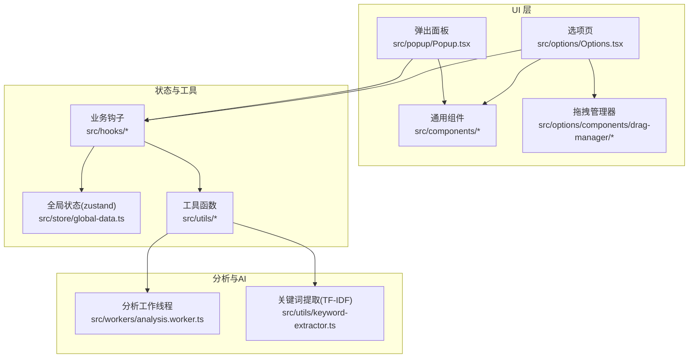
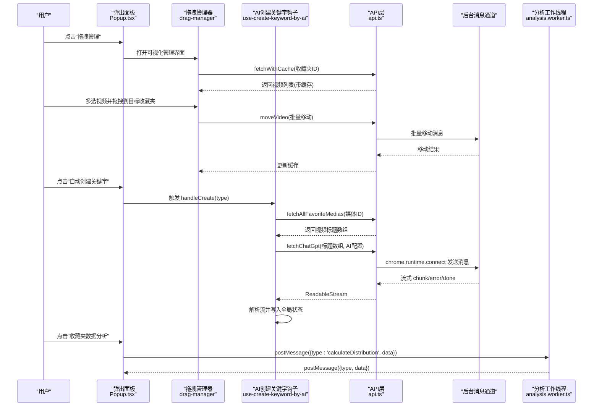
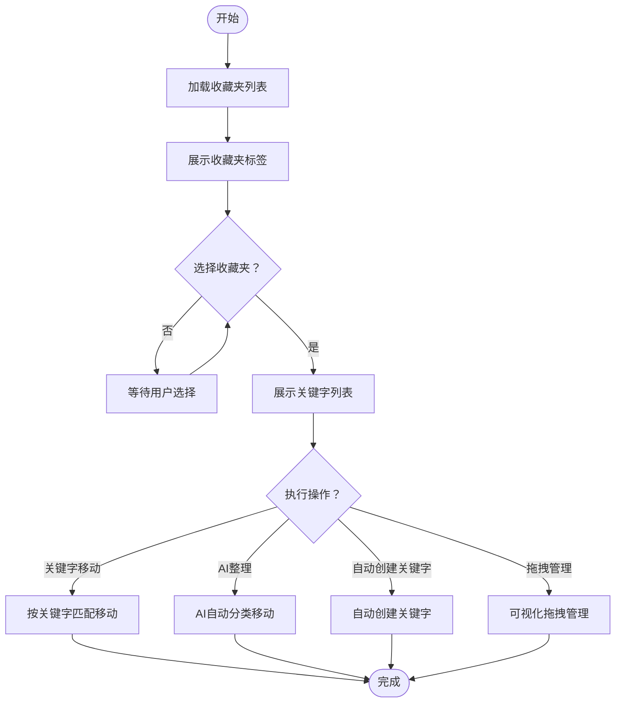
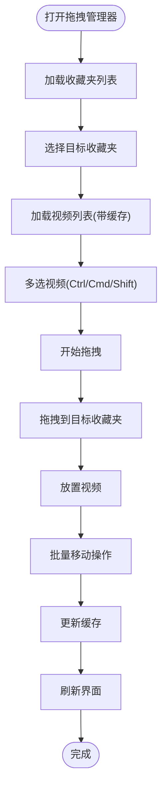
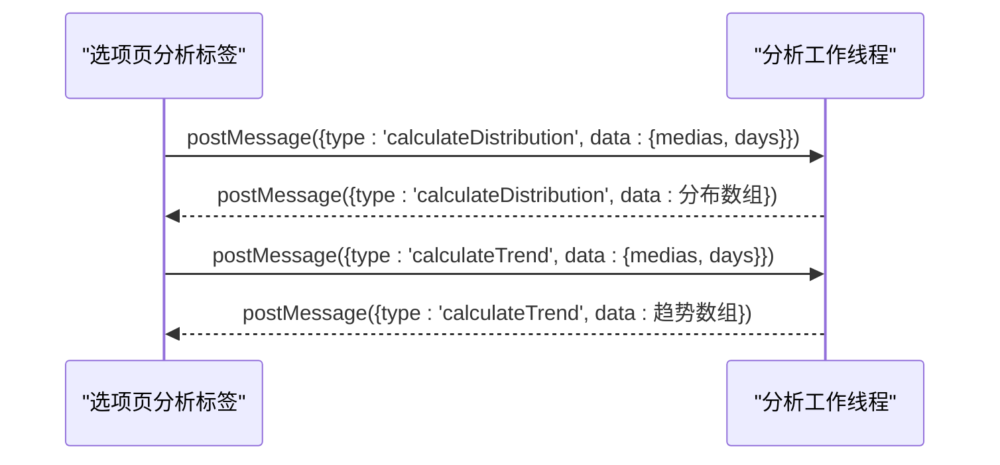
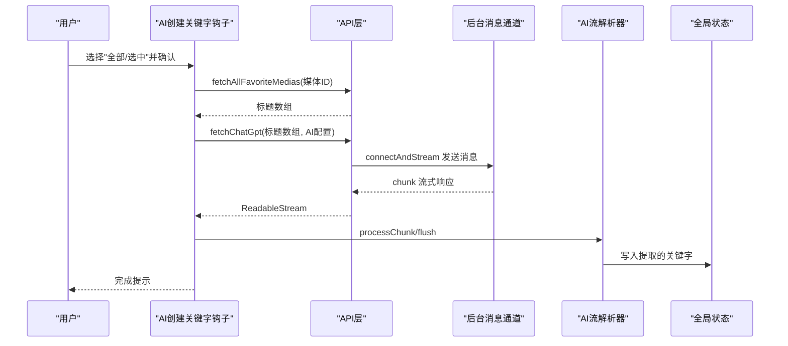
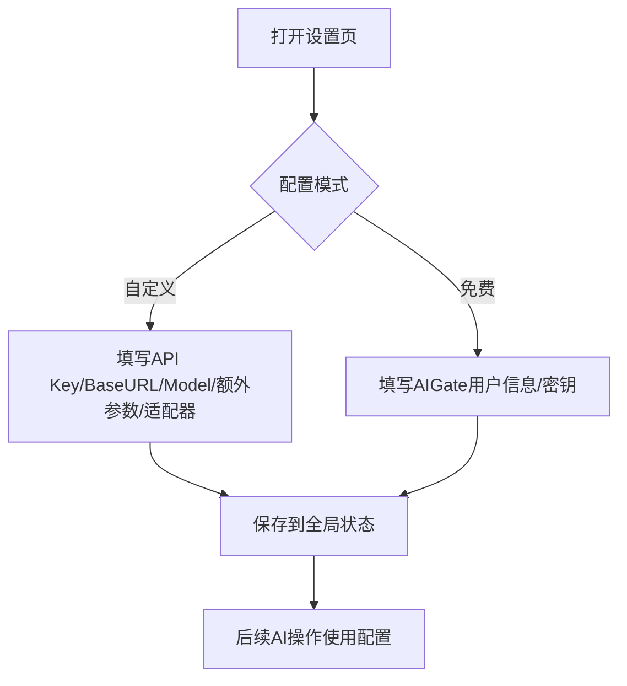
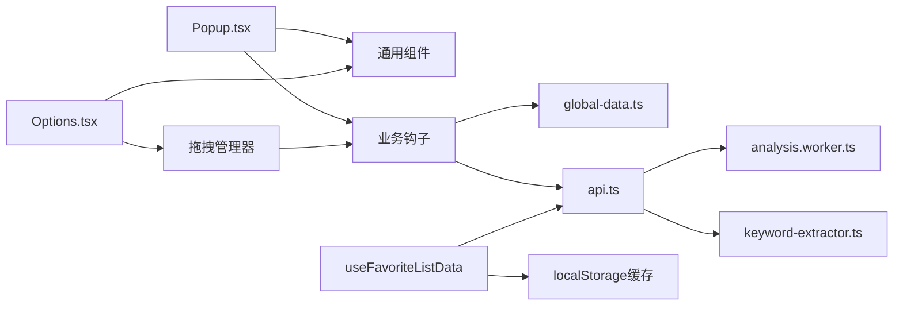

# 核心功能模块

<cite>
**本文引用的文件**
- [src/options/Options.tsx](file://src/options/Options.tsx)
- [src/popup/Popup.tsx](file://src/popup/Popup.tsx)
- [src/store/global-data.ts](file://src/store/global-data.ts)
- [src/utils/api.ts](file://src/utils/api.ts)
- [src/hooks/use-favorite-data/index.ts](file://src/hooks/use-favorite-data/index.ts)
- [src/hooks/use-favorite-list-data/index.ts](file://src/hooks/use-favorite-list-data/index.ts)
- [src/components/favorite-tag/index.tsx](file://src/components/favorite-tag/index.tsx)
- [src/components/keyword/index.tsx](file://src/components/keyword/index.tsx)
- [src/popup/components/move/index.tsx](file://src/popup/components/move/index.tsx)
- [src/popup/components/auto-create-keyword/index.tsx](file://src/popup/components/auto-create-keyword/index.tsx)
- [src/popup/components/ai-move/index.tsx](file://src/popup/components/ai-move/index.tsx)
- [src/popup/components/drag-manager-button/index.tsx](file://src/popup/components/drag-manager-button/index.tsx)
- [src/options/components/drag-manager/index.tsx](file://src/options/components/drag-manager/index.tsx)
- [src/options/components/drag-manager/folder-list.tsx](file://src/options/components/drag-manager/folder-list.tsx)
- [src/options/components/drag-manager/video-list.tsx](file://src/options/components/drag-manager/video-list.tsx)
- [src/options/components/drag-manager/video-card.tsx](file://src/options/components/drag-manager/video-card.tsx)
- [src/hooks/use-create-keyword-by-ai/index.tsx](file://src/hooks/use-create-keyword-by-ai/index.tsx)
- [src/options/components/setting/index.tsx](file://src/options/components/setting/index.tsx)
- [src/utils/keyword-extractor.ts](file://src/utils/keyword-extractor.ts)
- [src/workers/analysis.worker.ts](file://src/workers/analysis.worker.ts)
</cite>

## 更新摘要
**所做更改**
- 新增拖拽管理器模块的完整文档，包括模块化重构后的组件结构
- 新增useFavoriteListData hook的详细说明，包括缓存机制和请求去重
- 更新收藏夹管理系统章节，反映拖拽功能的增强实现
- 新增拖拽操作的使用示例和最佳实践

## 目录
1. [简介](#简介)
2. [项目结构](#项目结构)
3. [核心组件](#核心组件)
4. [架构总览](#架构总览)
5. [详细组件分析](#详细组件分析)
6. [依赖分析](#依赖分析)
7. [性能考虑](#性能考虑)
8. [故障排除指南](#故障排除指南)
9. [结论](#结论)
10. [附录](#附录)

## 简介
本文件面向B站收藏夹整理工具的核心功能模块，系统性梳理以下能力：
- 收藏夹管理系统：收藏夹列表获取、视频内容展示、批量操作（移动、AI整理、自动创建关键字、拖拽管理）。
- 智能分析系统：基于Web Worker的数据分析、统计卡片、趋势与分布可视化。
- AI整理引擎：通过AI流式通信抽取关键词、自动分类与移动、适配多模型/适配器。
- 配置管理系统：AI服务配置（自定义/免费额度）、用户偏好、权限与登录检查。

目标是帮助开发者与使用者快速理解模块职责、交互流程、配置项与常见问题处理方法。

## 项目结构
该扩展采用"弹出面板 + 选项页 + 工作线程"的前端架构，结合状态存储与消息通道实现跨页面通信与后台AI服务对接。

**图表来源**
- [src/popup/Popup.tsx:1-96](file://src/popup/Popup.tsx#L1-L96)
- [src/options/Options.tsx:1-92](file://src/options/Options.tsx#L1-L92)
- [src/store/global-data.ts:1-28](file://src/store/global-data.ts#L1-L28)
- [src/utils/api.ts:1-339](file://src/utils/api.ts#L1-L339)
- [src/workers/analysis.worker.ts:1-136](file://src/workers/analysis.worker.ts#L1-L136)
- [src/utils/keyword-extractor.ts:1-197](file://src/utils/keyword-extractor.ts#L1-L197)

**章节来源**
- [src/popup/Popup.tsx:1-96](file://src/popup/Popup.tsx#L1-L96)
- [src/options/Options.tsx:1-92](file://src/options/Options.tsx#L1-L92)
- [src/store/global-data.ts:1-28](file://src/store/global-data.ts#L1-L28)
- [src/utils/api.ts:1-339](file://src/utils/api.ts#L1-L339)

## 核心组件
- 弹出面板与选项页：提供收藏夹列表、关键字管理、可视化分析与配置入口。
- 拖拽管理器：全新的可视化收藏夹视频管理界面，支持多选拖拽批量移动。
- 全局状态：统一存放收藏夹数据、当前激活收藏夹、AI配置、默认收藏夹ID等。
- API层：封装B站收藏夹接口、AI流式通信、分页拉取、移动操作等。
- 关键词提取：本地TF-IDF算法，支持停用词过滤与最小长度控制。
- 分析工作线程：计算最近N日收藏数、每日分布与累计趋势。
- AI整理钩子：按选中或全部收藏夹调用AI抽取关键词，或进行AI自动分类移动。
- 数据缓存钩子：useFavoriteListData提供收藏夹视频列表的本地缓存与请求去重。

**章节来源**
- [src/popup/Popup.tsx:1-96](file://src/popup/Popup.tsx#L1-L96)
- [src/options/Options.tsx:1-92](file://src/options/Options.tsx#L1-L92)
- [src/store/global-data.ts:1-28](file://src/store/global-data.ts#L1-L28)
- [src/utils/api.ts:1-339](file://src/utils/api.ts#L1-L339)
- [src/utils/keyword-extractor.ts:1-197](file://src/utils/keyword-extractor.ts#L1-L197)
- [src/workers/analysis.worker.ts:1-136](file://src/workers/analysis.worker.ts#L1-L136)

## 架构总览
整体交互围绕"弹出面板/选项页 → 钩子/工具 → API层 → 后台消息通道/索引库 → UI渲染"展开；AI流程通过流式端口与后台通信，分析数据通过Web Worker异步计算。

**图表来源**
- [src/popup/Popup.tsx:1-96](file://src/popup/Popup.tsx#L1-L96)
- [src/options/components/drag-manager/index.tsx:1-200](file://src/options/components/drag-manager/index.tsx#L1-L200)
- [src/hooks/use-create-keyword-by-ai/index.tsx:1-170](file://src/hooks/use-create-keyword-by-ai/index.tsx#L1-L170)
- [src/utils/api.ts:1-339](file://src/utils/api.ts#L1-L339)
- [src/workers/analysis.worker.ts:1-136](file://src/workers/analysis.worker.ts#L1-L136)

## 详细组件分析

### 收藏夹管理系统
- 列表获取与缓存
  - 通过消息通道分页拉取收藏夹内容，支持缓存与过期策略，避免重复请求。
  - 代码路径参考：[src/utils/api.ts:285-319](file://src/utils/api.ts#L285-L319)
- 收藏夹标签展示
  - 使用滚动区域展示收藏夹标签，支持高亮当前激活收藏夹与默认收藏夹星标。
  - 代码路径参考：[src/components/favorite-tag/index.tsx:1-77](file://src/components/favorite-tag/index.tsx#L1-L77)
- 关键字展示与编辑
  - 关键字列表可编辑，支持键盘事件触发新增。
  - 代码路径参考：[src/components/keyword/index.tsx:1-32](file://src/components/keyword/index.tsx#L1-L32)
- 批量操作
  - 通过关键字匹配移动：[src/popup/components/move/index.tsx:1-42](file://src/popup/components/move/index.tsx#L1-L42)
  - 自动创建关键字入口：[src/popup/components/auto-create-keyword/index.tsx:1-23](file://src/popup/components/auto-create-keyword/index.tsx#L1-L23)
  - AI智能整理移动：[src/popup/components/ai-move/index.tsx:1-63](file://src/popup/components/ai-move/index.tsx#L1-L63)
  - **新增** 拖拽管理器：[src/popup/components/drag-manager-button/index.tsx:1-42](file://src/popup/components/drag-manager-button/index.tsx#L1-L42)

**图表来源**
- [src/popup/Popup.tsx:1-96](file://src/popup/Popup.tsx#L1-L96)
- [src/components/favorite-tag/index.tsx:1-77](file://src/components/favorite-tag/index.tsx#L1-L77)
- [src/components/keyword/index.tsx:1-32](file://src/components/keyword/index.tsx#L1-L32)
- [src/popup/components/move/index.tsx:1-42](file://src/popup/components/move/index.tsx#L1-L42)
- [src/popup/components/ai-move/index.tsx:1-63](file://src/popup/components/ai-move/index.tsx#L1-L63)
- [src/popup/components/auto-create-keyword/index.tsx:1-23](file://src/popup/components/auto-create-keyword/index.tsx#L1-L23)
- [src/popup/components/drag-manager-button/index.tsx:1-42](file://src/popup/components/drag-manager-button/index.tsx#L1-L42)

**章节来源**
- [src/utils/api.ts:285-319](file://src/utils/api.ts#L285-L319)
- [src/components/favorite-tag/index.tsx:1-77](file://src/components/favorite-tag/index.tsx#L1-L77)
- [src/components/keyword/index.tsx:1-32](file://src/components/keyword/index.tsx#L1-L32)
- [src/popup/components/move/index.tsx:1-42](file://src/popup/components/move/index.tsx#L1-L42)
- [src/popup/components/ai-move/index.tsx:1-63](file://src/popup/components/ai-move/index.tsx#L1-L63)
- [src/popup/components/auto-create-keyword/index.tsx:1-23](file://src/popup/components/auto-create-keyword/index.tsx#L1-L23)
- [src/popup/components/drag-manager-button/index.tsx:1-42](file://src/popup/components/drag-manager-button/index.tsx#L1-L42)

### 拖拽管理器系统
**新增** 全新的可视化收藏夹视频管理功能，提供直观的拖拽操作体验。

- 模块化组件结构
  - 主管理器组件：负责整体状态管理和拖拽逻辑协调
  - 文件夹列表组件：展示收藏夹列表和选择状态
  - 视频列表组件：显示视频内容和多选功能
  - 视频卡片组件：单个视频项的展示和交互
  - 代码路径参考：[src/options/components/drag-manager/index.tsx:1-200](file://src/options/components/drag-manager/index.tsx#L1-L200)

- 缓存数据钩子
  - useFavoriteListData提供收藏夹视频列表的本地缓存与请求去重
  - 支持20分钟缓存过期机制，提升加载性能
  - 实现请求去重，避免同一收藏夹的并发请求重复发起
  - 代码路径参考：[src/hooks/use-favorite-list-data/index.ts:1-133](file://src/hooks/use-favorite-list-data/index.tsx#L1-L133)

- 拖拽操作实现
  - 支持Ctrl/Cmd+点击多选和Shift连续选择
  - 实时拖拽预览和视觉反馈
  - 批量移动操作，支持错误处理和进度提示
  - 代码路径参考：[src/options/components/drag-manager/index.tsx:97-164](file://src/options/components/drag-manager/index.tsx#L97-L164)

- 用户界面设计
  - 采用渐变色彩主题和现代化UI设计
  - 支持响应式布局，适应不同屏幕尺寸
  - 提供空状态和加载状态的友好提示
  - 代码路径参考：[src/options/components/drag-manager/video-list.tsx:105-147](file://src/options/components/drag-manager/video-list.tsx#L105-L147)

**图表来源**
- [src/options/components/drag-manager/index.tsx:1-200](file://src/options/components/drag-manager/index.tsx#L1-L200)
- [src/hooks/use-favorite-list-data/index.ts:44-133](file://src/hooks/use-favorite-list-data/index.ts#L44-L133)

**章节来源**
- [src/options/components/drag-manager/index.tsx:1-200](file://src/options/components/drag-manager/index.tsx#L1-L200)
- [src/options/components/drag-manager/folder-list.tsx:1-80](file://src/options/components/drag-manager/folder-list.tsx#L1-L80)
- [src/options/components/drag-manager/video-list.tsx:1-147](file://src/options/components/drag-manager/video-list.tsx#L1-L147)
- [src/options/components/drag-manager/video-card.tsx:1-86](file://src/options/components/drag-manager/video-card.tsx#L1-L86)
- [src/hooks/use-favorite-list-data/index.ts:1-133](file://src/hooks/use-favorite-list-data/index.ts#L1-L133)

### 智能分析系统
- 数据分析工作线程
  - 提供最近N日收藏数、每日收藏分布与累计趋势计算。
  - 代码路径参考：[src/workers/analysis.worker.ts:1-136](file://src/workers/analysis.worker.ts#L1-L136)
- 可视化与统计卡片
  - 选项页分析标签导出图表组件与统计卡片，配合工作线程数据驱动。
  - 代码路径参考：[src/options/Options.tsx:74-82](file://src/options/Options.tsx#L74-L82)

**图表来源**
- [src/options/Options.tsx:74-82](file://src/options/Options.tsx#L74-L82)
- [src/workers/analysis.worker.ts:1-136](file://src/workers/analysis.worker.ts#L1-L136)

**章节来源**
- [src/workers/analysis.worker.ts:1-136](file://src/workers/analysis.worker.ts#L1-L136)
- [src/options/Options.tsx:74-82](file://src/options/Options.tsx#L74-L82)

### AI整理引擎
- AI流式通信
  - 通过chrome.runtime.connect建立长连接，接收chunk/done/error/aborted事件，封装为ReadableStream。
  - 代码路径参考：[src/utils/api.ts:176-232](file://src/utils/api.ts#L176-L232)
- 关键词抽取与适配
  - 本地TF-IDF关键词抽取，支持停用词过滤与最小长度控制；AI侧流式解析后写入全局状态。
  - 代码路径参考：[src/utils/keyword-extractor.ts:1-197](file://src/utils/keyword-extractor.ts#L1-L197)
- 自动创建关键字
  - 支持"选中收藏夹"或"全部收藏夹"两种模式，逐个拉取视频标题并调用AI抽取，最终批量提示结果。
  - 代码路径参考：[src/hooks/use-create-keyword-by-ai/index.tsx:1-170](file://src/hooks/use-create-keyword-by-ai/index.tsx#L1-L170)
- AI自动分类移动
  - 将视频标题发送至AI，由AI判断应归类到哪个收藏夹，再执行移动操作。
  - 代码路径参考：[src/popup/components/ai-move/index.tsx:1-63](file://src/popup/components/ai-move/index.tsx#L1-L63)

**图表来源**
- [src/hooks/use-create-keyword-by-ai/index.tsx:1-170](file://src/hooks/use-create-keyword-by-ai/index.tsx#L1-L170)
- [src/utils/api.ts:176-232](file://src/utils/api.ts#L176-L232)
- [src/store/global-data.ts:1-28](file://src/store/global-data.ts#L1-L28)

**章节来源**
- [src/utils/api.ts:176-232](file://src/utils/api.ts#L176-L232)
- [src/utils/keyword-extractor.ts:1-197](file://src/utils/keyword-extractor.ts#L1-L197)
- [src/hooks/use-create-keyword-by-ai/index.tsx:1-170](file://src/hooks/use-create-keyword-by-ai/index.tsx#L1-L170)
- [src/popup/components/ai-move/index.tsx:1-63](file://src/popup/components/ai-move/index.tsx#L1-L63)

### 配置管理系统
- AI服务配置
  - 支持自定义模式（API Key、BaseURL、Model、额外参数、适配器）与免费额度模式（AIGate）。
  - 表单校验与默认参数注入，变更后写入全局状态。
  - 代码路径参考：[src/options/components/setting/index.tsx:1-98](file://src/options/components/setting/index.tsx#L1-L98)
- 用户偏好与权限
  - 登录状态检查组件贯穿弹出面板与选项页，确保操作前具备有效Cookie与CSRF。
  - 代码路径参考：[src/popup/Popup.tsx:72-74](file://src/popup/Popup.tsx#L72-L74)，[src/options/Options.tsx:85-86](file://src/options/Options.tsx#L85-L86)

**图表来源**
- [src/options/components/setting/index.tsx:1-98](file://src/options/components/setting/index.tsx#L1-L98)

**章节来源**
- [src/options/components/setting/index.tsx:1-98](file://src/options/components/setting/index.tsx#L1-L98)
- [src/popup/Popup.tsx:72-74](file://src/popup/Popup.tsx#L72-L74)
- [src/options/Options.tsx:85-86](file://src/options/Options.tsx#L85-L86)

## 依赖分析
- 组件耦合
  - 弹出面板与选项页均依赖通用组件与业务钩子；收藏夹标签与关键字组件复用UI基础组件。
  - **新增** 拖拽管理器作为独立模块，通过useFavoriteData和useFavoriteListData钩子与数据层交互。
- 状态与存储
  - 全局状态集中管理收藏夹数据、AI配置、默认收藏夹ID等，避免跨页面重复请求。
  - **新增** useFavoriteListData提供本地缓存层，减少API调用频率。
- 外部依赖
  - 通过chrome.runtime.connect与后台通信；使用IndexedDB缓存收藏夹全量数据；Web Worker处理重计算任务。

**图表来源**
- [src/popup/Popup.tsx:1-96](file://src/popup/Popup.tsx#L1-L96)
- [src/options/Options.tsx:1-92](file://src/options/Options.tsx#L1-L92)
- [src/store/global-data.ts:1-28](file://src/store/global-data.ts#L1-L28)
- [src/utils/api.ts:1-339](file://src/utils/api.ts#L1-L339)
- [src/workers/analysis.worker.ts:1-136](file://src/workers/analysis.worker.ts#L1-L136)
- [src/utils/keyword-extractor.ts:1-197](file://src/utils/keyword-extractor.ts#L1-L197)
- [src/hooks/use-favorite-list-data/index.ts:1-133](file://src/hooks/use-favorite-list-data/index.ts#L1-L133)

**章节来源**
- [src/popup/Popup.tsx:1-96](file://src/popup/Popup.tsx#L1-L96)
- [src/options/Options.tsx:1-92](file://src/options/Options.tsx#L1-L92)
- [src/store/global-data.ts:1-28](file://src/store/global-data.ts#L1-L28)
- [src/utils/api.ts:1-339](file://src/utils/api.ts#L1-L339)
- [src/workers/analysis.worker.ts:1-136](file://src/workers/analysis.worker.ts#L1-L136)
- [src/utils/keyword-extractor.ts:1-197](file://src/utils/keyword-extractor.ts#L1-L197)

## 性能考虑
- 分页与缓存
  - 收藏夹全量数据分页拉取并缓存，减少重复网络请求与后台压力。
  - **新增** useFavoriteListData提供20分钟本地缓存，显著提升重复访问性能。
  - 参考：[src/utils/api.ts:285-319](file://src/utils/api.ts#L285-L319)，[src/hooks/use-favorite-list-data/index.ts:16-38](file://src/hooks/use-favorite-list-data/index.ts#L16-L38)
- 异步与流式
  - AI响应采用ReadableStream流式处理，避免一次性内存峰值；分析计算放入Web Worker，避免阻塞UI。
  - 参考：[src/utils/api.ts:176-232](file://src/utils/api.ts#L176-L232)，[src/workers/analysis.worker.ts:1-136](file://src/workers/analysis.worker.ts#L1-L136)
- 关键词提取优化
  - TF-IDF在小样本时回退为纯词频，兼顾准确性与性能。
  - 参考：[src/utils/keyword-extractor.ts:137-187](file://src/utils/keyword-extractor.ts#L137-L187)
- **新增** 请求去重机制
  - useFavoriteListData通过pendingRequests避免同一收藏夹的并发请求重复发起。
  - 支持批量移动后的缓存同步更新，保持数据一致性。

**章节来源**
- [src/utils/api.ts:285-319](file://src/utils/api.ts#L285-L319)
- [src/hooks/use-favorite-list-data/index.ts:1-133](file://src/hooks/use-favorite-list-data/index.ts#L1-L133)
- [src/utils/api.ts:176-232](file://src/utils/api.ts#L176-L232)
- [src/workers/analysis.worker.ts:1-136](file://src/workers/analysis.worker.ts#L1-L136)
- [src/utils/keyword-extractor.ts:137-187](file://src/utils/keyword-extractor.ts#L137-L187)

## 故障排除指南
- AI配置缺失
  - 现象：自动创建关键字/AI整理时报错"缺少配置字段"。
  - 处理：前往设置页完善API Key、Model等必要字段。
  - 参考：[src/hooks/use-create-keyword-by-ai/index.tsx:76-88](file://src/hooks/use-create-keyword-by-ai/index.tsx#L76-L88)
- Token消耗提醒
  - 现象：AI整理按钮二次点击才真正执行，首次弹出确认提示。
  - 处理：确认操作后再执行，避免不必要的Token消耗。
  - 参考：[src/popup/components/ai-move/index.tsx:12-27](file://src/popup/components/ai-move/index.tsx#L12-L27)
- 登录状态异常
  - 现象：无法获取收藏夹列表或执行移动操作。
  - 处理：使用登录检查组件确认已登录且Cookie有效。
  - 参考：[src/popup/Popup.tsx:72-74](file://src/popup/Popup.tsx#L72-L74)，[src/options/Options.tsx:85-86](file://src/options/Options.tsx#L85-L86)
- 分析数据为空
  - 现象：分析图表无数据。
  - 处理：确认已拉取收藏夹全量数据并传入工作线程。
  - 参考：[src/workers/analysis.worker.ts:89-133](file://src/workers/analysis.worker.ts#L89-L133)
- **新增** 拖拽功能异常
  - 现象：拖拽操作无效或视频无法移动。
  - 处理：检查收藏夹权限、网络连接状态，清理浏览器缓存后重试。
  - 参考：[src/options/components/drag-manager/index.tsx:126-164](file://src/options/components/drag-manager/index.tsx#L126-L164)
- **新增** 缓存数据过期
  - 现象：显示的视频列表不是最新数据。
  - 处理：使用拖拽管理器的刷新功能或手动清除缓存。
  - 参考：[src/hooks/use-favorite-list-data/index.ts:114-127](file://src/hooks/use-favorite-list-data/index.ts#L114-L127)

**章节来源**
- [src/hooks/use-create-keyword-by-ai/index.tsx:76-88](file://src/hooks/use-create-keyword-by-ai/index.tsx#L76-L88)
- [src/popup/components/ai-move/index.tsx:12-27](file://src/popup/components/ai-move/index.tsx#L12-L27)
- [src/popup/Popup.tsx:72-74](file://src/popup/Popup.tsx#L72-L74)
- [src/options/Options.tsx:85-86](file://src/options/Options.tsx#L85-L86)
- [src/workers/analysis.worker.ts:89-133](file://src/workers/analysis.worker.ts#L89-L133)
- [src/options/components/drag-manager/index.tsx:126-164](file://src/options/components/drag-manager/index.tsx#L126-L164)
- [src/hooks/use-favorite-list-data/index.ts:114-127](file://src/hooks/use-favorite-list-data/index.ts#L114-L127)

## 结论
本工具以清晰的模块划分与稳定的跨页面通信为基础，实现了收藏夹管理、智能分析与AI整理的闭环。**新增的拖拽管理器模块提供了直观的可视化操作体验，通过模块化组件设计和useFavoriteListData缓存钩子显著提升了性能和用户体验。**通过本地关键词提取与Web Worker分析，兼顾性能与体验；通过灵活的AI配置与流式通信，满足不同用户场景需求。建议在生产环境中持续关注Token预算、缓存策略与错误恢复机制。

## 附录
- 使用示例（路径指引）
  - 打开设置页配置AI服务：[src/popup/Popup.tsx:18-20](file://src/popup/Popup.tsx#L18-L20)
  - 自动创建关键字（全部收藏夹）：[src/popup/components/auto-create-keyword/index.tsx:5-10](file://src/popup/components/auto-create-keyword/index.tsx#L5-L10)
  - AI智能整理移动：[src/popup/components/ai-move/index.tsx:12-27](file://src/popup/components/ai-move/index.tsx#L12-L27)
  - 关键字移动：[src/popup/components/move/index.tsx:6-36](file://src/popup/components/move/index.tsx#L6-L36)
  - **新增** 拖拽管理器入口：[src/popup/components/drag-manager-button/index.tsx:6-8](file://src/popup/components/drag-manager-button/index.tsx#L6-L8)
  - **新增** 可视化拖拽管理：[src/options/Options.tsx:69-73](file://src/options/Options.tsx#L69-L73)
  - 收藏夹列表获取与缓存：[src/utils/api.ts:285-319](file://src/utils/api.ts#L285-L319)
  - **新增** useFavoriteListData缓存机制：[src/hooks/use-favorite-list-data/index.ts:44-133](file://src/hooks/use-favorite-list-data/index.ts#L44-L133)
  - 关键词提取（TF-IDF）：[src/utils/keyword-extractor.ts:137-187](file://src/utils/keyword-extractor.ts#L137-L187)
  - 分析工作线程：[src/workers/analysis.worker.ts:89-133](file://src/workers/analysis.worker.ts#L89-L133)