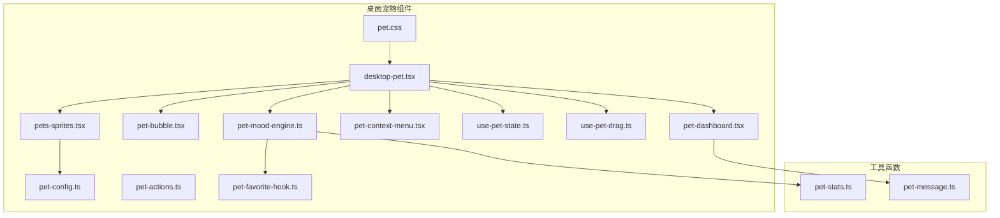
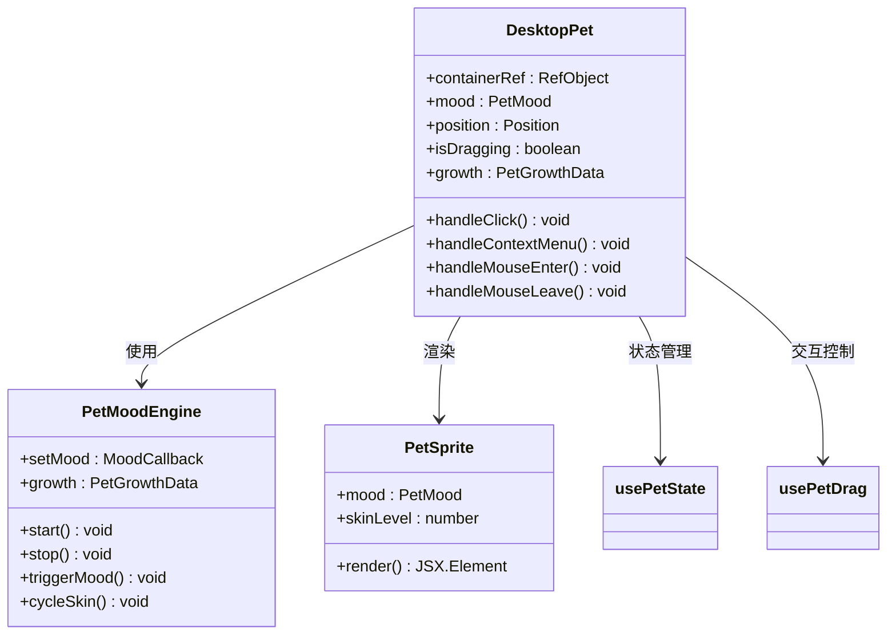
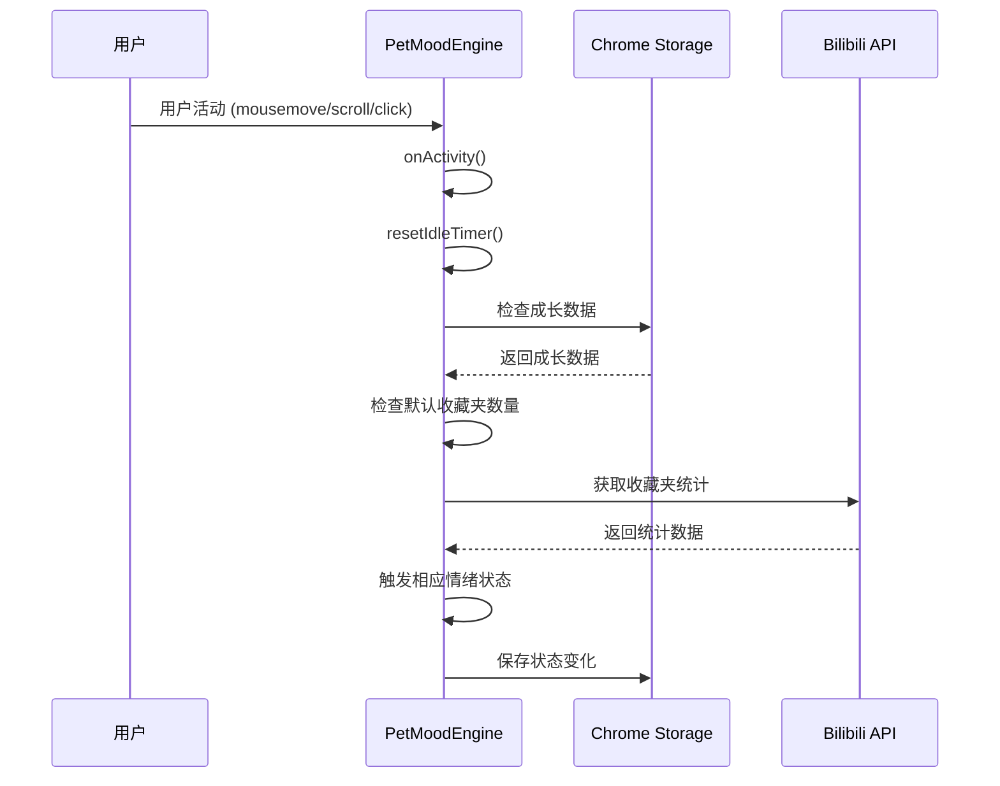
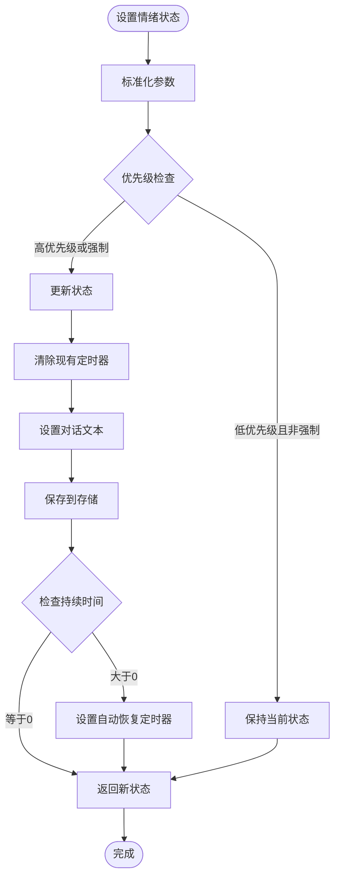
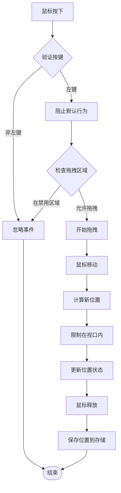
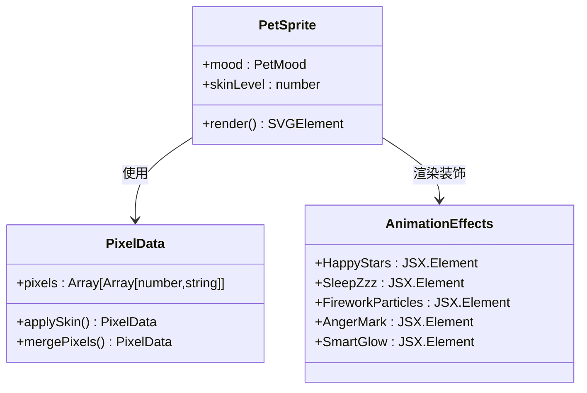
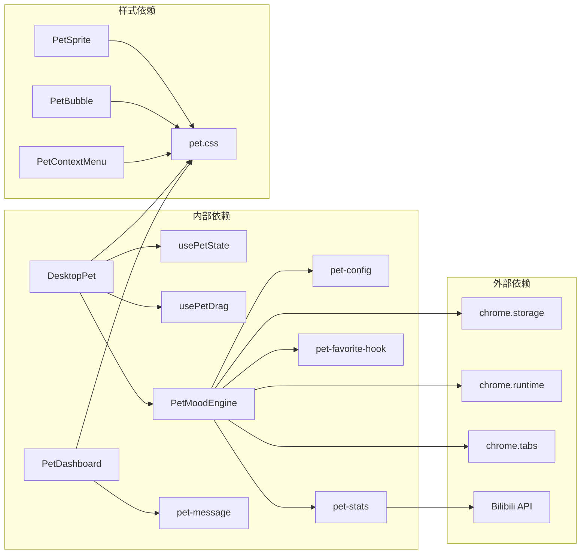

# 桌面宠物系统

<cite>
**本文档引用的文件**
- [desktop-pet.tsx](file://src/components/desktop-pet/desktop-pet.tsx)
- [index.ts](file://src/components/desktop-pet/index.ts)
- [pet-context-menu.tsx](file://src/components/desktop-pet/pet-context-menu.tsx)
- [use-pet-drag.ts](file://src/components/desktop-pet/use-pet-drag.ts)
- [use-pet-state.ts](file://src/components/desktop-pet/use-pet-state.ts)
- [pet-mood-engine.ts](file://src/components/desktop-pet/pet-mood-engine.ts)
- [pet-config.ts](file://src/components/desktop-pet/pet-config.ts)
- [pet-sprites.tsx](file://src/components/desktop-pet/pet-sprites.tsx)
- [pet-bubble.tsx](file://src/components/desktop-pet/pet-bubble.tsx)
- [pet-dashboard.tsx](file://src/components/desktop-pet/pet-dashboard.tsx)
- [pet-actions.ts](file://src/components/desktop-pet/pet-actions.ts)
- [pet.css](file://src/components/desktop-pet/pet.css)
- [pet-favorite-hook.ts](file://src/components/desktop-pet/pet-favorite-hook.ts)
- [pet-stats.ts](file://src/utils/pet-stats.ts)
- [pet-message.ts](file://src/utils/pet-message.ts)
</cite>

## 目录
1. [简介](#简介)
2. [项目结构](#项目结构)
3. [核心组件](#核心组件)
4. [架构概览](#架构概览)
5. [详细组件分析](#详细组件分析)
6. [依赖关系分析](#依赖关系分析)
7. [性能考虑](#性能考虑)
8. [故障排除指南](#故障排除指南)
9. [结论](#结论)

## 简介

桌面宠物系统是一个基于 Bilibili 扩展的交互式桌面宠物功能，为用户提供可爱的像素风格小电视角色作为浏览体验的陪伴者。该系统集成了智能情绪管理、拖拽交互、皮肤变换、数据分析等功能，通过 Chrome 扩展 API 实现与 Bilibili 网站的深度集成。

系统的核心特色包括：
- 智能情绪感知引擎，能够根据用户行为自动调整宠物状态
- 可拖拽的桌面宠物，支持位置持久化
- 多种皮肤颜色可选，支持连续整理收藏夹的奖励机制
- 丰富的动画效果和视觉反馈
- 与 Bilibili 收藏夹功能的无缝集成

## 项目结构

桌面宠物系统采用模块化的组件架构，主要文件组织如下：



**图表来源**
- [desktop-pet.tsx:1-167](file://src/components/desktop-pet/desktop-pet.tsx#L1-L167)
- [pet-mood-engine.ts:1-269](file://src/components/desktop-pet/pet-mood-engine.ts#L1-L269)

**章节来源**
- [desktop-pet.tsx:1-167](file://src/components/desktop-pet/desktop-pet.tsx#L1-L167)
- [index.ts:1-2](file://src/components/desktop-pet/index.ts#L1-L2)

## 核心组件

### 桌面宠物主组件

DesktopPet 是整个系统的核心组件，负责协调所有子组件的工作。它使用状态钩子管理宠物的情绪状态、位置信息，并处理用户交互事件。

### 情绪管理引擎

PetMoodEngine 是系统的大脑，负责：
- 监听用户活动（鼠标移动、键盘输入、滚动等）
- 分析用户行为并触发相应的情绪状态
- 管理宠物的成长数据和皮肤状态
- 处理来自扩展消息的外部事件

### 交互控制钩子

系统提供了两个核心钩子：
- usePetState：管理宠物的情绪状态和对话文本
- usePetDrag：处理宠物的拖拽交互和位置持久化

**章节来源**
- [desktop-pet.tsx:22-167](file://src/components/desktop-pet/desktop-pet.tsx#L22-L167)
- [pet-mood-engine.ts:48-269](file://src/components/desktop-pet/pet-mood-engine.ts#L48-L269)
- [use-pet-state.ts:34-108](file://src/components/desktop-pet/use-pet-state.ts#L34-L108)
- [use-pet-drag.ts:14-110](file://src/components/desktop-pet/use-pet-drag.ts#L14-L110)

## 架构概览

系统采用分层架构设计，各层职责明确：

```mermaid
graph TB
subgraph "表现层"
UI[桌面宠物界面]
Bubble[对话气泡]
Dashboard[状态面板]
Menu[右键菜单]
end
subgraph "控制层"
Engine[情绪管理引擎]
State[状态管理]
Drag[拖拽控制]
end
subgraph "数据层"
Storage[Chrome Storage]
Stats[收藏夹统计]
Growth[成长数据]
end
subgraph "外部集成"
Bilibili[Bilibili 网站]
Extension[Chrome 扩展]
API[Bilibili API]
end
UI --> Engine
Bubble --> Engine
Dashboard --> State
Menu --> Engine
Engine --> State
Engine --> Drag
Engine --> Storage
Engine --> Stats
Engine --> Growth
State --> Storage
Drag --> Storage
Bilibili <- --> Extension
Extension <- --> API
```

**图表来源**
- [pet-mood-engine.ts:48-98](file://src/components/desktop-pet/pet-mood-engine.ts#L48-L98)
- [use-pet-state.ts:34-55](file://src/components/desktop-pet/use-pet-state.ts#L34-L55)
- [use-pet-drag.ts:20-39](file://src/components/desktop-pet/use-pet-drag.ts#L20-L39)

## 详细组件分析

### 桌面宠物渲染组件

DesktopPet 组件是整个系统的外观层，负责：
- 管理宠物容器的位置和样式
- 协调各种装饰元素的显示
- 处理用户交互事件
- 管理上下文菜单的状态



**图表来源**
- [desktop-pet.tsx:22-167](file://src/components/desktop-pet/desktop-pet.tsx#L22-L167)
- [pet-mood-engine.ts:48-62](file://src/components/desktop-pet/pet-mood-engine.ts#L48-L62)
- [pet-sprites.tsx:173-228](file://src/components/desktop-pet/pet-sprites.tsx#L173-L228)

**章节来源**
- [desktop-pet.tsx:22-167](file://src/components/desktop-pet/desktop-pet.tsx#L22-L167)

### 情绪管理引擎

PetMoodEngine 是系统的核心逻辑组件，实现了复杂的行为模式：



**图表来源**
- [pet-mood-engine.ts:65-98](file://src/components/desktop-pet/pet-mood-engine.ts#L65-L98)
- [pet-mood-engine.ts:144-160](file://src/components/desktop-pet/pet-mood-engine.ts#L144-L160)

**章节来源**
- [pet-mood-engine.ts:48-269](file://src/components/desktop-pet/pet-mood-engine.ts#L48-L269)

### 状态管理系统

usePetState 提供了完整的状态管理功能：



**图表来源**
- [use-pet-state.ts:57-96](file://src/components/desktop-pet/use-pet-state.ts#L57-L96)

**章节来源**
- [use-pet-state.ts:34-108](file://src/components/desktop-pet/use-pet-state.ts#L34-L108)

### 拖拽交互系统

usePetDrag 实现了智能的拖拽功能：



**图表来源**
- [use-pet-drag.ts:53-95](file://src/components/desktop-pet/use-pet-drag.ts#L53-L95)

**章节来源**
- [use-pet-drag.ts:14-110](file://src/components/desktop-pet/use-pet-drag.ts#L14-L110)

### 像素精灵渲染系统

pet-sprites.tsx 实现了精美的像素艺术渲染：



**图表来源**
- [pet-sprites.tsx:173-228](file://src/components/desktop-pet/pet-sprites.tsx#L173-L228)
- [pet-sprites.tsx:231-334](file://src/components/desktop-pet/pet-sprites.tsx#L231-L334)

**章节来源**
- [pet-sprites.tsx:1-334](file://src/components/desktop-pet/pet-sprites.tsx#L1-L334)

## 依赖关系分析

系统采用松耦合的设计，主要依赖关系如下：



**图表来源**
- [pet-mood-engine.ts:12-14](file://src/components/desktop-pet/pet-mood-engine.ts#L12-L14)
- [pet-stats.ts:1-53](file://src/utils/pet-stats.ts#L1-L53)
- [pet-message.ts:1-43](file://src/utils/pet-message.ts#L1-L43)

**章节来源**
- [pet-config.ts:1-128](file://src/components/desktop-pet/pet-config.ts#L1-L128)
- [pet-css:1-365](file://src/components/desktop-pet/pet.css#L1-L365)

## 性能考虑

系统在设计时充分考虑了性能优化：

### 内存管理
- 使用 React.memo 和 useMemoizedFn 避免不必要的重渲染
- 及时清理定时器和事件监听器
- 合理使用 useRef 存储不需要触发重渲染的变量

### 事件处理优化
- 使用被动事件监听器减少主线程阻塞
- 防抖和节流机制防止高频事件影响性能
- 条件渲染避免不必要的 DOM 元素创建

### 存储优化
- Chrome Storage 异步操作避免阻塞 UI
- 成长数据和状态数据分离存储
- 合理的数据结构设计减少序列化开销

## 故障排除指南

### 常见问题及解决方案

**宠物无法拖拽**
- 检查容器元素是否存在
- 确认没有其他元素阻止拖拽事件
- 验证 Chrome Storage 权限

**情绪状态异常**
- 检查定时器是否正确清理
- 验证状态优先级配置
- 确认存储操作是否成功

**皮肤切换无效**
- 检查皮肤索引范围
- 验证存储权限
- 确认像素数据应用逻辑

**收藏夹统计不准确**
- 检查 Cookie 传递
- 验证 API 调用结果
- 确认默认收藏夹 ID 存储

**章节来源**
- [use-pet-drag.ts:20-39](file://src/components/desktop-pet/use-pet-drag.ts#L20-L39)
- [use-pet-state.ts:40-55](file://src/components/desktop-pet/use-pet-state.ts#L40-L55)
- [pet-stats.ts:16-30](file://src/utils/pet-stats.ts#L16-L30)

## 结论

桌面宠物系统展现了现代前端开发的最佳实践，通过精心设计的架构实现了功能丰富、性能优异的用户体验。系统的主要优势包括：

### 技术亮点
- **模块化设计**：清晰的组件边界和职责分离
- **智能交互**：基于用户行为的自适应情绪系统
- **性能优化**：合理的内存管理和事件处理策略
- **扩展性**：良好的架构支持未来功能扩展

### 用户价值
- 提供愉悦的浏览体验
- 增强用户粘性和使用频率
- 通过游戏化元素鼓励用户整理收藏夹
- 丰富的视觉反馈提升交互质量

该系统为浏览器扩展开发提供了优秀的参考案例，展示了如何在有限的 API 限制下实现复杂的用户交互功能。