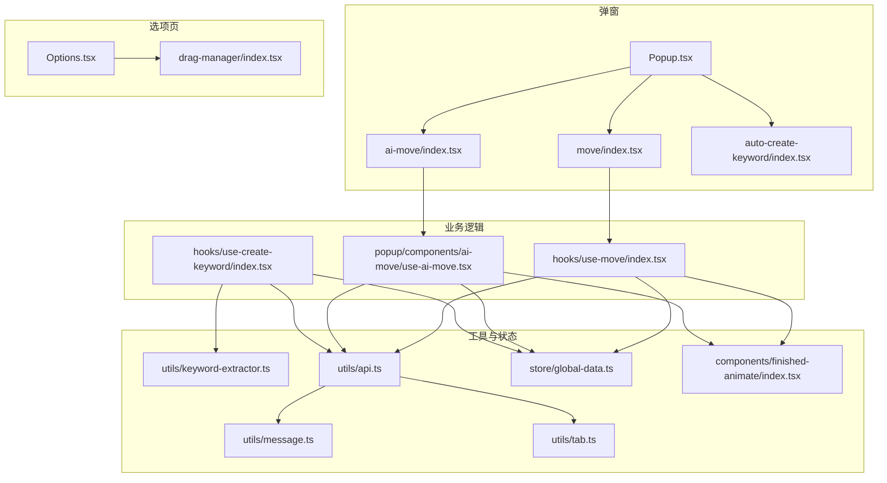
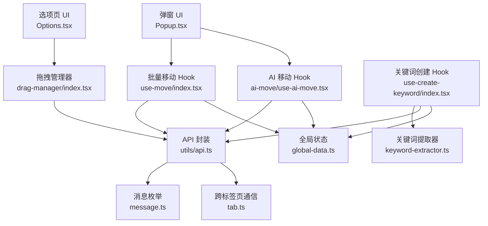
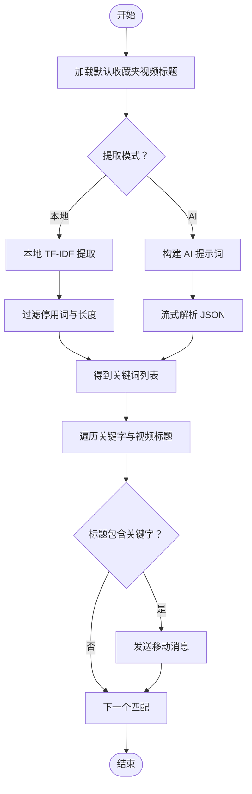
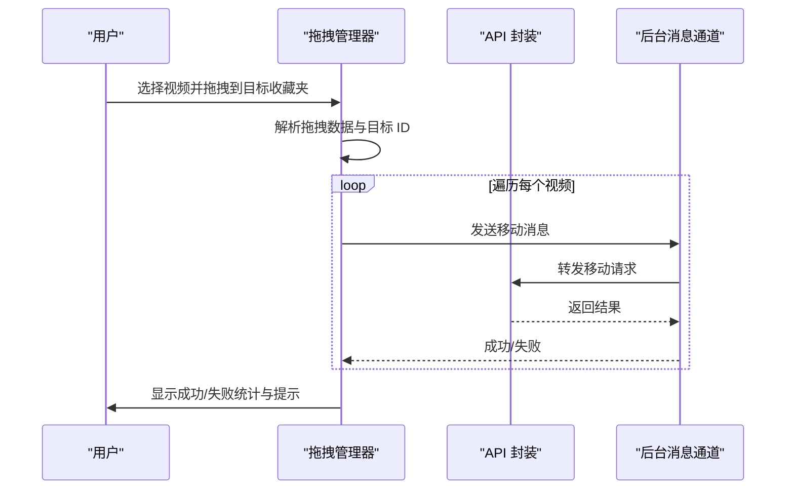
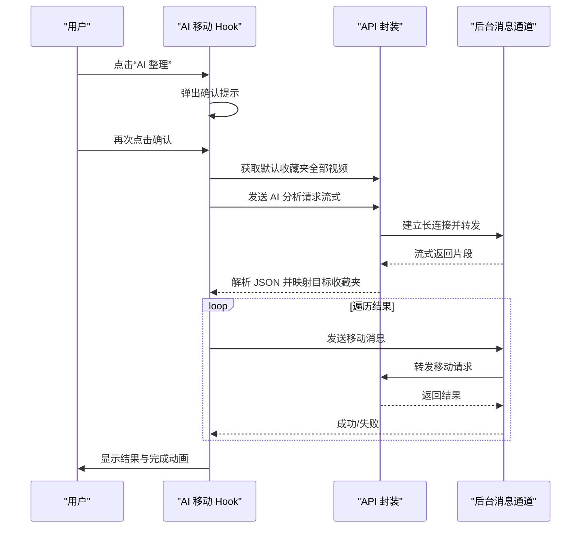
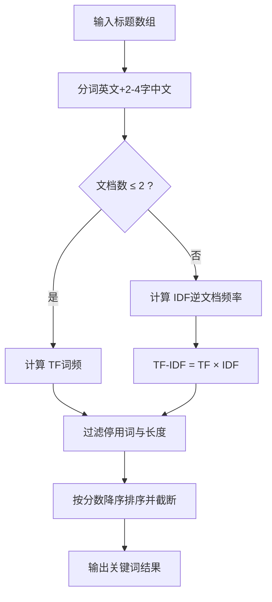
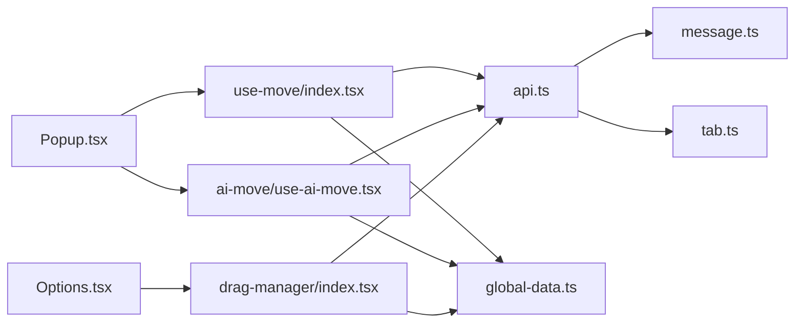

# 自动排序引擎

<cite>
**本文引用的文件**
- [src/popup/Popup.tsx](file://src/popup/Popup.tsx)
- [src/options/Options.tsx](file://src/options/Options.tsx)
- [src/options/components/drag-manager/index.tsx](file://src/options/components/drag-manager/index.tsx)
- [src/popup/components/move/index.tsx](file://src/popup/components/move/index.tsx)
- [src/hooks/use-move/index.tsx](file://src/hooks/use-move/index.tsx)
- [src/popup/components/ai-move/index.tsx](file://src/popup/components/ai-move/index.tsx)
- [src/popup/components/ai-move/use-ai-move.tsx](file://src/popup/components/ai-move/use-ai-move.tsx)
- [src/popup/components/auto-create-keyword/index.tsx](file://src/popup/components/auto-create-keyword/index.tsx)
- [src/hooks/use-create-keyword/index.tsx](file://src/hooks/use-create-keyword/index.tsx)
- [src/utils/keyword-extractor.ts](file://src/utils/keyword-extractor.ts)
- [src/utils/api.ts](file://src/utils/api.ts)
- [src/utils/message.ts](file://src/utils/message.ts)
- [src/utils/tab.ts](file://src/utils/tab.ts)
- [src/store/global-data.ts](file://src/store/global-data.ts)
- [src/components/finished-animate/index.tsx](file://src/components/finished-animate/index.tsx)
</cite>

## 目录
1. [简介](#简介)
2. [项目结构](#项目结构)
3. [核心组件](#核心组件)
4. [架构总览](#架构总览)
5. [详细组件分析](#详细组件分析)
6. [依赖关系分析](#依赖关系分析)
7. [性能考量](#性能考量)
8. [故障排查指南](#故障排查指南)
9. [结论](#结论)
10. [附录](#附录)

## 简介
本项目是一个浏览器扩展，旨在帮助用户对 Bilibili 收藏夹中的视频进行“自动分类与整理”。系统包含以下关键能力：
- 视频自动分类算法：基于关键词匹配与相似度计算，将默认收藏夹中的视频自动移动到对应收藏夹。
- 批量移动功能：支持拖拽操作、移动队列管理与进度跟踪。
- AI 辅助排序：通过大模型对视频标题进行智能分类，支持流式处理与用户确认流程。
- 关键词提取器：提供本地 TF-IDF 与 AI 两种关键词提取模式，支持快速提取与批量处理。
- 用户界面：提供弹窗面板、选项页与可视化拖拽管理器，配合拖拽反馈、操作提示与状态显示。

## 项目结构
项目采用模块化组织，主要目录与职责如下：
- src/popup：弹窗界面入口与常用组件集合，承载“自动分类”“AI 整理”“拖拽管理”等入口按钮与提示。
- src/options：选项页，包含“配置”“关键字管理”“可视化管理”“收藏夹数据分析”等标签页。
- src/hooks：业务逻辑钩子，如“批量移动”“AI 移动”“关键词创建”等。
- src/utils：通用工具与 API 封装，如关键词提取、消息通道、跨标签页通信、存储与缓存等。
- src/store：全局状态管理（Zustand + Immer + Chrome Storage Middleware）。
- src/components：UI 组件库与动画组件（如完成动画）。

图表来源
- [src/popup/Popup.tsx:1-80](file://src/popup/Popup.tsx#L1-L80)
- [src/options/Options.tsx:1-91](file://src/options/Options.tsx#L1-L91)
- [src/options/components/drag-manager/index.tsx:1-396](file://src/options/components/drag-manager/index.tsx#L1-L396)
- [src/popup/components/move/index.tsx:1-42](file://src/popup/components/move/index.tsx#L1-L42)
- [src/popup/components/ai-move/index.tsx:1-63](file://src/popup/components/ai-move/index.tsx#L1-L63)
- [src/popup/components/ai-move/use-ai-move.tsx:1-393](file://src/popup/components/ai-move/use-ai-move.tsx#L1-L393)
- [src/popup/components/auto-create-keyword/index.tsx:1-23](file://src/popup/components/auto-create-keyword/index.tsx#L1-L23)
- [src/hooks/use-move/index.tsx:1-161](file://src/hooks/use-move/index.tsx#L1-L161)
- [src/hooks/use-create-keyword/index.tsx:1-304](file://src/hooks/use-create-keyword/index.tsx#L1-L304)
- [src/utils/keyword-extractor.ts:1-197](file://src/utils/keyword-extractor.ts#L1-L197)
- [src/utils/api.ts:1-339](file://src/utils/api.ts#L1-L339)
- [src/utils/message.ts:1-20](file://src/utils/message.ts#L1-L20)
- [src/utils/tab.ts:1-93](file://src/utils/tab.ts#L1-L93)
- [src/store/global-data.ts:1-28](file://src/store/global-data.ts#L1-L28)
- [src/components/finished-animate/index.tsx:1-117](file://src/components/finished-animate/index.tsx#L1-L117)

章节来源
- [src/popup/Popup.tsx:1-80](file://src/popup/Popup.tsx#L1-L80)
- [src/options/Options.tsx:1-91](file://src/options/Options.tsx#L1-L91)

## 核心组件
- 弹窗入口与动作按钮
  - 弹窗主容器负责组织收藏夹展示、关键字展示与操作按钮区域。
  - 动作按钮包括“通过关键字整理”“自动创建关键字”“AI 整理”“拖拽管理”等。
- 批量移动（关键词驱动）
  - 通过遍历默认收藏夹视频标题与关键字进行包含匹配，触发移动消息。
  - 支持取消、进度提示与完成动画。
- 可视化拖拽管理
  - 在选项页中提供收藏夹与视频列表，支持多选、拖拽到目标收藏夹进行批量移动。
  - 提供拖拽反馈、加载骨架屏与移动遮罩层。
- AI 辅助排序
  - 将默认收藏夹视频标题发送至 AI，解析返回的分类结果并逐条移动。
  - 支持自定义模型与 AIGate 免费额度，具备确认提示与取消控制。
- 关键词提取器
  - 提供本地 TF-IDF 与 AI 两种提取模式；支持批量处理与流式解析。
- 全局状态与消息通道
  - Zustand 管理关键字、收藏夹、默认收藏夹、AI 配置等；通过消息枚举与跨标签页通信实现后台处理。

章节来源
- [src/popup/Popup.tsx:14-76](file://src/popup/Popup.tsx#L14-L76)
- [src/popup/components/move/index.tsx:6-38](file://src/popup/components/move/index.tsx#L6-L38)
- [src/popup/components/ai-move/index.tsx:8-59](file://src/popup/components/ai-move/index.tsx#L8-L59)
- [src/popup/components/auto-create-keyword/index.tsx:4-19](file://src/popup/components/auto-create-keyword/index.tsx#L4-L19)
- [src/options/components/drag-manager/index.tsx:33-392](file://src/options/components/drag-manager/index.tsx#L33-L392)
- [src/hooks/use-move/index.tsx:14-158](file://src/hooks/use-move/index.tsx#L14-L158)
- [src/popup/components/ai-move/use-ai-move.tsx:23-389](file://src/popup/components/ai-move/use-ai-move.tsx#L23-L389)
- [src/hooks/use-create-keyword/index.tsx:19-301](file://src/hooks/use-create-keyword/index.tsx#L19-L301)
- [src/utils/keyword-extractor.ts:137-187](file://src/utils/keyword-extractor.ts#L137-L187)
- [src/store/global-data.ts:6-25](file://src/store/global-data.ts#L6-L25)
- [src/utils/message.ts:1-20](file://src/utils/message.ts#L1-L20)
- [src/utils/tab.ts:65-82](file://src/utils/tab.ts#L65-L82)

## 架构总览
系统采用“UI 层 + 业务逻辑层 + 工具与状态层 + API/消息层”的分层架构：
- UI 层：弹窗与选项页组件，负责交互与状态展示。
- 业务逻辑层：移动、AI 移动、关键词创建等 Hook，封装复杂流程。
- 工具与状态层：关键词提取、消息枚举、跨标签页通信、全局状态存储。
- API/消息层：与 B 站接口交互、与后台建立长连接以支持流式 AI。

图表来源
- [src/popup/Popup.tsx:14-76](file://src/popup/Popup.tsx#L14-L76)
- [src/options/Options.tsx:12-87](file://src/options/Options.tsx#L12-L87)
- [src/options/components/drag-manager/index.tsx:33-392](file://src/options/components/drag-manager/index.tsx#L33-L392)
- [src/hooks/use-move/index.tsx:14-158](file://src/hooks/use-move/index.tsx#L14-L158)
- [src/popup/components/ai-move/use-ai-move.tsx:23-389](file://src/popup/components/ai-move/use-ai-move.tsx#L23-L389)
- [src/hooks/use-create-keyword/index.tsx:19-301](file://src/hooks/use-create-keyword/index.tsx#L19-L301)
- [src/utils/keyword-extractor.ts:137-187](file://src/utils/keyword-extractor.ts#L137-L187)
- [src/utils/api.ts:285-329](file://src/utils/api.ts#L285-L329)
- [src/utils/message.ts:1-20](file://src/utils/message.ts#L1-L20)
- [src/utils/tab.ts:65-82](file://src/utils/tab.ts#L65-L82)
- [src/store/global-data.ts:6-25](file://src/store/global-data.ts#L6-L25)

## 详细组件分析

### 视频自动分类算法（关键词匹配与相似度）
- 关键词提取
  - 本地模式：使用 TF-IDF（文档数 ≤2 时退化为 TF），结合停用词过滤与最小长度限制，输出关键词及其分数。
  - AI 模式：构建系统提示词，调用自定义模型或 AIGate 免费额度，流式解析返回的 JSON 片段。
- 匹配与分类
  - 将默认收藏夹视频标题与关键字进行小写包含匹配，命中即移动。
  - 分类决策逻辑简洁明确：标题包含关键字即归类到对应收藏夹。
- 性能与健壮性
  - 对空数据与异常进行保护；本地 TF-IDF 在小样本下仍可工作，避免过度复杂化。

图表来源
- [src/hooks/use-create-keyword/index.tsx:37-74](file://src/hooks/use-create-keyword/index.tsx#L37-L74)
- [src/hooks/use-create-keyword/index.tsx:107-169](file://src/hooks/use-create-keyword/index.tsx#L107-L169)
- [src/utils/keyword-extractor.ts:137-187](file://src/utils/keyword-extractor.ts#L137-L187)
- [src/hooks/use-move/index.tsx:71-96](file://src/hooks/use-move/index.tsx#L71-L96)

章节来源
- [src/utils/keyword-extractor.ts:137-187](file://src/utils/keyword-extractor.ts#L137-L187)
- [src/hooks/use-create-keyword/index.tsx:37-74](file://src/hooks/use-create-keyword/index.tsx#L37-L74)
- [src/hooks/use-create-keyword/index.tsx:107-169](file://src/hooks/use-create-keyword/index.tsx#L107-L169)
- [src/hooks/use-move/index.tsx:71-96](file://src/hooks/use-move/index.tsx#L71-L96)

### 批量移动功能（拖拽、队列与进度）
- 拖拽操作实现
  - 支持 Ctrl/Cmd 多选与 Shift 范围选择；拖拽时动态生成拖拽图像提示。
  - 拖拽到目标收藏夹后，按顺序逐个发送移动消息，统计成功/失败并提示。
- 移动队列管理
  - 以 for 循环顺序执行，保证请求有序性；对异常进行捕获与累计。
- 进度跟踪机制
  - 显示“移动中”遮罩层与加载动画；完成后汇总结果并提供“已完成”动画。

图表来源
- [src/options/components/drag-manager/index.tsx:146-193](file://src/options/components/drag-manager/index.tsx#L146-L193)
- [src/utils/api.ts:155-174](file://src/utils/api.ts#L155-L174)
- [src/utils/tab.ts:65-82](file://src/utils/tab.ts#L65-L82)

章节来源
- [src/options/components/drag-manager/index.tsx:115-193](file://src/options/components/drag-manager/index.tsx#L115-L193)
- [src/utils/api.ts:155-174](file://src/utils/api.ts#L155-L174)
- [src/utils/tab.ts:65-82](file://src/utils/tab.ts#L65-L82)

### AI 辅助排序（智能推荐、批量处理与用户确认）
- 智能推荐
  - 构建系统提示词，将视频标题与收藏夹名称映射，要求返回 JSON 结构。
  - 支持自定义模型与 AIGate 免费额度；通过流式读取与适配器解析片段。
- 批量处理
  - 分页拉取默认收藏夹全部视频，逐条发送 AI 分析，再逐条执行移动。
- 用户确认流程
  - 首次点击弹出“Token 消耗提醒”，二次点击才真正执行。
  - 支持取消：中断流与移动队列，清理资源。

图表来源
- [src/popup/components/ai-move/index.tsx:12-27](file://src/popup/components/ai-move/index.tsx#L12-L27)
- [src/popup/components/ai-move/use-ai-move.tsx:214-307](file://src/popup/components/ai-move/use-ai-move.tsx#L214-L307)
- [src/popup/components/ai-move/use-ai-move.tsx:90-169](file://src/popup/components/ai-move/use-ai-move.tsx#L90-L169)
- [src/utils/api.ts:234-277](file://src/utils/api.ts#L234-L277)
- [src/utils/tab.ts:65-82](file://src/utils/tab.ts#L65-L82)

章节来源
- [src/popup/components/ai-move/index.tsx:8-59](file://src/popup/components/ai-move/index.tsx#L8-L59)
- [src/popup/components/ai-move/use-ai-move.tsx:23-389](file://src/popup/components/ai-move/use-ai-move.tsx#L23-L389)
- [src/utils/api.ts:234-277](file://src/utils/api.ts#L234-L277)

### 关键词提取器工作机制
- 文本预处理
  - 清洗标点与特殊字符，保留中文与英文字母数字；提取 2-4 字中文词组。
- 特征提取
  - TF-IDF：统计词频与逆文档频率，计算关键词分数。
  - TF：当文档数 ≤2 时退化为纯词频，避免 IDF 不稳定。
- 匹配算法
  - 过滤停用词与长度阈值；按分数降序截断，返回关键词列表或字符串数组。

图表来源
- [src/utils/keyword-extractor.ts:72-94](file://src/utils/keyword-extractor.ts#L72-L94)
- [src/utils/keyword-extractor.ts:112-131](file://src/utils/keyword-extractor.ts#L112-L131)
- [src/utils/keyword-extractor.ts:158-186](file://src/utils/keyword-extractor.ts#L158-L186)

章节来源
- [src/utils/keyword-extractor.ts:137-187](file://src/utils/keyword-extractor.ts#L137-L187)

### 用户界面设计（拖拽反馈、操作提示与状态显示）
- 拖拽反馈
  - 拖拽时动态生成“移动 N 个视频”的提示元素；悬停目标收藏夹高亮显示。
- 操作提示
  - 弹窗与选项页均提供气泡提示与底部提示，指导用户操作。
- 状态显示
  - 加载骨架屏、移动遮罩层、完成动画与 Toast 提示，清晰反馈当前状态。

章节来源
- [src/options/components/drag-manager/index.tsx:115-193](file://src/options/components/drag-manager/index.tsx#L115-L193)
- [src/components/finished-animate/index.tsx:19-106](file://src/components/finished-animate/index.tsx#L19-L106)

## 依赖关系分析
- 组件耦合
  - UI 组件仅依赖对应 Hook 与工具函数，低耦合高内聚。
  - Hook 之间共享全局状态 Store，避免重复请求与状态分散。
- 外部依赖
  - 通过消息枚举与跨标签页通信实现与后台的解耦。
  - API 封装统一处理 B 站接口与缓存策略。

图表来源
- [src/popup/Popup.tsx:14-76](file://src/popup/Popup.tsx#L14-L76)
- [src/options/Options.tsx:12-87](file://src/options/Options.tsx#L12-L87)
- [src/hooks/use-move/index.tsx:14-158](file://src/hooks/use-move/index.tsx#L14-L158)
- [src/popup/components/ai-move/use-ai-move.tsx:23-389](file://src/popup/components/ai-move/use-ai-move.tsx#L23-L389)
- [src/options/components/drag-manager/index.tsx:33-392](file://src/options/components/drag-manager/index.tsx#L33-L392)
- [src/utils/api.ts:285-329](file://src/utils/api.ts#L285-L329)
- [src/utils/message.ts:1-20](file://src/utils/message.ts#L1-L20)
- [src/utils/tab.ts:65-82](file://src/utils/tab.ts#L65-L82)
- [src/store/global-data.ts:6-25](file://src/store/global-data.ts#L6-L25)

章节来源
- [src/utils/api.ts:285-329](file://src/utils/api.ts#L285-L329)
- [src/utils/message.ts:1-20](file://src/utils/message.ts#L1-L20)
- [src/utils/tab.ts:65-82](file://src/utils/tab.ts#L65-L82)
- [src/store/global-data.ts:6-25](file://src/store/global-data.ts#L6-L25)

## 性能考量
- 数据分页与缓存
  - 默认收藏夹视频列表采用分页拉取并缓存，减少重复请求与网络开销。
- 请求节流
  - AI 移动过程中对每次移动间隔进行短暂休眠，避免请求过快导致限流或失败。
- UI 响应
  - 长耗时操作使用遮罩层与动画提示，提升用户体验；完成动画在结束后自动清理状态。

章节来源
- [src/utils/api.ts:285-319](file://src/utils/api.ts#L285-L319)
- [src/popup/components/ai-move/use-ai-move.tsx:196-208](file://src/popup/components/ai-move/use-ai-move.tsx#L196-L208)
- [src/components/finished-animate/index.tsx:19-106](file://src/components/finished-animate/index.tsx#L19-L106)

## 故障排查指南
- “未设置默认收藏夹”
  - 现象：AI 整理或关键词创建时提示未设置默认收藏夹。
  - 排查：前往设置页配置默认收藏夹后再试。
- “未配置 AI”
  - 现象：AI 整理按钮提示未配置 AI。
  - 排查：在设置页配置自定义模型或使用免费额度。
- “加载失败/获取视频列表失败”
  - 现象：拖拽管理器加载视频列表失败。
  - 排查：检查登录态与 Cookie，确保存在 B 站标签页。
- “操作失败/移动失败”
  - 现象：移动过程出现失败统计。
  - 排查：检查网络与 B 站接口状态，重试或降低批量速度。

章节来源
- [src/popup/components/ai-move/use-ai-move.tsx:219-239](file://src/popup/components/ai-move/use-ai-move.tsx#L219-L239)
- [src/options/components/drag-manager/index.tsx:65-71](file://src/options/components/drag-manager/index.tsx#L65-L71)
- [src/utils/api.ts:137-145](file://src/utils/api.ts#L137-L145)

## 结论
本自动排序引擎通过“关键词匹配 + AI 智能分类”的双轨方案，结合可视化拖拽与流式处理，实现了高效、易用且可扩展的视频自动整理能力。其模块化设计与完善的错误处理机制，使得在不同场景下都能稳定运行并提供良好的用户体验。

## 附录
- 使用指南（概述）
  - 设置默认收藏夹与收藏夹关键字。
  - 通过“通过关键字整理”一键移动，或使用“AI 整理”进行智能分类。
  - 在选项页“可视化管理”中使用拖拽批量移动。
  - 关键词提取支持本地与 AI 两种模式，可批量处理多个收藏夹。
- 最佳实践
  - 为每个重要分类建立清晰的关键字，提高匹配准确率。
  - 大规模整理建议使用 AI 模式并开启确认提示，合理安排 Token 消耗。
  - 拖拽移动适合小批量精细调整，结合 Ctrl/Cmd 多选与 Shift 范围选择。
- 常见问题
  - 登录态失效：确保 B 站标签页处于活动状态，或重新登录。
  - AI 返回格式错误：检查提示词构建与流式解析逻辑，必要时切换到自定义模型。
  - 移动过快被限流：适当增加间隔或减少并发。