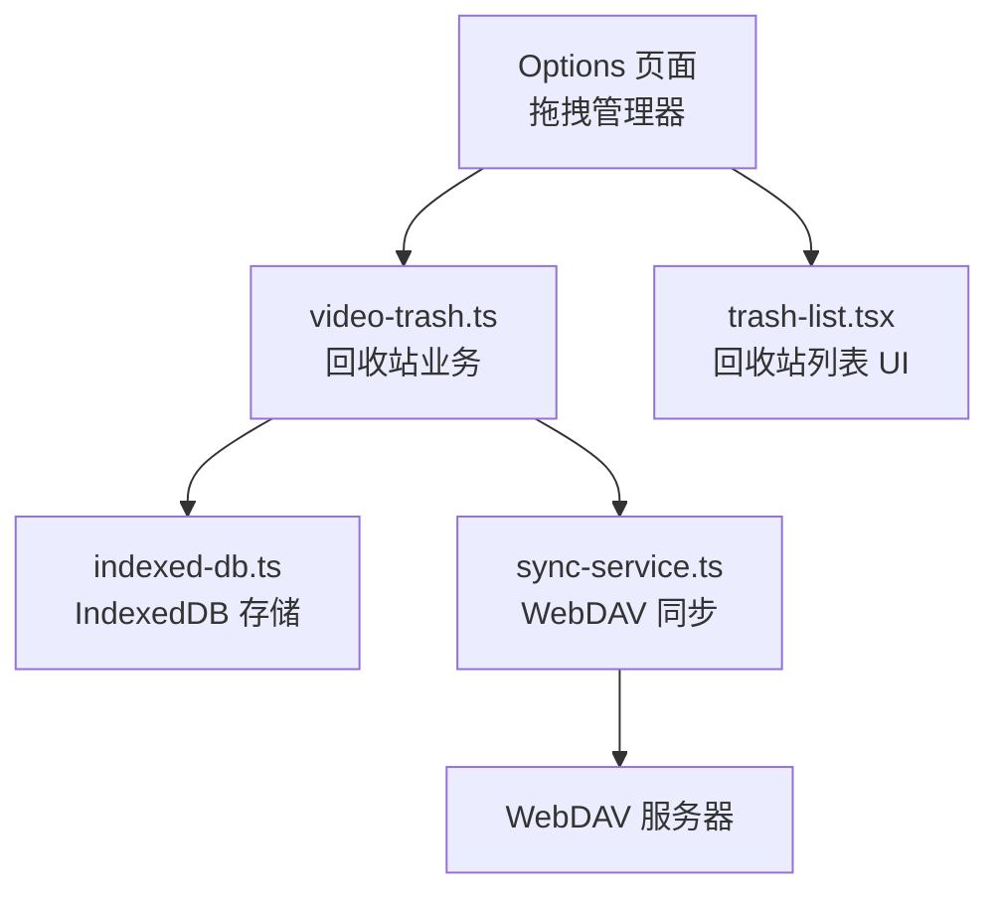
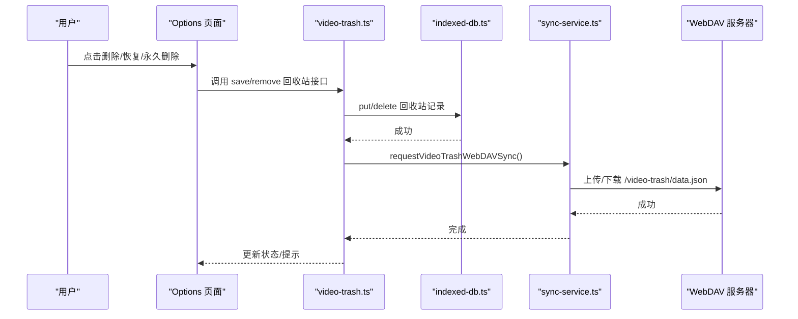
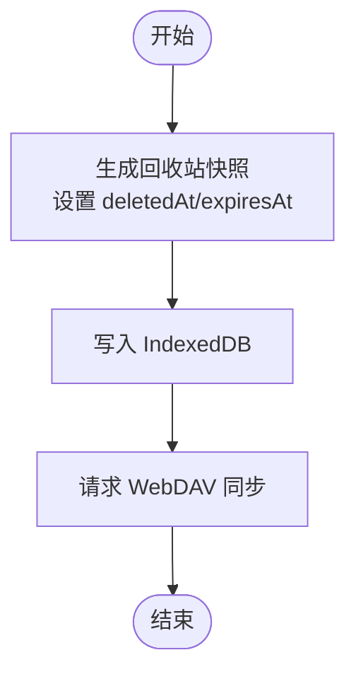
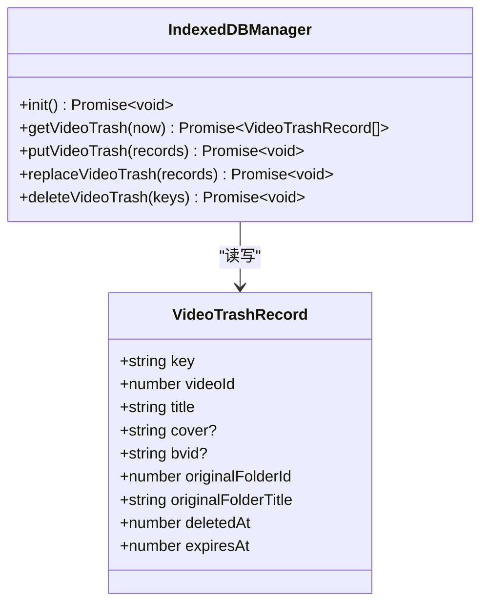
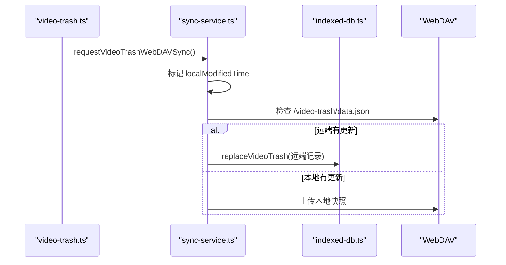
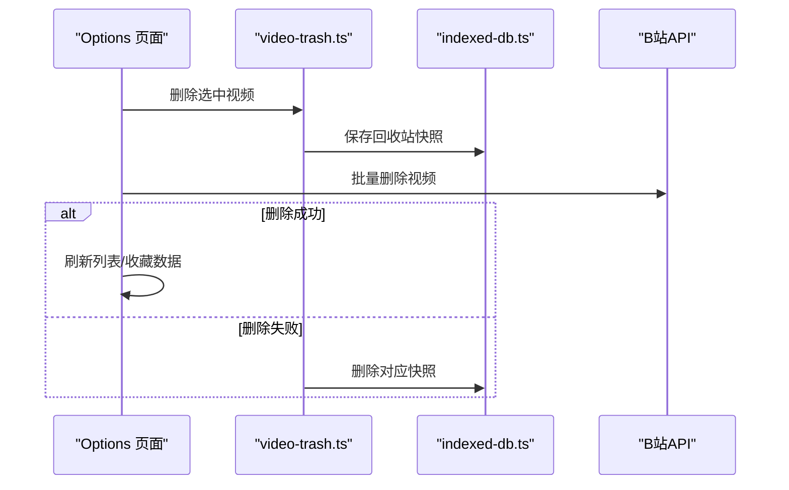
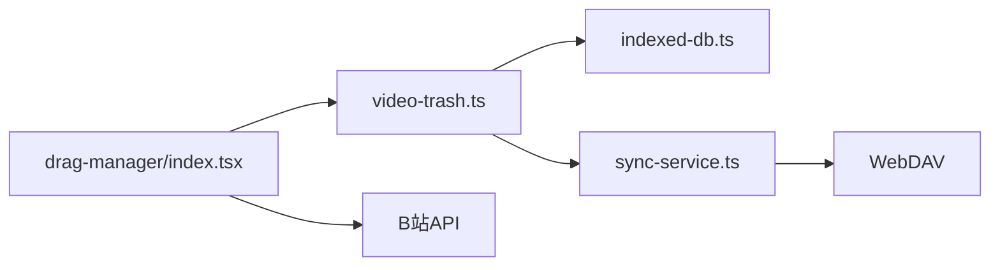

# 视频回收站系统

<cite>
**本文引用的文件**
- [src/utils/video-trash.ts](file://src/utils/video-trash.ts)
- [src/options/components/drag-manager/index.tsx](file://src/options/components/drag-manager/index.tsx)
- [src/options/components/drag-manager/trash-list.tsx](file://src/options/components/drag-manager/trash-list.tsx)
- [src/utils/indexed-db.ts](file://src/utils/indexed-db.ts)
- [src/utils/sync-service.ts](file://src/utils/sync-service.ts)
- [tests/video-trash.test.ts](file://tests/video-trash.test.ts)
- [tests/video-trash-webdav-sync.test.ts](file://tests/video-trash-webdav-sync.test.ts)
- [tests/video-trash-webdav-trigger.test.ts](file://tests/video-trash-webdav-trigger.test.ts)
- [README.md](file://README.md)
</cite>

## 目录
1. [简介](#简介)
2. [项目结构](#项目结构)
3. [核心组件](#核心组件)
4. [架构总览](#架构总览)
5. [详细组件分析](#详细组件分析)
6. [依赖关系分析](#依赖关系分析)
7. [性能与扩展性](#性能与扩展性)
8. [故障排查指南](#故障排查指南)
9. [结论](#结论)

## 简介
本仓库为 Bilibili 收藏夹整理工具，其中“视频回收站”是保障用户误删可恢复的关键能力。该功能将删除的视频以快照形式保存在本地 IndexedDB，保留 7 天；支持在 Options 页面中批量恢复或永久删除；同时通过 WebDAV 实现多设备间的回收站数据同步，确保跨设备一致性。

## 项目结构
围绕视频回收站的核心代码主要分布在以下位置：
- 业务逻辑层：src/utils/video-trash.ts（创建、查询、保存、删除回收站记录）
- 持久化层：src/utils/indexed-db.ts（IndexedDB 管理，含过期清理）
- 同步层：src/utils/sync-service.ts（WebDAV 上传/下载、冲突解决、触发机制）
- 界面交互层：src/options/components/drag-manager/index.tsx（主控制器）、trash-list.tsx（回收站列表 UI）
- 测试用例：tests/* 覆盖回收站保留期、WebDAV 同步与触发等关键路径

图表来源
- [src/options/components/drag-manager/index.tsx:52-114](file://src/options/components/drag-manager/index.tsx#L52-L114)
- [src/utils/video-trash.ts:13-47](file://src/utils/video-trash.ts#L13-L47)
- [src/utils/indexed-db.ts:187-249](file://src/utils/indexed-db.ts#L187-L249)
- [src/utils/sync-service.ts:489-574](file://src/utils/sync-service.ts#L489-L574)

章节来源
- [README.md:29-60](file://README.md#L29-L60)

## 核心组件
- 回收站业务封装（video-trash.ts）
  - 创建回收站快照：为每个被删视频生成唯一 key，并记录原收藏夹信息、删除时间、过期时间（7 天）。
  - 查询与剩余天数计算：读取本地快照，按过期时间过滤并按删除时间倒序返回；提供剩余天数计算。
  - 保存与删除：写入 IndexedDB 后自动触发 WebDAV 异步同步；删除时同样触发同步。
- 持久化（indexed-db.ts）
  - 对象存储：video-trash 表，keyPath 为记录 key，索引 expiresAt。
  - 读取时自动清理过期记录，保证只返回有效数据。
- 同步（sync-service.ts）
  - 独立于常规设置的回收站同步通道，使用 /video-trash/data.json 存储快照。
  - 首次接入合并两端记录；后续基于 lastSyncTime 与 localModifiedTime 进行 last-write-wins 冲突解决。
  - 修改后通过 requestVideoTrashWebDAVSync 标记本地已修改并触发后台同步。
- 界面（drag-manager/index.tsx, trash-list.tsx）
  - 提供回收站视图，展示视频封面、标题、原收藏夹、剩余天数，支持全选/多选、恢复、永久删除。
  - 与业务层协作完成删除→回收站→恢复/清理的完整流程。

章节来源
- [src/utils/video-trash.ts:13-56](file://src/utils/video-trash.ts#L13-L56)
- [src/utils/indexed-db.ts:187-249](file://src/utils/indexed-db.ts#L187-L249)
- [src/utils/sync-service.ts:489-574](file://src/utils/sync-service.ts#L489-L574)
- [src/options/components/drag-manager/index.tsx:321-469](file://src/options/components/drag-manager/index.tsx#L321-L469)
- [src/options/components/drag-manager/trash-list.tsx:21-185](file://src/options/components/drag-manager/trash-list.tsx#L21-L185)

## 架构总览
回收站系统采用“UI → 业务 → 存储 → 同步”的分层设计，关键调用链如下：

图表来源
- [src/options/components/drag-manager/index.tsx:321-469](file://src/options/components/drag-manager/index.tsx#L321-L469)
- [src/utils/video-trash.ts:37-47](file://src/utils/video-trash.ts#L37-L47)
- [src/utils/sync-service.ts:558-574](file://src/utils/sync-service.ts#L558-L574)

## 详细组件分析

### 回收站业务（video-trash.ts）
- 数据结构
  - 每条记录包含：videoId、title、cover、bvid、originalFolderId、originalFolderTitle、deletedAt、expiresAt，以及用于去重的 key（folderId:videoId:timestamp）。
- 保留策略
  - 固定保留 7 天，过期由 IndexedDB 读取时自动清理。
- 操作语义
  - createVideoTrashRecords：批量生成快照。
  - getVideoTrash/getVideoTrashRemainingDays：读取与剩余天数计算。
  - saveVideoTrash/removeVideoTrash：写库后触发 WebDAV 同步。

图表来源
- [src/utils/video-trash.ts:13-47](file://src/utils/video-trash.ts#L13-L47)

章节来源
- [src/utils/video-trash.ts:13-56](file://src/utils/video-trash.ts#L13-L56)
- [tests/video-trash.test.ts:8-39](file://tests/video-trash.test.ts#L8-L39)

### 持久化（indexed-db.ts）
- 对象存储与索引
  - video-trash 表，keyPath 为记录 key；建立 expiresAt 索引以便快速识别过期数据。
- 读取行为
  - getVideoTrash：获取全部记录，过滤掉 expiresAt <= now 的记录，并立即删除这些过期项，再按 deletedAt 倒序返回。
- 写入与替换
  - putVideoTrash：批量插入。
  - replaceVideoTrash：清空后全量写入（用于远端覆盖场景）。
  - deleteVideoTrash：按 key 批量删除。

图表来源
- [src/utils/indexed-db.ts:29-67](file://src/utils/indexed-db.ts#L29-L67)
- [src/utils/indexed-db.ts:187-249](file://src/utils/indexed-db.ts#L187-L249)

章节来源
- [src/utils/indexed-db.ts:187-249](file://src/utils/indexed-db.ts#L187-L249)

### 同步（sync-service.ts）
- 同步目标
  - /video-trash/data.json，格式包含 version、updatedAt、records。
- 同步策略
  - 首次接入：合并本地与远端记录，避免丢失。
  - 后续：比较 lastSyncTime 与 localModifiedTime/remote.updatedAt，执行上传或下载。
  - 冲突解决：last-write-wins。
- 触发机制
  - 任何回收站变更都会调用 requestVideoTrashWebDAVSync，标记本地修改时间并发送消息触发后台同步。

图表来源
- [src/utils/sync-service.ts:489-574](file://src/utils/sync-service.ts#L489-L574)

章节来源
- [src/utils/sync-service.ts:489-574](file://src/utils/sync-service.ts#L489-L574)
- [tests/video-trash-webdav-sync.test.ts:80-140](file://tests/video-trash-webdav-sync.test.ts#L80-L140)

### 界面交互（drag-manager/index.tsx, trash-list.tsx）
- 删除流程
  - 选择视频 → 确认删除 → 生成回收站快照 → 写入 IndexedDB → 调用 B 站 API 删除 → 失败则回滚快照 → 刷新列表与收藏数据。
- 恢复流程
  - 选择回收站记录 → 校验原收藏夹是否存在 → 调用 B 站 API 恢复 → 成功后从回收站移除记录 → 刷新列表与收藏数据。
- 永久删除
  - 直接删除回收站记录并触发同步。

图表来源
- [src/options/components/drag-manager/index.tsx:321-395](file://src/options/components/drag-manager/index.tsx#L321-L395)
- [src/utils/video-trash.ts:37-47](file://src/utils/video-trash.ts#L37-L47)

章节来源
- [src/options/components/drag-manager/index.tsx:321-469](file://src/options/components/drag-manager/index.tsx#L321-L469)
- [src/options/components/drag-manager/trash-list.tsx:21-185](file://src/options/components/drag-manager/trash-list.tsx#L21-L185)

## 依赖关系分析
- 模块耦合
  - drag-manager 依赖 video-trash 与 sync-service，负责编排 UI 与业务。
  - video-trash 依赖 indexed-db 与 sync-service，专注数据生命周期。
  - sync-service 依赖 webdav 与 indexed-db，负责跨设备一致性。
- 外部依赖
  - IndexedDB：本地持久化。
  - WebDAV：云端同步。
  - B 站 API：实际移动/删除/恢复视频。

图表来源
- [src/options/components/drag-manager/index.tsx:52-114](file://src/options/components/drag-manager/index.tsx#L52-L114)
- [src/utils/video-trash.ts:1-47](file://src/utils/video-trash.ts#L1-L47)
- [src/utils/sync-service.ts:489-574](file://src/utils/sync-service.ts#L489-L574)

章节来源
- [src/options/components/drag-manager/index.tsx:52-114](file://src/options/components/drag-manager/index.tsx#L52-L114)
- [src/utils/video-trash.ts:1-47](file://src/utils/video-trash.ts#L1-L47)
- [src/utils/sync-service.ts:489-574](file://src/utils/sync-service.ts#L489-L574)

## 性能与扩展性
- 批量处理
  - 删除视频按批次调用 B 站 API，减少网络往返。
- 缓存与过期
  - 读取回收站时自动清理过期记录，避免无效数据影响性能。
- 并发与重试
  - 加载视频列表具备通信超时重试与防抖逻辑，提升稳定性。
- 可扩展点
  - 回收站保留时长可通过常量调整。
  - WebDAV 同步策略可进一步细化（如增量合并、冲突提示）。

[本节为通用指导，不直接分析具体文件]

## 故障排查指南
- 回收站为空但仍有记录
  - 检查是否已过期（expiresAt），读取时会过滤并删除过期项。
- 恢复失败
  - 若原收藏夹不存在，会跳过并计入失败计数；请检查收藏夹是否已被删除。
- WebDAV 同步失败
  - 检查配置是否正确；首次接入会合并两端数据，若远端无数据会先上传本地快照。
  - 查看本地同步时间戳与修改时间戳是否合理，必要时重置。
- 界面卡顿或假死
  - 大量删除/恢复时会有处理遮罩；确认未重复触发操作。

章节来源
- [src/utils/indexed-db.ts:187-207](file://src/utils/indexed-db.ts#L187-L207)
- [src/options/components/drag-manager/index.tsx:397-469](file://src/options/components/drag-manager/index.tsx#L397-L469)
- [src/utils/sync-service.ts:489-574](file://src/utils/sync-service.ts#L489-L574)

## 结论
视频回收站系统通过清晰的职责分层与稳健的同步策略，实现了“误删可恢复、跨设备一致”的目标。结合 IndexedDB 的本地持久化与 WebDAV 的云端同步，用户在多设备间均可安全地管理回收站。未来可在冲突提示、增量同步、审计日志等方面进一步增强体验与可观测性。