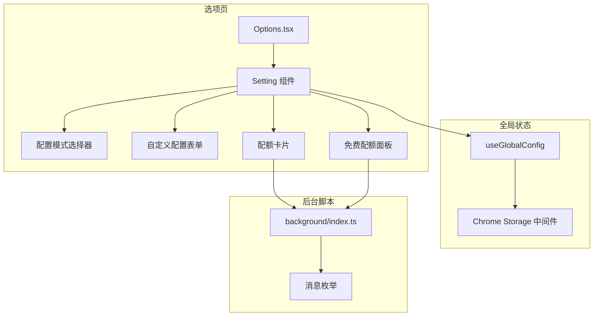
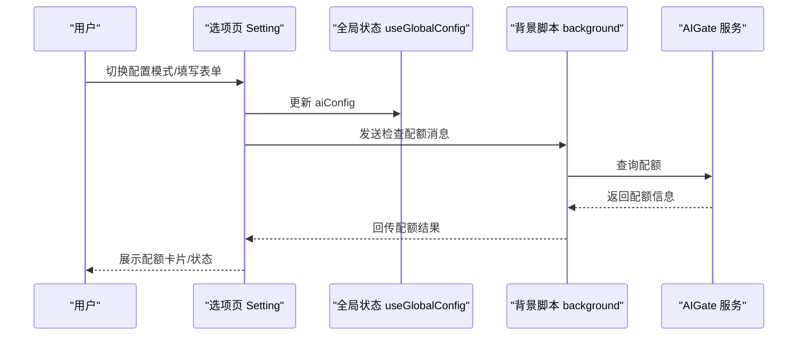
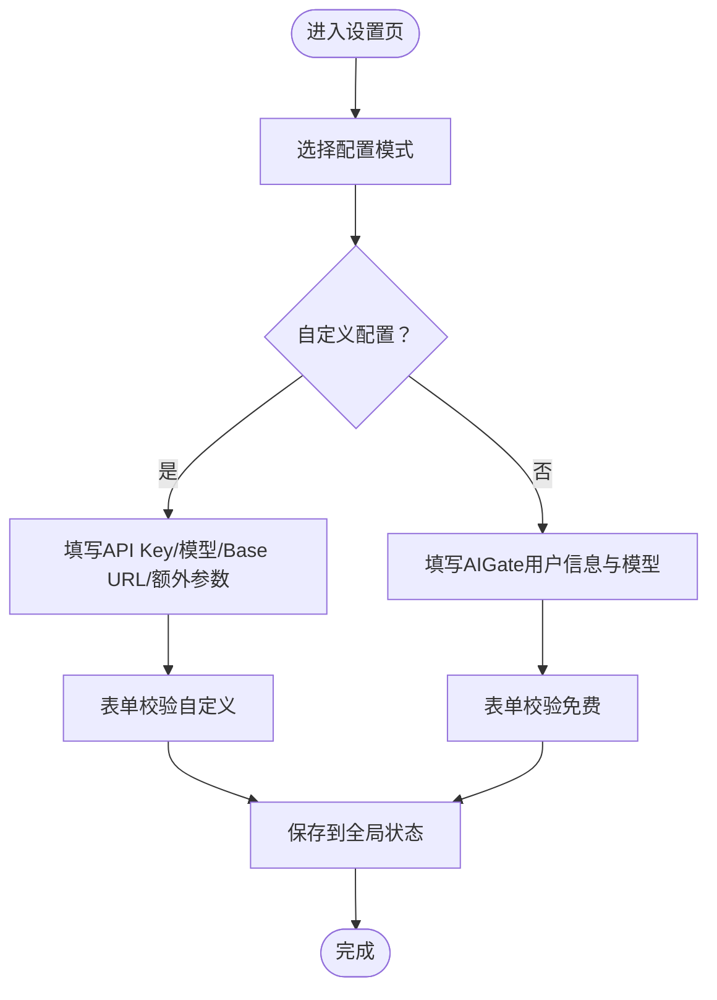
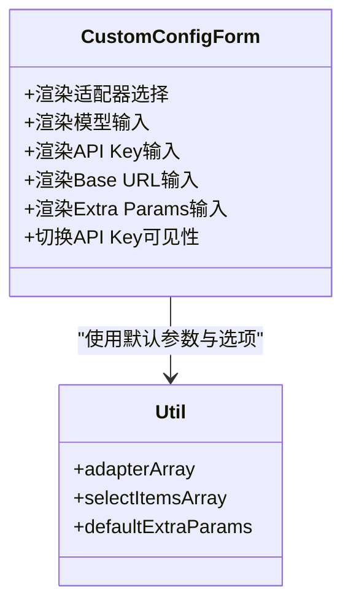
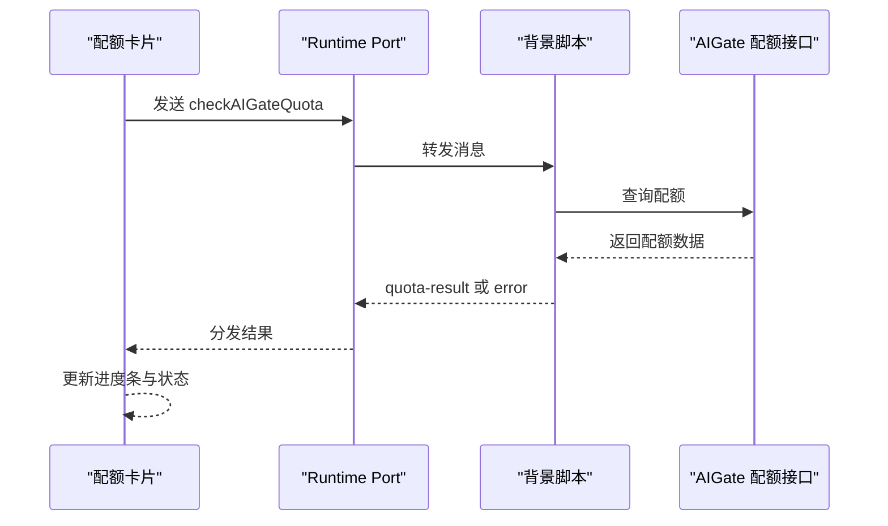
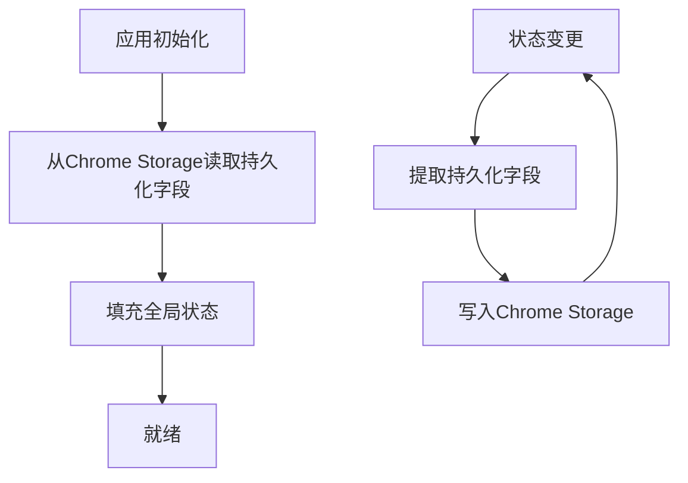
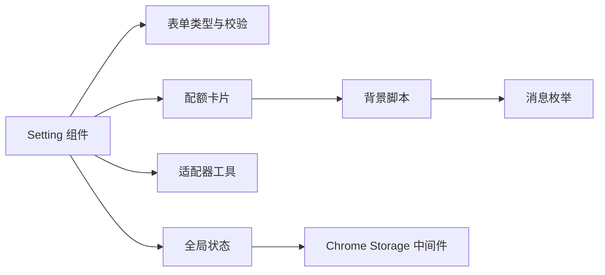

# 配置管理系统

<cite>
**本文档引用的文件**
- [src/options/Options.tsx](file://src/options/Options.tsx)
- [src/options/components/setting/index.tsx](file://src/options/components/setting/index.tsx)
- [src/options/components/setting/types.ts](file://src/options/components/setting/types.ts)
- [src/options/components/setting/util.ts](file://src/options/components/setting/util.ts)
- [src/options/components/setting/components/config-mode-selector.tsx](file://src/options/components/setting/components/config-mode-selector.tsx)
- [src/options/components/setting/components/custom-config-form.tsx](file://src/options/components/setting/components/custom-config-form.tsx)
- [src/options/components/setting/components/quota-card.tsx](file://src/options/components/setting/components/quota-card.tsx)
- [src/options/components/setting/components/free-quota-panel.tsx](file://src/options/components/setting/components/free-quota-panel.tsx)
- [src/store/global-data.ts](file://src/store/global-data.ts)
- [src/store/chorme-storage-middleware.ts](file://src/store/chorme-storage-middleware.ts)
- [src/utils/data-context.ts](file://src/utils/data-context.ts)
- [src/utils/message.ts](file://src/utils/message.ts)
- [src/background/index.ts](file://src/background/index.ts)
- [src/options/index.css](file://src/options/index.css)
</cite>

## 更新摘要
**变更内容**
- 更新了Options.tsx的响应式设计实现，从固定最小宽度改为使用Tailwind CSS响应式类
- 新增AIGate适配器支持，扩展了AI服务提供商选项
- 优化了设置界面的用户交互体验，增强了表单布局的响应式特性
- 完善了AIGate免费额度配置的完整实现

## 目录
1. [简介](#简介)
2. [项目结构](#项目结构)
3. [核心组件](#核心组件)
4. [架构总览](#架构总览)
5. [详细组件分析](#详细组件分析)
6. [依赖关系分析](#依赖关系分析)
7. [性能考虑](#性能考虑)
8. [故障排除指南](#故障排除指南)
9. [结论](#结论)
10. [附录](#附录)

## 简介
本配置管理系统为浏览器扩展提供统一的AI服务配置与管理能力，支持多种AI服务提供商（OpenAI、星火大模型、AIGate），并提供三种配置模式：自定义配置、免费额度配置与自动配置。系统具备配额监控、使用统计与提醒机制，同时通过本地存储实现配置持久化与跨设备同步。本文档将深入解析配置模式选择、配额管理、用户偏好设置、数据存储与同步机制，并提供完整配置指南与最佳实践。

## 项目结构
配置管理模块主要由以下层次构成：
- 选项页设置界面：负责展示与编辑AI配置、切换配置模式、查看配额状态
- 全局状态管理：基于Zustand + Chrome Storage中间件，持久化AI配置与用户偏好
- 背景脚本：处理AI服务调用、配额检查、消息路由与流式响应
- 工具与类型：定义适配器类型、表单校验、消息枚举与数据上下文

**图表来源**
- [src/options/Options.tsx:12-87](file://src/options/Options.tsx#L12-L87)
- [src/options/components/setting/index.tsx:14-95](file://src/options/components/setting/index.tsx#L14-L95)
- [src/store/global-data.ts:6-25](file://src/store/global-data.ts#L6-L25)
- [src/store/chorme-storage-middleware.ts:8-57](file://src/store/chorme-storage-middleware.ts#L8-L57)
- [src/background/index.ts:315-392](file://src/background/index.ts#L315-L392)
- [src/utils/message.ts:1-20](file://src/utils/message.ts#L1-L20)

**章节来源**
- [src/options/Options.tsx:12-87](file://src/options/Options.tsx#L12-L87)
- [src/options/components/setting/index.tsx:14-95](file://src/options/components/setting/index.tsx#L14-L95)
- [src/store/global-data.ts:6-25](file://src/store/global-data.ts#L6-L25)
- [src/store/chorme-storage-middleware.ts:8-57](file://src/store/chorme-storage-middleware.ts#L8-L57)
- [src/background/index.ts:315-392](file://src/background/index.ts#L315-L392)
- [src/utils/message.ts:1-20](file://src/utils/message.ts#L1-L20)

## 核心组件
- 配置模式选择器：提供"自定义配置"和"免费额度"两种模式切换，引导用户根据需求选择。
- 自定义配置表单：支持选择AI模型、输入API Key、自定义Base URL与额外参数，适配不同服务商。
- 配额卡片：实时查询AIGate配额，展示日配额、RPM限制与使用状态，提供检查按钮与最后更新时间。
- 全局状态管理：集中管理AI配置与用户偏好，通过Chrome Storage中间件实现持久化。
- 背景脚本：处理AI请求与配额检查，通过Port建立长连接，支持流式响应与取消机制。

**章节来源**
- [src/options/components/setting/components/config-mode-selector.tsx:11-44](file://src/options/components/setting/components/config-mode-selector.tsx#L11-L44)
- [src/options/components/setting/components/custom-config-form.tsx:30-148](file://src/options/components/setting/components/custom-config-form.tsx#L30-L148)
- [src/options/components/setting/components/quota-card.tsx:29-192](file://src/options/components/setting/components/quota-card.tsx#L29-L192)
- [src/store/global-data.ts:6-25](file://src/store/global-data.ts#L6-L25)
- [src/background/index.ts:315-392](file://src/background/index.ts#L315-L392)

## 架构总览
系统采用"选项页配置 + 全局状态 + 背景脚本"的分层架构。选项页负责UI交互与表单校验；全局状态负责数据持久化；背景脚本负责与AI服务通信与配额检查。消息通过Chrome Runtime Port进行流式传输，确保实时性与可控性。

**图表来源**
- [src/options/components/setting/index.tsx:40-65](file://src/options/components/setting/index.tsx#L40-L65)
- [src/options/components/setting/components/quota-card.tsx:48-101](file://src/options/components/setting/components/quota-card.tsx#L48-L101)
- [src/background/index.ts:351-363](file://src/background/index.ts#L351-L363)

## 详细组件分析

### 响应式设计优化
**更新** 选项页Options.tsx已从固定最小宽度调整为响应式设计

系统现在采用Tailwind CSS的响应式设计原则，通过媒体查询类名实现自适应布局：

- 移动端：`min-w-0` 确保在小屏幕设备上的最佳显示效果
- 平板端：`md:min-w-[786px]` 在中等屏幕设备上提供合适的最小宽度
- 桌面端：`max-w-screen-2xl` 限制最大宽度以保持良好的阅读体验

这种设计确保了配置界面在各种设备尺寸上都能提供一致且优质的用户体验。

**章节来源**
- [src/options/Options.tsx:16-30](file://src/options/Options.tsx#L16-L30)

### 配置模式选择
- 模式一：自定义配置
  - 适用场景：已有API Key或需要自定义Base URL与模型参数
  - 关键字段：adapter（AI模型）、model（模型名称）、key（API Key）、baseUrl（可选）、extraParams（可选）
  - 表单校验：当模式为自定义时，API Key、模型名称与适配器为必填
- 模式二：免费额度
  - 适用场景：希望使用AIGate免费额度，无需API Key
  - 关键字段：aigateUserId（用户邮箱）、aigateApiKeyId（API Key ID）、model（模型名称）
  - 表单校验：当模式为免费时，用户邮箱、API Key ID与模型名称为必填

**图表来源**
- [src/options/components/setting/components/config-mode-selector.tsx:11-44](file://src/options/components/setting/components/config-mode-selector.tsx#L11-L44)
- [src/options/components/setting/types.ts:52-98](file://src/options/components/setting/types.ts#L52-L98)
- [src/options/components/setting/util.ts:4-25](file://src/options/components/setting/util.ts#L4-L25)

**章节来源**
- [src/options/components/setting/components/config-mode-selector.tsx:11-44](file://src/options/components/setting/components/config-mode-selector.tsx#L11-L44)
- [src/options/components/setting/types.ts:52-98](file://src/options/components/setting/types.ts#L52-L98)
- [src/options/components/setting/util.ts:4-25](file://src/options/components/setting/util.ts#L4-L25)

### AI适配器支持扩展
**更新** 新增AIGate适配器支持，扩展了AI服务提供商选项

系统现在支持四种AI适配器：

- **星火大模型** (`spark`)：推荐当前星火大模型，有免费额度
- **OpenAI** (`openai`)：标准OpenAI API集成
- **AIGate** (`aigate`)：新增的免费额度服务提供商
- **自定义** (`custom`)：允许完全自定义的AI服务集成

每种适配器都有其特定的默认参数配置：
- 星火大模型：默认禁用思考过程
- OpenAI：无特殊默认参数
- AIGate：无特殊默认参数
- 自定义：无特殊默认参数

**章节来源**
- [src/options/components/setting/util.ts:4-35](file://src/options/components/setting/util.ts#L4-L35)
- [src/utils/data-context.ts:1-33](file://src/utils/data-context.ts#L1-L33)

### 自定义配置表单
- 支持的适配器：OpenAI、星火大模型、AIGate、自定义
- 默认额外参数：星火大模型默认禁用思考过程，OpenAI、AIGate、自定义为空对象
- 表单项说明：
  - AI模型：选择适配器
  - 模型：输入具体模型名称
  - API Key：支持明文/密文切换显示
  - Base URL：可选，用于自定义代理或服务端点
  - Extra Params：JSON字符串，传递额外参数（如禁用思考过程）

**图表来源**
- [src/options/components/setting/components/custom-config-form.tsx:30-148](file://src/options/components/setting/components/custom-config-form.tsx#L30-L148)
- [src/options/components/setting/util.ts:4-25](file://src/options/components/setting/util.ts#L4-L25)

**章节来源**
- [src/options/components/setting/components/custom-config-form.tsx:30-148](file://src/options/components/setting/components/custom-config-form.tsx#L30-L148)
- [src/options/components/setting/util.ts:4-25](file://src/options/components/setting/util.ts#L4-L25)

### 配额管理
- 配额信息结构：包含日配额、RPM限制与月配额（请求限制模式下无月配额）
- 检查流程：通过Port向背景脚本发送"checkAIGateQuota"消息，等待"quota-result"或"error"响应
- 状态展示：日配额进度条、RPM限制进度条、状态指示器（正常/配额用完/即将用完）
- 最后更新时间：记录上次检查时间，便于用户了解数据时效

**图表来源**
- [src/options/components/setting/components/quota-card.tsx:48-101](file://src/options/components/setting/components/quota-card.tsx#L48-L101)
- [src/background/index.ts:27-91](file://src/background/index.ts#L27-L91)
- [src/utils/message.ts:8-10](file://src/utils/message.ts#L8-L10)

**章节来源**
- [src/options/components/setting/components/quota-card.tsx:29-192](file://src/options/components/setting/components/quota-card.tsx#L29-L192)
- [src/background/index.ts:27-91](file://src/background/index.ts#L27-L91)
- [src/utils/message.ts:8-10](file://src/utils/message.ts#L8-L10)

### 用户偏好设置
- 主题与界面：当前仓库未提供主题与语言偏好设置字段，可在后续版本扩展
- 功能开关：当前仓库未提供功能开关字段，可在后续版本扩展
- 建议扩展方向：
  - 在DataContextType中新增主题、语言、通知开关等字段
  - 通过全局状态持久化用户偏好
  - 在选项页新增偏好设置标签页

**章节来源**
- [src/utils/data-context.ts:13-31](file://src/utils/data-context.ts#L13-L31)

### 数据存储与同步机制
- 持久化字段：仅持久化必要的字段（keyword、activeKey、cookie、aiConfig、defaultFavoriteId）
- 存储位置：Chrome Storage Local
- 同步策略：通过Port连接与消息机制实现跨页面通信，避免直接云端同步
- 初始化流程：启动时从Chrome Storage读取并填充全局状态

**图表来源**
- [src/store/chorme-storage-middleware.ts:12-57](file://src/store/chorme-storage-middleware.ts#L12-L57)
- [src/store/global-data.ts:6-25](file://src/store/global-data.ts#L6-L25)

**章节来源**
- [src/store/chorme-storage-middleware.ts:8-57](file://src/store/chorme-storage-middleware.ts#L8-L57)
- [src/store/global-data.ts:6-25](file://src/store/global-data.ts#L6-L25)

## 依赖关系分析
- 组件耦合：
  - Setting组件依赖全局状态与表单校验工具
  - 配额卡片依赖背景脚本的消息枚举
  - 自定义配置表单依赖适配器工具与默认参数
- 外部依赖：
  - Chrome Storage：用于持久化
  - Chrome Runtime：用于Port通信
  - 第三方AI服务：OpenAI、AIGate

**图表来源**
- [src/options/components/setting/index.tsx:18-23](file://src/options/components/setting/index.tsx#L18-L23)
- [src/options/components/setting/types.ts:1-99](file://src/options/components/setting/types.ts#L1-L99)
- [src/options/components/setting/util.ts:1-26](file://src/options/components/setting/util.ts#L1-L26)
- [src/options/components/setting/components/quota-card.tsx:29-192](file://src/options/components/setting/components/quota-card.tsx#L29-L192)
- [src/background/index.ts:315-392](file://src/background/index.ts#L315-L392)
- [src/utils/message.ts:1-20](file://src/utils/message.ts#L1-L20)
- [src/store/global-data.ts:6-25](file://src/store/global-data.ts#L6-L25)
- [src/store/chorme-storage-middleware.ts:8-57](file://src/store/chorme-storage-middleware.ts#L8-L57)

**章节来源**
- [src/options/components/setting/index.tsx:18-23](file://src/options/components/setting/index.tsx#L18-L23)
- [src/options/components/setting/types.ts:1-99](file://src/options/components/setting/types.ts#L1-L99)
- [src/options/components/setting/util.ts:1-26](file://src/options/components/setting/util.ts#L1-L26)
- [src/options/components/setting/components/quota-card.tsx:29-192](file://src/options/components/setting/components/quota-card.tsx#L29-L192)
- [src/background/index.ts:315-392](file://src/background/index.ts#L315-L392)
- [src/utils/message.ts:1-20](file://src/utils/message.ts#L1-L20)
- [src/store/global-data.ts:6-25](file://src/store/global-data.ts#L6-L25)
- [src/store/chorme-storage-middleware.ts:8-57](file://src/store/chorme-storage-middleware.ts#L8-L57)

## 性能考虑
- 流式响应：背景脚本使用SSE与流式读取，减少首字延迟并提升用户体验
- 取消机制：通过AbortController在Port断开或用户取消时及时终止请求
- 配额前置检查：在调用AI服务前先检查配额，避免无效请求与资源浪费
- 状态持久化：仅持久化必要字段，降低存储压力与读写开销
- 响应式优化：通过Tailwind CSS的响应式类名实现自适应布局，提升移动端体验

## 故障排除指南
- 配额检查失败
  - 现象：弹出错误提示，配额信息为空
  - 排查：确认网络连通性、AIGate服务状态与用户信息完整性
  - 参考路径：[src/options/components/setting/components/quota-card.tsx:48-101](file://src/options/components/setting/components/quota-card.tsx#L48-L101)
- API Key无效或缺失
  - 现象：自定义配置模式下提交报错
  - 排查：确认API Key、模型名称与适配器选择正确
  - 参考路径：[src/options/components/setting/types.ts:52-98](file://src/options/components/setting/types.ts#L52-L98)
- 配置未持久化
  - 现象：刷新页面后配置丢失
  - 排查：检查Chrome Storage权限与中间件是否正常工作
  - 参考路径：[src/store/chorme-storage-middleware.ts:12-57](file://src/store/chorme-storage-middleware.ts#L12-L57)
- 响应式布局问题
  - 现象：在某些设备上显示异常
  - 排查：检查Tailwind CSS类名是否正确应用，确认媒体查询生效
  - 参考路径：[src/options/Options.tsx:16-30](file://src/options/Options.tsx#L16-L30)

**章节来源**
- [src/options/components/setting/components/quota-card.tsx:48-101](file://src/options/components/setting/components/quota-card.tsx#L48-L101)
- [src/options/components/setting/types.ts:52-98](file://src/options/components/setting/types.ts#L52-L98)
- [src/store/chorme-storage-middleware.ts:12-57](file://src/store/chorme-storage-middleware.ts#L12-L57)
- [src/options/Options.tsx:16-30](file://src/options/Options.tsx#L16-L30)

## 结论
本配置管理系统通过清晰的三层架构实现了灵活的AI服务配置与管理。新增的AIGate适配器扩展了服务提供商选择，响应式设计优化提升了多设备兼容性，自定义配置满足多样化服务商接入需求，免费额度模式降低使用门槛，配额管理提供透明的用量监控。结合Chrome Storage持久化与Port消息机制，系统在易用性与可靠性之间取得平衡。建议后续扩展用户偏好设置与云端同步能力，进一步提升用户体验。

## 附录

### 配置指南
- 首次设置
  - 打开选项页，选择"自定义配置"或"免费额度"
  - 填写相应字段并点击保存
  - 查看配额卡片确认配置生效
- 高级配置
  - 在"AIGate"适配器下使用免费额度服务
  - 在"Extra Params"中添加服务商特定参数
  - 如需代理，填写"Base URL"
  - 定期检查配额，避免超出限制
- 故障排除
  - 网络问题：检查AIGate服务状态与网络连通性
  - 配额不足：等待次日重置或升级套餐
  - 配置丢失：确认Chrome Storage权限与中间件工作正常
  - 响应式问题：检查设备屏幕尺寸与浏览器缩放设置

### 实际配置示例
- 自定义OpenAI配置
  - 适配器：OpenAI
  - 模型：输入具体模型名称
  - API Key：填写从OpenAI获取的密钥
  - Base URL：可留空使用默认
  - Extra Params：按需添加参数
- 使用AIGate免费额度
  - 适配器：AIGate
  - 用户邮箱：填写注册邮箱
  - API Key ID：填写AIGate提供的Key ID
  - 模型：选择免费模型名称
  - 配额检查：点击"检查配额"查看剩余次数
- 星火大模型配置
  - 适配器：星火大模型
  - 模型：输入具体模型名称
  - 配额检查：可直接使用免费额度

### 最佳实践建议
- 优先使用免费额度进行日常使用，减少成本
- 定期检查配额与使用状态，避免影响业务连续性
- 对敏感信息（API Key）妥善保管，避免泄露
- 在Extra Params中谨慎添加参数，确保与服务商兼容
- 保持扩展更新，及时修复潜在问题
- 利用响应式设计特性，在不同设备上获得最佳体验
- 根据使用场景选择合适的AI适配器，平衡成本与性能