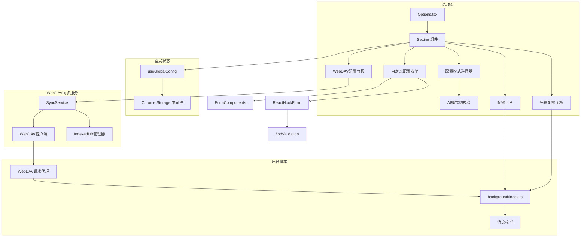
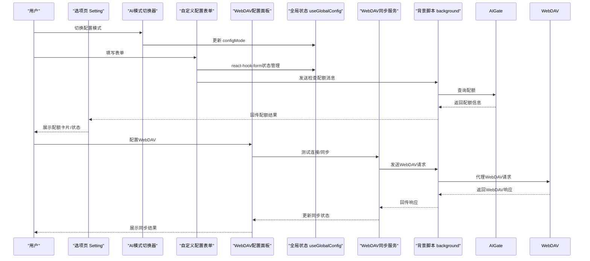
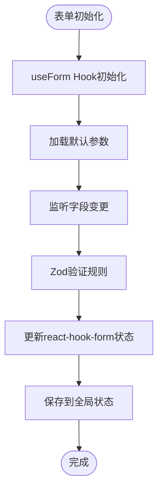
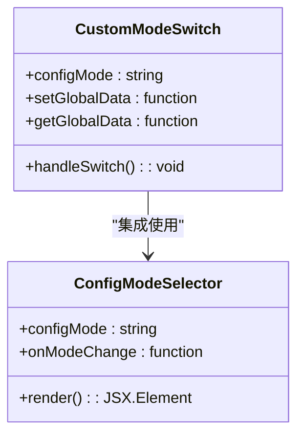
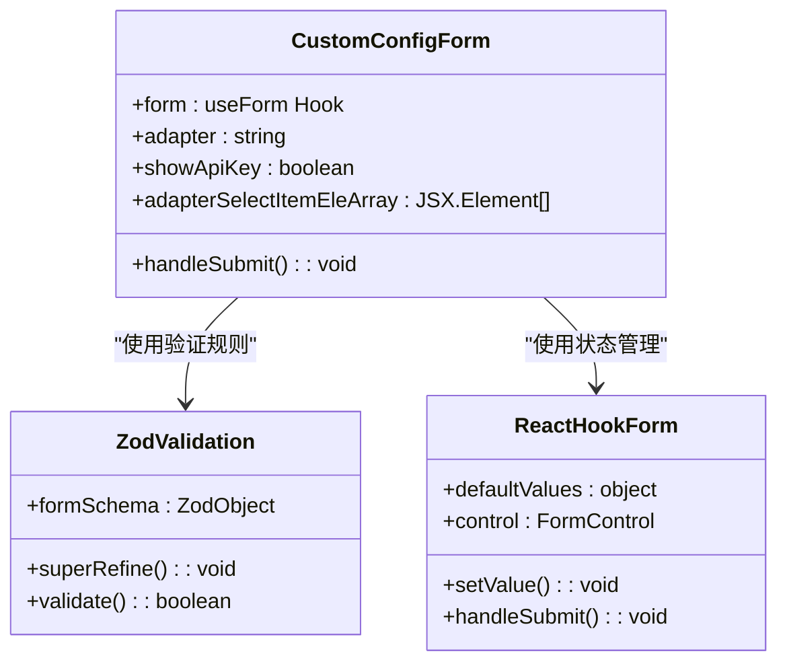
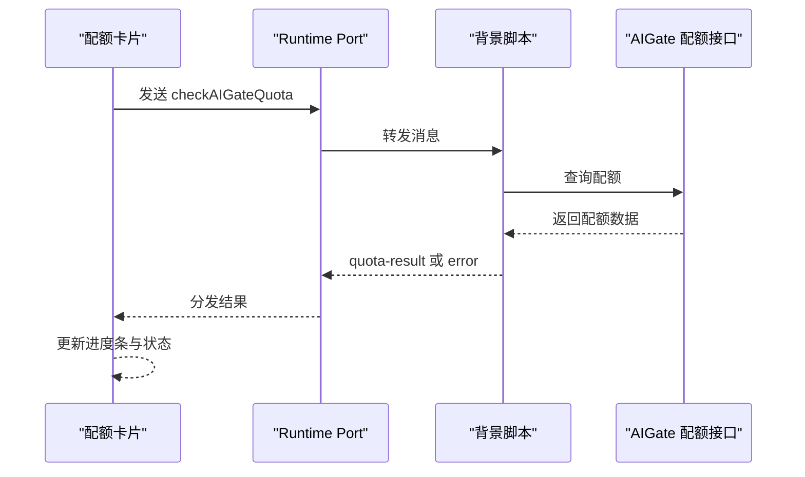
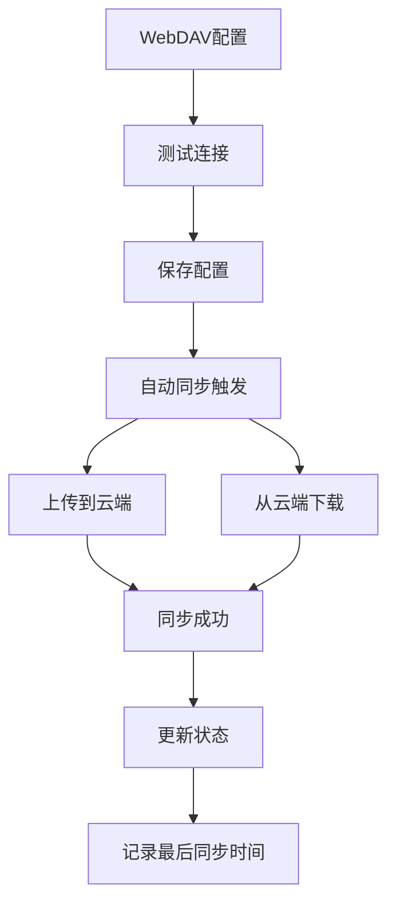
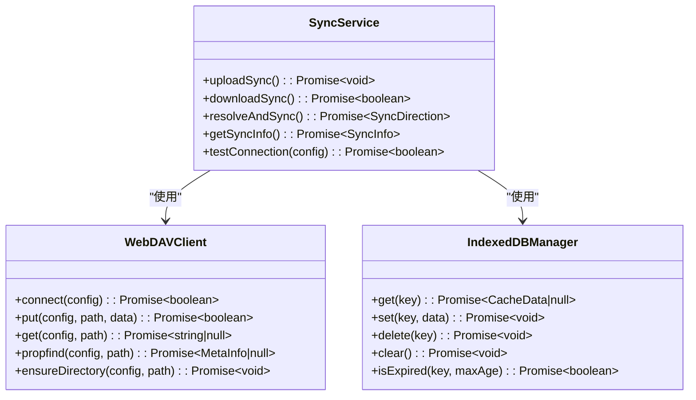
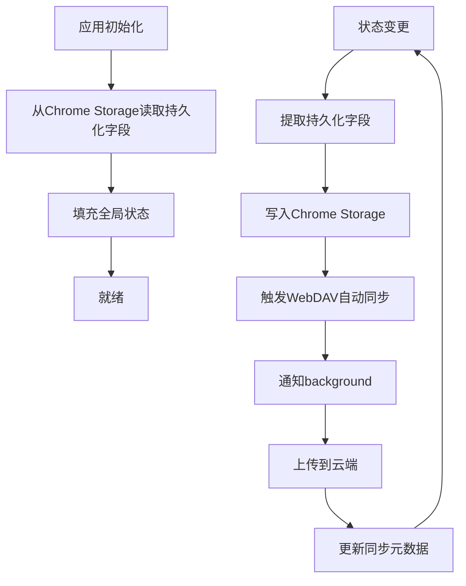
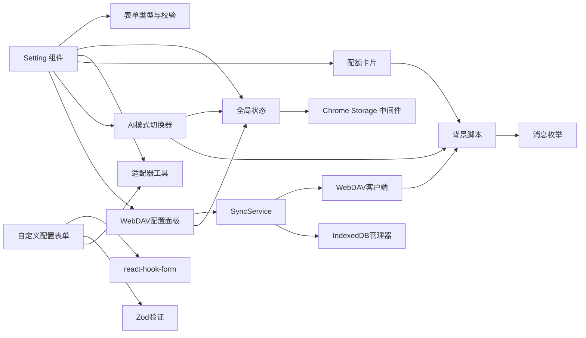

# 配置管理系统

<cite>
**本文档引用的文件**
- [src/options/Options.tsx](file://src/options/Options.tsx)
- [src/options/components/setting/index.tsx](file://src/options/components/setting/index.tsx)
- [src/options/components/setting/types.ts](file://src/options/components/setting/types.ts)
- [src/options/components/setting/util.ts](file://src/options/components/setting/util.ts)
- [src/options/components/setting/components/config-mode-selector.tsx](file://src/options/components/setting/components/config-mode-selector.tsx)
- [src/options/components/setting/components/custom-config-form.tsx](file://src/options/components/setting/components/custom-config-form.tsx)
- [src/options/components/setting/components/custom-mode-switch.tsx](file://src/options/components/setting/components/custom-mode-switch.tsx)
- [src/options/components/setting/components/quota-card.tsx](file://src/options/components/setting/components/quota-card.tsx)
- [src/options/components/setting/components/free-quota-panel.tsx](file://src/options/components/setting/components/free-quota-panel.tsx)
- [src/options/components/setting/components/webdav-config.tsx](file://src/options/components/setting/components/webdav-config.tsx)
- [src/store/global-data.ts](file://src/store/global-data.ts)
- [src/store/chorme-storage-middleware.ts](file://src/store/chorme-storage-middleware.ts)
- [src/utils/data-context.ts](file://src/utils/data-context.ts)
- [src/utils/message.ts](file://src/utils/message.ts)
- [src/utils/webdav.ts](file://src/utils/webdav.ts)
- [src/utils/sync-service.ts](file://src/utils/sync-service.ts)
- [src/utils/indexed-db.ts](file://src/utils/indexed-db.ts)
- [src/background/index.ts](file://src/background/index.ts)
- [src/components/ui/form.tsx](file://src/components/ui/form.tsx)
- [src/options/index.css](file://src/options/index.css)
</cite>

## 更新摘要
**变更内容**
- 新增WebDAV配置面板集成：添加了完整的WebDAV云同步功能，支持Nextcloud、坚果云、群晖等服务
- 扩展配置管理功能范围：在设置界面中新增"云同步"标题和WebDAV配置面板
- 增强数据存储与同步机制：支持Chrome Storage和IndexedDB的双向同步
- 新增WebDAV同步服务：提供自动同步、手动同步和冲突解决机制
- 扩展全局状态管理：新增webdavConfig、webdavEnabled、webdavSyncIndexedDB、webdavLastSyncTime等字段
- 新增WebDAV客户端：提供轻量级WebDAV客户端，通过background service worker中转请求

## 目录
1. [简介](#简介)
2. [项目结构](#项目结构)
3. [核心组件](#核心组件)
4. [架构总览](#架构总览)
5. [详细组件分析](#详细组件分析)
6. [依赖关系分析](#依赖关系分析)
7. [性能考虑](#性能考虑)
8. [故障排除指南](#故障排除指南)
9. [结论](#结论)
10. [附录](#附录)

## 简介
本配置管理系统为浏览器扩展提供统一的AI服务配置与管理能力，支持多种AI服务提供商（OpenAI、通义千问、Kimi、自定义），并提供两种配置模式：自定义配置与免费额度配置。系统具备配额监控、使用统计与提醒机制，同时通过本地存储实现配置持久化与跨设备同步。**新增的WebDAV云同步功能**进一步增强了数据备份与跨设备同步能力，支持Nextcloud、坚果云、群晖等主流WebDAV服务。本文档将深入解析配置模式选择、配额管理、用户偏好设置、数据存储与同步机制，并提供完整配置指南与最佳实践。

## 项目结构
配置管理模块主要由以下层次构成：
- 选项页设置界面：负责展示与编辑AI配置、切换配置模式、查看配额状态、管理WebDAV云同步
- 全局状态管理：基于Zustand + Chrome Storage中间件，持久化AI配置、用户偏好和WebDAV配置
- 背景脚本：处理AI服务调用、配额检查、WebDAV请求代理与消息路由
- WebDAV同步服务：管理数据的上传、下载、冲突解决和自动同步
- 工具与类型：定义适配器类型、表单校验、消息枚举、WebDAV配置与数据上下文

**图表来源**
- [src/options/Options.tsx:12-87](file://src/options/Options.tsx#L12-L87)
- [src/options/components/setting/index.tsx:14-95](file://src/options/components/setting/index.tsx#L14-L95)
- [src/store/global-data.ts:6-25](file://src/store/global-data.ts#L6-L25)
- [src/store/chorme-storage-middleware.ts:8-57](file://src/store/chorme-storage-middleware.ts#L8-L57)
- [src/background/index.ts:315-392](file://src/background/index.ts#L315-L392)
- [src/utils/message.ts:1-20](file://src/utils/message.ts#L1-L20)
- [src/options/components/setting/components/custom-mode-switch.tsx:1-35](file://src/options/components/setting/components/custom-mode-switch.tsx#L1-35)
- [src/options/components/setting/components/custom-config-form.tsx:1-230](file://src/options/components/setting/components/custom-config-form.tsx#L1-230)
- [src/options/components/setting/components/webdav-config.tsx:1-318](file://src/options/components/setting/components/webdav-config.tsx#L1-318)
- [src/utils/webdav.ts:1-182](file://src/utils/webdav.ts#L1-182)
- [src/utils/sync-service.ts:1-293](file://src/utils/sync-service.ts#L1-293)
- [src/utils/indexed-db.ts:1-128](file://src/utils/indexed-db.ts#L1-128)
- [src/components/ui/form.tsx:1-168](file://src/components/ui/form.tsx#L1-L168)

**章节来源**
- [src/options/Options.tsx:12-87](file://src/options/Options.tsx#L12-L87)
- [src/options/components/setting/index.tsx:14-95](file://src/options/components/setting/index.tsx#L14-L95)
- [src/store/global-data.ts:6-25](file://src/store/global-data.ts#L6-L25)
- [src/store/chorme-storage-middleware.ts:8-57](file://src/store/chorme-storage-middleware.ts#L8-L57)
- [src/background/index.ts:315-392](file://src/background/index.ts#L315-L392)
- [src/utils/message.ts:1-20](file://src/utils/message.ts#L1-L20)

## 核心组件
- **AI模式切换器(CustomModeSwitch)**：提供"自定义配置"和"免费额度"两种模式无缝切换，通过Switch组件实现直观的用户交互
- **自定义配置表单(CustomConfigForm)**：基于react-hook-form与Zod验证框架，支持选择AI模型、输入API Key、自定义Base URL与额外参数
- **配置模式选择器(ConfigModeSelector)**：集成AI模式切换器，提供视觉化的模式切换按钮
- **配额卡片(QuotaCard)**：实时查询AIGate配额，展示日配额、RPM限制与使用状态，提供检查按钮与最后更新时间
- **WebDAV配置面板(WebDAVConfigPanel)**：**新增组件**，提供WebDAV云同步配置界面，支持服务器地址、用户名、密码、同步路径配置，以及连接测试、手动同步等功能
- **全局状态管理(useGlobalConfig)**：集中管理AI配置、用户偏好和WebDAV配置，通过Chrome Storage中间件实现持久化
- **WebDAV同步服务(SyncService)**：**新增服务**，管理数据的上传、下载、冲突解决和自动同步，支持Chrome Storage和IndexedDB的双向同步
- **背景脚本(background)**：处理AI请求与配额检查，通过Port建立长连接，支持流式响应与取消机制，**新增WebDAV请求代理功能**

**章节来源**
- [src/options/components/setting/components/custom-mode-switch.tsx:1-35](file://src/options/components/setting/components/custom-mode-switch.tsx#L1-35)
- [src/options/components/setting/components/custom-config-form.tsx:30-148](file://src/options/components/setting/components/custom-config-form.tsx#L30-L148)
- [src/options/components/setting/components/config-mode-selector.tsx:11-44](file://src/options/components/setting/components/config-mode-selector.tsx#L11-L44)
- [src/options/components/setting/components/quota-card.tsx:29-192](file://src/options/components/setting/components/quota-card.tsx#L29-L192)
- [src/options/components/setting/components/webdav-config.tsx:23-318](file://src/options/components/setting/components/webdav-config.tsx#L23-L318)
- [src/store/global-data.ts:6-25](file://src/store/global-data.ts#L6-L25)
- [src/utils/sync-service.ts:1-293](file://src/utils/sync-service.ts#L1-L293)
- [src/background/index.ts:315-392](file://src/background/index.ts#L315-L392)

## 架构总览
系统采用"选项页配置 + 全局状态 + 背景脚本 + WebDAV同步服务"的分层架构。选项页负责UI交互与表单校验；全局状态负责数据持久化；背景脚本负责与AI服务通信与配额检查；**WebDAV同步服务负责云端数据同步与冲突解决**。消息通过Chrome Runtime Port进行流式传输，确保实时性与可控性。

**图表来源**
- [src/options/components/setting/index.tsx:40-65](file://src/options/components/setting/index.tsx#L40-L65)
- [src/options/components/setting/components/custom-mode-switch.tsx:16-31](file://src/options/components/setting/components/custom-mode-switch.tsx#L16-L31)
- [src/options/components/setting/components/custom-config-form.tsx:57-82](file://src/options/components/setting/components/custom-config-form.tsx#L57-L82)
- [src/options/components/setting/components/quota-card.tsx:48-101](file://src/options/components/setting/components/quota-card.tsx#L48-L101)
- [src/options/components/setting/components/webdav-config.tsx:54-105](file://src/options/components/setting/components/webdav-config.tsx#L54-L105)
- [src/background/index.ts:351-363](file://src/background/index.ts#L351-L363)

## 详细组件分析

### 配置系统重构与表单验证
**更新** 配置系统已全面重构，采用react-hook-form与Zod验证框架

系统现在采用现代化的表单管理方案：

- **react-hook-form集成**：CustomConfigForm使用useForm Hook管理表单状态，提供高性能的受控组件
- **Zod类型验证**：formSchema定义了完整的类型安全验证规则，支持条件验证逻辑
- **实时验证**：表单字段变更时自动触发验证，提供即时反馈
- **默认值管理**：通过useEffect监听适配器变更，自动填充默认参数

**图表来源**
- [src/options/components/setting/components/custom-config-form.tsx:41-53](file://src/options/components/setting/components/custom-config-form.tsx#L41-L53)
- [src/options/components/setting/types.ts:28-63](file://src/options/components/setting/types.ts#L28-L63)

**章节来源**
- [src/options/components/setting/components/custom-config-form.tsx:30-148](file://src/options/components/setting/components/custom-config-form.tsx#L30-L148)
- [src/options/components/setting/types.ts:28-63](file://src/options/components/setting/types.ts#L28-L63)

### AI模式无缝切换
**更新** 新增CustomModeSwitch组件实现AI模式无缝切换功能

AI模式切换器提供了直观的用户界面：

- **Switch组件集成**：使用原生Switch组件实现模式切换
- **状态同步**：切换时自动更新全局状态中的configMode字段
- **条件渲染**：根据模式动态渲染自定义配置表单或配额卡片
- **用户友好**：提供清晰的标签文本"使用内置免费 AI"

**图表来源**
- [src/options/components/setting/components/custom-mode-switch.tsx:7-32](file://src/options/components/setting/components/custom-mode-switch.tsx#L7-L32)
- [src/options/components/setting/components/config-mode-selector.tsx:12-44](file://src/options/components/setting/components/config-mode-selector.tsx#L12-L44)

**章节来源**
- [src/options/components/setting/components/custom-mode-switch.tsx:1-35](file://src/options/components/setting/components/custom-mode-switch.tsx#L1-35)
- [src/options/components/setting/components/config-mode-selector.tsx:1-46](file://src/options/components/setting/components/config-mode-selector.tsx#L1-46)

### AI适配器支持更新
**更新** AI适配器支持列表已更新，移除了AIGate选项并新增了通义千问和Kimi支持

系统现在支持七种AI适配器，按照优先级顺序排列：

1. **通义千问** (`qianwen`)：新增的通义千问适配器，支持阿里云通义千问模型
2. **Kimi** (`kimi`)：新增的Kimi适配器，支持月之暗面Kimi模型
3. **OpenAI** (`openai`)：标准OpenAI API集成
4. **GML** (`gml`)：新增的大模型平台适配器
5. **自定义** (`custom`)：允许完全自定义的AI服务集成
6. **星火大模型** (`spark`)：传统的星火大模型适配器
7. **AIGate** (`aigate`)：已移除的适配器（在当前版本中不再支持）

每种适配器都有其特定的默认参数配置：
- 通义千问：默认Base URL为dashscope.aliyuncs.com，禁用思考过程
- Kimi：默认Base URL为api.moonshot.ai，禁用思考过程
- OpenAI：默认Base URL为api.openai.com，禁用思考过程
- GML：默认Base URL为open.bigmodel.cn，禁用思考过程
- 自定义：无特殊默认参数
- 星火大模型：默认禁用思考过程
- AIGate：已移除

**章节来源**
- [src/options/components/setting/util.ts:6-85](file://src/options/components/setting/util.ts#L6-L85)
- [src/utils/data-context.ts:1-34](file://src/utils/data-context.ts#L1-L34)

### 自定义配置表单
**更新** 自定义配置表单已重构为基于react-hook-form与Zod验证

- **表单验证**：使用Zod schema定义严格的验证规则，支持条件验证
- **适配器选择**：支持通义千问、Kimi、OpenAI、GML、自定义、星火大模型
- **默认参数**：根据适配器类型自动填充默认参数
- **Extra Params**：仅在自定义适配器下启用，支持JSON格式参数
- **API Key管理**：支持明文/密文切换显示
- **实时状态**：通过react-hook-form提供实时状态管理和表单提交

**图表来源**
- [src/options/components/setting/components/custom-config-form.tsx:33-229](file://src/options/components/setting/components/custom-config-form.tsx#L33-L229)
- [src/options/components/setting/types.ts:28-63](file://src/options/components/setting/types.ts#L28-L63)
- [src/components/ui/form.tsx:16-168](file://src/components/ui/form.tsx#L16-L168)

**章节来源**
- [src/options/components/setting/components/custom-config-form.tsx:30-148](file://src/options/components/setting/components/custom-config-form.tsx#L30-L148)
- [src/options/components/setting/types.ts:28-63](file://src/options/components/setting/types.ts#L28-L63)
- [src/components/ui/form.tsx:1-168](file://src/components/ui/form.tsx#L1-168)

### 配额管理
- 配额信息结构：包含日配额、RPM限制与月配额（请求限制模式下无月配额）
- 检查流程：通过Port向背景脚本发送"checkAIGateQuota"消息，等待"quota-result"或"error"响应
- 状态展示：日配额进度条、RPM限制进度条、状态指示器（正常/配额用完/即将用完）
- 最后更新时间：记录上次检查时间，便于用户了解数据时效

**图表来源**
- [src/options/components/setting/components/quota-card.tsx:48-101](file://src/options/components/setting/components/quota-card.tsx#L48-L101)
- [src/background/index.ts:27-91](file://src/background/index.ts#L27-L91)
- [src/utils/message.ts:8-10](file://src/utils/message.ts#L8-L10)

**章节来源**
- [src/options/components/setting/components/quota-card.tsx:29-192](file://src/options/components/setting/components/quota-card.tsx#L29-L192)
- [src/background/index.ts:27-91](file://src/background/index.ts#L27-L91)
- [src/utils/message.ts:8-10](file://src/utils/message.ts#L8-L10)

### WebDAV云同步功能
**新增** WebDAV配置面板集成了完整的云同步功能

WebDAV配置面板提供了全面的云同步管理：

- **配置界面**：支持服务器地址、用户名、密码、同步路径配置
- **连接测试**：动态申请权限并测试WebDAV连接
- **手动同步**：支持手动上传到云端和从云端下载
- **自动同步**：状态变更时自动触发同步，静默失败处理
- **同步选项**：可选同步分析缓存数据（IndexedDB）
- **状态管理**：实时显示同步状态、最后同步时间和操作按钮
- **兼容性**：支持Nextcloud、坚果云、群晖等主流WebDAV服务

**图表来源**
- [src/options/components/setting/components/webdav-config.tsx:43-105](file://src/options/components/setting/components/webdav-config.tsx#L43-L105)
- [src/utils/sync-service.ts:80-113](file://src/utils/sync-service.ts#L80-L113)
- [src/utils/sync-service.ts:118-164](file://src/utils/sync-service.ts#L118-L164)

**章节来源**
- [src/options/components/setting/components/webdav-config.tsx:23-318](file://src/options/components/setting/components/webdav-config.tsx#L23-L318)
- [src/utils/webdav.ts:1-182](file://src/utils/webdav.ts#L1-L182)
- [src/utils/sync-service.ts:1-293](file://src/utils/sync-service.ts#L1-L293)

### WebDAV同步服务
**新增** SyncService提供了完整的数据同步管理

WebDAV同步服务实现了复杂的数据同步逻辑：

- **同步策略**：last-write-wins冲突解决机制
- **同步范围**：仅同步Chrome Storage中的关键字段，不包含敏感数据
- **数据结构**：settings.json存储配置数据，sync-meta.json存储元数据
- **IndexedDB同步**：可选同步分析缓存数据，支持增量同步
- **设备识别**：生成唯一设备ID，支持多设备协同
- **版本控制**：支持同步版本升级和向后兼容
- **错误处理**：完善的错误捕获和用户反馈机制

**图表来源**
- [src/utils/sync-service.ts:77-113](file://src/utils/sync-service.ts#L77-L113)
- [src/utils/webdav.ts:67-80](file://src/utils/webdav.ts#L67-L80)
- [src/utils/indexed-db.ts:45-81](file://src/utils/indexed-db.ts#L45-L81)

**章节来源**
- [src/utils/sync-service.ts:1-293](file://src/utils/sync-service.ts#L1-L293)
- [src/utils/webdav.ts:1-182](file://src/utils/webdav.ts#L1-L182)
- [src/utils/indexed-db.ts:1-128](file://src/utils/indexed-db.ts#L1-L128)

### 用户偏好设置
- 主题与界面：当前仓库未提供主题与语言偏好设置字段，可在后续版本扩展
- 功能开关：当前仓库未提供功能开关字段，可在后续版本扩展
- **新增桌面宠物设置**：支持在B站页面显示桌面宠物的功能开关
- 建议扩展方向：
  - 在DataContextType中新增主题、语言、通知开关等字段
  - 通过全局状态持久化用户偏好
  - 在选项页新增偏好设置标签页

**章节来源**
- [src/utils/data-context.ts:13-31](file://src/utils/data-context.ts#L13-L31)
- [src/options/components/setting/index.tsx:31-48](file://src/options/components/setting/index.tsx#L31-L48)

### 数据存储与同步机制
- **持久化字段扩展**：新增webdavConfig、webdavEnabled、webdavSyncIndexedDB、webdavLastSyncTime等WebDAV相关字段
- **存储位置**：Chrome Storage Local，WebDAV配置仅本地持久化，不参与WebDAV同步
- **同步策略**：通过Port连接与消息机制实现跨页面通信，避免直接云端同步
- **初始化流程**：启动时从Chrome Storage读取并填充全局状态
- **WebDAV自动同步**：状态变更时通知background触发上传，静默失败处理
- **冲突解决**：last-write-wins策略，比较远端和本地时间戳决定同步方向

**图表来源**
- [src/store/chorme-storage-middleware.ts:12-57](file://src/store/chorme-storage-middleware.ts#L12-L57)
- [src/store/global-data.ts:6-25](file://src/store/global-data.ts#L6-L25)
- [src/store/chorme-storage-middleware.ts:47-50](file://src/store/chorme-storage-middleware.ts#L47-L50)

**章节来源**
- [src/store/chorme-storage-middleware.ts:8-57](file://src/store/chorme-storage-middleware.ts#L8-L57)
- [src/store/global-data.ts:6-25](file://src/store/global-data.ts#L6-L25)

## 依赖关系分析
- 组件耦合：
  - Setting组件依赖全局状态与表单校验工具
  - 配额卡片依赖背景脚本的消息枚举
  - 自定义配置表单依赖react-hook-form与Zod验证
  - AI模式切换器依赖全局状态管理
  - **WebDAV配置面板依赖同步服务和WebDAV客户端**
  - **同步服务依赖WebDAV客户端和IndexedDB管理器**
- 外部依赖：
  - Chrome Storage：用于持久化
  - Chrome Runtime：用于Port通信和WebDAV请求代理
  - react-hook-form：用于表单状态管理
  - Zod：用于类型安全验证
  - **WebDAV服务：Nextcloud、坚果云、群晖等**
  - **IndexedDB：分析缓存数据存储**

**图表来源**
- [src/options/components/setting/index.tsx:18-23](file://src/options/components/setting/index.tsx#L18-L23)
- [src/options/components/setting/types.ts:1-99](file://src/options/components/setting/types.ts#L1-L99)
- [src/options/components/setting/util.ts:1-26](file://src/options/components/setting/util.ts#L1-L26)
- [src/options/components/setting/components/quota-card.tsx:29-192](file://src/options/components/setting/components/quota-card.tsx#L29-L192)
- [src/options/components/setting/components/custom-mode-switch.tsx:1-35](file://src/options/components/setting/components/custom-mode-switch.tsx#L1-35)
- [src/options/components/setting/components/webdav-config.tsx:1-318](file://src/options/components/setting/components/webdav-config.tsx#L1-318)
- [src/background/index.ts:315-392](file://src/background/index.ts#L315-L392)
- [src/utils/message.ts:1-20](file://src/utils/message.ts#L1-L20)
- [src/store/global-data.ts:6-25](file://src/store/global-data.ts#L6-L25)
- [src/store/chorme-storage-middleware.ts:8-57](file://src/store/chorme-storage-middleware.ts#L8-L57)

**章节来源**
- [src/options/components/setting/index.tsx:18-23](file://src/options/components/setting/index.tsx#L18-L23)
- [src/options/components/setting/types.ts:1-99](file://src/options/components/setting/types.ts#L1-L99)
- [src/options/components/setting/util.ts:1-26](file://src/options/components/setting/util.ts#L1-L26)
- [src/options/components/setting/components/quota-card.tsx:29-192](file://src/options/components/setting/components/quota-card.tsx#L29-L192)
- [src/options/components/setting/components/custom-mode-switch.tsx:1-35](file://src/options/components/setting/components/custom-mode-switch.tsx#L1-35)
- [src/options/components/setting/components/webdav-config.tsx:1-318](file://src/options/components/setting/components/webdav-config.tsx#L1-318)
- [src/background/index.ts:315-392](file://src/background/index.ts#L315-L392)
- [src/utils/message.ts:1-20](file://src/utils/message.ts#L1-L20)
- [src/store/global-data.ts:6-25](file://src/store/global-data.ts#L6-L25)
- [src/store/chorme-storage-middleware.ts:8-57](file://src/store/chorme-storage-middleware.ts#L8-L57)

## 性能考虑
- **流式响应**：背景脚本使用SSE与流式读取，减少首字延迟并提升用户体验
- **取消机制**：通过AbortController在Port断开或用户取消时及时终止请求
- **配额前置检查**：在调用AI服务前先检查配额，避免无效请求与资源浪费
- **状态持久化优化**：仅持久化必要字段，降低存储压力与读写开销
- **表单优化**：react-hook-form提供高性能的表单状态管理，减少不必要的重渲染
- **条件渲染**：根据配置模式动态渲染组件，避免不必要DOM节点的创建
- **响应式优化**：通过Tailwind CSS的响应式类名实现自适应布局，提升移动端体验
- **WebDAV同步优化**：**支持可选的IndexedDB同步，避免大数据量同步造成的性能问题**
- **自动同步防抖**：**WebDAV自动同步使用防抖机制，避免频繁同步导致的性能损耗**

## 故障排除指南
- **配额检查失败**
  - 现象：弹出错误提示，配额信息为空
  - 排查：确认网络连通性、AIGate服务状态与用户信息完整性
  - 参考路径：[src/options/components/setting/components/quota-card.tsx:48-101](file://src/options/components/setting/components/quota-card.tsx#L48-L101)
- **API Key无效或缺失**
  - 现象：自定义配置模式下提交报错
  - 排查：确认API Key、模型名称与适配器选择正确
  - 参考路径：[src/options/components/setting/types.ts:52-98](file://src/options/components/setting/types.ts#L52-L98)
- **配置未持久化**
  - 现象：刷新页面后配置丢失
  - 排查：检查Chrome Storage权限与中间件是否正常工作
  - 参考路径：[src/store/chorme-storage-middleware.ts:12-57](file://src/store/chorme-storage-middleware.ts#L12-L57)
- **表单验证错误**
  - 现象：表单提交时报错，无法保存配置
  - 排查：检查Zod验证规则，确认必填字段完整
  - 参考路径：[src/options/components/setting/types.ts:28-63](file://src/options/components/setting/types.ts#L28-L63)
- **AI模式切换失效**
  - 现象：切换模式后界面不更新
  - 排查：检查CustomModeSwitch组件状态更新逻辑
  - 参考路径：[src/options/components/setting/components/custom-mode-switch.tsx:16-31](file://src/options/components/setting/components/custom-mode-switch.tsx#L16-L31)
- **WebDAV连接失败**
  - 现象：测试连接或同步时失败
  - 排查：确认服务器地址、用户名、密码正确，检查WebDAV服务状态，确认权限申请成功
  - 参考路径：[src/options/components/setting/components/webdav-config.tsx:55-105](file://src/options/components/setting/components/webdav-config.tsx#L55-L105)
- **WebDAV同步冲突**
  - 现象：多设备同步时数据不一致
  - 排查：理解last-write-wins策略，确认设备ID生成正常，检查同步元数据
  - 参考路径：[src/utils/sync-service.ts:170-199](file://src/utils/sync-service.ts#L170-L199)
- **IndexedDB同步问题**
  - 现象：分析缓存数据同步失败
  - 排查：检查IndexedDB权限，确认数据库初始化成功，验证缓存数据格式
  - 参考路径：[src/utils/sync-service.ts:233-270](file://src/utils/sync-service.ts#L233-L270)
- **响应式布局问题**
  - 现象：在某些设备上显示异常
  - 排查：检查Tailwind CSS类名是否正确应用，确认媒体查询生效
  - 参考路径：[src/options/Options.tsx:16-30](file://src/options/Options.tsx#L16-L30)

**章节来源**
- [src/options/components/setting/components/quota-card.tsx:48-101](file://src/options/components/setting/components/quota-card.tsx#L48-L101)
- [src/options/components/setting/types.ts:52-98](file://src/options/components/setting/types.ts#L52-L98)
- [src/store/chorme-storage-middleware.ts:12-57](file://src/store/chorme-storage-middleware.ts#L12-L57)
- [src/options/components/setting/types.ts:28-63](file://src/options/components/setting/types.ts#L28-L63)
- [src/options/components/setting/components/custom-mode-switch.tsx:16-31](file://src/options/components/setting/components/custom-mode-switch.tsx#L16-L31)
- [src/options/components/setting/components/webdav-config.tsx:55-105](file://src/options/components/setting/components/webdav-config.tsx#L55-L105)
- [src/utils/sync-service.ts:170-199](file://src/utils/sync-service.ts#L170-L199)
- [src/utils/sync-service.ts:233-270](file://src/utils/sync-service.ts#L233-L270)
- [src/options/Options.tsx:16-30](file://src/options/Options.tsx#L16-L30)

## 结论
本配置管理系统通过全面的重构实现了更加现代化和可靠的AI服务配置与管理。新增的react-hook-form与Zod验证框架提供了类型安全的表单管理，CustomModeSwitch组件实现了无缝的AI模式切换，更新的适配器支持扩展了服务提供商选择，移除的AIGate选项简化了配置流程，响应式设计优化提升了多设备兼容性。**最重要的新增功能是WebDAV云同步系统，它提供了完整的跨设备数据备份与同步能力，支持Nextcloud、坚果云、群晖等主流WebDAV服务，通过SyncService实现了智能的冲突解决和自动同步机制**。新的配置系统在易用性、可靠性与可维护性之间取得了更好的平衡。建议后续扩展用户偏好设置与云端同步能力，进一步提升用户体验。

## 附录

### 配置指南
- **首次设置**
  - 打开选项页，使用AI模式切换器选择"自定义配置"或"免费额度"
  - 填写相应字段并点击保存
  - 查看配额卡片确认配置生效
  - **在"云同步"部分配置WebDAV服务器，测试连接并保存**
- **高级配置**
  - 在"通义千问"或"Kimi"适配器下使用对应的免费额度服务
  - 在"Extra Params"中添加服务商特定参数
  - 如需代理，填写"Base URL"
  - 定期检查配额，避免超出限制
  - **配置WebDAV时选择合适的同步路径，避免与其他应用冲突**
  - **如需同步大量分析缓存数据，建议开启"同步分析缓存数据"选项**
- **WebDAV云同步配置**
  - **服务器地址**：填写WebDAV服务器URL，如https://dav.example.com/remote.php/dav/files/user
  - **用户名和密码**：输入WebDAV账户凭据
  - **同步路径**：建议使用/bilibili-favorites/作为基础路径
  - **测试连接**：点击"测试连接并保存"，系统会动态申请权限
  - **手动同步**：可随时点击"上传到云端"或"从云端下载"
  - **自动同步**：状态变更时自动触发，无需手动操作
- **故障排除**
  - 网络问题：检查AIGate服务状态与网络连通性
  - 配额不足：等待次日重置或升级套餐
  - 配置丢失：确认Chrome Storage权限与中间件工作正常
  - 表单验证：检查Zod验证规则，确保必填字段完整
  - AI模式切换：检查CustomModeSwitch组件状态更新逻辑
  - **WebDAV连接失败**：检查服务器地址、用户名、密码，确认权限申请成功
  - **WebDAV同步冲突**：理解last-write-wins策略，检查设备ID和同步元数据
  - **响应式问题**：检查设备屏幕尺寸与浏览器缩放设置

### 实际配置示例
- **自定义OpenAI配置**
  - 适配器：OpenAI
  - 模型：输入具体模型名称
  - API Key：填写从OpenAI获取的密钥
  - Base URL：可留空使用默认
  - Extra Params：按需添加参数
- **使用通义千问免费额度**
  - 适配器：通义千问
  - 模型：选择通义千问模型名称
  - 配额检查：点击"检查配额"查看剩余次数
- **使用Kimi免费额度**
  - 适配器：Kimi
  - 模型：选择Kimi模型名称
  - 配额检查：点击"检查配额"查看剩余次数
- **星火大模型配置**
  - 适配器：星火大模型
  - 模型：输入具体模型名称
  - 配额检查：可直接使用免费额度
- **WebDAV云同步配置**
  - **Nextcloud配置**：服务器地址https://cloud.example.com/remote.php/dav/files/username
  - **坚果云配置**：服务器地址https://dav.nutstore.net/username
  - **群晖配置**：服务器地址https://synology.example.com/webdav/username
  - **同步路径**：/bilibili-favorites/（可根据需要调整）
  - **测试连接**：确保权限申请成功，连接测试通过

### 最佳实践建议
- 优先使用免费额度进行日常使用，减少成本
- 定期检查配额与使用状态，避免影响业务连续性
- 对敏感信息（API Key）妥善保管，避免泄露
- 在Extra Params中谨慎添加参数，确保与服务商兼容
- 利用react-hook-form的实时验证功能，确保配置准确性
- 根据使用场景选择合适的AI适配器，平衡成本与性能
- 注意适配器列表的变化，及时更新配置以匹配当前支持的服务商
- 利用AI模式切换器快速在自定义和免费模式间切换
- 保持扩展更新，及时修复潜在问题
- 利用响应式设计特性，在不同设备上获得最佳体验
- **合理使用WebDAV云同步功能，定期检查同步状态和存储空间**
- **对于大量分析缓存数据，建议谨慎开启同步，避免影响性能**
- **在多设备环境下使用WebDAV同步时，理解last-write-wins策略的含义**
- **定期备份重要数据，WebDAV同步只是辅助手段，不是唯一的数据保护方案**