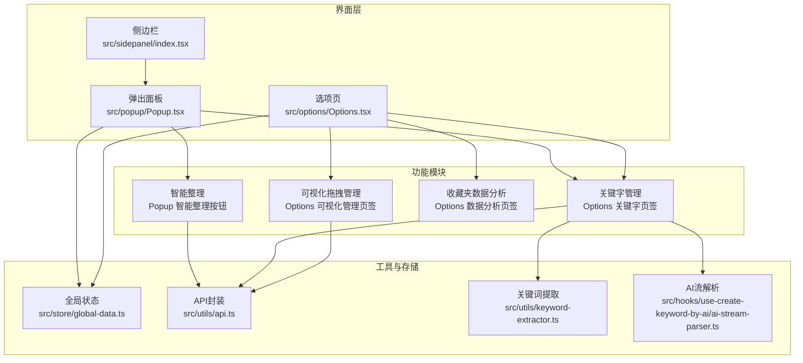
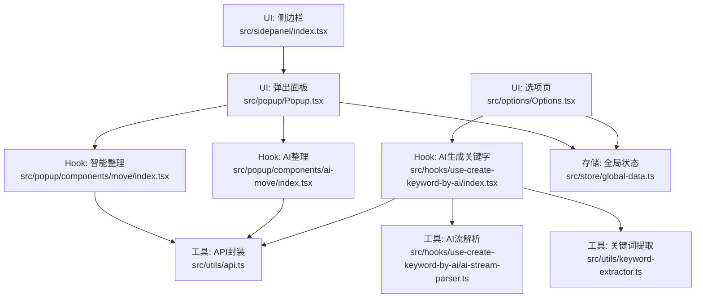
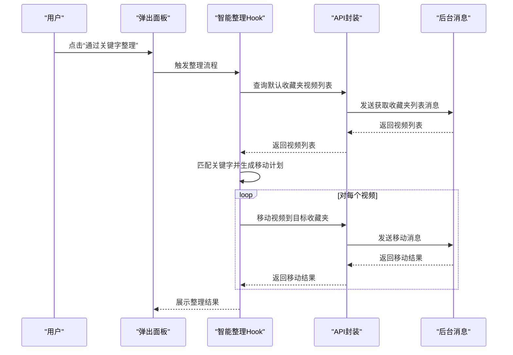
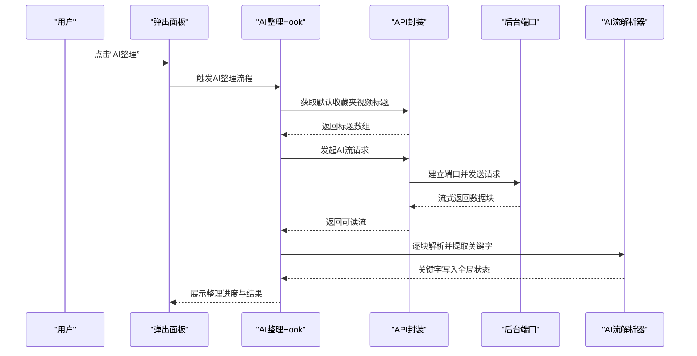
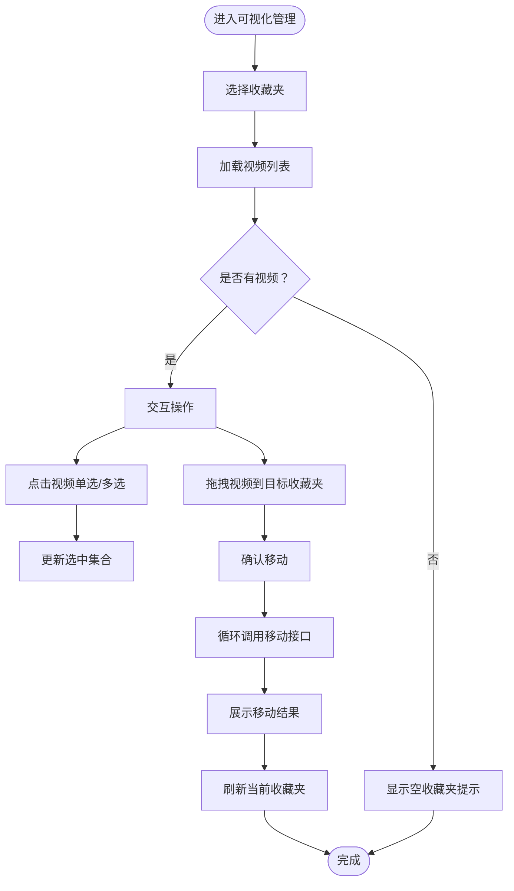
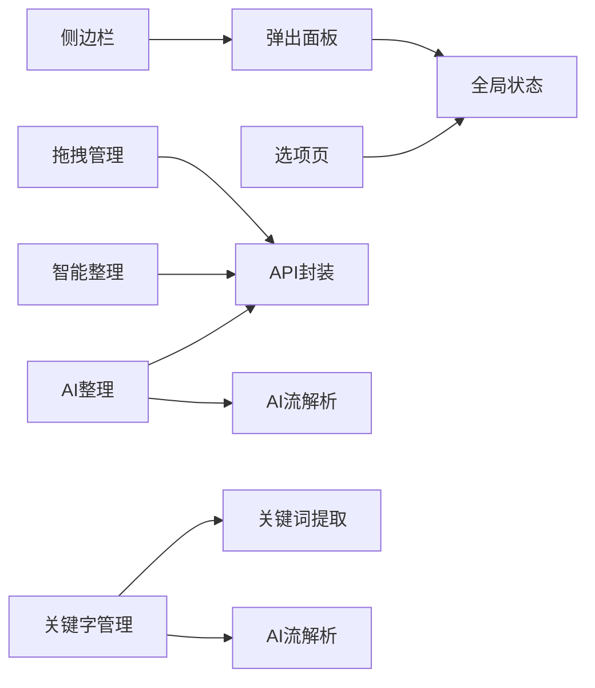

# 功能特性概览

<cite>
**本文引用的文件**
- [src/popup/Popup.tsx](file://src/popup/Popup.tsx)
- [src/sidepanel/index.tsx](file://src/sidepanel/index.tsx)
- [src/options/Options.tsx](file://src/options/Options.tsx)
- [src/options/components/drag-manager/index.tsx](file://src/options/components/drag-manager/index.tsx)
- [src/popup/components/move/index.tsx](file://src/popup/components/move/index.tsx)
- [src/popup/components/ai-move/index.tsx](file://src/popup/components/ai-move/index.tsx)
- [src/popup/components/auto-create-keyword/index.tsx](file://src/popup/components/auto-create-keyword/index.tsx)
- [src/hooks/use-create-keyword-by-ai/index.tsx](file://src/hooks/use-create-keyword-by-ai/index.tsx)
- [src/hooks/use-create-keyword-by-ai/ai-stream-parser.ts](file://src/hooks/use-create-keyword-by-ai/ai-stream-parser.ts)
- [src/utils/keyword-extractor.ts](file://src/utils/keyword-extractor.ts)
- [src/utils/api.ts](file://src/utils/api.ts)
- [src/store/global-data.ts](file://src/store/global-data.ts)
- [src/manifest.ts](file://src/manifest.ts)
</cite>

## 目录
1. [简介](#简介)
2. [项目结构](#项目结构)
3. [核心功能模块](#核心功能模块)
4. [架构总览](#架构总览)
5. [详细组件分析](#详细组件分析)
6. [依赖关系分析](#依赖关系分析)
7. [性能考量](#性能考量)
8. [故障排查指南](#故障排查指南)
9. [结论](#结论)

## 简介
本工具为浏览器扩展，围绕“B站收藏夹”提供四大核心能力：收藏内容分析、智能整理、可视化拖拽管理、侧边栏模式。它通过本地关键词提取与AI流式解析、IndexedDB缓存、跨页面消息通信等技术手段，帮助用户高效组织与管理收藏内容。

## 项目结构
- 弹出面板（Popup）：提供常用操作入口与快捷功能，适合日常高频使用。
- 选项页（Options）：集中配置、关键字管理、可视化拖拽管理、收藏夹数据分析。
- 侧边栏（Side Panel）：以独立窗口形式提供更宽屏的管理体验。
- 工具与存储：统一的数据上下文、全局状态、API封装、关键词提取与AI流解析。
- 清单（Manifest）：声明权限、背景页、内容脚本、侧边栏等。

图表来源
- [src/popup/Popup.tsx:14-77](file://src/popup/Popup.tsx#L14-L77)
- [src/sidepanel/index.tsx:1-11](file://src/sidepanel/index.tsx#L1-L11)
- [src/options/Options.tsx:12-88](file://src/options/Options.tsx#L12-L88)
- [src/options/components/drag-manager/index.tsx:33-393](file://src/options/components/drag-manager/index.tsx#L33-L393)
- [src/store/global-data.ts:6-25](file://src/store/global-data.ts#L6-L25)
- [src/utils/api.ts:285-319](file://src/utils/api.ts#L285-L319)
- [src/utils/keyword-extractor.ts:137-187](file://src/utils/keyword-extractor.ts#L137-L187)
- [src/hooks/use-create-keyword-by-ai/ai-stream-parser.ts:221-277](file://src/hooks/use-create-keyword-by-ai/ai-stream-parser.ts#L221-L277)

章节来源
- [src/popup/Popup.tsx:14-77](file://src/popup/Popup.tsx#L14-L77)
- [src/sidepanel/index.tsx:1-11](file://src/sidepanel/index.tsx#L1-L11)
- [src/options/Options.tsx:12-88](file://src/options/Options.tsx#L12-L88)

## 核心功能模块
- 收藏内容分析：在选项页提供统计卡片与趋势/分布图表，结合Web Worker与IndexedDB缓存，实现对收藏夹数据的可视化洞察。
- 智能整理：支持基于关键字匹配的自动整理与AI智能分类两种路径，前者面向已有关键字，后者通过AI生成关键字并进行批量移动。
- 可视化拖拽管理：在选项页提供拖拽式收藏夹视频管理界面，支持多选、范围选择、拖拽移动，直观高效。
- 侧边栏模式：以独立窗口提供更宽屏的管理体验，复用弹出面板UI布局。

章节来源
- [src/options/Options.tsx:31-82](file://src/options/Options.tsx#L31-L82)
- [src/options/components/drag-manager/index.tsx:33-393](file://src/options/components/drag-manager/index.tsx#L33-L393)
- [src/popup/Popup.tsx:55-70](file://src/popup/Popup.tsx#L55-L70)
- [src/sidepanel/index.tsx:1-11](file://src/sidepanel/index.tsx#L1-L11)

## 架构总览
系统采用“界面层 + 功能模块 + 工具与存储”的分层设计。界面层通过React组件承载；功能模块由Hooks与工具函数协作实现；工具与存储层负责状态、网络与缓存。

图表来源
- [src/popup/Popup.tsx:14-77](file://src/popup/Popup.tsx#L14-L77)
- [src/options/Options.tsx:12-88](file://src/options/Options.tsx#L12-L88)
- [src/sidepanel/index.tsx:1-11](file://src/sidepanel/index.tsx#L1-L11)
- [src/popup/components/move/index.tsx:6-39](file://src/popup/components/move/index.tsx#L6-L39)
- [src/popup/components/ai-move/index.tsx:8-62](file://src/popup/components/ai-move/index.tsx#L8-L62)
- [src/hooks/use-create-keyword-by-ai/index.tsx:9-167](file://src/hooks/use-create-keyword-by-ai/index.tsx#L9-L167)
- [src/utils/api.ts:285-319](file://src/utils/api.ts#L285-L319)
- [src/utils/keyword-extractor.ts:137-187](file://src/utils/keyword-extractor.ts#L137-L187)
- [src/hooks/use-create-keyword-by-ai/ai-stream-parser.ts:221-277](file://src/hooks/use-create-keyword-by-ai/ai-stream-parser.ts#L221-L277)
- [src/store/global-data.ts:6-25](file://src/store/global-data.ts#L6-L25)

## 详细组件分析

### 收藏内容分析
- 功能概述：在选项页“收藏夹数据分析”中，提供统计卡片、趋势图与分布图，帮助用户了解收藏夹规模、增长趋势与内容分布。
- 技术亮点：
  - Web Worker：分离计算任务，避免阻塞UI。
  - IndexedDB缓存：对收藏夹视频列表进行缓存，减少重复拉取。
- 使用场景：定期查看收藏夹健康度、发现内容偏好变化、规划归档策略。

章节来源
- [src/options/Options.tsx:74-82](file://src/options/Options.tsx#L74-L82)

### 智能整理（关键字匹配）
- 功能概述：通过视频标题与收藏夹关键字进行匹配，将默认收藏夹中的视频自动移动到对应收藏夹。
- 技术亮点：
  - 关键字匹配：基于预设关键字集合进行匹配与移动。
  - 一键操作：在弹出面板提供“通过关键字整理”按钮，支持气泡说明。
- 使用场景：已有关键字体系的用户，快速批量整理默认收藏夹内容。

图表来源
- [src/popup/components/move/index.tsx:6-39](file://src/popup/components/move/index.tsx#L6-L39)
- [src/utils/api.ts:155-174](file://src/utils/api.ts#L155-L174)

章节来源
- [src/popup/components/move/index.tsx:6-39](file://src/popup/components/move/index.tsx#L6-L39)

### AI智能整理
- 功能概述：通过AI对视频标题进行分析，自动识别内容并进行智能分类，适合关键字尚未完善的场景。
- 技术亮点：
  - 流式AI解析：通过扩展端口建立长连接，接收AI流式响应并实时解析。
  - 多适配器：支持星火、OpenAI等适配器，便于切换不同后端。
  - Token消耗提醒：二次确认，降低误操作成本。
- 使用场景：首次导入大量收藏夹、关键字缺失、希望探索性整理。

图表来源
- [src/popup/components/ai-move/index.tsx:8-62](file://src/popup/components/ai-move/index.tsx#L8-L62)
- [src/hooks/use-create-keyword-by-ai/index.tsx:21-154](file://src/hooks/use-create-keyword-by-ai/index.tsx#L21-L154)
- [src/hooks/use-create-keyword-by-ai/ai-stream-parser.ts:221-277](file://src/hooks/use-create-keyword-by-ai/ai-stream-parser.ts#L221-L277)
- [src/utils/api.ts:234-247](file://src/utils/api.ts#L234-L247)

章节来源
- [src/popup/components/ai-move/index.tsx:8-62](file://src/popup/components/ai-move/index.tsx#L8-L62)
- [src/hooks/use-create-keyword-by-ai/index.tsx:9-167](file://src/hooks/use-create-keyword-by-ai/index.tsx#L9-L167)
- [src/hooks/use-create-keyword-by-ai/ai-stream-parser.ts:1-278](file://src/hooks/use-create-keyword-by-ai/ai-stream-parser.ts#L1-L278)

### 可视化拖拽管理
- 功能概述：在选项页提供拖拽式收藏夹视频管理界面，支持多选、范围选择、拖拽移动，直观高效。
- 技术亮点：
  - 拖拽多选：支持Ctrl/Cmd单选与Shift范围选择。
  - 即时反馈：拖拽悬停高亮、移动中遮罩提示。
  - 错误处理：加载失败与移动失败的Toast提示。
- 使用场景：需要精细调整视频归属、批量移动、快速浏览与筛选。

图表来源
- [src/options/components/drag-manager/index.tsx:52-193](file://src/options/components/drag-manager/index.tsx#L52-L193)

章节来源
- [src/options/components/drag-manager/index.tsx:33-393](file://src/options/components/drag-manager/index.tsx#L33-L393)

### 侧边栏模式
- 功能概述：以独立窗口提供更宽屏的管理体验，复用弹出面板UI布局，适合长时间操作与多任务并行。
- 技术亮点：
  - 独立渲染：侧边栏入口直接渲染弹出面板组件。
  - 权限与清单：清单声明side_panel权限，支持在浏览器中打开侧边栏。
- 使用场景：需要更大可视区域进行拖拽管理、批量操作或同时对比多个收藏夹。

章节来源
- [src/sidepanel/index.tsx:1-11](file://src/sidepanel/index.tsx#L1-L11)
- [src/manifest.ts:51-53](file://src/manifest.ts#L51-L53)

### 关键字管理与AI生成
- 功能概述：在选项页“关键字管理”中，支持手动与AI生成两种方式创建关键字，并与收藏夹关键字联动。
- 技术亮点：
  - 本地TF-IDF：提供本地关键词提取算法，支持最小长度、最低分、最大数量等参数。
  - AI流解析：从AI流中解析关键字并写入全局状态，避免重复。
  - 自动创建入口：弹出面板提供“自动创建关键字”按钮直达选项页。
- 使用场景：为收藏夹建立关键字体系、批量生成关键字、提升智能整理命中率。

章节来源
- [src/options/Options.tsx:42-62](file://src/options/Options.tsx#L42-L62)
- [src/popup/components/auto-create-keyword/index.tsx:4-20](file://src/popup/components/auto-create-keyword/index.tsx#L4-L20)
- [src/utils/keyword-extractor.ts:137-187](file://src/utils/keyword-extractor.ts#L137-L187)
- [src/hooks/use-create-keyword-by-ai/ai-stream-parser.ts:148-179](file://src/hooks/use-create-keyword-by-ai/ai-stream-parser.ts#L148-L179)

## 依赖关系分析
- 组件耦合：
  - 弹出面板与选项页共享全局状态与API封装，确保数据一致性。
  - 可视化拖拽管理与智能整理均依赖API封装与消息通信。
- 外部依赖：
  - 清单声明host_permissions与side_panel权限，支持访问AI服务与侧边栏。
  - IndexedDB用于收藏夹视频列表缓存，降低重复请求成本。

图表来源
- [src/store/global-data.ts:6-25](file://src/store/global-data.ts#L6-L25)
- [src/utils/api.ts:285-319](file://src/utils/api.ts#L285-L319)
- [src/utils/keyword-extractor.ts:137-187](file://src/utils/keyword-extractor.ts#L137-L187)
- [src/hooks/use-create-keyword-by-ai/ai-stream-parser.ts:221-277](file://src/hooks/use-create-keyword-by-ai/ai-stream-parser.ts#L221-L277)
- [src/sidepanel/index.tsx:1-11](file://src/sidepanel/index.tsx#L1-L11)

章节来源
- [src/manifest.ts:39-46](file://src/manifest.ts#L39-L46)

## 性能考量
- 缓存策略：收藏夹视频列表通过IndexedDB缓存，支持过期时间控制，减少重复拉取与网络开销。
- 并行与批处理：AI生成关键字支持批量处理多个收藏夹，内部进行成功/失败计数，提升效率。
- UI优化：拖拽管理提供加载骨架屏与移动中遮罩，改善用户感知。
- 网络与流式：AI请求通过扩展端口建立长连接，按块解析，降低首帧延迟与内存占用。

章节来源
- [src/utils/api.ts:285-319](file://src/utils/api.ts#L285-L319)
- [src/hooks/use-create-keyword-by-ai/index.tsx:117-139](file://src/hooks/use-create-keyword-by-ai/index.tsx#L117-L139)
- [src/options/components/drag-manager/index.tsx:281-293](file://src/options/components/drag-manager/index.tsx#L281-L293)

## 故障排查指南
- 登录状态异常：弹出面板与选项页均内置登录检查组件，若未登录将无法获取收藏夹数据或执行移动操作。
- AI配置缺失：AI生成关键字与AI整理需要正确配置apiKey、model等参数，否则会提示配置不完整。
- Token消耗提醒：AI整理会提示Token消耗风险，需二次确认以避免误操作。
- 拖拽移动失败：检查源/目标收藏夹是否一致、网络状态与权限，查看Toast错误提示并重试。

章节来源
- [src/popup/Popup.tsx:72-74](file://src/popup/Popup.tsx#L72-L74)
- [src/options/Options.tsx:85-86](file://src/options/Options.tsx#L85-L86)
- [src/hooks/use-create-keyword-by-ai/index.tsx:76-88](file://src/hooks/use-create-keyword-by-ai/index.tsx#L76-L88)
- [src/popup/components/ai-move/index.tsx:12-27](file://src/popup/components/ai-move/index.tsx#L12-L27)
- [src/options/components/drag-manager/index.tsx:65-71](file://src/options/components/drag-manager/index.tsx#L65-L71)

## 结论
本工具通过“收藏内容分析 + 智能整理 + 可视化拖拽管理 + 侧边栏模式”的组合，覆盖从“洞察—整理—管理—长期维护”的完整生命周期。借助本地关键词提取、AI流解析与IndexedDB缓存，既保证易用性又兼顾性能与隐私。建议用户先建立关键字体系，再配合AI智能整理与可视化拖拽管理，实现高效有序的收藏夹治理。