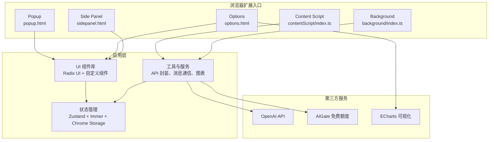
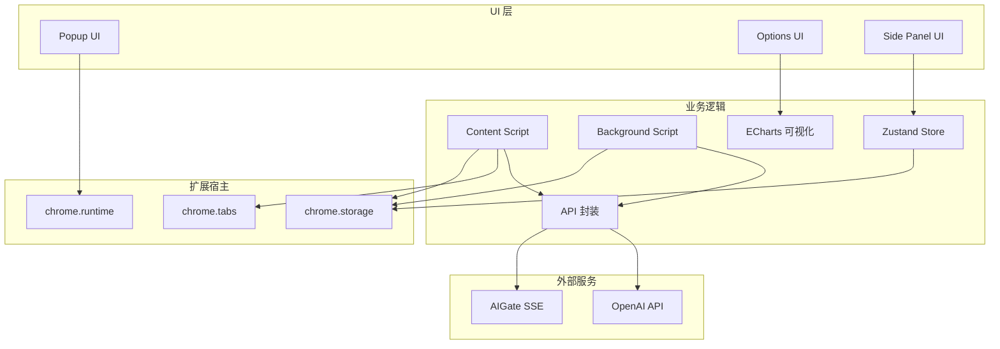
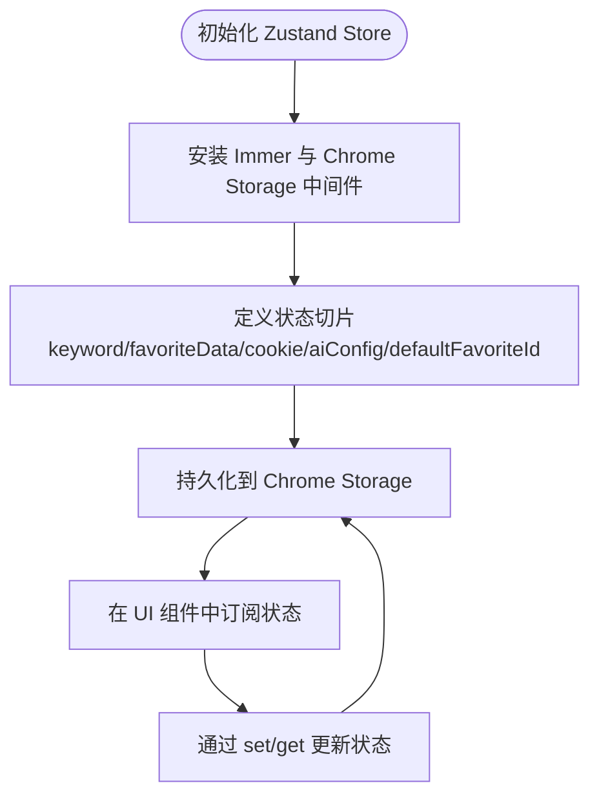
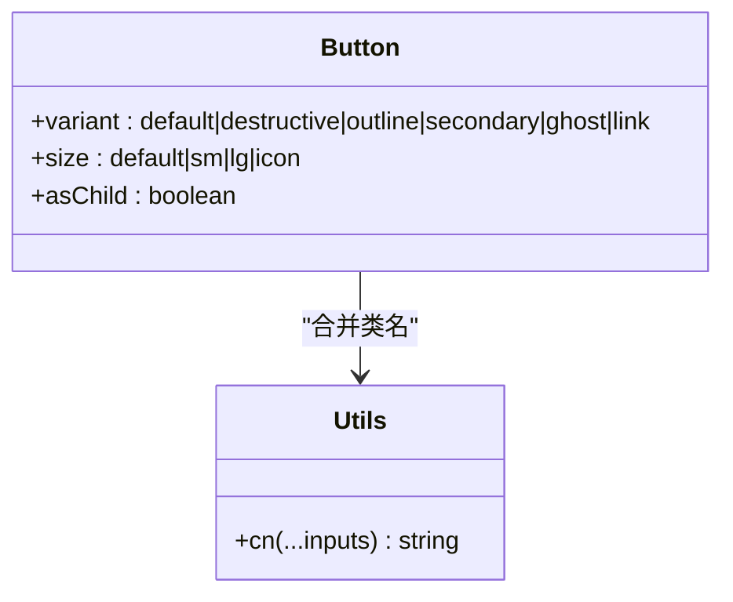
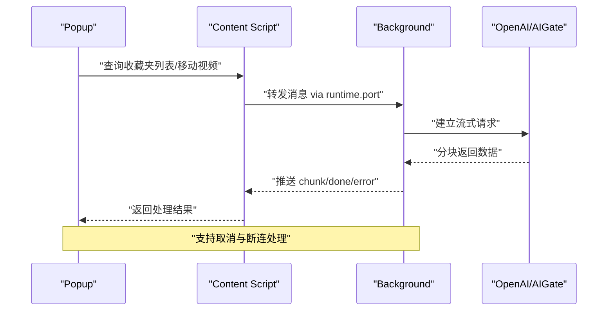
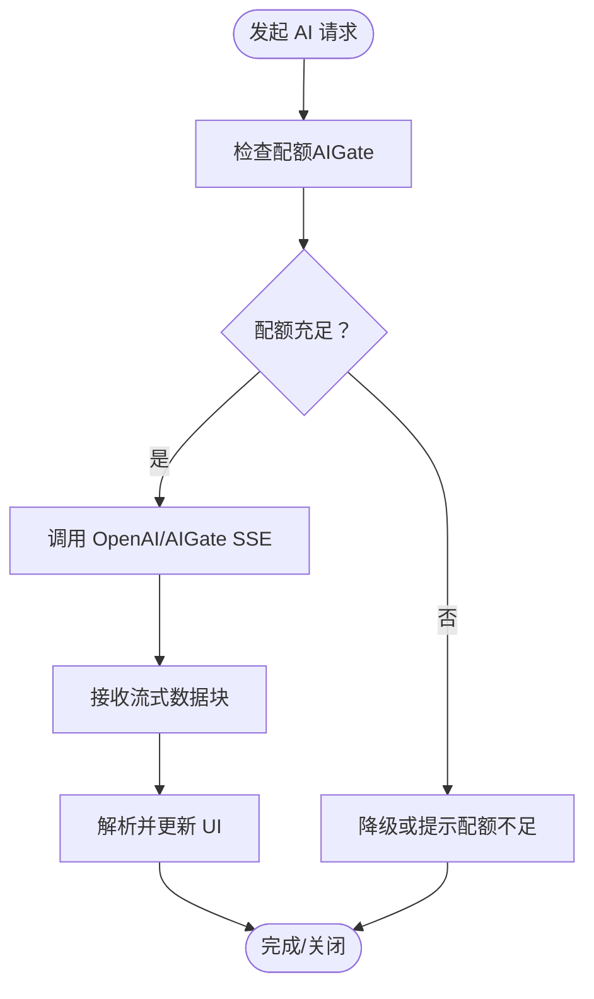
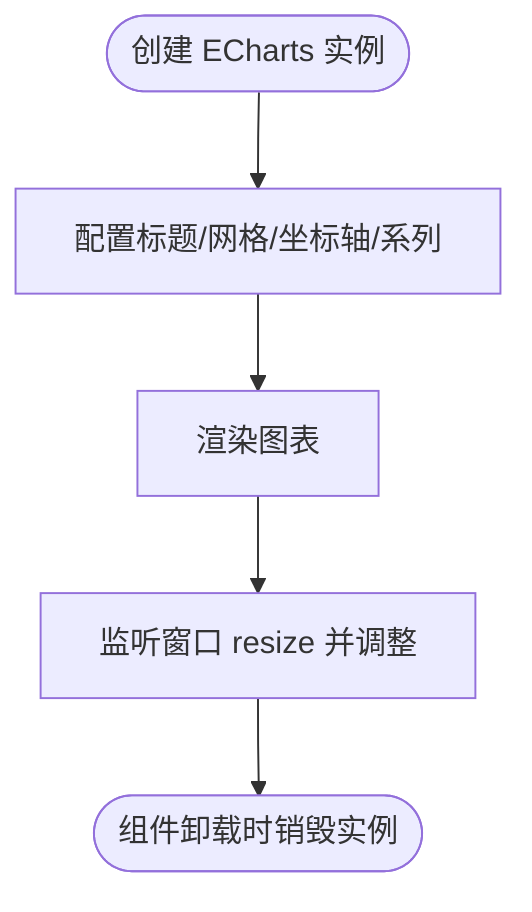
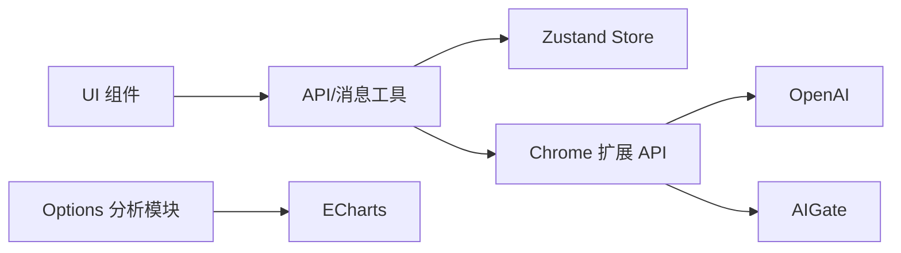

# 技术栈介绍

<cite>
**本文引用的文件**
- [package.json](file://package.json)
- [vite.config.ts](file://vite.config.ts)
- [tsconfig.json](file://tsconfig.json)
- [tailwind.config.js](file://tailwind.config.js)
- [postcss.config.js](file://postcss.config.js)
- [src/manifest.ts](file://src/manifest.ts)
- [src/store/global-data.ts](file://src/store/global-data.ts)
- [src/components/ui/button.tsx](file://src/components/ui/button.tsx)
- [src/lib/utils.ts](file://src/lib/utils.ts)
- [src/hooks/use-create-keyword-by-ai/index.tsx](file://src/hooks/use-create-keyword-by-ai/index.tsx)
- [src/utils/api.ts](file://src/utils/api.ts)
- [src/utils/message.ts](file://src/utils/message.ts)
- [src/background/index.ts](file://src/background/index.ts)
- [src/contentScript/index.ts](file://src/contentScript/index.ts)
- [src/options/components/analysis/chart/bar-chart.tsx](file://src/options/components/analysis/chart/bar-chart.tsx)
</cite>

## 目录
1. [引言](#引言)
2. [项目结构](#项目结构)
3. [核心组件](#核心组件)
4. [架构总览](#架构总览)
5. [详细组件分析](#详细组件分析)
6. [依赖关系分析](#依赖关系分析)
7. [性能考量](#性能考量)
8. [故障排查指南](#故障排查指南)
9. [结论](#结论)
10. [附录](#附录)

## 引言
本文件面向开发者与产品人员，系统性梳理“B站收藏夹整理工具”的技术栈与架构决策。重点覆盖现代前端技术栈（React 19、TypeScript、Vite）、状态管理（Zustand）、UI 组件库（Radix UI）、样式方案（Tailwind CSS）、Chrome 扩展开发（Manifest V3、消息通信）、第三方服务集成（OpenAI API、AIGate 免费额度、ECharts 可视化）以及测试与构建工具链。文档以循序渐进的方式呈现，既便于快速上手，也便于深入理解技术选型的权衡。

## 项目结构
该项目采用按功能域划分的目录组织方式，结合 Chrome 扩展的多入口（popup、options、sidepanel、content script、background）布局，并通过 Vite 进行统一构建与开发体验优化。关键特性包括：
- 使用 Vite 作为构建与开发服务器，配合 CRX 插件支持 Chrome Extension 开发。
- TypeScript 提供强类型保障，严格模式与路径别名提升可维护性。
- Tailwind CSS 与 PostCSS 实现原子化样式与自动前缀处理。
- Zustand 管理全局状态，结合 Immer 与 Chrome Storage 中间件实现持久化与不可变更新。
- Radix UI 提供无障碍、可组合的基础 UI 组件。
- ECharts 在选项页分析模块中用于可视化展示。

**图示来源**
- [src/manifest.ts:1-55](file://src/manifest.ts#L1-L55)
- [vite.config.ts:1-44](file://vite.config.ts#L1-L44)
- [src/background/index.ts:1-393](file://src/background/index.ts#L1-L393)
- [src/contentScript/index.ts:1-55](file://src/contentScript/index.ts#L1-L55)
- [src/options/components/analysis/chart/bar-chart.tsx:1-107](file://src/options/components/analysis/chart/bar-chart.tsx#L1-L107)

**章节来源**
- [src/manifest.ts:1-55](file://src/manifest.ts#L1-L55)
- [vite.config.ts:1-44](file://vite.config.ts#L1-L44)
- [tsconfig.json:1-44](file://tsconfig.json#L1-L44)
- [tailwind.config.js:1-118](file://tailwind.config.js#L1-L118)
- [postcss.config.js:1-7](file://postcss.config.js#L1-L7)

## 核心组件
本节聚焦于项目的关键技术选型与组件职责，解释为何选择这些技术以及它们带来的优势。

- 现代前端技术栈
  - React 19：提供函数式组件与并发特性，结合 React Compiler 优化渲染性能；在 Vite 中通过插件启用编译器，减少打包体积与运行时开销。
  - TypeScript：严格类型系统降低运行时错误，路径别名与类型声明提升协作效率。
  - Vite：快速冷启动与热更新，CRX 插件支持 Chrome Extension 开发，Rollup 压缩移除 console，提升生产包质量。
- 状态管理
  - Zustand：轻量、易用、可组合的状态容器；结合 Immer 实现不可变更新；通过自定义中间件接入 Chrome Storage，实现跨页面持久化。
- UI 组件库
  - Radix UI：高可组合、无障碍、语义明确的基础组件；与 Tailwind CSS 协同，通过 Variance Authority 生成变体类，保持一致的设计语言。
- 样式框架
  - Tailwind CSS：原子化类名、主题变量与暗色模式支持；PostCSS 自动前缀与动画插件增强视觉一致性。
- Chrome 扩展开发
  - Manifest V3：模块化 background、content scripts、side panel、action 等入口；权限与 host 权限明确分离，提升安全性与可控性。
  - 消息通信：popup/content script/background 之间通过 runtime port 建立长连接，实现流式 AI 响应与取消控制。
- 第三方服务集成
  - OpenAI API：通过 background 代理流式请求，支持取消与错误处理。
  - AIGate 免费额度：在配额充足时调用自有 SSE 接口，提供有限免费额度的 AI 能力。
  - ECharts：在选项页分析模块中进行柱状图等可视化展示，支持响应式与主题切换。

**章节来源**
- [package.json:1-91](file://package.json#L1-L91)
- [vite.config.ts:1-44](file://vite.config.ts#L1-L44)
- [tsconfig.json:1-44](file://tsconfig.json#L1-L44)
- [tailwind.config.js:1-118](file://tailwind.config.js#L1-L118)
- [postcss.config.js:1-7](file://postcss.config.js#L1-L7)
- [src/store/global-data.ts:1-28](file://src/store/global-data.ts#L1-L28)
- [src/components/ui/button.tsx:1-51](file://src/components/ui/button.tsx#L1-L51)
- [src/lib/utils.ts:1-7](file://src/lib/utils.ts#L1-L7)
- [src/hooks/use-create-keyword-by-ai/index.tsx:1-170](file://src/hooks/use-create-keyword-by-ai/index.tsx#L1-L170)
- [src/utils/api.ts:1-339](file://src/utils/api.ts#L1-L339)
- [src/utils/message.ts:1-20](file://src/utils/message.ts#L1-L20)
- [src/background/index.ts:1-393](file://src/background/index.ts#L1-L393)
- [src/contentScript/index.ts:1-55](file://src/contentScript/index.ts#L1-L55)
- [src/options/components/analysis/chart/bar-chart.tsx:1-107](file://src/options/components/analysis/chart/bar-chart.tsx#L1-L107)

## 架构总览
下图展示了浏览器扩展各模块之间的交互关系，以及与第三方服务的集成点。重点体现消息通道、状态流转与可视化渲染。

**图示来源**
- [src/manifest.ts:1-55](file://src/manifest.ts#L1-L55)
- [src/contentScript/index.ts:1-55](file://src/contentScript/index.ts#L1-L55)
- [src/background/index.ts:1-393](file://src/background/index.ts#L1-L393)
- [src/utils/api.ts:1-339](file://src/utils/api.ts#L1-L339)
- [src/store/global-data.ts:1-28](file://src/store/global-data.ts#L1-L28)
- [src/options/components/analysis/chart/bar-chart.tsx:1-107](file://src/options/components/analysis/chart/bar-chart.tsx#L1-L107)

## 详细组件分析

### 状态管理：Zustand + Immer + Chrome Storage 中间件
- 设计要点
  - 使用 Immer 中间件简化不可变更新，避免深层拷贝与样板代码。
  - 通过自定义中间件将状态同步至 Chrome Storage，实现跨页面持久化与重启恢复。
  - 导出 useGlobalConfig 作为全局数据上下文，供 popup、options、sidepanel 等模块共享。
- 适用场景
  - 收藏夹列表、关键词、AI 配置、默认收藏夹 ID 等跨页面共享数据。
- 性能与可靠性
  - 仅在必要字段变更时触发更新，减少渲染抖动。
  - 结合 IndexedDB 缓存收藏夹全量数据，降低重复网络请求。

**图示来源**
- [src/store/global-data.ts:1-28](file://src/store/global-data.ts#L1-L28)

**章节来源**
- [src/store/global-data.ts:1-28](file://src/store/global-data.ts#L1-L28)

### UI 组件：Radix UI + Tailwind CSS
- 设计要点
  - 基于 Radix UI 的基础组件（按钮、标签页、滚动区域、进度条等），通过 Variance Authority 生成变体类，统一尺寸与风格。
  - Tailwind 原子化类名与主题变量结合，支持暗色模式与品牌色系；提供滚动条美化工具类。
- 适用场景
  - popup、options、sidepanel 的表单、卡片、按钮、标签页等通用界面元素。
- 最佳实践
  - 使用 cn 合并条件类名，避免重复与冲突。
  - 通过设计令牌（如 --radius、--background）统一圆角与背景色。

**图示来源**
- [src/components/ui/button.tsx:1-51](file://src/components/ui/button.tsx#L1-L51)
- [src/lib/utils.ts:1-7](file://src/lib/utils.ts#L1-L7)

**章节来源**
- [src/components/ui/button.tsx:1-51](file://src/components/ui/button.tsx#L1-L51)
- [src/lib/utils.ts:1-7](file://src/lib/utils.ts#L1-L7)
- [tailwind.config.js:1-118](file://tailwind.config.js#L1-L118)

### 消息通信：Runtime Port 与消息枚举
- 设计要点
  - 定义消息枚举（如获取 Cookie、移动视频、获取收藏夹列表、AI 请求等），确保跨脚本通信的一致性与可追踪性。
  - content script 与 background 通过 runtime port 建立长连接，实现流式响应与取消控制。
  - popup 通过封装的 fetchChatGpt/fetchAIMove 等方法发起请求，内部统一走 port 通道。
- 适用场景
  - AI 关键词抽取、AI 自动移动、收藏夹数据拉取、用户 Cookie 获取等。
- 错误与取消
  - 支持中途取消（AbortController）与断连兜底，保证用户体验与资源释放。

**图示来源**
- [src/utils/message.ts:1-20](file://src/utils/message.ts#L1-L20)
- [src/utils/api.ts:176-232](file://src/utils/api.ts#L176-L232)
- [src/contentScript/index.ts:1-55](file://src/contentScript/index.ts#L1-L55)
- [src/background/index.ts:315-392](file://src/background/index.ts#L315-L392)

**章节来源**
- [src/utils/message.ts:1-20](file://src/utils/message.ts#L1-L20)
- [src/utils/api.ts:176-232](file://src/utils/api.ts#L176-L232)
- [src/contentScript/index.ts:1-55](file://src/contentScript/index.ts#L1-L55)
- [src/background/index.ts:315-392](file://src/background/index.ts#L315-L392)

### 第三方服务集成：OpenAI API 与 AIGate 免费额度
- OpenAI API
  - background 侧通过 OpenAI SDK 建立流式会话，逐块推送至 content script，最终由 popup 或 hook 处理解析与展示。
  - 支持取消与异常处理，兼容不同模型与额外参数。
- AIGate 免费额度
  - 通过独立 SSE 接口提供有限免费额度；先检查配额，再发起流式请求；断连与取消均做妥善处理。
- 适用场景
  - AI 关键词抽取、AI 自动分类移动、提示词工程与结果解析。

**图示来源**
- [src/background/index.ts:27-91](file://src/background/index.ts#L27-L91)
- [src/background/index.ts:93-192](file://src/background/index.ts#L93-L192)
- [src/background/index.ts:194-247](file://src/background/index.ts#L194-L247)
- [src/hooks/use-create-keyword-by-ai/index.tsx:1-170](file://src/hooks/use-create-keyword-by-ai/index.tsx#L1-L170)

**章节来源**
- [src/background/index.ts:27-91](file://src/background/index.ts#L27-L91)
- [src/background/index.ts:93-192](file://src/background/index.ts#L93-L192)
- [src/background/index.ts:194-247](file://src/background/index.ts#L194-L247)
- [src/hooks/use-create-keyword-by-ai/index.tsx:1-170](file://src/hooks/use-create-keyword-by-ai/index.tsx#L1-L170)

### 可视化：ECharts 在选项页分析模块
- 设计要点
  - 通过 ECharts 初始化实例，动态设置标题、网格、坐标轴与系列样式。
  - 支持横向/纵向柱状图切换、窗口 resize 自适应与实例销毁清理。
- 适用场景
  - 收藏夹统计卡片与趋势/分布图展示，辅助用户理解数据分布与变化。

**图示来源**
- [src/options/components/analysis/chart/bar-chart.tsx:1-107](file://src/options/components/analysis/chart/bar-chart.tsx#L1-L107)

**章节来源**
- [src/options/components/analysis/chart/bar-chart.tsx:1-107](file://src/options/components/analysis/chart/bar-chart.tsx#L1-L107)

### 构建与开发：Vite + CRX + TypeScript + Tailwind
- Vite 配置
  - CRX 插件注入 Manifest V3 配置，React 插件集成 React Compiler，Rollup 压缩移除 console。
- TypeScript
  - 严格模式、路径别名、类型声明与 React/Chrome 类型集成，提升开发体验与类型安全。
- Tailwind CSS
  - 主题变量、暗色模式、滚动条美化插件与 PostCSS 自动前缀，统一视觉与交互体验。

**章节来源**
- [vite.config.ts:1-44](file://vite.config.ts#L1-L44)
- [tsconfig.json:1-44](file://tsconfig.json#L1-L44)
- [tailwind.config.js:1-118](file://tailwind.config.js#L1-L118)
- [postcss.config.js:1-7](file://postcss.config.js#L1-L7)

## 依赖关系分析
- 组件耦合
  - UI 组件依赖 Radix UI 与 Tailwind 工具函数，保持低耦合与高复用。
  - 状态管理对存储中间件解耦，便于替换持久化策略。
  - API 封装集中于 utils，content script 与 background 仅负责消息转发与流式处理。
- 外部依赖
  - OpenAI 与 AIGate 通过 background 代理，避免前端直接暴露密钥。
  - ECharts 仅在选项页分析模块使用，不影响主流程性能。
- 循环依赖
  - 通过清晰的消息枚举与模块边界避免循环依赖风险。

**图示来源**
- [src/components/ui/button.tsx:1-51](file://src/components/ui/button.tsx#L1-L51)
- [src/lib/utils.ts:1-7](file://src/lib/utils.ts#L1-L7)
- [src/utils/api.ts:1-339](file://src/utils/api.ts#L1-L339)
- [src/store/global-data.ts:1-28](file://src/store/global-data.ts#L1-L28)
- [src/background/index.ts:1-393](file://src/background/index.ts#L1-L393)
- [src/options/components/analysis/chart/bar-chart.tsx:1-107](file://src/options/components/analysis/chart/bar-chart.tsx#L1-L107)

**章节来源**
- [package.json:1-91](file://package.json#L1-L91)
- [src/utils/api.ts:1-339](file://src/utils/api.ts#L1-L339)
- [src/background/index.ts:1-393](file://src/background/index.ts#L1-L393)

## 性能考量
- 渲染优化
  - React 19 + React Compiler：减少不必要的渲染与计算，提升交互流畅度。
  - Zustand 仅在必要字段变更时触发更新，避免全局重渲染。
- 网络与缓存
  - IndexedDB 缓存收藏夹全量数据，设置过期时间，减少重复请求。
  - 流式响应与取消控制避免长时间占用资源。
- 构建与体积
  - Vite + Rollup 压缩移除 console，减小生产包体积。
  - 按需引入 ECharts 与第三方库，避免全量引入。
- 样式与主题
  - Tailwind 原子化类名减少样式冲突与重绘，主题变量统一视觉规范。

## 故障排查指南
- 常见问题
  - AI 请求无响应：检查消息枚举与 port 连接状态，确认取消与断连回调是否正确执行。
  - 配额不足：优先使用 AIGate 免费额度，若不足则提示用户配置 OpenAI。
  - 收藏夹数据为空：确认 Cookie 获取与 host 权限，检查 IndexedDB 缓存是否过期。
- 调试建议
  - 在 background 与 content script 中打印关键日志，定位消息传递与流式处理问题。
  - 使用浏览器开发者工具的 Network 面板观察 SSE/流式响应与取消行为。
  - 在 options 分析模块中验证 ECharts 实例生命周期与 resize 回调。

**章节来源**
- [src/utils/message.ts:1-20](file://src/utils/message.ts#L1-L20)
- [src/background/index.ts:315-392](file://src/background/index.ts#L315-L392)
- [src/contentScript/index.ts:1-55](file://src/contentScript/index.ts#L1-L55)
- [src/utils/api.ts:284-319](file://src/utils/api.ts#L284-L319)

## 结论
本项目在现代前端技术栈基础上，结合 Chrome Extension 的多入口与消息通信机制，构建了稳定、可扩展且具备良好用户体验的收藏夹整理工具。Zustand 的轻量与可组合性、Radix UI 的可访问性与可定制性、Tailwind CSS 的原子化样式体系，以及 Vite 的高效开发体验，共同构成了清晰的技术架构。第三方服务集成通过 background 代理与流式处理，兼顾安全性与性能。整体选型强调可维护性、可测试性与可扩展性，适合持续演进与团队协作。

## 附录
- 最佳实践清单
  - 使用消息枚举统一通信协议，避免魔法字符串。
  - 在 background 中集中处理第三方 API，content script 仅负责转发与 UI 交互。
  - 对流式响应进行取消与断连兜底，提升稳定性。
  - 使用 TypeScript 严格模式与路径别名，提升可维护性。
  - 在选项页分析模块中谨慎使用重型可视化库，确保首屏性能。