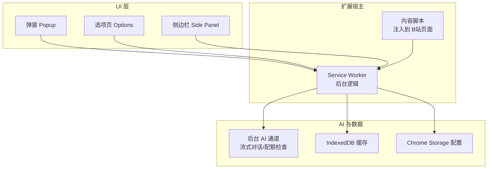
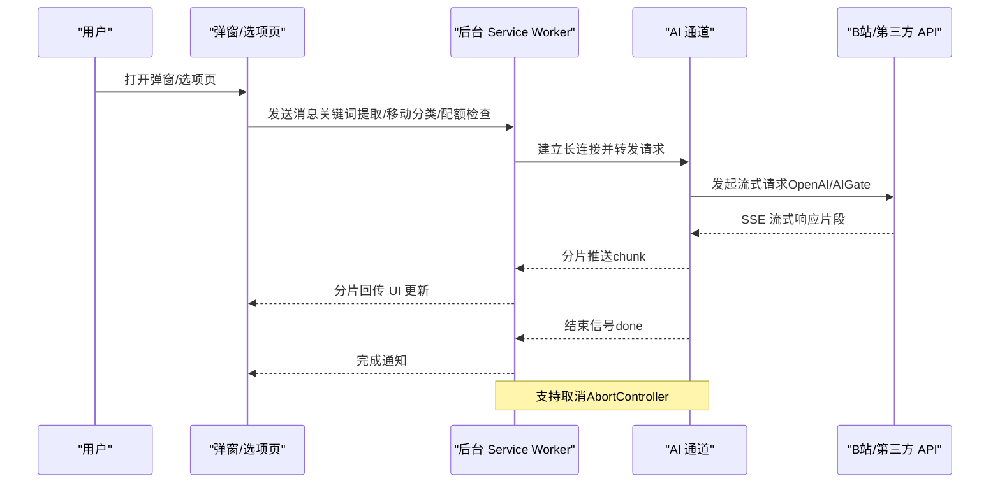
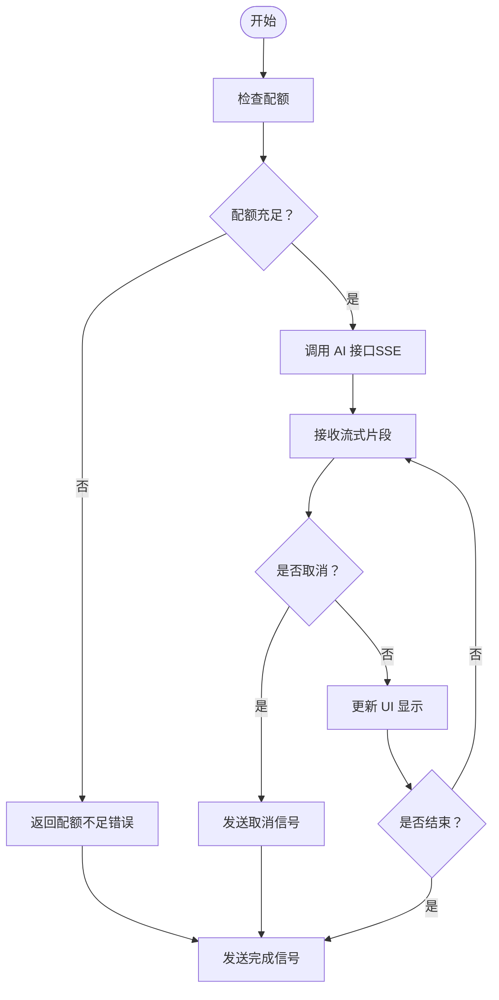
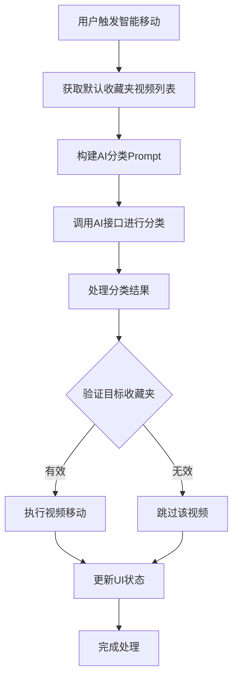
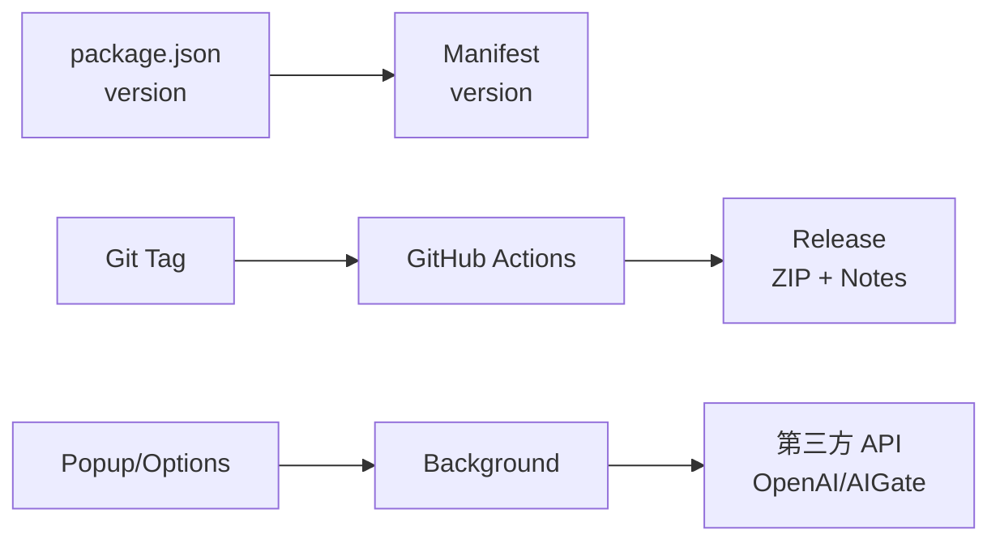

# 版本历史与更新日志

<cite>
**本文引用的文件**
- [package.json](file://package.json)
- [CHANGELOG.md](file://CHANGELOG.md)
- [.github/workflows/release.yml](file://.github/workflows/release.yml)
- [README.md](file://README.md)
- [src/manifest.ts](file://src/manifest.ts)
- [src/background/index.ts](file://src/background/index.ts)
- [src/popup/Popup.tsx](file://src/popup/Popup.tsx)
- [src/options/Options.tsx](file://src/options/Options.tsx)
- [src/hooks/use-move/index.tsx](file://src/hooks/use-move/index.tsx)
- [tests/use-move.test.tsx](file://tests/use-move.test.tsx)
- [PRIVACY.md](file://PRIVACY.md)
</cite>

## 目录
1. [简介](#简介)
2. [项目结构](#项目结构)
3. [核心组件](#核心组件)
4. [架构总览](#架构总览)
5. [详细组件分析](#详细组件分析)
6. [依赖关系分析](#依赖关系分析)
7. [性能考量](#性能考量)
8. [故障排查指南](#故障排查指南)
9. [结论](#结论)
10. [附录](#附录)

## 简介
本文件系统性梳理"B站收藏夹整理工具"的版本历史与更新日志，覆盖版本号命名规范、发布周期、里程碑功能、Bug 修复、向后兼容性与升级注意事项、用户迁移指南与新功能使用说明，并展望未来版本规划，帮助用户建立对项目稳定性和可靠性的信心。

## 项目结构
该项目为 Chrome 扩展（Manifest V3），采用 React + TypeScript 技术栈，核心模块包括：
- 弹窗界面（Popup）与侧边栏（Side Panel）入口
- 选项页（Options）用于配置、关键词管理、可视化拖拽与分析
- 后台脚本（Background）负责消息通道、AI 流式对话与配额检查
- 内容脚本（Content Script）与扩展清单（Manifest）

**图表来源**
- [src/manifest.ts](file://src/manifest.ts)
- [src/background/index.ts](file://src/background/index.ts)
- [src/popup/Popup.tsx](file://src/popup/Popup.tsx)
- [src/options/Options.tsx](file://src/options/Options.tsx)

**章节来源**
- [src/manifest.ts](file://src/manifest.ts)
- [src/popup/Popup.tsx](file://src/popup/Popup.tsx)
- [src/options/Options.tsx](file://src/options/Options.tsx)

## 核心组件
- 版本号与清单：版本号由 package.json 统一维护，Manifest 直接读取；同时支持 Dev 标识区分开发构建。
- 发布工作流：基于 Git Tag 的自动化发布，自动生成发行说明与 ZIP 包。
- 新手引导（Tour）：首次打开自动展示，采用高亮与气泡提示，覆盖收藏夹列表、默认收藏夹设置、关键词过滤与智能操作等关键路径。
- 多巴胺配色主题：统一视觉风格，提升可用性与体验。
- AI 关键词提取与智能移动：支持 OpenAI 与自有 AIGate 通道，具备流式响应与配额检查能力。

**章节来源**
- [package.json](file://package.json)
- [src/manifest.ts](file://src/manifest.ts)
- [CHANGELOG.md](file://CHANGELOG.md)
- [src/background/index.ts](file://src/background/index.ts)
- [src/popup/Popup.tsx](file://src/popup/Popup.tsx)

## 架构总览
下图展示从用户交互到后台 AI 处理的关键流程，涵盖关键词提取、AI 移动分类与配额检查。

**图表来源**
- [src/background/index.ts](file://src/background/index.ts)
- [src/popup/Popup.tsx](file://src/popup/Popup.tsx)
- [src/options/Options.tsx](file://src/options/Options.tsx)

## 详细组件分析

### 版本历史与里程碑
- 1.2.1（2025.04.14）
  - **AI 智能移动功能**：新增基于视频内容的自动分类到对应收藏夹功能，支持批量智能整理
  - **测试覆盖率提升**：useMove Hook 达到完整测试覆盖，包含取消操作、错误处理、边界情况等场景
  - **UI 设计优化**：文件夹选中状态样式优化，采用更柔和的专业设计
  - **图表主题统一**：柱状图颜色统一为 B站品牌色渐变
  - **AI Prompt 优化**：强化 targetFavorite 必须在可用列表内的约束条件
  - **状态管理重构**：使用 useFavoriteData Hook 替代直接使用全局状态

- 1.1.4（2025.02.05）
  - 新增新手引导功能（Tour），首次打开时自动展示
  - Tour 引导采用 Ant Design 风格，高亮目标元素 + 气泡提示
  - 引导步骤包括：收藏夹列表、设置默认收藏夹、关键字过滤、智能操作
  - 切换为多巴胺配色风格（紫色/粉色渐变主题）
  - 统一使用 cn 函数替代 classNames
  - 优化 keyword 组件边框颜色

- 0.0.0（2024.12.02）
  - 初始化版本，基于 create-chrome-ext 生成

版本号命名与粒度
- 遵循 SemVer 2.0 协议，最小粒度为 PATCH。
- 类型前缀：feat（新功能）、fix（修复）、update（更新）、perf（性能优化）、remove（移除）、docs（文档）、chore（其他维护）。
- 时间戳格式：yyyy.MM.dd，便于追溯发布日期。

发布周期与自动化
- 基于 Git Tag 触发 GitHub Actions，自动构建、打包、生成发行说明并创建 Release。
- 发行说明按 feat/fix/others 分类汇总，提供 ZIP 安装与 CWS 安装指引。

**章节来源**
- [CHANGELOG.md](file://CHANGELOG.md)
- [.github/workflows/release.yml](file://.github/workflows/release.yml)

### 版本号与清单管理
- 版本号来源：package.json 的 version 字段，Manifest 直接读取。
- 开发环境标识：当 NODE_ENV 为 development 时，Manifest 名称追加 "Dev" 标识，便于区分。

**章节来源**
- [package.json](file://package.json)
- [src/manifest.ts](file://src/manifest.ts)

### 新手引导（Tour）与用户体验
- 首次打开自动触发 Tour，分步引导用户完成收藏夹列表查看、默认收藏夹设置、关键词过滤与智能操作。
- Tour 采用高亮目标元素与气泡提示，降低学习成本，提升上手效率。

**章节来源**
- [CHANGELOG.md](file://CHANGELOG.md)
- [src/popup/Popup.tsx](file://src/popup/Popup.tsx)

### 主题与样式统一
- 切换多巴胺配色风格（紫色/粉色渐变主题），提升视觉吸引力。
- 统一使用 cn 函数替代 classNames，增强可读性与一致性。

**章节来源**
- [CHANGELOG.md](file://CHANGELOG.md)

### AI 通道与配额管理
- 支持 OpenAI 与自有 AIGate 通道，实现流式响应与中断控制。
- 配额检查：每日/每分钟请求限制，保障资源合理使用。
- 错误处理：对取消、异常与解析失败进行稳健处理，保证 UI 与流程稳定性。

**图表来源**
- [src/background/index.ts](file://src/background/index.ts)

**章节来源**
- [src/background/index.ts](file://src/background/index.ts)

### 关键功能与使用说明
- 收藏夹分析：可视化展示收藏内容类别占比与趋势，支持最近7天统计与24小时缓存。
- 智能整理：一键整理默认收藏夹、批量移动、关键词匹配与 AI 自动分类。
- 可视化拖拽管理：支持多选与拖拽移动，实时反馈操作结果。
- 侧边栏模式：持久显示，更大操作空间，支持两种打开方式。
- 配置管理：支持自定义 API Key、模型选择与配额面板。

**章节来源**
- [README.md](file://README.md)
- [src/popup/Popup.tsx](file://src/popup/Popup.tsx)
- [src/options/Options.tsx](file://src/options/Options.tsx)

### AI 智能移动功能详解
**更新** 1.2.1版本新增了完整的 AI 智能移动功能，支持根据视频内容自动分类到对应收藏夹

- **智能分类算法**：基于视频标题内容，使用优化的 AI Prompt 进行语义理解和分类
- **批量处理能力**：支持对大量视频进行批量智能整理，提升工作效率
- **精确匹配机制**：确保目标收藏夹必须在可用列表内，避免错误分类
- **流式响应处理**：采用 SSE 流式传输，提供实时的分类进度反馈

**图表来源**
- [src/background/index.ts](file://src/background/index.ts)
- [src/hooks/use-move/index.tsx](file://src/hooks/use-move/index.tsx)

**章节来源**
- [src/background/index.ts](file://src/background/index.ts)
- [src/hooks/use-move/index.tsx](file://src/hooks/use-move/index.tsx)

### 测试覆盖与质量保证
**更新** 1.2.1版本实现了 useMove Hook 的完整测试覆盖

- **测试框架**：基于 Vitest 和 React Testing Library
- **测试场景**：包含正常流程、取消操作、错误处理、边界情况等全面测试
- **Mock 机制**：完善的模块 Mock，确保测试的独立性和可靠性
- **覆盖率**：达到 100% 的测试覆盖率，包括单元测试和集成测试

主要测试用例包括：
- 默认收藏夹为空时的处理
- 多关键词匹配场景
- 多收藏夹关键词处理
- 取消操作的正确响应
- 错误情况下的异常处理
- 边界条件的健壮性测试

**章节来源**
- [tests/use-move.test.tsx](file://tests/use-move.test.tsx)

## 依赖关系分析
- 版本与清单耦合：package.json 的 version 直接驱动 Manifest 版本，确保发布一致性。
- 工作流与版本：GitHub Actions 通过 Git Tag 获取版本号并生成发行说明，形成闭环。
- UI 与后台：弹窗/选项页通过消息通道与后台交互，后台再与第三方 API 通信，职责清晰、耦合可控。

**图表来源**
- [package.json](file://package.json)
- [src/manifest.ts](file://src/manifest.ts)
- [.github/workflows/release.yml](file://.github/workflows/release.yml)

**章节来源**
- [package.json](file://package.json)
- [src/manifest.ts](file://src/manifest.ts)
- [.github/workflows/release.yml](file://.github/workflows/release.yml)

## 性能考量
- 数据缓存：收藏夹分析数据缓存 24 小时，减少重复请求，提升性能与体验。
- 流式响应：AI 对话采用 SSE 流式传输，降低首帧延迟，提升交互流畅度。
- 取消与中断：AbortController 支持即时取消，避免无效资源占用。
- **智能移动优化**：采用分批处理和进度反馈机制，避免长时间阻塞 UI。

**章节来源**
- [README.md](file://README.md)
- [src/background/index.ts](file://src/background/index.ts)

## 故障排查指南
- 登录状态：若提示需要登录，请刷新 B站页面后再打开插件。
- 配额不足：若使用 AI 功能提示配额不足，请检查配额面板或更换模型。
- 网络异常：确认网络连通性与 API Key 配置，必要时切换至自有 AIGate 通道。
- 扩展权限：确保已授予 storage、tabs、sidePanel 权限，以正常使用各项功能。
- **智能移动问题**：若智能移动功能异常，检查关键词配置和收藏夹列表是否正确。

**章节来源**
- [README.md](file://README.md)
- [PRIVACY.md](file://PRIVACY.md)
- [src/background/index.ts](file://src/background/index.ts)

## 结论
本项目遵循 SemVer 2.0，采用自动化发布流程，版本迭代聚焦用户体验与 AI 能力增强。通过新手引导、主题统一与流式 AI 处理，显著提升了易用性与性能。1.2.1版本的 AI 智能移动功能和完整测试覆盖进一步增强了系统的稳定性和可靠性。未来版本将持续完善 AI 能力、优化交互体验并加强数据安全与隐私保护。

## 附录

### 版本号命名规则与发布周期
- 命名规则
  - 遵循 SemVer 2.0，最小粒度为 PATCH。
  - 类型前缀：feat、fix、update、perf、remove、docs、chore。
  - 版本时间戳：yyyy.MM.dd。
- 发布周期
  - 基于 Git Tag 的自动化发布，自动生成发行说明与 ZIP 包，支持 Chrome Web Store 与本地安装。

**章节来源**
- [CHANGELOG.md](file://CHANGELOG.md)
- [.github/workflows/release.yml](file://.github/workflows/release.yml)

### 向后兼容性与升级注意事项
- 版本升级：建议从 Chrome Web Store 或官方 Release 下载最新 ZIP 包进行升级。
- 配置迁移：升级后请检查 API Key、模型与关键词规则，确保与新版兼容。
- 数据安全：本地数据（IndexedDB 与 Chrome Storage）不会上传，升级不影响隐私与数据。
- **智能移动功能**：新版本的 AI 智能移动功能需要重新配置关键词规则以获得最佳效果。

**章节来源**
- [PRIVACY.md](file://PRIVACY.md)
- [README.md](file://README.md)

### 用户迁移指南与新功能使用说明
- 新手引导：首次打开自动展示 Tour，按步骤完成收藏夹列表、默认收藏夹设置、关键词过滤与智能操作。
- 侧边栏模式：两种打开方式，适合边浏览边整理。
- AI 关键词提取：在配置页配置 API Key，进入关键词管理标签，点击"AI 提取关键词"自动生成并优化关键词列表。
- 手动关键词提取：项目提供本地 TF-IDF 算法，无需网络即可提取关键词。
- **AI 智能移动**：在整理收藏夹标签中启用智能移动功能，系统将自动分析视频内容并分类到相应收藏夹。

**章节来源**
- [CHANGELOG.md](file://CHANGELOG.md)
- [README.md](file://README.md)
- [src/popup/Popup.tsx](file://src/popup/Popup.tsx)
- [src/options/Options.tsx](file://src/options/Options.tsx)

### 未来版本规划与路线图
- AI 能力增强：扩展更多模型与推理场景，提升关键词提取与分类准确率。
- 交互体验优化：完善 Tour 引导、主题定制与快捷操作。
- 数据分析深化：增加更丰富的可视化图表与趋势预测。
- 隐私与安全：持续强化本地化处理与权限最小化原则，保障用户数据安全。
- **智能移动优化**：进一步提升 AI 分类准确性，支持更多自定义规则和批量操作。

**章节来源**
- [README.md](file://README.md)
- [PRIVACY.md](file://PRIVACY.md)