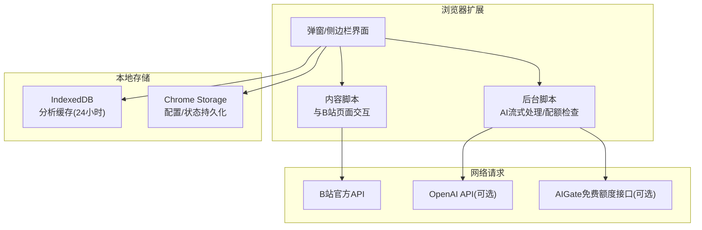
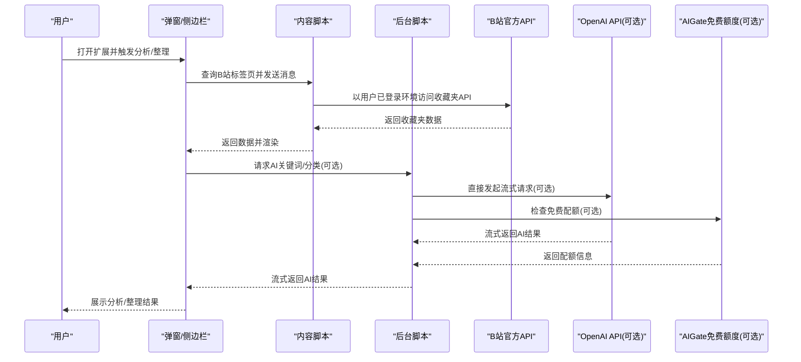
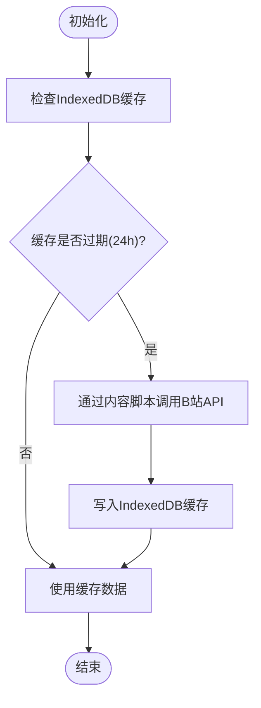
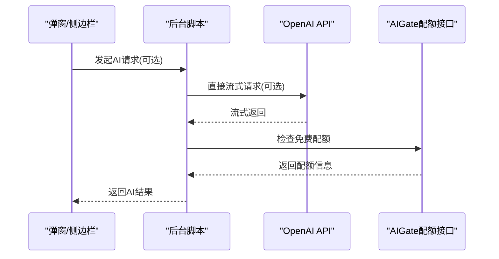
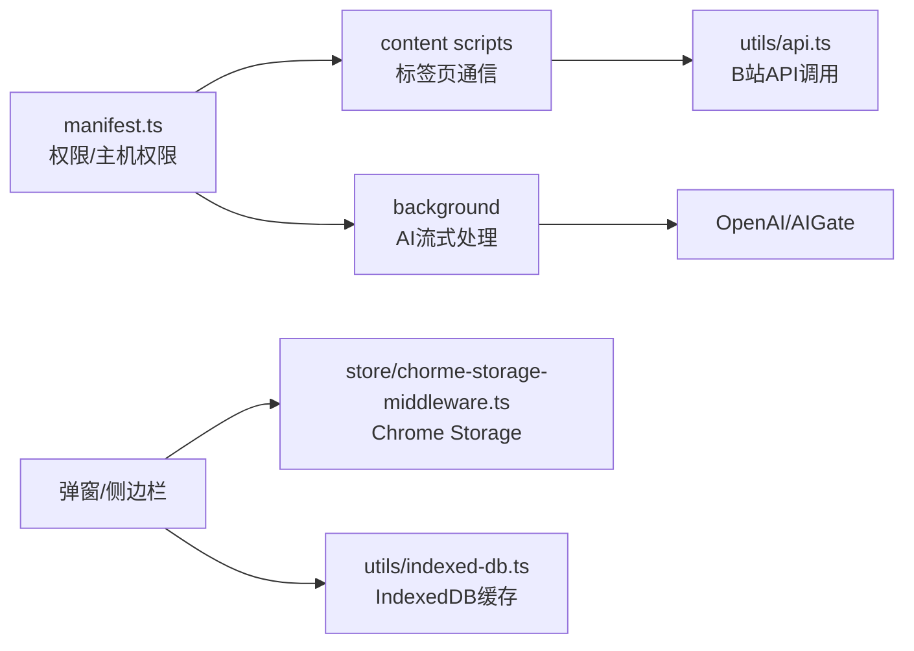

# 隐私政策与数据安全

<cite>
**本文引用的文件**
- [PRIVACY.md](file://PRIVACY.md)
- [README.md](file://README.md)
- [src/manifest.ts](file://src/manifest.ts)
- [src/utils/api.ts](file://src/utils/api.ts)
- [src/utils/indexed-db.ts](file://src/utils/indexed-db.ts)
- [src/utils/tab.ts](file://src/utils/tab.ts)
- [src/store/chorme-storage-middleware.ts](file://src/store/chorme-storage-middleware.ts)
- [src/background/index.ts](file://src/background/index.ts)
- [src/options/components/setting/util.ts](file://src/options/components/setting/util.ts)
</cite>

## 目录
1. [简介](#简介)
2. [项目结构](#项目结构)
3. [核心组件](#核心组件)
4. [架构总览](#架构总览)
5. [详细组件分析](#详细组件分析)
6. [依赖关系分析](#依赖关系分析)
7. [性能考量](#性能考量)
8. [故障排查指南](#故障排查指南)
9. [结论](#结论)
10. [附录](#附录)

## 简介
本文件面向“B站收藏夹整理工具”项目，系统阐述隐私政策与数据安全相关内容，重点说明：
- 对用户隐私的保护承诺与数据处理原则
- 数据存储策略（本地存储与云端传输的边界）
- 用户数据的使用范围与目的
- 网络请求的安全保障（Bilibili官方API与OpenAI API的访问控制）
- 数据删除与账户注销的处理方式
- 隐私政策的更新机制与用户权利保障

本说明严格依据项目现有实现与隐私声明文件进行归纳总结，确保用户充分了解自身数据如何被处理与保护。

## 项目结构
围绕隐私与数据安全的关键模块如下：
- 配置与权限：manifest中声明的权限与主机权限
- 本地存储：IndexedDB用于分析数据缓存；Chrome Storage用于用户配置与状态持久化
- 网络请求：仅访问B站官方API与可选的OpenAI/AIGate API
- 背景逻辑：AI流式请求的后台处理与配额检查
- 工具与上下文：标签页通信、Cookie解析、全局状态上下文

图示来源
- [src/manifest.ts:39-46](file://src/manifest.ts#L39-L46)
- [src/utils/api.ts:117-174](file://src/utils/api.ts#L117-L174)
- [src/utils/indexed-db.ts:15-124](file://src/utils/indexed-db.ts#L15-L124)
- [src/store/chorme-storage-middleware.ts:4-34](file://src/store/chorme-storage-middleware.ts#L4-L34)
- [src/background/index.ts:315-392](file://src/background/index.ts#L315-L392)

章节来源
- [src/manifest.ts:39-46](file://src/manifest.ts#L39-L46)
- [src/utils/api.ts:117-174](file://src/utils/api.ts#L117-L174)
- [src/utils/indexed-db.ts:15-124](file://src/utils/indexed-db.ts#L15-L124)
- [src/store/chorme-storage-middleware.ts:4-34](file://src/store/chorme-storage-middleware.ts#L4-L34)
- [src/background/index.ts:315-392](file://src/background/index.ts#L315-L392)

## 核心组件
- 隐私声明与政策
  - 明确不收集个人身份信息、不上传用户数据至第三方服务器、所有数据仅本地存储、网络请求仅访问官方API等原则
- 本地存储组件
  - IndexedDB：分析数据缓存（24小时有效期）
  - Chrome Storage：用户配置与状态持久化（关键词规则、默认收藏夹ID、AI配置、Cookie等）
- 网络请求组件
  - B站官方API：仅在用户已登录B站的浏览器环境中发起，访问范围限于用户本人收藏夹数据
  - OpenAI API/AIGate：可选功能，直接从浏览器发起，不经过扩展中转服务器
- 背景逻辑组件
  - AI流式请求处理、配额检查、消息通道与取消机制
- 工具与上下文
  - 标签页通信、Cookie解析、全局状态上下文类型定义

章节来源
- [PRIVACY.md:9-76](file://PRIVACY.md#L9-L76)
- [src/utils/indexed-db.ts:15-124](file://src/utils/indexed-db.ts#L15-L124)
- [src/store/chorme-storage-middleware.ts:4-34](file://src/store/chorme-storage-middleware.ts#L4-L34)
- [src/utils/api.ts:117-174](file://src/utils/api.ts#L117-L174)
- [src/background/index.ts:315-392](file://src/background/index.ts#L315-L392)
- [src/utils/tab.ts:84-92](file://src/utils/tab.ts#L84-L92)

## 架构总览
下图展示了扩展在本地与云端之间的数据边界与流向，强调“仅本地处理、必要时访问官方API”的原则。

图示来源
- [src/utils/api.ts:298-319](file://src/utils/api.ts#L298-L319)
- [src/utils/api.ts:176-232](file://src/utils/api.ts#L176-L232)
- [src/background/index.ts:315-392](file://src/background/index.ts#L315-L392)
- [src/utils/tab.ts:65-82](file://src/utils/tab.ts#L65-L82)

## 详细组件分析

### 本地存储策略与数据边界
- IndexedDB缓存
  - 用途：缓存分析数据，减少重复网络请求
  - 生命周期：24小时有效期，过期自动失效
  - 存储键：按收藏夹ID生成唯一键，避免跨用户数据污染
- Chrome Storage持久化
  - 持久化字段：关键词规则、活动标签、Cookie、AI配置、默认收藏夹ID
  - 仅本地存储：不上传至任何服务器
- Cookie与标签页通信
  - 通过标签页消息传递获取用户登录态，不存储Cookie到本地
  - 设备ID：首次使用生成随机ID并存储于本地，用于配额检查等场景

图示来源
- [src/utils/indexed-db.ts:118-123](file://src/utils/indexed-db.ts#L118-L123)
- [src/utils/api.ts:285-319](file://src/utils/api.ts#L285-L319)

章节来源
- [src/utils/indexed-db.ts:15-124](file://src/utils/indexed-db.ts#L15-L124)
- [src/store/chorme-storage-middleware.ts:4-34](file://src/store/chorme-storage-middleware.ts#L4-L34)
- [src/utils/tab.ts:84-92](file://src/utils/tab.ts#L84-L92)

### 网络请求与访问控制
- B站官方API
  - 仅访问公开接口，且在用户已登录B站的浏览器环境中发起
  - 访问范围限于用户本人收藏夹数据，不涉及其他用户数据
- OpenAI API（可选）
  - 直接从浏览器发起，扩展不作为中转服务器
  - 用户可随时关闭该功能
- AIGate免费额度（可选）
  - 通过后台脚本检查配额，使用设备ID进行识别
  - 仅用于免费额度校验，不存储用户信息

图示来源
- [src/utils/api.ts:234-263](file://src/utils/api.ts#L234-L263)
- [src/background/index.ts:351-375](file://src/background/index.ts#L351-L375)

章节来源
- [src/utils/api.ts:117-174](file://src/utils/api.ts#L117-L174)
- [src/background/index.ts:315-392](file://src/background/index.ts#L315-L392)

### 数据使用范围与目的
- 收藏夹分析与整理
  - 仅用于分析与整理用户本人收藏夹内容
  - 不收集个人身份信息、不收集浏览历史、不收集使用行为统计
- AI关键词提取与智能整理
  - 仅基于视频标题进行关键词提取与分类
  - 用户可选择关闭该功能
- 配置与偏好
  - 仅存储用户在扩展内的配置与偏好（如API Key、模型选择、关键词规则等）

章节来源
- [PRIVACY.md:9-76](file://PRIVACY.md#L9-L76)
- [src/options/components/setting/util.ts:4-22](file://src/options/components/setting/util.ts#L4-L22)

### 数据删除与账户注销
- 用户权利
  - 查看权：可随时查看浏览器中存储的所有数据
  - 删除权：可通过清除浏览器数据或卸载扩展删除本地存储
  - 退出权：可随时停止使用并通过扩展管理页面卸载
- 实现路径
  - 清除浏览器数据：删除IndexedDB与Chrome Storage中的所有数据
  - 卸载扩展：移除所有权限与存储

章节来源
- [PRIVACY.md:77-83](file://PRIVACY.md#L77-L83)
- [src/utils/indexed-db.ts:102-113](file://src/utils/indexed-db.ts#L102-L113)
- [src/store/chorme-storage-middleware.ts:33-34](file://src/store/chorme-storage-middleware.ts#L33-L34)

### 隐私政策更新机制与用户权利保障
- 更新机制
  - 项目承诺会不时更新隐私声明，重大变更时通过扩展更新或适当方式通知
  - 建议用户定期查阅以了解最新信息
- 联系方式
  - 通过GitHub Issues进行反馈与沟通
- 儿童隐私
  - 不针对13岁以下儿童设计，若无意中收集将及时删除

章节来源
- [PRIVACY.md:89-104](file://PRIVACY.md#L89-L104)
- [README.md:134-143](file://README.md#L134-L143)

## 依赖关系分析
- 权限与主机权限
  - 权限：storage、tabs、sidePanel
  - 主机权限：B站API、OpenAI API、星火大模型、AIGate相关域名
- 组件耦合
  - 内容脚本与后台脚本通过消息通道通信
  - 本地存储与全局状态通过中间件进行持久化
  - IndexedDB与API层配合实现缓存与去重

图示来源
- [src/manifest.ts:39-46](file://src/manifest.ts#L39-L46)
- [src/utils/api.ts:117-174](file://src/utils/api.ts#L117-L174)
- [src/store/chorme-storage-middleware.ts:4-34](file://src/store/chorme-storage-middleware.ts#L4-L34)
- [src/utils/indexed-db.ts:15-124](file://src/utils/indexed-db.ts#L15-L124)

章节来源
- [src/manifest.ts:39-46](file://src/manifest.ts#L39-L46)
- [src/utils/api.ts:117-174](file://src/utils/api.ts#L117-L174)
- [src/store/chorme-storage-middleware.ts:4-34](file://src/store/chorme-storage-middleware.ts#L4-L34)
- [src/utils/indexed-db.ts:15-124](file://src/utils/indexed-db.ts#L15-L124)

## 性能考量
- 缓存策略
  - IndexedDB缓存24小时，减少重复网络请求，提升性能
- 流式传输
  - AI请求采用流式传输，降低首屏等待时间
- 存储最小化
  - 仅持久化必要的配置与状态，避免存储敏感信息

章节来源
- [src/utils/indexed-db.ts:118-123](file://src/utils/indexed-db.ts#L118-L123)
- [src/background/index.ts:197-247](file://src/background/index.ts#L197-L247)
- [src/store/chorme-storage-middleware.ts:22-34](file://src/store/chorme-storage-middleware.ts#L22-L34)

## 故障排查指南
- 无法获取收藏夹数据
  - 确认已在B站页面登录，且扩展已获取tabs权限
  - 检查是否有B站标签页处于打开状态
- AI功能不可用
  - 若使用OpenAI/AIGate，确认已正确配置API Key与模型
  - 检查网络连通性与配额情况
- 数据未清理
  - 通过浏览器扩展管理页面卸载扩展或清除浏览器数据

章节来源
- [src/utils/tab.ts:65-82](file://src/utils/tab.ts#L65-L82)
- [src/background/index.ts:351-375](file://src/background/index.ts#L351-L375)
- [PRIVACY.md:77-83](file://PRIVACY.md#L77-L83)

## 结论
本扩展严格遵循“本地优先、最小化数据”的隐私原则：
- 不收集个人身份信息与浏览历史
- 所有数据仅存储在本地浏览器中
- 网络请求仅访问官方API，且可选功能直接从浏览器发起
- 用户拥有查看、删除与退出的权利
- 隐私政策将根据需要进行更新，并通过扩展渠道通知用户

## 附录
- 术语说明
  - “本地存储”：指浏览器本地的IndexedDB与Chrome Storage
  - “官方API”：指B站与第三方服务提供的公开API接口
  - “可选功能”：指基于OpenAI/AIGate的AI关键词提取与智能整理功能