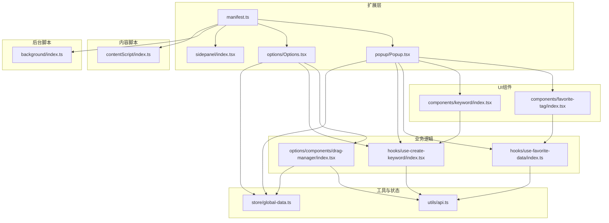
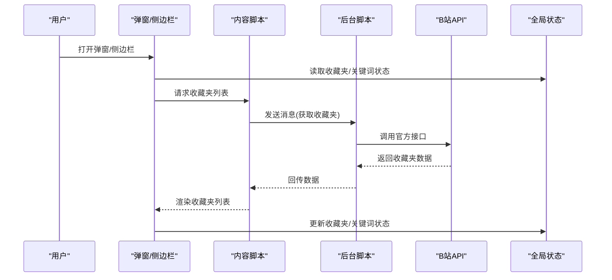
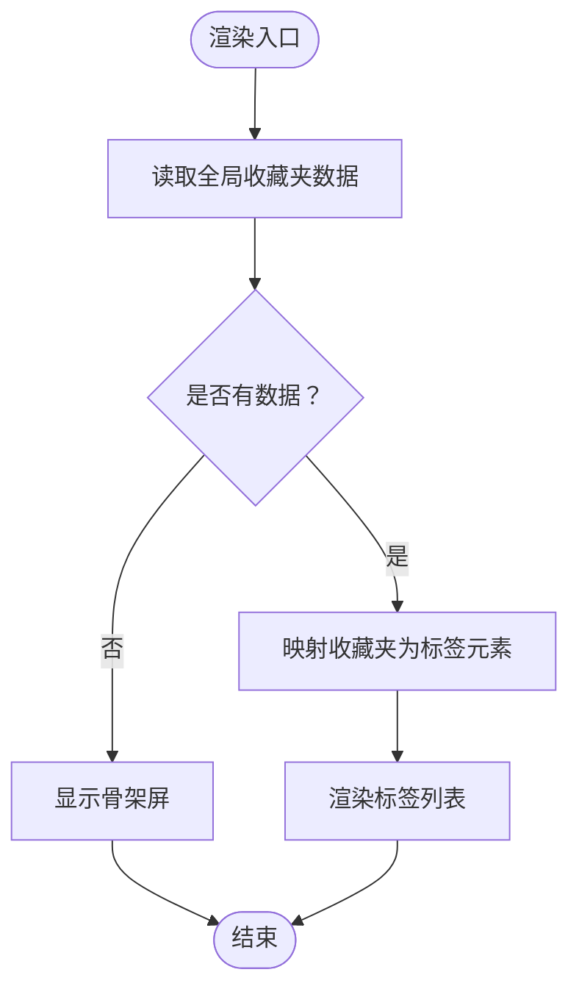
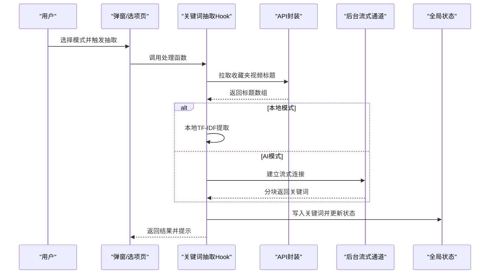
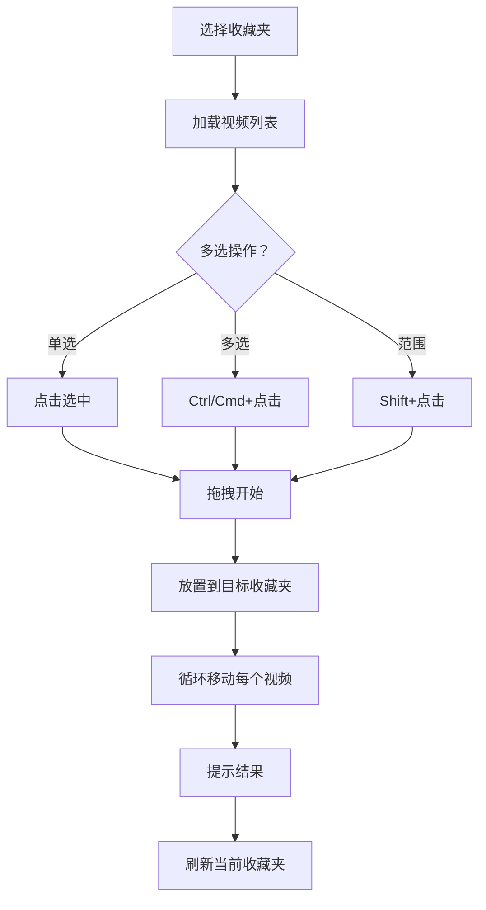
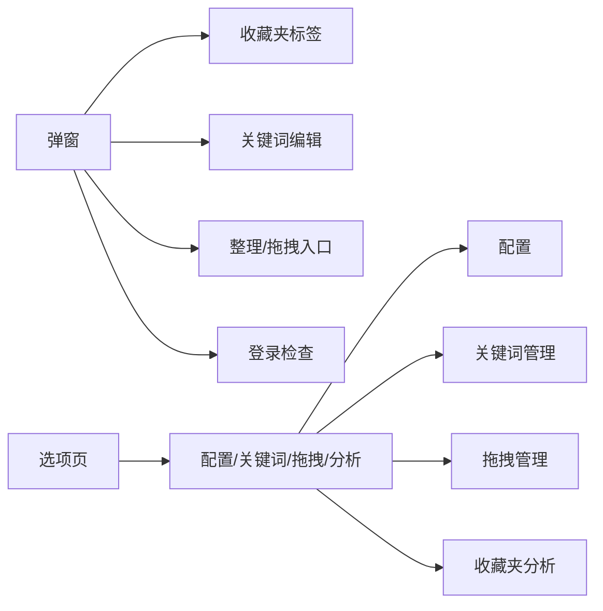
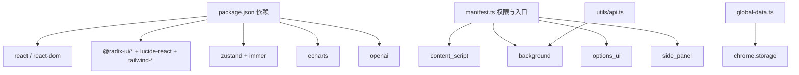

# 项目介绍

<cite>
**本文引用的文件**
- [README.md](file://README.md)
- [package.json](file://package.json)
- [src/manifest.ts](file://src/manifest.ts)
- [src/popup/Popup.tsx](file://src/popup/Popup.tsx)
- [src/options/Options.tsx](file://src/options/Options.tsx)
- [src/components/favorite-tag/index.tsx](file://src/components/favorite-tag/index.tsx)
- [src/components/keyword/index.tsx](file://src/components/keyword/index.tsx)
- [src/hooks/use-favorite-data/index.ts](file://src/hooks/use-favorite-data/index.ts)
- [src/hooks/use-create-keyword/index.tsx](file://src/hooks/use-create-keyword/index.tsx)
- [src/utils/api.ts](file://src/utils/api.ts)
- [src/popup/components/auto-create-keyword/index.tsx](file://src/popup/components/auto-create-keyword/index.tsx)
- [src/popup/components/drag-manager-button/index.tsx](file://src/popup/components/drag-manager-button/index.tsx)
- [src/options/components/drag-manager/index.tsx](file://src/options/components/drag-manager/index.tsx)
- [PRIVACY.md](file://PRIVACY.md)
- [src/store/global-data.ts](file://src/store/global-data.ts)
</cite>

## 目录
1. [引言](#引言)
2. [项目结构](#项目结构)
3. [核心组件](#核心组件)
4. [架构总览](#架构总览)
5. [详细组件分析](#详细组件分析)
6. [依赖关系分析](#依赖关系分析)
7. [性能考虑](#性能考虑)
8. [故障排查指南](#故障排查指南)
9. [结论](#结论)
10. [附录](#附录)

## 引言
本项目是面向B站用户的Chrome扩展工具，旨在帮助用户高效管理与整理收藏夹内容。它通过“收藏内容分析+智能整理+可视化拖拽管理”的一体化能力，解决用户在面对海量收藏内容时的“难以分类、难以查找、难以维护”的痛点。项目强调隐私保护与本地化处理，所有数据仅存储于本地浏览器，不上传至任何第三方服务器；同时提供AI关键词抽取与AI智能整理能力，降低人工成本，提升整理效率。

本工具适合以下用户群体：
- 经常使用B站收藏功能的用户，希望系统化管理收藏内容；
- 收藏夹数量较多、内容混杂，需要自动化分类与批量整理的用户；
- 希望通过可视化界面直观拖拽完成批量移动的用户；
- 对隐私与本地处理有较高要求的用户；
- 希望借助AI能力自动抽取关键词并进行智能归类的用户。

设计理念与用户体验考量：
- 低门槛：通过弹窗与侧边栏双入口，满足不同场景使用习惯；
- 高效性：提供一键整理、批量移动、AI关键词抽取与AI智能整理；
- 可视化：拖拽式界面，支持多选与范围选择，直观反馈操作结果；
- 隐私优先：所有数据本地存储，不上传，网络请求仅限官方API与可选AI服务；
- 可扩展：模块化组件与全局状态管理，便于后续功能迭代。

市场定位与竞争优势：
- 定位为“轻量、专注、隐私优先”的B站收藏夹管理工具；
- 与同类工具相比，具备更强的AI能力（关键词抽取与智能整理）、更完善的可视化拖拽管理体验、以及严格的隐私保护策略；
- 提供侧边栏模式，兼顾“边看边整理”的高频使用场景。

发展愿景与长期规划：
- 持续优化AI关键词抽取与智能整理效果，引入更多模型与适配；
- 扩展分析维度（如按UP主、类型、时间趋势等），提供更丰富的可视化图表；
- 增强与B站生态的联动（如与历史记录、关注UP主等结合），形成更完整的“内容资产管理”方案；
- 探索离线与增量同步能力，进一步提升在弱网环境下的可用性。

**章节来源**
- [README.md:1-188](file://README.md#L1-L188)
- [PRIVACY.md:1-104](file://PRIVACY.md#L1-L104)

## 项目结构
项目采用Chrome Extension V3架构，前端基于React + TypeScript，UI组件库采用Radix UI与Tailwind CSS，状态管理使用Zustand（Immer中间件 + Chrome Storage中间件），并通过content script与background service worker实现与B站页面及官方API的交互。

- manifest定义了扩展元信息、权限、背景脚本、内容脚本、侧边栏页面与选项页；
- popup与options分别提供弹窗与选项页的主界面；
- components提供可复用UI组件（收藏夹标签、关键词编辑等）；
- hooks封装业务逻辑（收藏夹数据获取、关键词抽取、AI抽取流程等）；
- utils提供API调用、消息传递、IndexedDB缓存、参数解析等基础设施；
- store提供全局状态与本地持久化；
- workers用于分析类任务的独立线程处理（如图表计算）。

**图示来源**
- [src/manifest.ts:1-55](file://src/manifest.ts#L1-L55)
- [src/popup/Popup.tsx:1-80](file://src/popup/Popup.tsx#L1-L80)
- [src/options/Options.tsx:1-91](file://src/options/Options.tsx#L1-L91)
- [src/components/favorite-tag/index.tsx:1-77](file://src/components/favorite-tag/index.tsx#L1-L77)
- [src/components/keyword/index.tsx:1-32](file://src/components/keyword/index.tsx#L1-L32)
- [src/hooks/use-favorite-data/index.ts:1-64](file://src/hooks/use-favorite-data/index.ts#L1-L64)
- [src/hooks/use-create-keyword/index.tsx:1-304](file://src/hooks/use-create-keyword/index.tsx#L1-L304)
- [src/options/components/drag-manager/index.tsx:1-396](file://src/options/components/drag-manager/index.tsx#L1-L396)
- [src/utils/api.ts:1-339](file://src/utils/api.ts#L1-L339)
- [src/store/global-data.ts:1-28](file://src/store/global-data.ts#L1-L28)

**章节来源**
- [src/manifest.ts:1-55](file://src/manifest.ts#L1-L55)
- [package.json:1-91](file://package.json#L1-L91)

## 核心组件
- 收藏夹标签组件：展示用户收藏夹列表，支持默认收藏夹标记与长按/点击交互，配合全局状态管理实现选中态与默认收藏夹标识。
- 关键词组件：提供关键词编辑区域，支持键盘事件触发输入与删除，配合关键词编辑Hook实现增删改查。
- 收藏夹数据Hook：封装获取收藏夹列表的逻辑，通过消息传递与后台脚本交互，避免直接在页面中发起跨域请求；支持缓存与加载态。
- 关键词抽取Hook：支持本地TF-IDF与AI两种抽取模式，提供批量处理与取消控制，自动写入全局状态并提示结果。
- 可视化拖拽管理：在选项页中提供左右分栏布局，左侧收藏夹列表，右侧视频列表，支持多选、Ctrl/Cmd+点击、Shift+点击、拖拽放置，实现批量移动与实时反馈。
- 全局状态与本地存储：基于Zustand + Immer + Chrome Storage中间件，统一管理关键词、收藏夹数据、AI配置、活动收藏夹ID等，保证跨页面一致性和持久化。

**章节来源**
- [src/components/favorite-tag/index.tsx:1-77](file://src/components/favorite-tag/index.tsx#L1-L77)
- [src/components/keyword/index.tsx:1-32](file://src/components/keyword/index.tsx#L1-L32)
- [src/hooks/use-favorite-data/index.ts:1-64](file://src/hooks/use-favorite-data/index.ts#L1-L64)
- [src/hooks/use-create-keyword/index.tsx:1-304](file://src/hooks/use-create-keyword/index.tsx#L1-L304)
- [src/options/components/drag-manager/index.tsx:1-396](file://src/options/components/drag-manager/index.tsx#L1-L396)
- [src/store/global-data.ts:1-28](file://src/store/global-data.ts#L1-L28)

## 架构总览
整体架构遵循Chrome Extension V3规范，采用“弹窗/侧边栏 + 内容脚本 + 后台脚本 + 本地存储”的分层设计。内容脚本负责注入与页面交互，后台脚本负责与B站官方API通信与消息转发，UI层通过React组件与全局状态驱动，工具层提供API封装与缓存策略。

**图示来源**
- [src/manifest.ts:27-32](file://src/manifest.ts#L27-L32)
- [src/utils/api.ts:137-145](file://src/utils/api.ts#L137-L145)
- [src/hooks/use-favorite-data/index.ts:32-52](file://src/hooks/use-favorite-data/index.ts#L32-L52)
- [src/store/global-data.ts:6-25](file://src/store/global-data.ts#L6-L25)

## 详细组件分析

### 收藏夹标签组件分析
该组件负责渲染用户收藏夹列表，支持默认收藏夹标记与交互反馈。其核心逻辑包括：
- 通过全局状态读取收藏夹数据与活动收藏夹ID；
- 使用鼠标事件处理长按与点击，结合骨架屏提升首次加载体验；
- 将收藏夹数据映射为可点击标签，支持选中态高亮与默认收藏夹星标。

**图示来源**
- [src/components/favorite-tag/index.tsx:13-77](file://src/components/favorite-tag/index.tsx#L13-L77)
- [src/hooks/use-favorite-data/index.ts:23-61](file://src/hooks/use-favorite-data/index.ts#L23-L61)

**章节来源**
- [src/components/favorite-tag/index.tsx:1-77](file://src/components/favorite-tag/index.tsx#L1-L77)
- [src/hooks/use-favorite-data/index.ts:1-64](file://src/hooks/use-favorite-data/index.ts#L1-L64)

### 关键词抽取与管理分析
关键词抽取支持三种模式：本地TF-IDF、AI抽取（可选自定义模型或免费通道）、手动输入。其处理流程如下：
- 本地模式：拉取默认收藏夹全部视频标题，使用本地算法提取Top-N关键词，写入全局状态；
- AI模式：构建系统提示词与用户输入，通过后台流式通道与AI服务交互，逐块解析并写入全局状态；
- 批量处理：遍历所有收藏夹，记录成功/失败计数，统一提示结果；
- 取消控制：AbortController支持用户中断操作。

**图示来源**
- [src/hooks/use-create-keyword/index.tsx:191-284](file://src/hooks/use-create-keyword/index.tsx#L191-L284)
- [src/utils/api.ts:285-319](file://src/utils/api.ts#L285-L319)
- [src/utils/api.ts:176-232](file://src/utils/api.ts#L176-L232)

**章节来源**
- [src/hooks/use-create-keyword/index.tsx:1-304](file://src/hooks/use-create-keyword/index.tsx#L1-L304)
- [src/utils/api.ts:1-339](file://src/utils/api.ts#L1-L339)

### 可视化拖拽管理分析
拖拽管理提供“收藏夹列表-视频列表”的双栏界面，支持：
- 选择收藏夹后加载对应视频列表；
- 多选支持：普通点击、Ctrl/Cmd+点击切换、Shift+点击范围选择；
- 拖拽放置：将选中视频批量移动到目标收藏夹；
- 实时反馈：移动中遮罩提示、成功/失败计数提示、移动后刷新当前收藏夹。

**图示来源**
- [src/options/components/drag-manager/index.tsx:77-201](file://src/options/components/drag-manager/index.tsx#L77-L201)
- [src/options/components/drag-manager/index.tsx:115-193](file://src/options/components/drag-manager/index.tsx#L115-L193)

**章节来源**
- [src/options/components/drag-manager/index.tsx:1-396](file://src/options/components/drag-manager/index.tsx#L1-L396)

### 弹窗与选项页集成分析
弹窗与选项页作为主要交互入口，分别承载不同的功能组合：
- 弹窗：收藏夹标签、关键词编辑、一键整理、AI整理、拖拽管理入口、登录检查与提示；
- 选项页：配置、关键词管理、可视化拖拽管理、收藏夹数据分析。

**图示来源**
- [src/popup/Popup.tsx:14-79](file://src/popup/Popup.tsx#L14-L79)
- [src/options/Options.tsx:12-87](file://src/options/Options.tsx#L12-L87)

**章节来源**
- [src/popup/Popup.tsx:1-80](file://src/popup/Popup.tsx#L1-L80)
- [src/options/Options.tsx:1-91](file://src/options/Options.tsx#L1-L91)

## 依赖关系分析
- 依赖管理：使用pnpm管理依赖，核心运行时依赖React、Radix UI、Tailwind CSS、Zustand、ECharts等；
- 扩展清单：声明权限（storage、tabs、sidePanel）、主机权限（B站与AI服务域名）、内容脚本与后台脚本、选项页与侧边栏路径；
- 状态持久化：全局状态通过Chrome Storage中间件持久化，避免刷新丢失；
- 网络请求：仅访问B站官方API与可选AI服务，且通过后台脚本与消息通道实现，避免页面直接跨域。

**图示来源**
- [package.json:29-58](file://package.json#L29-L58)
- [src/manifest.ts:39-54](file://src/manifest.ts#L39-L54)
- [src/store/global-data.ts:6-25](file://src/store/global-data.ts#L6-L25)
- [src/utils/api.ts:137-145](file://src/utils/api.ts#L137-L145)

**章节来源**
- [package.json:1-91](file://package.json#L1-L91)
- [src/manifest.ts:1-55](file://src/manifest.ts#L1-L55)
- [src/store/global-data.ts:1-28](file://src/store/global-data.ts#L1-L28)

## 性能考虑
- 数据缓存：收藏夹视频列表采用IndexedDB缓存，带过期时间（默认10分钟），减少重复请求，提升加载速度；
- 懒加载与骨架屏：收藏夹标签在首次加载时使用骨架屏，改善首屏体验；
- 分页拉取：收藏夹视频分页拉取，避免一次性请求过多数据；
- 流式处理：AI抽取与AI智能整理通过流式通道逐步解析，避免阻塞UI；
- 批量操作：拖拽管理支持批量移动，减少多次网络请求；
- 本地处理：所有配置与分析数据仅在本地存储，避免云端传输带来的延迟与风险。

**章节来源**
- [src/utils/api.ts:285-319](file://src/utils/api.ts#L285-L319)
- [src/components/favorite-tag/index.tsx:63-65](file://src/components/favorite-tag/index.tsx#L63-L65)
- [src/hooks/use-create-keyword/index.tsx:107-169](file://src/hooks/use-create-keyword/index.tsx#L107-L169)

## 故障排查指南
- 登录状态问题：若提示需要登录，请确保已在B站页面保持登录状态，刷新B站页面后再打开插件；
- 无法加载收藏夹：检查网络连通性与B站API可用性，确认已登录且有收藏夹数据；
- AI抽取失败：检查AI配置（API Key、模型、基础URL等），或切换到本地模式；
- 拖拽移动失败：确认选择了正确的源收藏夹与目标收藏夹，检查网络状态与B站API响应；
- 侧边栏不可用：确认浏览器版本支持SidePanel，或改用弹窗模式；
- 隐私与数据：所有数据仅存储于本地浏览器，可通过清理浏览器数据或卸载扩展删除。

**章节来源**
- [README.md:101-132](file://README.md#L101-L132)
- [PRIVACY.md:19-47](file://PRIVACY.md#L19-L47)

## 结论
本项目以“隐私优先、AI增强、可视化高效”为核心价值主张，通过弹窗与侧边栏双入口、收藏夹分析、关键词抽取与AI智能整理、可视化拖拽管理等功能，有效解决了B站用户在海量收藏内容面前的管理难题。依托Chrome Extension V3架构与本地化数据处理策略，项目在保障用户隐私的同时，提供了良好的使用体验与扩展空间。未来将持续优化AI能力、增强分析维度与可视化呈现，并探索更多与B站生态的协同能力。

## 附录
- 安装与使用：支持从Chrome Web Store安装与本地安装两种方式；基本使用流程包括登录验证、收藏夹分析与整理操作；
- 隐私政策：严格遵守隐私原则，不收集任何个人数据，所有数据仅存储于本地浏览器；
- 贡献与许可：欢迎提交Issue与Pull Request，项目采用MIT开源协议。

**章节来源**
- [README.md:82-144](file://README.md#L82-L144)
- [PRIVACY.md:1-104](file://PRIVACY.md#L1-L104)