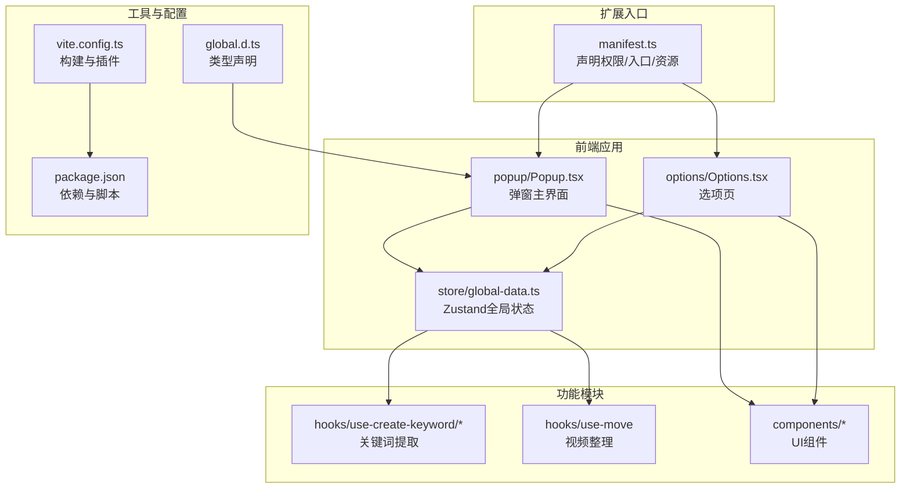
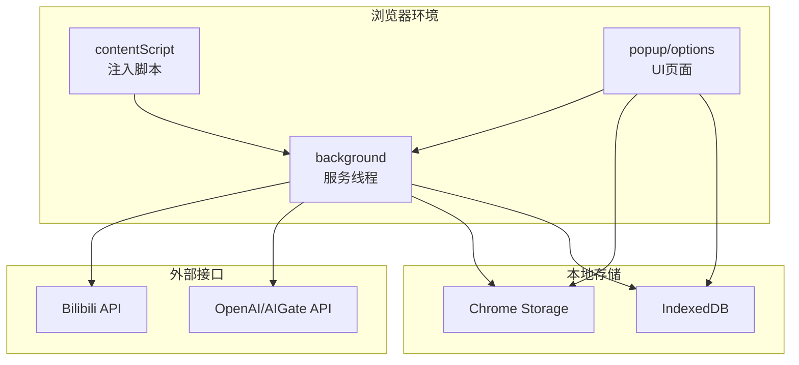
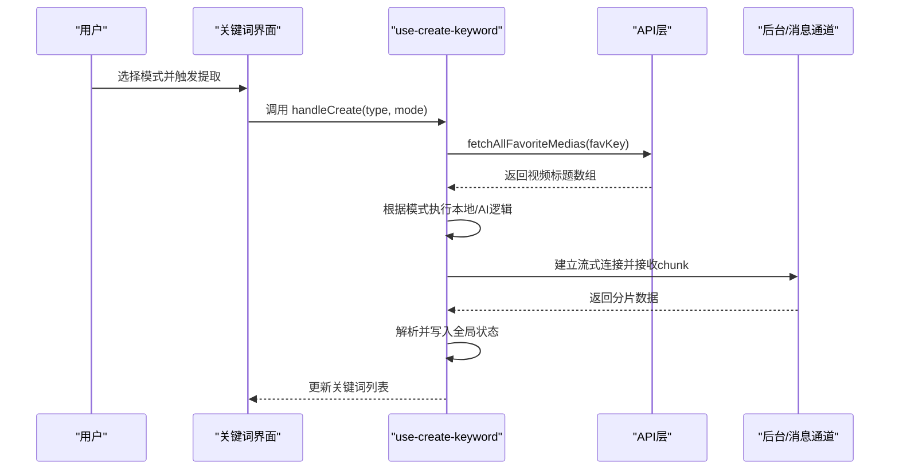
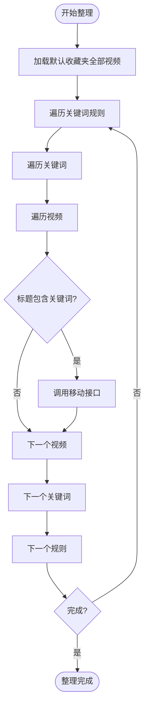
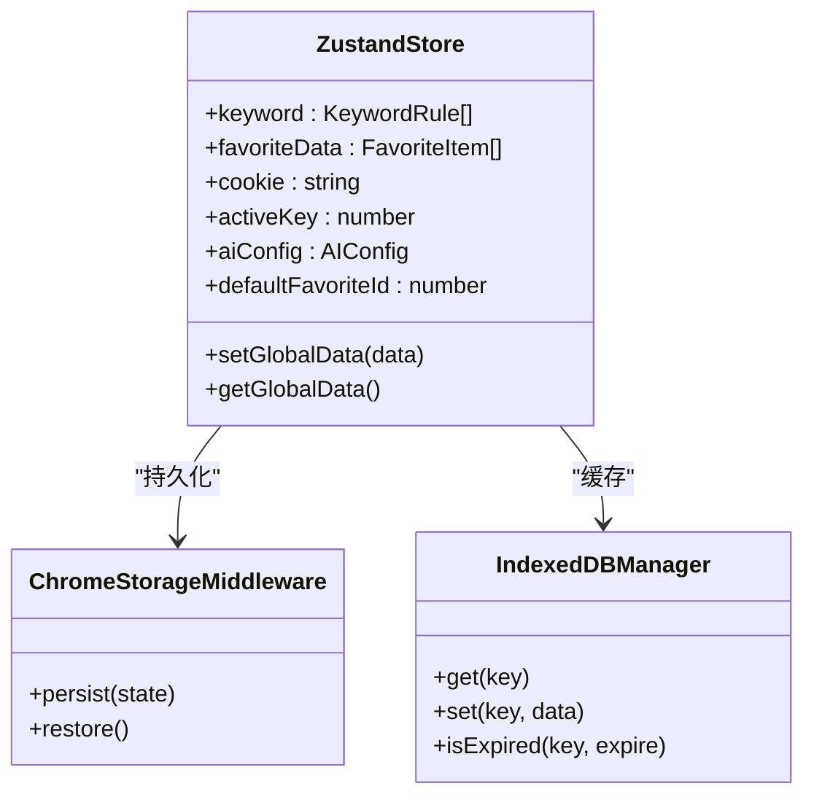
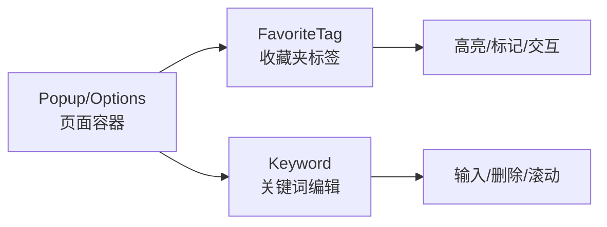
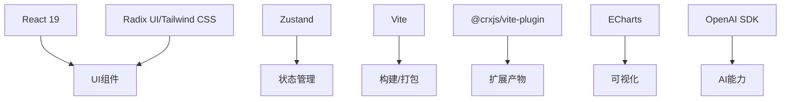

# 项目概述

<cite>
**本文档引用的文件**
- [README.md](file://README.md)
- [PRIVACY.md](file://PRIVACY.md)
- [package.json](file://package.json)
- [vite.config.ts](file://vite.config.ts)
- [src/manifest.ts](file://src/manifest.ts)
- [src/global.d.ts](file://src/global.d.ts)
- [src/popup/Popup.tsx](file://src/popup/Popup.tsx)
- [src/options/Options.tsx](file://src/options/Options.tsx)
- [src/store/global-data.ts](file://src/store/global-data.ts)
- [src/utils/api.ts](file://src/utils/api.ts)
- [src/hooks/use-create-keyword/index.tsx](file://src/hooks/use-create-keyword/index.tsx)
- [src/hooks/use-create-keyword-by-ai/index.tsx](file://src/hooks/use-create-keyword-by-ai/index.tsx)
- [src/hooks/use-move/index.tsx](file://src/hooks/use-move/index.tsx)
- [src/components/favorite-tag/index.tsx](file://src/components/favorite-tag/index.tsx)
- [src/components/keyword/index.tsx](file://src/components/keyword/index.tsx)
</cite>

## 目录
1. [简介](#简介)
2. [项目结构](#项目结构)
3. [核心组件](#核心组件)
4. [架构总览](#架构总览)
5. [详细组件分析](#详细组件分析)
6. [依赖关系分析](#依赖关系分析)
7. [性能考虑](#性能考虑)
8. [故障排除指南](#故障排除指南)
9. [结论](#结论)
10. [附录](#附录)

## 简介
本项目是面向B站用户的Chrome扩展工具，旨在帮助用户高效管理与分析收藏夹内容。它提供收藏夹分析、智能整理、AI关键词提取、可视化拖拽管理等核心能力，支持弹窗与侧边栏两种工作模式，满足不同场景下的使用需求。

- 目标用户：经常使用B站收藏夹、希望自动化整理与分析收藏内容的用户
- 核心价值：降低收藏夹维护成本，提升内容检索效率，提供可选的AI增强能力
- 独特优势：无需后端、数据本地化；支持侧边栏持久化操作；可选AI关键词抽取与自动整理；可视化拖拽管理

**章节来源**
- [README.md:1-188](file://README.md#L1-L188)

## 项目结构
项目采用Chrome Extension Manifest V3架构，前端基于React 19与现代构建工具链，状态管理使用Zustand，UI组件库采用Radix UI与Tailwind CSS组合，构建工具为Vite。

**图示来源**
- [src/manifest.ts:1-55](file://src/manifest.ts#L1-L55)
- [src/popup/Popup.tsx:1-80](file://src/popup/Popup.tsx#L1-L80)
- [src/options/Options.tsx:1-91](file://src/options/Options.tsx#L1-L91)
- [src/store/global-data.ts:1-28](file://src/store/global-data.ts#L1-L28)
- [vite.config.ts:1-44](file://vite.config.ts#L1-L44)
- [package.json:1-91](file://package.json#L1-L91)
- [src/global.d.ts:1-4](file://src/global.d.ts#L1-L4)

**章节来源**
- [src/manifest.ts:1-55](file://src/manifest.ts#L1-L55)
- [vite.config.ts:1-44](file://vite.config.ts#L1-L44)
- [package.json:1-91](file://package.json#L1-L91)
- [src/global.d.ts:1-4](file://src/global.d.ts#L1-L4)

## 核心组件
- 弹窗与选项页：提供主要交互入口，支持收藏夹分析、关键词管理、可视化拖拽管理与配置
- 全局状态：使用Zustand + Immer + Chrome Storage中间件，集中管理关键词、收藏夹数据、AI配置等
- 关键词提取：支持本地TF-IDF与AI流式解析两种模式，可批量生成关键词并写入状态
- 视频整理：基于关键词匹配与B站官方API，实现批量移动视频到目标收藏夹
- UI组件：基于Radix UI与Tailwind CSS，提供基础控件与布局容器

**章节来源**
- [src/popup/Popup.tsx:1-80](file://src/popup/Popup.tsx#L1-L80)
- [src/options/Options.tsx:1-91](file://src/options/Options.tsx#L1-L91)
- [src/store/global-data.ts:1-28](file://src/store/global-data.ts#L1-L28)
- [src/hooks/use-create-keyword/index.tsx:1-304](file://src/hooks/use-create-keyword/index.tsx#L1-L304)
- [src/hooks/use-move/index.tsx:1-161](file://src/hooks/use-move/index.tsx#L1-L161)
- [src/components/favorite-tag/index.tsx:1-77](file://src/components/favorite-tag/index.tsx#L1-L77)
- [src/components/keyword/index.tsx:1-32](file://src/components/keyword/index.tsx#L1-L32)

## 架构总览
整体架构围绕“内容脚本+后台脚本+UI页面”的扩展模型展开，前端通过消息通道与后台通信，后台再调用B站与第三方API，最终将结果回传给UI。

**图示来源**
- [src/manifest.ts:27-53](file://src/manifest.ts#L27-L53)
- [src/utils/api.ts:108-329](file://src/utils/api.ts#L108-L329)

**章节来源**
- [src/manifest.ts:1-55](file://src/manifest.ts#L1-L55)
- [src/utils/api.ts:1-339](file://src/utils/api.ts#L1-L339)

## 详细组件分析

### 组件A：关键词提取流程（本地/AI）
该流程支持三种模式：本地TF-IDF、AI流式解析（OpenAI/AIGate）、手动输入。流程包含数据准备、模式选择、流式解析与状态写入。

**图示来源**
- [src/hooks/use-create-keyword/index.tsx:191-284](file://src/hooks/use-create-keyword/index.tsx#L191-L284)
- [src/utils/api.ts:285-319](file://src/utils/api.ts#L285-L319)
- [src/utils/api.ts:177-232](file://src/utils/api.ts#L177-L232)

**章节来源**
- [src/hooks/use-create-keyword/index.tsx:1-304](file://src/hooks/use-create-keyword/index.tsx#L1-L304)
- [src/hooks/use-create-keyword-by-ai/index.tsx:1-170](file://src/hooks/use-create-keyword-by-ai/index.tsx#L1-L170)
- [src/utils/api.ts:177-277](file://src/utils/api.ts#L177-L277)

### 组件B：视频整理流程（关键词匹配+批量移动）
该流程遍历关键词规则，匹配默认收藏夹中的视频标题，通过消息通道调用B站官方API完成批量移动。

**图示来源**
- [src/hooks/use-move/index.tsx:60-124](file://src/hooks/use-move/index.tsx#L60-L124)
- [src/utils/api.ts:147-174](file://src/utils/api.ts#L147-L174)

**章节来源**
- [src/hooks/use-move/index.tsx:1-161](file://src/hooks/use-move/index.tsx#L1-L161)
- [src/utils/api.ts:147-174](file://src/utils/api.ts#L147-L174)

### 组件C：状态管理与数据流
全局状态使用Zustand，结合Immer实现不可变更新，通过Chrome Storage中间件持久化到浏览器存储；同时配合IndexedDB缓存收藏夹数据，减少重复请求。

**图示来源**
- [src/store/global-data.ts:6-25](file://src/store/global-data.ts#L6-L25)
- [src/utils/api.ts:285-319](file://src/utils/api.ts#L285-L319)

**章节来源**
- [src/store/global-data.ts:1-28](file://src/store/global-data.ts#L1-L28)
- [src/utils/api.ts:285-319](file://src/utils/api.ts#L285-L319)

### 组件D：UI与交互组件
- 收藏夹标签展示：支持高亮当前选中、标记默认收藏夹、长按选择等交互
- 关键词编辑：支持键盘输入、回车新增、退格删除，滚动区域展示
- 弹窗与选项页：统一的导航与内容布局，支持侧边栏模式

**图示来源**
- [src/components/favorite-tag/index.tsx:13-77](file://src/components/favorite-tag/index.tsx#L13-L77)
- [src/components/keyword/index.tsx:10-32](file://src/components/keyword/index.tsx#L10-L32)
- [src/popup/Popup.tsx:14-80](file://src/popup/Popup.tsx#L14-L80)
- [src/options/Options.tsx:12-91](file://src/options/Options.tsx#L12-L91)

**章节来源**
- [src/components/favorite-tag/index.tsx:1-77](file://src/components/favorite-tag/index.tsx#L1-L77)
- [src/components/keyword/index.tsx:1-32](file://src/components/keyword/index.tsx#L1-L32)
- [src/popup/Popup.tsx:1-80](file://src/popup/Popup.tsx#L1-L80)
- [src/options/Options.tsx:1-91](file://src/options/Options.tsx#L1-L91)

## 依赖关系分析
- 技术栈选择
  - React 19：现代化函数式组件与并发特性，提升交互体验
  - Zustand：轻量级状态管理，易于持久化与调试
  - Vite：快速开发与构建，支持热更新与插件生态
  - Radix UI + Tailwind CSS：高可定制UI组件与原子化样式
  - ECharts：可视化图表渲染
  - OpenAI SDK：可选AI能力接入
- 构建与运行
  - CRXJS插件用于打包Chrome扩展
  - Terser移除console日志，减小产物体积
  - React Compiler优化渲染性能

**图示来源**
- [package.json:29-58](file://package.json#L29-L58)
- [vite.config.ts:34-41](file://vite.config.ts#L34-L41)

**章节来源**
- [package.json:1-91](file://package.json#L1-L91)
- [vite.config.ts:1-44](file://vite.config.ts#L1-L44)

## 性能考虑
- 数据缓存：收藏夹全量数据使用IndexedDB缓存，默认24小时过期，减少重复请求
- 构建优化：生产构建启用Terser压缩与代码分割，移除console日志
- 渲染优化：React Compiler与React 19并发特性，提升交互流畅度
- 网络优化：批量分页拉取、流式AI解析，避免阻塞主线程

**章节来源**
- [src/utils/api.ts:285-319](file://src/utils/api.ts#L285-L319)
- [vite.config.ts:20-27](file://vite.config.ts#L20-L27)

## 故障排除指南
- 登录状态问题：确保已在B站页面登录且保持页面活跃，若提示未登录，请刷新B站页面后重试
- AI配置缺失：使用AI关键词提取前需在配置页填写API Key与模型，否则会提示配置不完整
- 操作取消：关键词提取与整理支持取消，取消后会中断当前流程
- 数据未刷新：收藏夹分析与整理后，可通过刷新按钮获取最新数据

**章节来源**
- [README.md:101-132](file://README.md#L101-L132)
- [src/hooks/use-create-keyword-by-ai/index.tsx:76-88](file://src/hooks/use-create-keyword-by-ai/index.tsx#L76-L88)
- [src/hooks/use-move/index.tsx:35-38](file://src/hooks/use-move/index.tsx#L35-L38)

## 结论
本项目通过现代前端技术栈与Chrome扩展架构，提供了从收藏夹分析到智能整理的一体化解决方案。其核心优势在于本地化处理、可选AI增强、可视化拖拽与侧边栏持久化操作，既保证了用户隐私，又提升了使用效率。未来可在规则引擎扩展、多语言支持与更丰富的可视化维度上持续演进。

## 附录

### 版本与许可
- 当前版本：1.1.7
- 许可协议：MIT
- 开发与测试工具：Vitest、Playwright、ESLint、Prettier、Husky

**章节来源**
- [package.json:4](file://package.json#L4)
- [package.json:8](file://package.json#L8)
- [README.md:162-167](file://README.md#L162-L167)

### 隐私与数据处理
- 严格本地化：所有数据仅存储在浏览器本地（IndexedDB + Chrome Storage）
- 最小权限：仅请求storage、tabs、sidePanel权限，不收集用户身份信息
- 可选AI：关键词提取可选OpenAI或AIGate免费额度，数据直连官方API
- 透明性：提供完整的隐私声明与数据处理说明

**章节来源**
- [PRIVACY.md:1-104](file://PRIVACY.md#L1-L104)
- [src/manifest.ts:39-53](file://src/manifest.ts#L39-L53)

### 安装与使用
- 安装方式：Chrome Web Store一键安装或本地加载
- 基本流程：登录B站 → 打开弹窗/侧边栏 → 查看分析 → 配置关键词 → 执行整理/拖拽管理

**章节来源**
- [README.md:82-132](file://README.md#L82-L132)