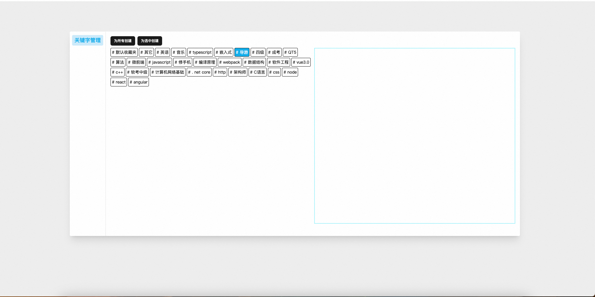

# Bilibili 收藏夹管理助手

一个帮助你更好地管理 Bilibili 收藏夹的 Chrome 扩展。


## ✨ 功能特性

### 1. 收藏内容分析

- 智能分析您的 B 站收藏内容分布,可视化展示收藏内容类别占比
  
  
- 基于 GPT 的视频标题关键词提取
  

### 2. 智能整理

- 一键整理默认收藏夹内容
- 支持批量移动视频到指定收藏夹
- 自定义移动规则
- 支持关键词匹配移动



## 🛠️ 技术栈

- React 19
- TypeScript
- Vite
- Tailwind CSS
- OpenAI API
- Chrome Extension Manifest V3

## 📦 安装

1. 下载最新版本的扩展
2. 打开 Chrome 浏览器，进入扩展管理页面（chrome://extensions/）
3. 开启开发者模式
4. 点击"加载已解压的扩展程序"
5. 选择解压后的扩展文件夹

## 🚀 使用说明

### 基本使用

1. 点击浏览器工具栏中的扩展图标
2. 登录你的 Bilibili 账号（如果尚未登录）
3. 在弹出窗口中查看你的收藏夹分析
4. 使用整理功能将视频移动到合适的收藏夹

### 收藏夹整理

1. 点击"整理收藏夹"按钮
2. 选择源收藏夹（默认为"默认收藏夹"）
3. 选择目标收藏夹
4. 点击确认开始整理

## 🔨 开发指南

### 环境要求

- Node.js >= 16
- pnpm

### 本地开发

```bash
# 安装依赖
pnpm install

# 启动开发服务器
pnpm dev

# 构建生产版本
pnpm build
```

### 项目结构

```
src/
├── background/     # 后台脚本
├── contentScript/  # 内容脚本
├── popup/         # 弹出窗口
├── options/       # 选项页面
├── components/    # 共享组件
├── hooks/         # 自定义 Hooks
├── utils/         # 工具函数
└── assets/        # 静态资源
```

## 📝 更新日志

详见 [CHANGELOG.md](./CHANGELOG.md)

## 📄 许可证

[MIT License](./LICENSE)
